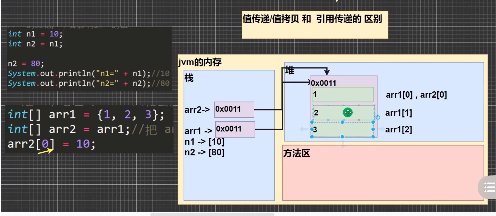
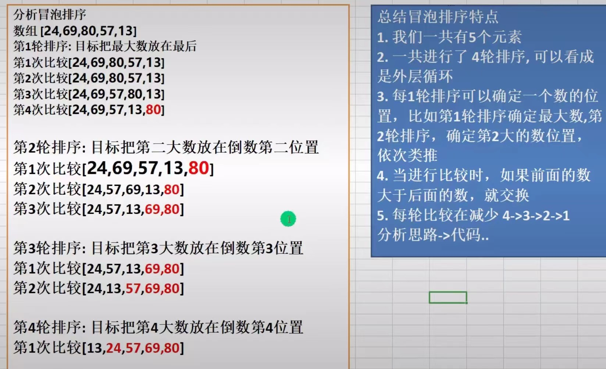
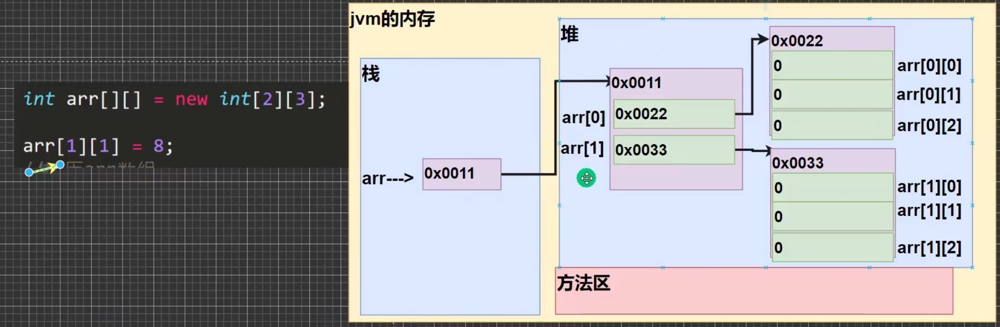

# 01 数组

> * ==数组可以存放多个同类型的数据==，数组也是一种数据类型(引用类型)，数组型数据是对象（object）
> * ==满足自动类型转换的数据可以放在同一个数组==（低精度元素放高精度数组)，比方说int --> double
> * 数组中的元素可以是任何数据类型，包括基本类型和引用类型，但不能混用
> * 数组创建之后，若没有赋值，有默认值。`int、short、bate、long`的都是`0`，`float、double`的都是`0.0`，`char`的是`\u0000`(十六进制的)，`boolean`的是`false`，`String`的是`null`
> * 数组的下标是从0开始的

```java
public class Array01{
    public static void main(String[] args) {
        //定义一个存放double类型的数组，静态初始化
        //{}里的数即为数组的元素
        double[] hens = {3, 5, 1, 3.4, 2, 50};
        //double hens[] = {3, 5, 1, 3.4, 2, 50};这样写也可以
        
        double totalweight = 0;

        //遍历数组得到数组所有元素的和
        for(int i = 0; i < hens.length; i++){
             totalweight += hens[i]; 
        }
        System.out.println(totalweight);  //64.4
        System.out.println((int)(totalweight/hens.length));   //10 
    }
} 
```

## 01.1 使用方式1：动态初始化1

```java
//基本语法
数据类型 数组名[] = new 数据类型[大小];
int a[] = new int[5];  //创建一个数组，存放了5个int数据，默认为0

//数组元素的访问
a[0]  //取到数组a的第一个元素，因为数组的下标是从0开始的
    
//这样写是对的，中括号内不填数字
String strs[] = new String[]{"a", "b", "c"};
//下面这样写是错的
String strs[] = new String[3]{"a", "b", "c"};
```

```java
import java.util.Scanner;
public class Array01{
    public static void main(String[] args) {
        Scanner sc = new Scanner(System.in);
		//动态初试化数组
        double a[] = new double[5];

        for(int i = 0; i < a.length; i++){
            //加括号提升运算优先级，不然会是字符串拼接
            System.out.println("请输入第" + (i+1) + "个数");  
            a[i] = sc.nextDouble();
        }
        System.out.println("第五个元素为" + a[4]);
    }
}
```

## 01.2 使用方式2：动态初始化2

> * 先声明数组：  数据类型 数组名[];     或是   数据类型[] 数组名；
> * 再创建数组：  数组名 = new 数据类型[大小]；
> * 就是第一种动态初始化拆开写

```java
import java.util.Scanner;
public class Array01{
    public static void main(String[] args) {
        Scanner sc = new Scanner(System.in);
		//动态初始化数组，先声明,此时还未分配内存空间
        double a[];//或者double[] a;

        //再创建数组，并分配内存空间
        a = new double[5];

        for(int i = 0; i < a.length; i++){
            //加括号提升运算优先级，不然会是字符串拼接
            System.out.println("请输入第" + (i+1) + "个数");  
            a[i] = sc.nextDouble();
        }
        System.out.println("第五个元素为" + a[4]);
    }
}
```

## 01.3 使用方式3：静态初始化

> * 语法：   数据类型  数组名[] = {元素值，元素值，……}
> * 当数组长度较小，每个元素值明确时，使用该种做法合适，其实就是写死

## 01.4 练习

```java
//创建一个char类型的26个字母的数组
//提示，char类型中 'A' +1 -->'B'
public class Array01{
    public static void main(String[] args) {
        char[] arr01 = new char[26];
        arr01[0] = 'A';
        System.out.println(arr01[0]);
        for(int i=1; i <26; i++){
            arr01[i] = (char)(arr01[i-1] + 1);
            System.out.println(arr01[i]);
        }
    }
}
```

```java
//求一个数组中的最大值
public class Array01{
    public static void main(String[] args) {
        int[] arr01 = {4, -1, 9, 10, 23};

        //假定第一个元素是最大的
        int max = arr01[0];

        for (int i = 1; i < arr01.length; i++) {
            if (arr01[i] > max) {
                max = arr01[i];
            }
        }
        System.out.println("最大值是：" + max);
    }
}
```

## 01.5 数组赋值机制 *

> * 基本数据类型赋值，这个值就是具体的数据，而且相互不影响
> * 这种赋值方式为值拷贝

```java
public class Arrayassign{
    public static void main(String[] args) {
        //基本数据类型赋值
        int n1 = 2;
        int n2 = n1;
        n2 = 3;
        System.out.println("n1 =" + n1);  //结果为2
        System.out.println("n2 =" + n2);  //结果为3
    }
}
```

> * ==数组在默认情况下是引用传递，赋的值是地址==
> * 这种赋值方式为引用拷贝、地址拷贝
> * 在JVM内存中，数组的指向是一个地址，在栈里。然后这个地址又指向堆里的确切的数

```java
public class Arrayassign{
    public static void main(String[] args) {
        //数组赋值
        int[] arr1 = {1,2,3,4,5};
        int[] arr2 = arr1;
        arr2[0] = 100;
        System.out.println(arr1[0]);  //结果arr1的第一个元素也改为100
    }
}
```



## 01.6 数组拷贝

> * 也就是拷贝一个全新的数组，不和原来的共用一个地址，数据空间独立，修改之后不影响原先数组

```java
public class Arrayassign{
    public static void main(String[] args) {
        int[] arr1 = {1,2,3,4,5};

        //创建一个新的数组arr2，开辟新的数据空间
        int[] arr2 = new int[arr1.length];
        //遍历arr1，把每个元素拷贝到arr2
        for(int i = 0; i < arr1.length; i++){
            arr2[i] = arr1[i];
        }
        arr2[3] = 123;
        System.out.println(arr1[3]);  //arr1不变，依旧是4
    }
}
```

## 01.7  数组反转

```JAVA
//思路一：借助temp，实现首尾互换，原地反转
public class ArrayReverse{
    public static void main(String[] args) {
        int[] arr1 = {1,2,3,4,5,4123,5324,74653,7354};
        int temp = 0;
        for(int i = 0; i < arr1.length/2; i++){
            temp = arr1[i];
            arr1[i] = arr1[arr1.length - 1 - i];
            arr1[arr1.length - 1 - i] = temp;
            //这样也可以
            //temp = arr1[arr1.length - 1 -i];
            //arr1[arr1.length - 1 - i] = arr1[i];
            //arr1[i] = temp;

        }
        for(int i = 0; i < arr1.length; i++){
            System.out.print(arr1[i] + " ");
        }
    }
}
```

```java
//思路二：逆向赋值新的数组
public class ArrayReverse{
    public static void main(String[] args) {
        int[] arr1 = {1,2,3,4,5,4123,5324,74653,7354};
        int[] arr2 = new int[9];
        for(int i = arr1.length - 1, j = 0; i >= 0; i--, j++){
            arr2[j] = arr1[i];
        }
        for(int i = 0; i < arr2.length; i++){
            System.out.print(arr2[i] + " ");
        }
    }
} 
```

## 01.8 数组的扩容与缩减

```java
//数组的扩容
public class ArrayAdd{
    public static void main(String[] args) {
        int[] arr1 = {1,2,3};
        //创建一个新的数组
        int[] arr2 = new int[arr1.length + 1];
        //把arr1数组的值赋给arr2
        for(int i = 0; i < arr1.length; i++){
            arr2[i] = arr1[i];
        }
        //把4赋给arr2的最后一个元素
        arr2[arr2.length - 1] = 4;
        //把arr2赋给arr1
        arr1 = arr2;
        for(int i = 0; i < arr1.length; i++){
            System.out.println(arr1[i]);
        }
    }
} 
```

```java
//数组的动态扩容
import java.util.Scanner;
public class ArrayAdd{
    public static void main(String[] args) {
        Scanner myScanner = new Scanner(System.in);
        int[] arr1 = {1,2,3};
        do{
            //创建一个新的数组
            int[] arr2 = new int[arr1.length + 1];
            //把arr1数组的值赋给arr2
            for(int i = 0; i < arr1.length; i++){
                arr2[i] = arr1[i];
            }
            System.out.println("请输入添加的那个数：");
            int addnum = myScanner.nextInt();
            //赋给arr2的最后一个元素
            arr2[arr2.length - 1] = addnum;
            //把arr2赋给arr1
            arr1 = arr2;
            for(int i = 0; i < arr1.length; i++){
                System.out.println(arr1[i] + "\t");
            }
            //询问是否继续增加
            System.out.println("是否继续增加？y/n");
            char choice = myScanner.next().charAt(0);
            //输入n则结束数组扩容
            if(choice == 'n'){
                break;
            }
        }while(true);
    }
}
```

```java
//动态缩减数组
import java.util.Scanner;
public class ArrayAdd{
    public static void main(String[] args) {
        Scanner myScanner = new Scanner(System.in);
        int[] arr1 = {1,2,3,32};
        do{
            //创建一个新的数组
            int[] arr2 = new int[arr1.length - 1];
            //把arr1数组的值赋给arr2
            for(int i = 0; i < arr2.length; i++){
                arr2[i] = arr1[i];
            }
            //把arr2赋给arr1
            arr1 = arr2;
            for(int i = 0; i < arr1.length; i++){
                System.out.println(arr1[i] + "\t");
            }
            //询问是否继续缩减
            System.out.println("是否继续缩减？y/n");
            char choice = myScanner.next().charAt(0);
            //输入n则结束数组缩减
            if(choice == 'n'){
                break;
            }
        }while(true);
    } 
}
```

# 02 排序(仅冒泡)

> 排序的分类
>
> * 内部排序，将所有数据加载到内部存储器中进行排序（交换式排序法、选择式排序法和插入式排序法）
> * 外部排序，数据量大，无法全部加载到内存中，需借助外部存储进行（合并排序法和直接合并排序法）

> * 冒泡排序（bubble sorting）：依次比较相邻元素的值，若为逆序，则交换位置，使值大的元素逐渐从前向后移（从大到小的也同理）



```java
public class BubbleSort{
    public static void main(String[] args) {
        //从小到大排序，冒泡排序               
        int[] arr = {31, 41, 2534, 64355, 6345, 647, 47645};
        //第一层for循环是控制第几轮的
        for (int i = 0; i < arr.length - 1; i++) {
            //第二层for循环是控制每一轮中比较的次数
            for (int j = 0; j < arr.length - 1 - i; j++) {
                //如果前一个数大于后一个数，则交换
                if (arr[j] > arr[j + 1]) {
                    int temp = arr[j];
                    arr[j] = arr[j + 1];
                    arr[j + 1] = temp;
                }
            }
        }
        //输出排序后的数组
        for(int i = 0; i < arr.length; i++){
            System.out.print(arr[i] + " ");
        }
    } 
}
```

# 03 查找(仅顺序)

> * 在java中，常用的查找有两种：顺序查找、二分查找（算法章节详讲）

```java
//线性查找（顺序查找）
import java.util.Scanner;
public class SeqSearch{
    public static void main(String[] args) {
        String[] arr = {"张无忌","张翠山","张良","王二麻子","谢广坤"};
        Scanner myScanner = new Scanner(System.in);
        System.out.println("请输入要查找的字符：");
        String key = myScanner.next();
        // 线性查找
        int index = -1;
        for(int i = 0;i < arr.length;i++){
            if(key.equals(arr[i])){
                index = i;
                System.out.println("找到"+key+"的下标为："+index);
                break;
            }
        }
        //小技巧
        if(index == -1){
            System.out.println("没有找到"+key);
        }
    } 
}
```

# 04 多维数组

> * 这里只讲二维数组，就是一维数组里的元素又是一个数组，这就称之为二维数组
> * 二维数组里的各个一维数组的长度可以不相同

```java
public class TwoDimensionalArray{
    public static void main(String[] args) {
        // 初始化一个二维数组，包含3行3列的整数
        int[][] arr = {{1,2,3},{4,5,6},{7,8,9}};
        
        // 遍历二维数组的每一行
        for(int i = 0; i < arr.length; i++){
            // 遍历当前行的每一列
            for(int j = 0; j < arr[i].length; j++){
                // 输出当前元素的值
                System.out.print(arr[i][j] + " ");
            }
            // 每一行输出完毕后换行
            System.out.println();
        }
    }
}
```

## 04.1 二维数组的使用

### 04.1.1 使用方式1：动态初始化1

```java
//基本语法
类型[][] 数组名 = new 类型[大小][大小];
int a[][] = new int[2][3];
```

### 04.1.2 使用方式2：动态初始化2

> * 先声明，再定义

```java
//基本语法
类型 数组名[][];
//或者
类型[][] 数组名;
//或者
类型[] 数组名[];

数组名 = new 类型[大小][大小];
```

```java
public class TwoDimensionalArray{
    public static void main(String[] args) {
        // 初始化，先声明，后定义
        int arr[][];
        arr = new int[2][3];
        
        //元素赋值
        arr[1][1] = 8;
    }
}
```

### 04.1.3 使用方式3：动态初始化-列元素数不确定

> * 在java中，可以允许内部每个一维数组的元素个数不一致，即列数不确定

```java
public class TwoDimensionalArray{
    public static void main(String[] args) {
        //创建二维数组，列数不确定，还没开辟空间
        int[][] arr = new int[3][];
        for(int i = 0; i < arr.length; i++){
            //给每个一维数组开辟空间
            arr[i] = new int[i + 1];
            for(int j = 0; j < arr[i].length; j++){
                arr[i][j] = (i+1)*(j+1);
            }
        }
        //输出数组
        for(int i = 0; i < arr.length; i++){
            for(int j = 0; j < arr[i].length; j++){
                System.out.print(arr[i][j] + " ");
            }
            System.out.println(); //换行
        }
    }
}
```

### 04.1.4 使用方式4：静态初始化

```java
//基本语法
类型 数组名[][] = {{值1，值2，……}, {值1，值2，……}, {值1，值2，……}，……};
int[][] arr = {{1,1,1}, {8,8,9}, {100}};
```


## 04.2 二维数组内存情况

> * 以二行三列的二维数组为例，先是在栈里存储整个二维数组指向的地址，然后地址指向堆里的两个一维数组的地址，这两个地址又分别指向堆里的真正的数据



## 04.3 二维数组的遍历

```java
public class TwoDimensionalArray{
    public static void main(String[] args) {
        //创建二维数组
        int arr[][] = {{4,6}, {1,3,5,7}, {32,534,745}};
        int sum = 0;
        for(int i = 0;i <arr.length;i++){
            for(int j = 0;j < arr[i].length;j++){
                sum += arr[i][j];
            }
        }
        System.out.println("这个二维数组所有元素的和为" + sum);  //结果为1337
    }
}
```

## 04.4 二维数组练习

```java
//输出杨辉三角
public class TwoDimensionalArray{
    public static void main(String[] args) {
        //输出一个10层的杨辉三角
        int[][] arr = new int[10][];
        for(int i = 0; i < arr.length; i++){
            // 每一行的长度等于行数加一
            arr[i] = new int[i + 1];
            for(int j = 0; j < arr[i].length; j++){
                // 第一列和最后一列的值都是1
                if(j == 0 || j == arr[i].length - 1){
                    arr[i][j] = 1;
                }else{
                    // 其他位置的值等于上一行的前一个位置的值加上上一行的当前位置的值
                    arr[i][j] = arr[i - 1][j - 1] + arr[i - 1][j];
                }
            }
        }
        // 输出二维数组
        for(int i = 0; i < arr.length; i++){
            for(int j = 0; j < arr[i].length; j++){
                System.out.print(arr[i][j] + " ");
            }
            System.out.println();
        }
    }
}
```

```java
int[] x, y[];
//在这里，x其实是一个一维数组，它的完整写法是 int[] x;
//y是一个二维数组，完整写法是 int[] y[];
```

  ```java
  //练习三
  //判断下面代码的输出
  String foo = "blue";
  boolean[] bar = new boolean[2];
  if(bar[0]){
      foo = "green";
  }
  System.out.println(foo);  //布尔类型的数组默认值为false，因而不进入if语句，输出false
  ```

```java
//练习四
//插入一个数字进升序的数组中，并且保持升序
import java.util.Scanner;
public class TwoDimensionalArray{
    public static void main(String[] args) {
        Scanner sc = new Scanner(System.in);
        System.out.println("请输入要插入的数字：");
        int num = sc.nextInt();
        int arr1[] = {10, 12, 45, 90};
        int arr2[] = new int[arr1.length + 1];
        // 使用标志位flag来处理第一次遇到大于num的情况,使else if里值运行一次
        boolean flag = true;
        for (int i = 0; i < arr1.length; i++) {
            if(arr1[i] <= num){
                arr2[i] = arr1[i];
            }else if(flag){  //第一次遇到大于num，执行后，flag变false，不再执行
                arr2[i] = num;
                arr2[i + 1] = arr1[i];
                flag = false;
            }else{  // 第二次及更多次遇到大于num的情况，直接插入
                arr2[i + 1] = arr1[i];
            }
        }
        // 输出
        for(int i = 0; i < arr2.length; i++){
            System.out.print(arr2[i] + " ");
        }
        System.out.println();
    }
}
```

这个练习再看看视频里是怎么写的，后面补，P186

还有剩余练习题，记得补
