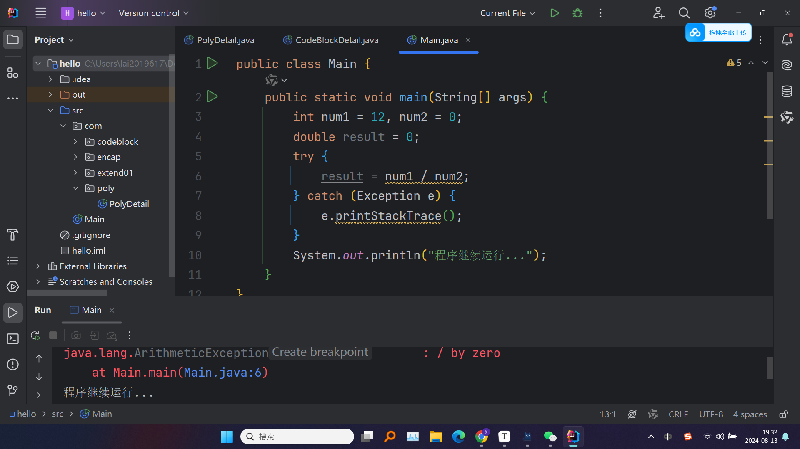
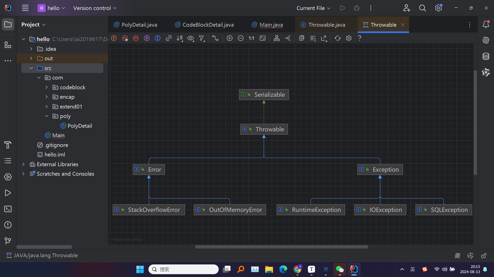
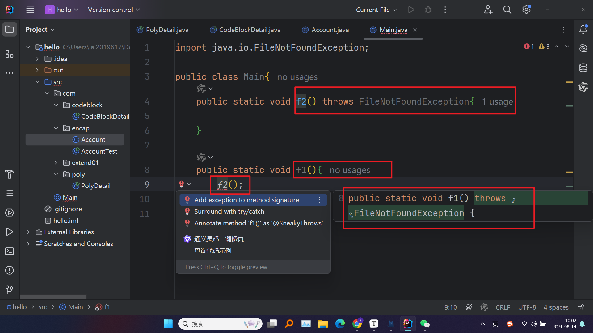
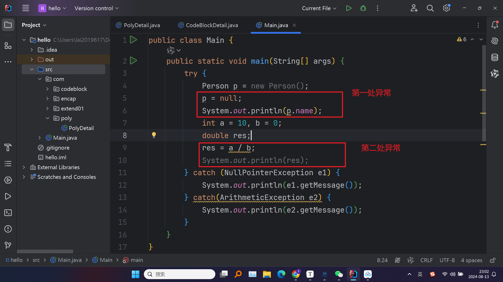
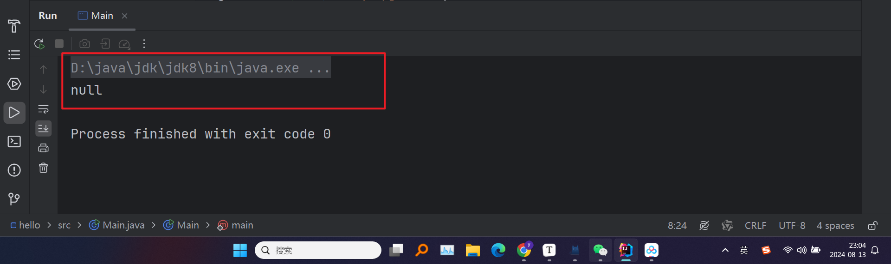

# 01 基本介绍

> * 异常处理机制是编写健壮、可维护程序的重要组成部分。通过异常处理，程序可以有效地捕获和处理运行时出现的错误，从而避免程序意外终止并提供更好的用户体验
> * ==将程序执行中发生的不正常情况称为异常，语法错误和逻辑错误不是异常==
> * ==IDEA中将可能出现异常的代码选中，再`ctrl + alt + t`选中`try-catch`可以进行异常捕获==



# 0.2 异常体系图

> * 在Java中，==所有异常类都继承自`Throwable`类==。`Throwable`是Java异常处理机制的基础类，代表了所有可以作为异常或错误抛出的类。==`Throwable`类有两个直接子类：`Error`和`Exception`==
> * ==编译异常是指在java源程序到转成字节码文件这个过程中的==
> * ==运行异常是指在字节码文件到内存中加载、运行类这个过程中的==

```plaintext
Throwable
    ├── Error
    │     ├── VirtualMachineError
    │     │     ├── OutOfMemoryError
    │     │     ├── StackOverflowError
    │     │     └── ...
    │     └── OtherErrorTypes
    │           └── ...
    └── Exception
          ├── RuntimeException
          │     ├── NullPointerException
          │     ├── ArrayIndexOutOfBoundsException
          │     ├── ArithmeticException
          │     ├── IllegalArgumentException
          │     └── ...
          ├── IOException
          │     ├── FileNotFoundException
          │     ├── EOFException
          │     └── ...
          ├── SQLException
          ├── ClassNotFoundException
          ├── NoSuchMethodException
          └── ...
```

> * **`Throwable`**：是所有异常和错误的根类。它有两个直接子类：`Error` 和 `Exception`。类中有两个主要的方法：
>   - `getMessage()`：返回异常的详细信息
>   - `printStackTrace()`：输出异常的堆栈跟踪信息，帮助调试

> * **`Error`**：表示程序无法处理的严重问题，一般是 JVM（Java虚拟机）引发的，==程序不应该捕获这些错误==。这些错误通常表示系统级别的异常，比如内存溢出、栈溢出等

> * **`Exception`**：表示程序可以捕获并处理的异常，是异常处理机制的核心。==`Exception` 类又分为受检异常和非受检异常。==非受检异常是 `RuntimeException` 类及其子类的实例

> * 在IDEA中，可以在代码里写一个`Throwable`，鼠标定位到，然后`ctrl + B`进入这个类，然后再右键，选择`diagrams`就可以进入一个框架图中，在里面再`ctrl + alt + B`就可以查看它的实现的子类，可以自动生成框架图



> * ==**受检异常** 是需要被显式捕获或声明的异常，通常是可以预见的异常情况，如文件未找到、网络连接失败等。受检异常在编译时必须要进行处理，否则会出现编译错误==
> * **非受检异常** 是 `RuntimeException` 类及其子类的实例。它们通常是由编程错误引发的，如逻辑错误、数据不一致等。这些异常不要求显式捕获或声明



> * 可以看到当`f1()`调用`f2()`时，IDEA提示出现错误
> * 这就是因为`f2()`声明了一个受检异常，当用`f1()`去调用`f2()`时，`f1()`也会存在这个异常，而受检异常是一定要显式捕获或声明的，因此这里提示在方法名后面声明一个相同的异常，或者我们在`f1()`里面把`f2()`给`catch`住也是可以的

# 0.3 常见的运行异常（非受检）

## 03.1 NullPointerException

> * 是在程序试图对 `null` 引用的对象调用方法、访问字段或数组元素时抛出的异常。这意味着你正在试图使用一个未初始化的对象引用
> * #### 触发条件：
>   - 调用 `null` 对象的方法或属性
>   - 访问 `null` 对象的字段
>   - 试图通过 `null` 引用访问数组元素
>   - 在 `null` 引用上调用 `length`、`toString()`、`equals()` 等方法

```java
public class NullPointerExample {
    public static void main(String[] args) {
        String str = null;

        // 会抛出 NullPointerException
        int length = str.length();
        System.out.println("String length: " + length);
    }
}
```

## 03.2 ArithmeticException

> * 是在算术运算中出现非法操作时抛出的异常，最常见的情况是整数除以零

```java
public class ArithmeticExample {
    public static void main(String[] args) {
        int a = 10;
        int b = 0;

        // 会抛出 ArithmeticException: / by zero
        int result = a / b;
        System.out.println("Result: " + result);
    }
}
```

## 03.3 ArrayIndexOutOfBoundsException

> * 是在程序试图通过非法的索引访问数组元素时抛出的异常。这通常发生在索引小于0或大于等于数组长度时
>
> * #### 触发条件：
>
>   - 使用负数或大于等于数组长度的索引访问数组元素

```java
public class ArrayIndexOutOfBoundsExample {
    public static void main(String[] args) {
        int[] numbers = {1, 2, 3};

        // 会抛出 ArrayIndexOutOfBoundsException: Index 3 out of bounds for length 3
        int number = numbers[3];
        System.out.println("Number: " + number);
    }
}
```

## 03.4 ClassCastException

> * 是在程序试图将对象强制转换为不兼容的类型时抛出的异常。这通常发生在类型转换操作不符合对象实际类型时
>
> * #### 触发条件：
>
>   - 将对象转换为不兼容的类型

```java
public class ClassCastExample {
    public static void main(String[] args) {
        Object obj = "Hello, World!";

        // 会抛出 ClassCastException: java.lang.String cannot be cast to java.lang.Integer
        Integer num = (Integer) obj;
    }
}
```

## 03.5 NumberFormatException

> * 是在程序试图将字符串转换为数字类型（如 `int`、`float` 等），但字符串的格式不正确或不符合数字格式时抛出的异常
>
> * #### 触发条件：
>
>   - 将不符合数字格式的字符串转换为数字类型

```java
public class NumberFormatExample {
    public static void main(String[] args) {
        String str = "abc123";

        // 会抛出 NumberFormatException: For input string: "abc123"
        int number = Integer.parseInt(str);
        System.out.println("Number: " + number);
    }
}
```

# 04 异常处理机制

> * Java 的异常处理机制提供了一种在程序运行时捕获和处理错误的方式，使得程序可以在发生异常时仍能继续运行，或者安全地退出。Java 的异常处理机制主要依赖于 `try-catch-finally` 块和 `throws` 关键字

## 04.1`try-catch-finally`

> * 是 Java 中最常见的异常处理结构。它用于捕获和处理可能在运行时发生的异常，并确保无论是否发生异常，都可以执行特定的代码

```java
// 基本语法
try {
    // 可能抛出异常的代码
} catch (ExceptionType1 e1) {
    // 处理 ExceptionType1 的代码
} catch (ExceptionType2 e2) {
    // 处理 ExceptionType2 的代码
} finally {  //可选
    // 无论是否发生异常，都会执行的代码
}
```

> * **`try` 块**：包含可能抛出异常的代码。这个块中的代码在执行时，如果抛出了异常，那么控制权将被转移到相应的 `catch` 块
> * **`catch` 块**：用于捕获和处理在 `try` 块中抛出的异常。每个 `catch` 块只能捕获一种类型的异常（或其子类）。如果异常类型与 `catch` 块中指定的类型匹配，异常将被捕获并在 `catch` 块中处理
> * **`finally` 块**：这是一个可选块，无论是否发生异常，`finally` 块中的代码都会被执行。通常用于资源释放操作（如关闭文件、释放数据库连接等）

> **细节说明：**
>
> * 在`try`块里，如果发生异常，则后面的代码也不会执行。比方说块里有三句，第二句代码有异常，则会直接进入对应异常的`catch`块，第三句代码不会执行
> * 若没有异常，则正常执行`try`块里的代码，且不会进入`catch`块里
> * 可以有多个`catch`语句，捕获不同的异常，要求父类异常在后面，子类异常在前面。比如NullPoniterException在前，Exception在后





> * 由上面的图片可见，只能捕获先出现的异常，并且会自己进行匹配对应的`catch`块进行处理

```java
//一个利用异常捕获机制实现功能的例子
import java.util.Scanner;

public class Main {
    public static void main(String[] args) {
        Scanner sc = new Scanner(System.in);
        int num = 0;
        while (true) {
                System.out.println("请输入一个整数：");
            try {
                num = Integer.parseInt(sc.next());//这里可能存在异常
                break;
            } catch(NumberFormatException e1) {
                System.out.println("输入的不是整数");
            }
        }
        System.out.println("你输入的为" + num);
    }
}
```

## 04.2 `throws`

> * 用于声明一个方法可能抛出的异常。它通常与受检异常（Checked Exception）一起使用，以通知调用方法的代码，必须处理这些异常
> * ==这个的逻辑就是往上“投诉”，比方说方法1里有异常，便会把这个异常往调用它的那个方法2里传递这个异常，如果整个链路上的都用的`throws`，最后会把异常传递到JVM里，那么便会直接输出异常，终止代码。如果在中间的某层用了`try-catch`，那么便会在该层处理这个异常==
> * **`throws` 关键字**：用于方法声明中，表明该方法可能会抛出一种或多种异常。如果方法中存在受检异常且未在方法内处理，那么必须使用 `throws` 关键字声明这些异常类型，以便调用者知道需要处理这些异常
> * **多异常声明**：如果一个方法可能抛出多种异常，可以使用逗号分隔多个异常类型

```java
//基本语法
public void methodName() throws ExceptionType1, ExceptionType2 {
    // 方法体
}
```

```java
import java.io.*;

public class ThrowsExample {
    public static void main(String[] args) {
        try {
            readFile("non_existent_file.txt");
        } catch (IOException e) {
            System.out.println("Error: " + e.getMessage());
        }
    }

    // 方法声明中使用 throws 关键字，表明该方法可能抛出 IOException
    public static void readFile(String fileName) throws IOException {
        FileReader file = new FileReader(fileName);
        BufferedReader reader = new BufferedReader(file);
        String line = reader.readLine();
        System.out.println(line);
        reader.close();
    }
}
```

> * **解释**：
>   - `readFile` 方法声明中使用了 `throws IOException`，表明该方法可能会抛出 `IOException`
>   - 在 `main` 方法中，我们调用 `readFile` 方法，并使用 `try-catch` 捕获和处理 `IOException`

> **细节说明：**
>
> * `throws`的逻辑是如果一个方法（中的语句执行时）可能存在异常，但是不确定如何处理，则此方法应该显式地声明抛出异常，表明该方法将不对该异常进行处理，而是由该方法的调用者来处理
> * 声明的异常既可以是具体的异常名字，也可以是它的父类异常名
> * 对于运行异常（非受检），如果程序中没有进行处理，默认是`throws`的方式处理，然后一直传递到JVM里，抛出异常，终止代码

## 04.3 `throws` 机制在继承中的规则

> **方法重写时的异常声明：**
>
> * 子类重写父类方法时，子类方法抛出的异常（在 `throws` 中声明的异常）不能比父类方法声明的异常更宽泛，可以是一致的，也可以是父类异常的子类型，或者是不声明异常

还有更多细节，之后深入再补充


# 05 `throw`关键字

> * `throw`关键字用于显式地抛出一个异常对象。这可以让程序在检测到特定错误条件时主动抛出异常，以便在其他地方捕获和处理

## 05.1 `throw` 基本语法

> * **`ExceptionType`**：要抛出的异常的类型，必须是`Throwable`类的子类（通常是`Exception`或`RuntimeException`的子类）
>
>   **`"Error message"`**：可选的错误信息，用于描述异常的原因。可以在异常对象的构造函数中传递

```java
throw new ExceptionType("Error message");
```

## 05.2 使用`throw`抛出异常

### 05.2.1 抛出受检异常

> * `checkAge`方法中，当`age`小于18时，使用`throw`关键字显式抛出一个`Exception`
>
> * 在`main`方法中，我们使用`try-catch`块捕获并处理这个异常

```java
//抛出受检异常
public class ThrowExample {
    public static void main(String[] args) {
        try {
            checkAge(15);
        } catch (Exception e) {
            System.out.println("Caught exception: " + e.getMessage());
        }
    }

    public static void checkAge(int age) throws Exception {
        if (age < 18) {
            throw new Exception("Age must be at least 18.");
        }
        System.out.println("Age is valid.");
    }
}
```

### 05.2.2 抛出非受检异常
> * validateInput 方法中，当input为null时，使用throw关键字抛出NullPointerException
> * 因为NullPointerException是非受检异常（RuntimeException的子类），所以不需要在方法签名中声明throws
```java
//抛出非受检异常
public class ThrowUncheckedExample {
    public static void main(String[] args) {
        validateInput(null);
    }

    public static void validateInput(String input) {
        if (input == null) {
            throw new NullPointerException("Input cannot be null.");
        }
        System.out.println("Input is valid.");
    }
}
```

### 05.2.3 细节说明

> * #### 抛出的对象必须是 `Throwable` 的子类
>
>   1.只能抛出`Throwable`类的实例或其子类实例（如`Exception`或`Error`）
>
>   2.通常自定义的异常类也会继承自`Exception`或`RuntimeException`
>
> * #### 一旦抛出异常，后续代码不会执行
>   1.一旦在方法中执行了throw语句，异常会立即被抛出，方法的执行也会立即中断，转而执行相应的catch块（如果存在），或向调用栈上层传播。因此，throw语句后面的代码不会被执行
>
> * #### 抛出异常后，异常必须被处理或声明
>   1.对于受检异常（继承自Exception，但不包括RuntimeException的异常），如果在方法中抛出了这样的异常，必须在该方法签名中使用throws关键字声明该异常，或者在调用该方法的地方捕获并处理该异常
>
>   2.对于非受检异常（RuntimeException及其子类），不需要在方法签名中声明，但可以选择捕获处理

### 05.2.4 `throw`与`throws`的区别

> * **`throw`**：用于显式抛出一个异常实例，主动生成异常
> * **`throws`**：用于声明一个方法可能抛出的异常类型，告知调用者这些异常需要处理。


# 06 自定义异常

> * 在实际开发中，经常需要创建自己的异常类型来反映特定的业务逻辑错误或程序状态。这就是所谓的**自定义异常（Custom Exception）**
>
> * ### 自定义异常的步骤
>
>   1. **创建一个异常类**：自定义异常类通常继承自`Exception`或`RuntimeException`
>   2. **定义构造函数**：自定义异常类可以定义不同的构造函数，以便在抛出异常时传递详细的错误信息或其他参数
>   3. **抛出异常**：在代码中，当遇到特定的错误条件时，可以抛出自定义异常
>   4. **捕获异常**：使用`try-catch`块来捕获并处理自定义异常

> * ### 自定义异常的分类
>
>   1.**受检异常（Checked Exception）**：继承自`Exception`类。这类异常需要在编译时强制处理，通常用于可预见的错误条件。
>
>   2.**非受检异常（Unchecked Exception）**：继承自`RuntimeException`类。这类异常在编译时不要求强制处理，通常用于程序逻辑错误或运行时异常

## 06.1 自定义受检异常

> * `InsufficientFundsException`是一个自定义的受检异常，继承自`Exception`
> * 在`withdraw`方法中，当取款金额超过余额时，抛出`InsufficientFundsException`
> * 在`main`方法中，我们使用`try-catch`块捕获并处理该异常

```java
// 自定义受检异常类，继承自 Exception
class InsufficientFundsException extends Exception {
    public InsufficientFundsException(String message) {
        super(message);
    }
}

// 使用自定义异常
class BankAccount {
    private double balance;

    public BankAccount(double balance) {
        this.balance = balance;
    }

    public void withdraw(double amount) throws InsufficientFundsException {
        if (amount > balance) {
            throw new InsufficientFundsException("Insufficient funds for withdrawal.");
        }
        balance -= amount;
    }

    public double getBalance() {
        return balance;
    }
}

public class CustomCheckedExceptionExample {
    public static void main(String[] args) {
        BankAccount account = new BankAccount(100.0);
        try {
            account.withdraw(150.0);
        } catch (InsufficientFundsException e) {
            System.out.println(e.getMessage());
        }
    }
}
```

## 06.2 自定义非受检异常

> * `InvalidAgeException`是一个自定义的非受检异常，继承自`RuntimeException`
> * 在`Person`类的构造函数中，当年龄不符合要求时，抛出`InvalidAgeException`
> * 在`main`方法中，我们可以选择捕获该异常，尽管它是非受检异常。

```java
// 自定义非受检异常类，继承自 RuntimeException
class InvalidAgeException extends RuntimeException {
    public InvalidAgeException(String message) {
        super(message);
    }
}

// 使用自定义异常
class Person {
    private int age;

    public Person(int age) {
        if (age < 0 || age > 150) {
            throw new InvalidAgeException("Age must be between 0 and 150.");
        }
        this.age = age;
    }

    public int getAge() {
        return age;
    }
}

public class CustomUncheckedExceptionExample {
    public static void main(String[] args) {
        try {
            Person person = new Person(200); // 会抛出 InvalidAgeException
        } catch (InvalidAgeException e) {
            System.out.println(e.getMessage());
        }
    }
}
```

## 06.3 自定义异常的构造函数

> * 在创建自定义异常时，你可以根据需要定义不同的构造函数，以支持传递消息、异常原因或其他数据
> * `CustomException`类包含多个构造函数，允许传递不同的参数，包括消息和异常原因
> * 在`main`方法中，我们演示了如何抛出并捕获`CustomException`

```java
class CustomException extends Exception {
    // 默认构造函数
    public CustomException() {
        super("Default error message");
    }

    // 带有自定义消息的构造函数
    public CustomException(String message) {
        super(message);
    }

    // 带有消息和原因的构造函数
    public CustomException(String message, Throwable cause) {
        super(message, cause);
    }

    // 带有原因的构造函数
    public CustomException(Throwable cause) {
        super(cause);
    }
}

public class CustomExceptionDemo {
    public static void main(String[] args) {
        try {
            throw new CustomException("Custom error message");
        } catch (CustomException e) {
            e.printStackTrace();
        }
    }
}
```

## 06.4 应用场景

```java
package com.exception_;

// 自定义异常类，用于表示无效的电子邮件格式
class InvalidEmailFormatException extends RuntimeException {
    public InvalidEmailFormatException(String message) {
        super(message);
    }
}

// 用户注册类
class UserRegistration {
    public void register(String email) {
        if (!email.contains("@")) {
            throw new InvalidEmailFormatException("Invalid email format: " + email);
        }
        // 继续注册逻辑
        System.out.println("User registered with email: " + email);
    }
}

public class RegistrationApp {
    public static void main(String[] args) {
        UserRegistration registration = new UserRegistration();
        try {
            registration.register("invalidEmail"); // 输入无效的电子邮件格式
        } catch (InvalidEmailFormatException e) {
            System.out.println(e.getMessage()); // 处理无效的电子邮件格式异常
        }
    }
}
```


