# 01 包装类

> * 包装类（Wrapper Classes）是对基本数据类型（primitive types）的封装。Java 提供了包装类来为每个基本数据类型提供一个对象表示，这些包装类位于 `java.lang` 包中
> * 这些包装类为基本数据类型提供了对象形式，以便在需要对象而不是基本类型的地方（如集合框架、泛型等）使用

## 01.1 Java中的包装类列表

> * 以下是基本数据类型及其对应的包装类：

| 基本数据类型 |   包装类    |
| :----------: | :---------: |
|    `byte`    |   `Byte`    |
|   `short`    |   `Short`   |
|    `int`     |  `Integer`  |
|    `long`    |   `Long`    |
|   `float`    |   `Float`   |
|   `double`   |  `Double`   |
|    `char`    | `Character` |
|  `boolean`   |  `Boolean`  |

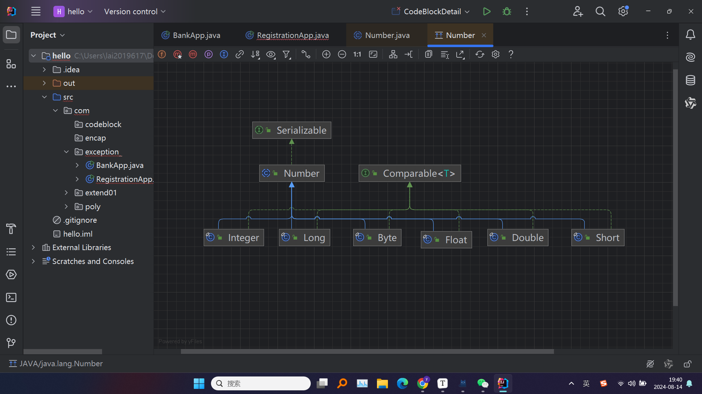

## 01.2 为什么需要包装类？

> * **集合框架的需要**：Java的集合框架（如`ArrayList`、`HashMap`等）只接受对象类型，而不能直接存储基本数据类型。包装类使得我们可以将基本数据类型封装为对象，从而存储在集合中
> * **对象的功能增强**：包装类提供许多实用的方法，如类型转换、比较、哈希计算等，这些都是基本数据类型不具备的
> * **与泛型配合**：Java的泛型不支持基本数据类型，因此包装类在泛型中的使用是必不可少的
> * **自动装箱与拆箱**：Java引入了自动装箱（Autoboxing）和自动拆箱（Unboxing）的特性，使得基本类型和包装类之间的转换变得更加自然

## 01.3 包装类与基本数据类型的转换

> * 这种转换包括**自动装箱**（Autoboxing）和**自动拆箱**（Unboxing）两种机制。自动装箱和拆箱（JDK5之后）简化了基本类型与包装类对象之间的操作，使得代码更加简洁和易于理解
> * **自动装箱（Autoboxing）**：将基本数据类型自动转换为对应的包装类对象
> * **自动拆箱（Unboxing）**：将包装类对象自动转换为对应的基本数据类型

### 01.3.1 自动装箱

> * 是将基本数据类型自动转换为对应的包装类对象。Java在需要对象而不是基本类型的上下文中，自动执行这一转换

```java
public class AutoboxingExample {
    public static void main(String[] args) {
        int primitiveInt = 10;
        Integer wrapperInt = primitiveInt; // 自动装箱

        System.out.println("Primitive int: " + primitiveInt);
        System.out.println("Wrapper Integer: " + wrapperInt);
    }
}
```

> * `primitiveInt` 是一个基本数据类型 `int`
> * 当将 `primitiveInt` 赋值给 `wrapperInt` 时，Java 自动将其装箱为 `Integer` 对象

> * #### 应用场景
>
>   - **在集合中使用**：集合框架（如`List`、`Set`）只接受对象，自动装箱允许将基本类型直接添加到集合中

```java
List<Integer> intList = new ArrayList<>();
intList.add(10); // 自动装箱为 Integer 对象
```

### 01.3.2 自动拆箱

> * 是将包装类对象自动转换为对应的基本数据类型。当包装类对象需要作为基本数据类型使用时，Java自动执行这一转换

```java
public class UnboxingExample {
    public static void main(String[] args) {
        Integer wrapperInt = 20; // 自动装箱
        int primitiveInt = wrapperInt; // 自动拆箱

        System.out.println("Wrapper Integer: " + wrapperInt);
        System.out.println("Primitive int: " + primitiveInt);
    }
}
```

> * #### 应用场景
>
>   - **算术运算**：自动拆箱允许我们直接在包装类对象上执行算术运算

```java
Integer wrapperInt = 5;
int result = wrapperInt + 10; // 自动拆箱为 int 并执行加法
System.out.println("Result: " + result); // 输出: 15
```

### 01.3.3 手动装箱

> * 指的是通过调用包装类的构造函数或静态方法将基本数据类型转换为包装类对象
> * 使用`new Integer(primitiveInt)`和`Integer.valueOf(primitiveInt)`都可以手动将基本类型装箱为`Integer`对象

```java
int primitiveInt = 30;

// 通过构造函数进行手动装箱
Integer wrapperInt1 = new Integer(primitiveInt);

// 通过静态方法 valueOf 进行手动装箱
Integer wrapperInt2 = Integer.valueOf(primitiveInt);

System.out.println("Manual boxing using constructor: " + wrapperInt1);
System.out.println("Manual boxing using valueOf: " + wrapperInt2);
```

### 01.3.4 手动拆箱

> * 指的是通过调用包装类的方法将包装类对象转换为对应的基本数据类型

```java
Integer wrapperInt = 40;

// 通过 intValue 方法进行手动拆箱
int primitiveInt = wrapperInt.intValue();

System.out.println("Manual unboxing: " + primitiveInt);
```

## 01.4包装类的对象缓存机制 **

> * 对于某些包装类，Java 会缓存特定范围内的对象，这意味着这些对象不会每次都创建新的实例，而是重用已有的实例。这种机制主要应用于`Byte`、`Short`、`Integer`、`Long`、`Character`和`Boolean`包装类
>
> * Java标准库中的以下包装类实现了对象缓存机制：
>
>   1. **`Byte`**：缓存所有可能的字节值，范围是 `-128` 到 `127`
>   2. **`Short`**：缓存范围是 `-128` 到 `127` 的值
>   3. **`Integer`**：缓存范围是 `-128` 到 `127` 的值
>   4. **`Long`**：缓存范围是 `-128` 到 `127` 的值
>   5. **`Character`**：缓存范围是 `\u0000` 到 `\u007F`（即 `0` 到 `127` 的字符）
>   6. **`Boolean`**：缓存 `true` 和 `false` 两个值
>
> * 其他包装类（如 `Float` 和 `Double`）则不实现对象缓存机制，因为它们的数值范围过于广泛，并且浮点数的使用场景通常不太需要缓存

```java
public class WrapperCacheExample {
    public static void main(String[] args) {
        // 在缓存范围内的 Integer 对象
        Integer a = 127;
        Integer b = 127;

        // 超出缓存范围的 Integer 对象
        Integer c = 128;
        Integer d = 128;

        // 比较缓存范围内的对象引用
        System.out.println("a == b: " + (a == b)); // 输出: true

        // 比较超出缓存范围的对象引用
        System.out.println("c == d: " + (c == d)); // 输出: false

        // 比较缓存范围内的对象值
        System.out.println("a.equals(b): " + a.equals(b)); // 输出: true

        // 比较超出缓存范围的对象值
        System.out.println("c.equals(d): " + c.equals(d)); // 输出: true
    }
}
```

> * 对于`Integer`、`Byte`、`Short`、`Long`等包装类，当调用 `valueOf` 方法或使用自动装箱时，Java 会先检查值是否在缓存范围内。如果在范围内，则返回缓存中的对象，否则创建一个新的对象

## 01.5 `==` 与 `equals()`的区别

> * 比较包装类对象时，`==` 比较的是对象的引用（即它们是否指向同一个对象），而 `equals()` 比较的是对象的值
> * ==因此，如果是new出两个值相等的包装类，比如说`Integer  1`。再用`==`，也是不相等的==

## 01.6 包装类型与`String`的相互转换

### 01.6.1 包装类转 `String`

> **使用 `toString()` 方法**
>
> * 每个包装类都继承自 `Object` 类，并重写了 `toString()` 方法，能够将包装类对象转换为其字符串表示形式
> * 如果包装类对象为`null`，调用`toString()`方法将抛出 `NullPointerException`

```java
public class ToStringExample {
    public static void main(String[] args) {
        Integer intValue = 42;
        Double doubleValue = 3.14159;

        // 使用 toString() 方法转换
        String intStr = intValue.toString();
        String doubleStr = doubleValue.toString();

        System.out.println("Integer as String: " + intStr);  // 输出: "42"
        System.out.println("Double as String: " + doubleStr);  // 输出: "3.14159"
    }
}
```

> **使用 `String.valueOf()` 方法**
>
> * `String.valueOf()` 方法是将包装类对象转换为 `String` 的推荐方式之一，它能够安全地处理 `null` 值
> * 能够处理`null`，如果对象为`null`，返回字符串 `"null"` 而不会抛出异常

```java
public class ValueOfExample {
    public static void main(String[] args) {
        Integer intValue = 42;
        Double doubleValue = 3.14159;

        // 使用 String.valueOf() 方法转换
        String intStr = String.valueOf(intValue);
        String doubleStr = String.valueOf(doubleValue);

        System.out.println("Integer as String: " + intStr);  // 输出: "42"
        System.out.println("Double as String: " + doubleStr);  // 输出: "3.14159"
    }
}
```

> **使用 `包装类 + ""`（字符串连接）**
>
> * 将包装类对象与一个空字符串 `""` 进行连接，可以快速将包装类转换为 `String` 类型。这种方式利用了字符串连接的特性，在连接时会自动调用对象的 `toString()` 方法

```java
public class ConcatenationExample {
    public static void main(String[] args) {
        Integer intValue = 42;
        Double doubleValue = 3.14159;

        // 通过字符串连接进行转换
        String intStr = intValue + "";
        String doubleStr = doubleValue + "";

        System.out.println("Integer as String: " + intStr);  // 输出: "42"
        System.out.println("Double as String: " + doubleStr);  // 输出: "3.14159"
    }
}
```

### 01.6.2 `String` 转换为包装类

> **使用包装类的 `parseXXX()` 方法**
>
> * 每个包装类提供了静态的 `parseXXX()` 方法，用于将字符串转换为对应的基本数据类型
> * 如果字符串格式不正确（如非数字字符），会抛出 `NumberFormatException`

```java
public class ParseXXXExample {
    public static void main(String[] args) {
        String intStr = "42";
        String doubleStr = "3.14159";

        // 使用 parseXXX() 方法将 String 转换为基本类型
        int intValue = Integer.parseInt(intStr);
        double doubleValue = Double.parseDouble(doubleStr);

        System.out.println("String as Integer: " + intValue);  // 输出: 42
        System.out.println("String as Double: " + doubleValue);  // 输出: 3.14159
    }
}                            
```

> **使用包装类的 `XXX.valueOf()` 方法**
>
> * 包装类的 `valueOf()` 方法将 `String` 转换为对应的包装类对象，是从 `String` 转换为包装类的推荐方式

```java
public class ValueOfStringExample {
    public static void main(String[] args) {
        String intStr = "42";
        String doubleStr = "3.14159";

        // 使用 valueOf() 方法将 String 转换为包装类型
        Integer intValue = Integer.valueOf(intStr);
        Double doubleValue = Double.valueOf(doubleStr);

        System.out.println("String as Integer: " + intValue);  // 输出: 42
        System.out.println("String as Double: " + doubleValue);  // 输出: 3.14159
    }
}
```

### 01.6.3 处理 `null` 值

```java
public class NullSafeExample {
    public static void main(String[] args) {
        Integer intValue = null;

        // 使用 String.valueOf() 方法避免 NullPointerException
        String intStr = String.valueOf(intValue);  // 输出: "null"

        // 使用三元运算符进行安全的字符串连接
        String safeIntStr = (intValue != null) ? intValue + "" : "null";

        System.out.println("Safe Integer as String: " + safeIntStr);  // 输出: "null"
    }
}
```

### 01.6.4 处理 `NumberFormatException`

```java
public class NumberFormatExceptionHandlingExample {
    public static void main(String[] args) {
        String invalidIntStr = "abc";

        try {
            int intValue = Integer.parseInt(invalidIntStr);  
            // 这里会抛出 NumberFormatException
        } catch (NumberFormatException e) {
            System.out.println("Invalid number format: " + e.getMessage());  
            // 输出: For input string: "abc"
        }
    }
}
```

## 01.7 `Integer`类常用方法

```java
//比较方法
Integer a = 5;
Integer b = 10;
int result = a.compareTo(b);  // 返回 -1，因为 a < b

//返回 Integer 对象的 int 值
Integer number = 123;
int value = number.intValue();  // 返回 123

//int 类型的最大值（2^31 - 1）
int maxValue = Integer.MAX_VALUE;

//int 类型的最小值（-2^31）
int minValue = Integer.MIN_VALUE;
```

## 01.8 `Character` 类的常用方法

```java
//判断字符是否为字母
boolean isLetter = Character.isLetter('a');  // 返回 true

//判断字符是否为数字
boolean isDigit = Character.isDigit('5');  // 返回 true

//判断字符是否为空白字符
boolean isWhitespace = Character.isWhitespace(' ');  // 返回 true

//判断字符是否为大写字母,里面可以传变量，也可以传包装类的
boolean isUpperCase = Character.isUpperCase('A');  // 返回 true

//判断字符是否为小写字母
boolean isLowerCase = Character.isLowerCase('a');  // 返回 true

//判断字符是否为字母或与字母相关的字符
boolean isAlphabetic = Character.isAlphabetic('a');  // 返回 true

//将字符转换为大写形式
char upper = Character.toUpperCase('a');  // 返回 'A'

//将字符转换为小写形式
char lower = Character.toLowerCase('A');  // 返回 'a'

//比较两个字符的大小，返回一个整数值
int comparison = Character.compare('a', 'b');  // 返回 -1，因为 'a' < 'b'
```

# 02 String类

> *  `String` 类型是用于表示字符串的类。`String` 类位于 `java.lang` 包中，Java 程序默认导入这个包，因此可以直接使用 `String` 类，而不需要显式导入
> * 字符串的字符使用`Unicode`字符编码，一个字符（不区分字母还是汉字）占两个字节
> * 可以看到，`String`类有非常多的构造器

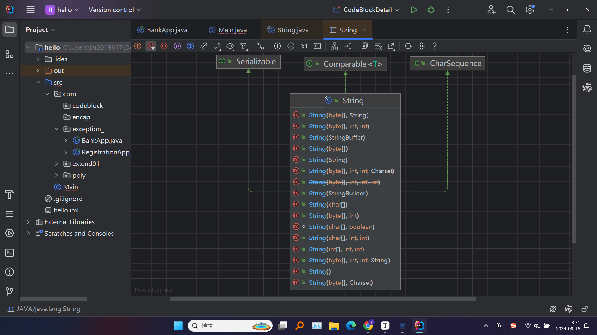

## 02.1 不可变性（Immutability）

> * 不可变性意味着一旦创建了一个 `String` 对象，其内容就不能被改变。每次对字符串的修改操作，都会创建一个新的 `String` 对象，而不会修改原来的对象

```java
public class StringReassignmentExample {
    public static void main(String[] args) {
        String str = "Hello";
        System.out.println("Original: " + str);  // 输出: Hello

        str = str + " World";  // 创建了一个新的字符串对象，并将其引用赋给str
        System.out.println("Modified: " + str);  // 输出: Hello World
    }
}
```

> * **最初的字符串**：`String str = "Hello";` 创建了一个字符串对象 `"Hello"`，`str` 引用它
>
> * **字符串“修改”**：当你执行 `str = str + " World";` 时，实际上发生了以下两件事：
>
>   1. 创建了一个新的字符串对象 `"Hello World"`
>
>   2. `str` 引用被更新，现在指向新的字符串对象 `"Hello World"`
>
> * 原来的字符串对象 `"Hello"` 此时不再有任何变量引用它，变成了不可达对象，这些不可达对象不会被立即删除，而是由垃圾回收器（Garbage Collector）在适当的时候进行回收，释放内存空间

## 02.2 存储方式

> * 在 Java 中，`String` 对象实际上是通过一个 `char[]` 数组来存储字符数据的。这也是 `String` 不可变的原因之一：一旦 `String` 对象创建后，内部的 `char[]` 数组不会被修改
> * `value[]` 是存储字符串内容的 `char` 数组
> * `final` 关键字使得这个数组一旦初始化后不能再被改变，从而确保了 `String` 的不可变性

```java
//java中的String类源码
public final class String implements java.io.Serializable, Comparable<String>, CharSequence {
    private final char value[];
    private int hash; // 字符串的哈希值，缓存以提高性能

    // String 的构造函数
    public String(String original) {
        this.value = original.value;
        this.hash = original.hash;
    }
}
```

## 02.3 创建方式

> * 方式一：使用字符串字面量
> * 当使用字面量（例如 `"Hello"`）来创建 `String` 对象时，Java 会在常量池（String Pool）中查找是否存在相同内容的字符串对象。如果有，则直接引用已有的对象；如果没有，则创建一个新的对象并放入常量池

```java
String str1 = "Hello";
String str2 = "Hello"; // str1 和 str2 指向同一个对象
```

> * 方式二：使用 `new` 关键字（调用构造器）
> * 使用 `new` 关键字会显式地创建一个新的 `String` 对象，而不会检查常量池。这种方式总是创建一个新的对象。虽然 `str3` 和 `str4` 的内容相同，但它们是不同的对象，`str3 == str4` 的结果为 `false`

```java
String str3 = new String("Hello");
String str4 = new String("Hello"); // str3 和 str4 是两个不同的对象
```

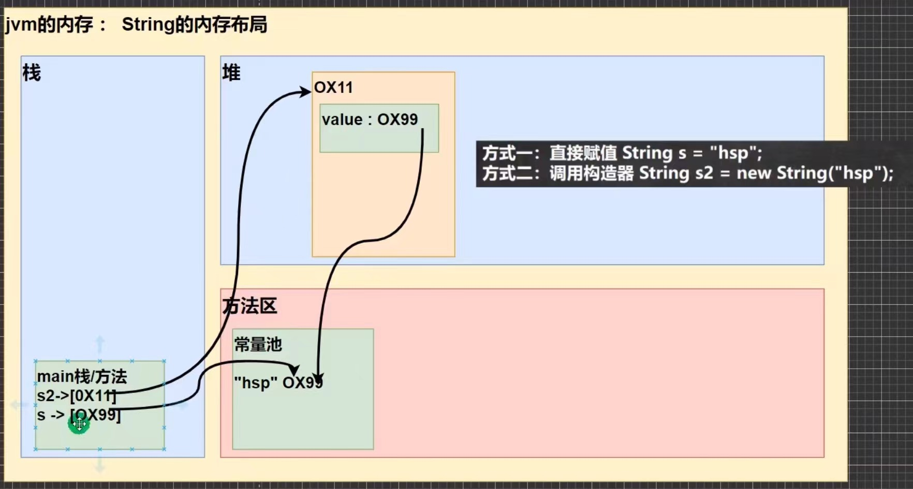

## 02.4 练习

```java
public class Main {
    public static void main(String[] args) {
        Person p1 = new Person();
        p1.name = "wsx";
        Person p2 = new Person();
        p2.name = "wsx";

        System.out.println(p1.name.equals(p2.name));  //对
        System.out.println(p1.name == p2.name);  //对
        System.out.println(p1.name == "wsx");  //对
    }
}
```
### 02.4.1字符串拼接特性 **

**题一**

> * `String`类型的字符串在编译时如果是常量表达式（如由字符串字面量相加形成的字符串），编译器会对其进行优化，即直接在编译期就将字符串连接的结果计算出来，然后将结果作为一个字符串字面量放入**字符串常量池**（String Pool）中。这意味着，在运行时不会创建新的字符串对象

> * 段代码在运行时只会创建**一个**字符串对象
> * 下面这句代码的执行过程如下：
>   1. **编译期优化**： `"as" + "ws"` 由于两个操作数都是字符串字面量，Java编译器会在编译时直接将这两个字符串连接成 `"asws"`，并将这个结果作为字面量存储在字符串常量池中。
>   2. **字符串常量池检查**：在运行时，Java虚拟机会检查字符串常量池中是否已经存在 `"asws"` 这个字符串字面量。如果存在，则直接返回对该字符串的引用；如果不存在，则会将其添加到字符串常量池中。
>   3. **赋值给变量 `a`**：`a` 会指向字符串常量池中的 `"asws"` 字符串对象

```java
String a = "as" + "ws";
```
**题二**

> * `alt + shift + F7`强制进入键，进入方法体，看调用方法的具体实现细节
> * 由于 `a` 和 `b` 是字符串变量，而不是字符串字面量，编译器无法在编译时优化这个字符串拼接

```java
String a = "hello";  //创建一个对象（常量池没有的话）
String b = "abc";  //创建一个对象（常量池没有的话）
String c = a + b;  //创建三个对象
String d = "helloabc";
System.out.println(c == d);  //false
```

>  因此，在运行时会创建一个 `StringBuilder` 对象，用于执行字符串拼接操作

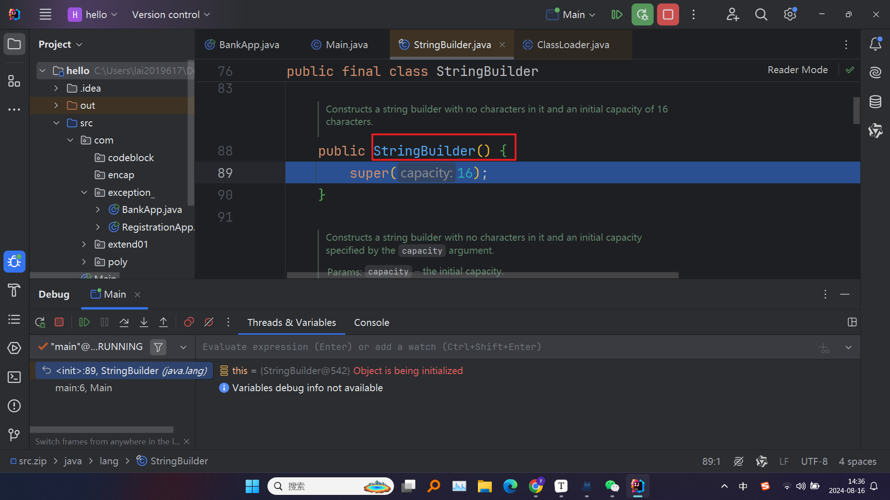

> * 退出方法体（`F8`）发现还停留在这句，说明还没执行完，再次强制进入
> * `StringBuilder` 的 `append` 方法会将 `a` 和 `b` 的内容拼接，最终生成 `"helloabc"` 字符串

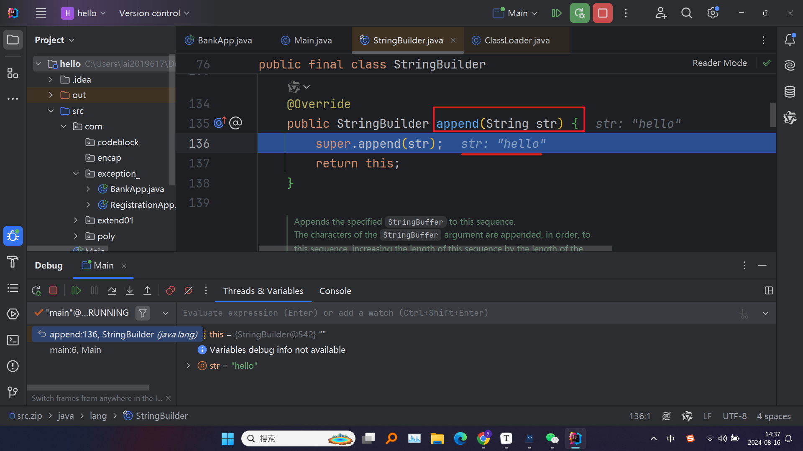

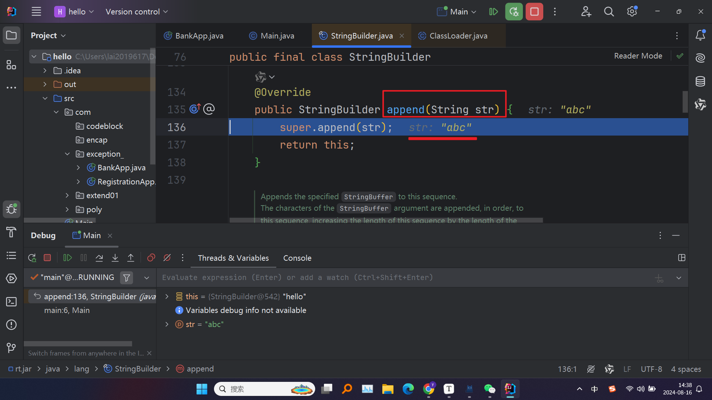

> * 最后，`toString()` 方法将 `StringBuilder` 中拼接好的内容转换为一个新的 `String` 对象，并将其引用赋给 `c`

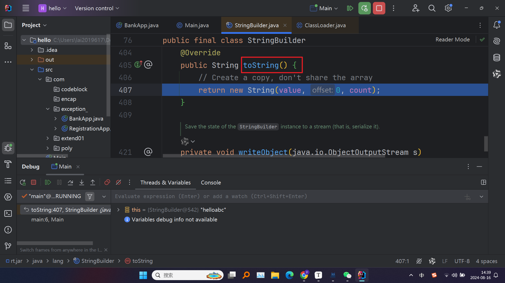

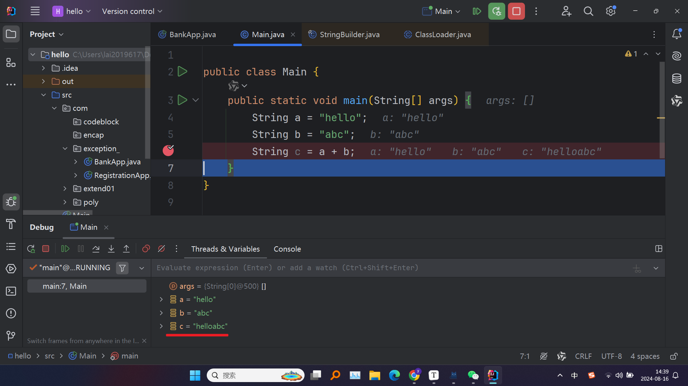

> * 根据上面的分析，这段代码通常会创建五个对象：
>   1. `"hello"` 字符串对象（存储在字符串常量池中）
>   2. `"abc"` 字符串对象（存储在字符串常量池中）
>   3. 一个 `StringBuilder` 对象（用于拼接字符串）
>   4. 一个 `String` 对象存储 `"helloabc"`
>   5. `"helloabc"` 字符串对象（如果拼接结果需要加入常量池，这个是编译器决定的）

**题三**

```java
public class Test1{
    String str = new String("hsp");
    final char[] ch = {'j', 'a', 'v', 'a'};
    public void change(String str, char[] ch){
        str = "java";
        ch[0] = 'h';
    }
    public static void main(String[] args) {
        Test1 ex = new Test1();
        ex.change(ex.str, ex.ch);
        System.out.print(ex.str + "and");
        System.out.println(ex.ch);
    }
}
```

> * 由于 `ch` 被声明为 `final`，它的引用不能被重新分配，即它总是指向同一个数组对象。但这个数组对象的内容是可以修改的
> * `str = "java";` 将 `str` 这个引用副本重新指向了一个新的 `String` 对象 `"java"`。**重要**：这种操作仅改变了 `str` 引用的副本，并不会影响外部的 `ex.str`。外部的 `ex.str` 仍然指向原始的 `"hsp"` 对象
> * `ch[0] = 'h';` 修改了 `ch` 引用指向的数组的第一个元素，将其从 `'j'` 改为 `'h'`。**重要**：因为 `ch` 引用的副本和原始的 `ex.ch` 都指向同一个数组对象，因此这个修改直接影响了数组的内容，外部的 `ex.ch` 也发生了变化，变成 `{'h', 'a', 'v', 'a'}`
> * ==我自己理解因为String类不可变，方法体内对这个变量进行重新赋值，也就是说内部和外部的str指向的地址是不同的，相当于就是这个副本指向了另外一个对象，这肯定是不影响外部的引用的。而ch在方法体内仍然还是这个地址，他是针对这个地址的对象进行修改，外部引用也指向这个地址，因此会受到影响==

## 02.5 常用方法

### 02.5.1 `String.intern()`

> * 用于将字符串加入到字符串常量池（String Pool）中，并返回字符串常量池中该字符串的引用。它在优化内存使用和提高性能方面扮演了重要角色，尤其是在需要大量重复字符串时
>
> * **字符串常量池**是Java中一个特殊的内存区域，用于存储字符串字面量（如 `"Hello"`）以及通过 `intern()` 方法加入池中的字符串。当一个字符串被加入字符串常量池后，池中将只保留一个该字符串的副本，这样可以节省内存
>
> * `intern()` 方法会检查字符串常量池中是否已经包含与当前字符串内容相同的字符串：
>
>   1.如果存在，`intern()` 返回池中该字符串的引用
>
>   2.如果不存在，`intern()` 会将该字符串加入字符串常量池，并返回该字符串的引用

```java
public class InternExample {
    public static void main(String[] args) {
        String str1 = new String("Hello");
        String str2 = str1.intern();
        String str3 = "Hello";

        // str2 和 str3 指向同一个字符串常量池中的对象
        System.out.println(str2 == str3); // 输出: true
        System.out.println(str1 == str3); // 输出: false
    }
}
```

> * 如果应用程序中存在大量重复的字符串，并且这些字符串的内容相同但对象不同，使用 `intern()` 可以减少内存消耗

```java
public class MemoryOptimizationExample {
    public static void main(String[] args) {
        String[] data = new String[10000];

        for (int i = 0; i < data.length; i++) {
            data[i] = new String("Data").intern(); // 所有的data[i]都指向同一个字符串常量池中的"Data"
        }

        System.out.println("Data optimization done");
    }
}
```

> * 当你需要频繁比较字符串时，使用 `intern()` 可以将字符串的比较从内容比较变为引用比较，从而提高性能

```java
public class StringComparisonExample {
    public static void main(String[] args) {
        String str1 = new String("Hello").intern();
        String str2 = new String("Hello").intern();

        // 由于 intern()，str1 和 str2 都指向常量池中的同一个对象，因此可以用 == 比较
        System.out.println(str1 == str2); // 输出: true
    }
}
```

### 02.5.2 常用方法1

```java
//length()，返回字符串的长度（字符数），包括空格和标点符号
String str = "Hello, World!";
int len = str.length();
System.out.println(len);  // 输出: 13

//charAt(int index)，返回指定索引处的字符。索引从 0 开始
char ch = str.charAt(1);
System.out.println(ch);  // 输出: e

//substring(int beginIndex, int endIndex)
//返回从 beginIndex 开始到 endIndex 结束的子字符串，endIndex 位置的字符不包含在内
String subStr = str.substring(0, 5);
System.out.println(subStr);  // 输出: Hello

//indexOf(char ch)，返回字符 ch 在字符串中首次出现的索引。如果未找到，返回 -1
int index = str.indexOf('o');
System.out.println(index);  // 输出: 4

//indexOf(String str)，返回子字符串 str 在字符串中首次出现的索引。如果未找到，返回 -1
int index = str.indexOf("World");
System.out.println(index);  // 输出: 7

//lastIndexOf(char ch)，返回字符 ch 在字符串中最后一次出现的索引。如果未找到，返回 -1
int lastIndex = str.lastIndexOf('o');
System.out.println(lastIndex);  // 输出: 8

//equals(Object obj)，比较两个字符串的内容是否相同，区分大小写
String str1 = "Hello";
String str2 = "hello";
boolean isEqual = str1.equals(str2);
System.out.println(isEqual);  // 输出: false

//equalsIgnoreCase(String anotherString)，比较两个字符串的内容是否相同，忽略大小写
boolean isEqualIgnoreCase = str1.equalsIgnoreCase(str2);
System.out.println(isEqualIgnoreCase);  // 输出: true

//replace(char oldChar, char newChar)，将字符串中所有的 oldChar 替换为 newChar
String replacedStr = str.replace('l', 'p');
System.out.println(replacedStr);  // 输出: Heppo, Worpd!

//replace(CharSequence target, CharSequence replacement)
//将字符串中所有的 target 子字符串替换为 replacement
String replacedStr = str.replace("World", "Java");
System.out.println(replacedStr);  // 输出: Hello, Java!

//toLowerCase()，将字符串中的所有字符转换为小写
String lowerStr = str.toLowerCase();
System.out.println(lowerStr);  // 输出: hello, world!

//toUpperCase()，将字符串中的所有字符转换为大写
String upperStr = str.toUpperCase();
System.out.println(upperStr);  // 输出: HELLO, WORLD!

//trim()，去除字符串首尾的空白字符（空格、制表符等）
String strWithSpaces = "   Hello, World!   ";
String trimmedStr = strWithSpaces.trim();
System.out.println(trimmedStr);  // 输出: Hello, World!

//join(CharSequence delimiter, CharSequence... elements)
//使用指定的分隔符将多个字符串连接为一个字符串
String joinedStr = String.join("-", "Java", "is", "fun");
System.out.println(joinedStr);  // 输出: Java-is-fun

//contains(CharSequence s)，判断字符串是否包含指定的子字符串
boolean containsStr = str.contains("World");
System.out.println(containsStr);  // 输出: true

//toCharArray()，将字符串转换为字符数组
char[] chars = str.toCharArray();
for (char c : chars) {
    System.out.print(c + " ");
}
// 输出: H e l l o ,   W o r l d !
```

# 03 StringBuffer类

> * `StringBuffer` 类是用于创建和操作可变字符串的类。与不可变的 `String` 类不同，`StringBuffer` 提供了一种在内容可变的情况下对字符串进行高效操作的方法。这使得 `StringBuffer` 特别适合用于需要频繁修改字符串内容的场景，比如字符串的拼接、插入、删除等操作
>
> * **`StringBuffer` 的基本特点**
>
>   1.**可变性**：`StringBuffer` 是可变的，这意味着可以在不创建新对象的情况下修改其内容
>
>   2.**线程安全**：`StringBuffer` 线程安全，多线程环境中可以安全地使用。通过在方法上添加 `synchronized` 关键字来确保线程安全性，这也意味着它的性能比 `StringBuilder` 略差
>
>   3.**性能**：由于是线程安全的，相较于 `StringBuilder`，`StringBuffer` 在单线程环境中的性能较低，但在多线程环境中能够保证数据的正确性
>
> * 在`StringBuffer`的父类`AbstractStringBuilder`中，可以看到属性`char[] value`，他不是`final`的，和`String`类不一样，因此是存放在堆中的，而不是常量池中
>
> * **扩容机制**: 如果 `StringBuffer` 中存储的字符数超过了当前容量，`StringBuffer` 会自动扩容。扩容时，`StringBuffer` 的容量将增加到 `(当前容量 * 2) + 2`。这种增长方式可以减少扩容的频率，从而提高性能
>

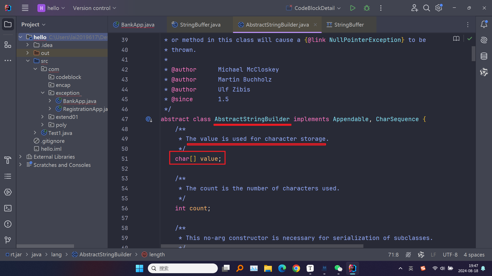

> * `StringBuffer`类是`final`的，不能被继承

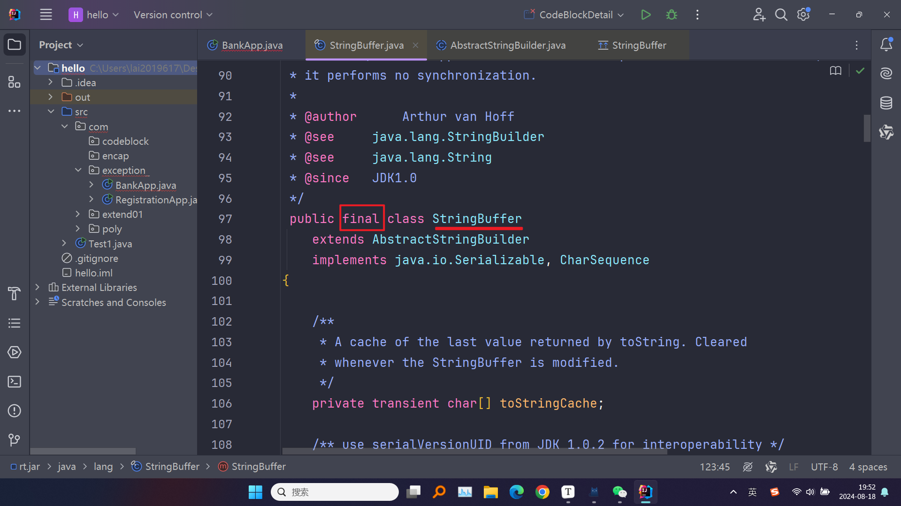

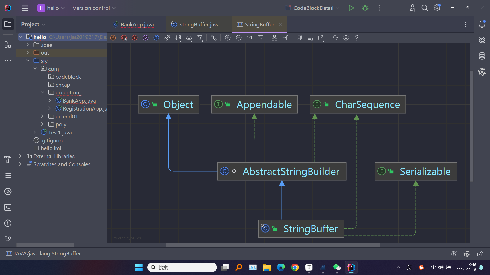

## 03.1 `String`和`StringBuffer`

> * **是否可变性**：
>
>   1.`String` 是不可变的（immutable）。一旦创建了 `String` 对象，其内容就不能被修改。任何对 `String` 的操作（如拼接、替换等）都会创建一个新的 `String` 对象，而不会修改原来的对象
>
>   2.**可变性**：`StringBuffer` 是可变的（mutable）。允许在不创建新对象的情况下修改其内容。通过 `append`、`insert`、`delete` 等方法，可以直接对字符串内容进行修改
>
> * **线程安全性**：
>
>   1.`String` 是线程安全的，因为它是不可变的。在多线程环境中，多个线程可以安全地共享同一个 `String` 对象，而不需要额外的同步机制
>
>   2.`StringBuffer` 是线程安全的。它的许多方法使用了 `synchronized` 关键字，确保了在多线程环境下对 `StringBuffer` 对象的操作是安全的。**缺点**：由于线程安全性，`StringBuffer` 的性能在某些情况下会低于 `StringBuilder`，特别是在单线程环境下
>
> * **内存使用**：
>
>   1.`String` 是不可变的，每次修改字符串都会创建一个新的 `String` 对象。这可能会导致大量的短命对象（short-lived objects）占用内存，特别是在频繁修改字符串的场景下。**内存优化**：Java 的字符串常量池（String Pool）机制可以优化内存使用，将相同内容的 `String` 对象共享存储
>
>   2.`StringBuffer` 在内存中分配了一个可变的字符数组来存储字符串内容。随着内容的增加，`StringBuffer` 可以自动扩展容量，减少了频繁创建对象的开销。**内存分配**：初始容量可以通过构造函数指定，如果超过初始容量，`StringBuffer` 会自动扩展

## 03.2 创建 `StringBuffer` 对象

> * `StringBuffer` 类有多个构造器，用于创建不同初始状态的 `StringBuffer` 对象。通过这些构造器，你可以根据需要指定初始容量、初始内容等参数

**方式一**
> * 创建一个空的 `StringBuffer` 对象，并设置默认的初始容量
> * 默认初始容量为 16 个字符。`StringBuffer` 内部维护了一个可变的字符数组，初始时容量为 16。如果内容超过 16 个字符，`StringBuffer` 会自动扩容

```java
StringBuffer buffer = new StringBuffer();
```

> * 可以设个断点，然后强制进入看看内部源码`ctrl + B`
> * 可以看到这里的无参构造器是用了`super`，默认字符串为16，也就是父类的构造器，再强制进入看看

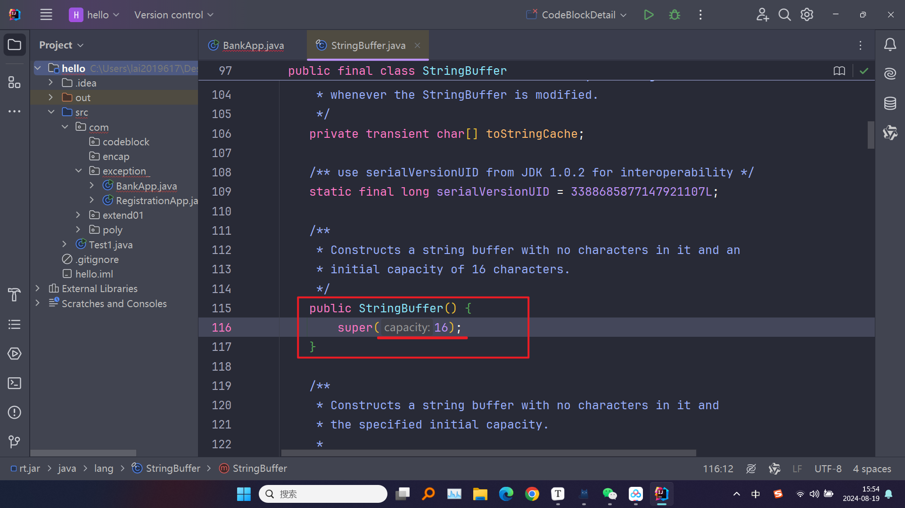

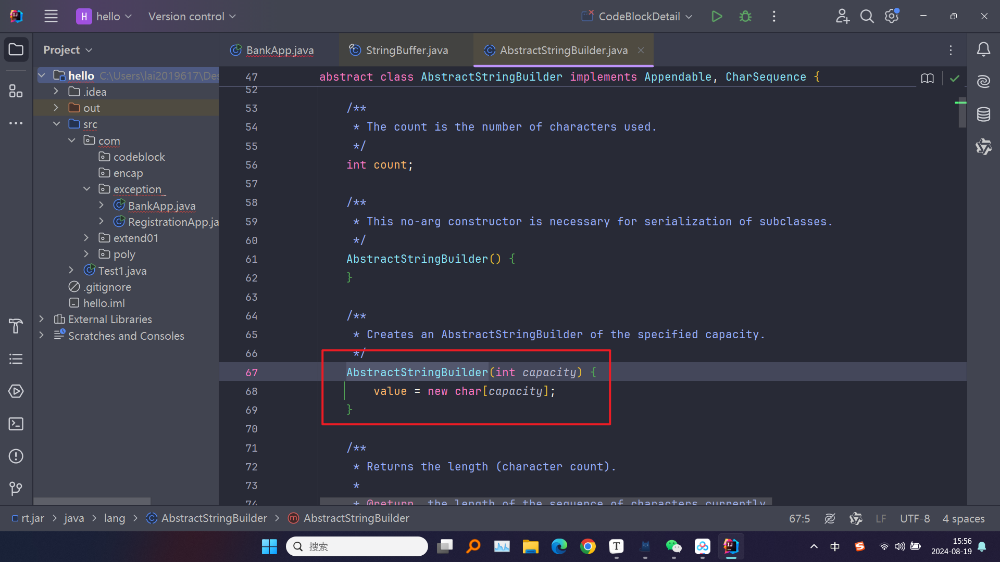

**方式二**

> * 创建一个空的 `StringBuffer` 对象，并设置指定的初始容量
> * **初始容量**: 由构造器参数 `capacity` 指定。例如，`new StringBuffer(50)` 创建的 `StringBuffer` 对象具有初始容量 50 个字符

```java
StringBuffer buffer = new StringBuffer(50);
```

**方式三**
> * 创建一个 `StringBuffer` 对象，并将其初始化为指定的字符串内容
> * **初始容量**: 初始容量为 `str.length() + 16`。如果字符串 `str` 的长度为 5，则 `StringBuffer` 对象的初始容量为 21（即 5 + 16）

```java
StringBuffer buffer = new StringBuffer("Hello");
```

**方式四**

> * 创建一个 `StringBuffer` 对象，并将其初始化为指定的 `CharSequence` 内容
> * **初始容量**: 初始容量为 `seq.length() + 16`。与 `String` 构造器类似，它会在 `CharSequence` 的长度基础上额外分配 16 个字符的空间。**用途**: 当你有一个实现了 `CharSequence` 接口的对象（如 `StringBuilder`、`String`、`StringBuffer`）并希望将其转换为 `StringBuffer` 时，可以使用这个构造器

```java
CharSequence seq = "Hello";
StringBuffer buffer = new StringBuffer(seq);
```

## 03.3 `String`和`StringBuffer`相互转换

### 03.3.1  `String` 转 `StringBuffer`

> * 最直接的方法是使用 `StringBuffer` 的构造器将 `String` 转换为 `StringBuffer`

```java
String str = "Hello World";
StringBuffer buffer = new StringBuffer(str);
System.out.println(buffer);  // 输出: Hello World
```

> * 若已经有一个 `StringBuffer` 对象，可以通过 `append()` 方法将 `String` 添加到 `StringBuffer` 中

```java
String str = "Hello";
StringBuffer buffer = new StringBuffer();
buffer.append(str);
System.out.println(buffer);  // 输出: Hello
```

### 03.3.2 `StringBuffer` 转 `String`

> * `StringBuffer` 提供了一个 `toString()` 方法，可以将 `StringBuffer` 对象的内容转换为 `String`

```java
StringBuffer buffer = new StringBuffer("Hello World");
String str = buffer.toString();
System.out.println(str);  // 输出: Hello World
```

> * 使用 `String` 的构造器来从 `StringBuffer` 创建一个新的 `String` 对象

```java
StringBuffer buffer = new StringBuffer("Hello World");
String str = new String(buffer);
System.out.println(str);  // 输出: Hello World
```

## 03.4 常用方法

> * `StringBuffer` 类提供了一系列常用方法，用于在不创建新对象的情况下修改字符串内容。`StringBuffer` 是可变的，并且是线程安全的，这使得它特别适合在多线程环境中进行字符串的高效操作

### 03.4.1 `append()`增

> * 在 `StringBuffer` 的末尾追加字符串、字符、数字等各种类型的数据
> * `append()` 方法将传入的参数追加到 `StringBuffer` 对象的末尾，原有的 `StringBuffer` 对象被直接修改，而不会创建新的对象

```java
StringBuffer buffer = new StringBuffer("Hello");
buffer.append(" World");
buffer.append(123);
System.out.println(buffer);  // 输出: Hello World123
```

### 03.4.2 `delete()`删

> * 删除从开始索引到结束索引之间的字符（左闭右开）

```java
StringBuffer buffer = new StringBuffer("Hello World");
buffer.delete(5, 11);
System.out.println(buffer);  // 输出: Hello
```

### 03.4.3 `deleteCharAt()`删

> * 删除指定索引处的字符
> * `deleteCharAt(int index)` 删除 `index` 位置处的字符，后续字符向前移位填补删除的位置

```java
StringBuffer buffer = new StringBuffer("Hello World");
buffer.deleteCharAt(5);
System.out.println(buffer);  // 输出: HelloWorld
```

### 03.4.4 `replace()`改

> * 将从开始索引到结束索引之间的内容替换为指定的字符串（左闭右开）
> * `replace(int start, int end, String str)` 用 `str` 替换从索引 `start` 到 `end` 之间的内容

```java
StringBuffer buffer = new StringBuffer("Hello World");
buffer.replace(6, 11, "Java");
System.out.println(buffer);  // 输出: Hello Java
```

### 03.4.5 `setCharAt()`改

> * 修改指定索引处的字符
> * `setCharAt(int index, char ch)` 将 `index` 位置处的字符替换为 `ch`，修改的是原 `StringBuffer` 对象中的内容

```java
StringBuffer buffer = new StringBuffer("Hello World");
buffer.setCharAt(6, 'J');
System.out.println(buffer);  // 输出: Hello Jorld
```

### 03.4.6 `indexOf()`查

> * 返回指定子字符串在 `StringBuffer` 中第一次出现的索引位置，如果没有找到，返回 `-1`

```java
StringBuffer buffer = new StringBuffer("Hello World");
int index = buffer.indexOf("World");
System.out.println(index);  // 输出: 6

//indexOf(String str, int fromIndex)
//从指定的索引位置开始搜索，返回子字符串第一次出现的索引位置
StringBuffer buffer = new StringBuffer("Hello World World");
int index = buffer.indexOf("World", 7);
System.out.println(index);  // 输出: 12
```

### 03.4.7 `charAt()`查

> * 返回指定索引处的字符

```java
StringBuffer buffer = new StringBuffer("Hello World");
char ch = buffer.charAt(6);
System.out.println(ch);  // 输出: W
```

### 03.4.8 `insert()`插

> * 在指定位置插入字符串、字符、数字等数据
> * `insert()` 方法在 `StringBuffer` 指定的索引处插入给定的数据，原有的内容将被向后移位

```java
StringBuffer buffer = new StringBuffer("Hello World");
buffer.insert(5, ",");
buffer.insert(6, " Java");
System.out.println(buffer);  // 输出: Hello, Java World
```

### 03.4.9 `reverse()`

> * 将 `StringBuffer` 中的字符顺序反转

```java
StringBuffer buffer = new StringBuffer("Hello World");
buffer.reverse();
System.out.println(buffer);  // 输出: dlroW olleH
```

### 03.4.10 `length()`

> * 返回 `StringBuffer` 中字符的数量
> * 不同于 `capacity()`，`capacity()` 表示内部数组的大小，而 `length()` 表示实际存储的字符数

```java
StringBuffer buffer = new StringBuffer("Hello World");
System.out.println(buffer.length());  // 输出: 11
```

## 03.5 练习

```java
//分析这段代码的输出
public class Test1{
    public static void main(String[] args) {
        String str = null;
        StringBuffer sb = new StringBuffer();
        sb.append(str);
        System.out.println(sb.length());
    }
}
```

> * 主要看append方法里传入null会怎样
> * 进入方法体发现是调用了父类的append，继续追

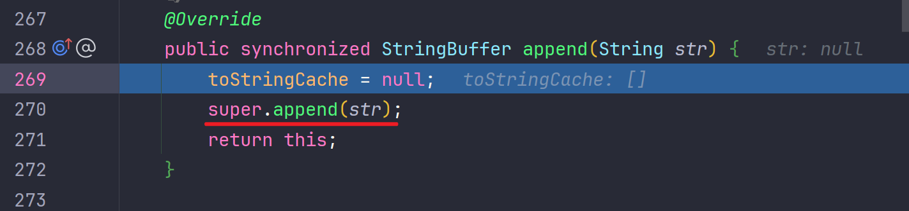

> * 可以看到，这里有专门写明如果传入的事null该如何处理
> * 继续追入appendnull方法中

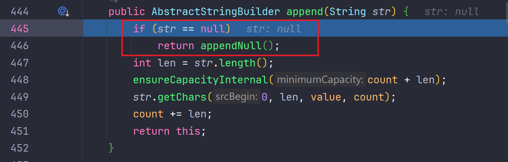

> * 发现这里将null作为四个字符进行计数
> * 具体来说，当 `append` 方法接收到一个 `null` 值时，它不会抛出 `NullPointerException`，而是将字符串 `"null"` 追加到 `StringBuffer` 中

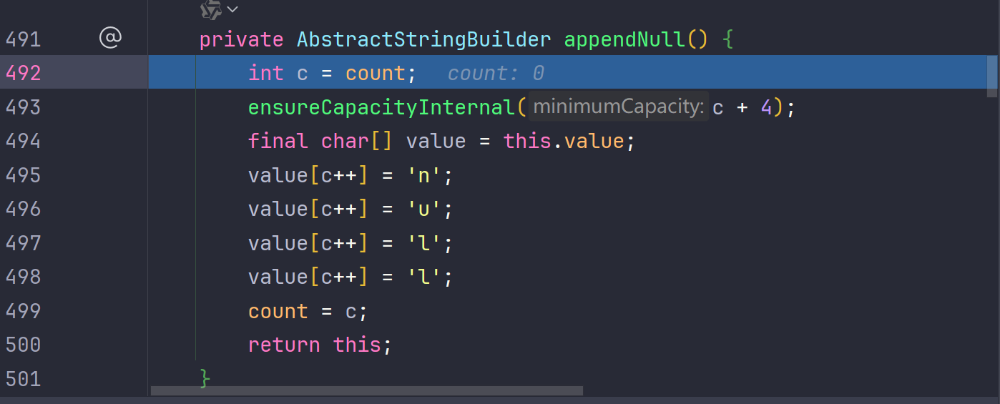

> * `count` 变量表示当前 `StringBuffer` 或 `StringBuilder` 中已经包含的字符数量
> * `ensureCapacityInternal(c + 4);` 方法用于确保 `StringBuffer` 或 `StringBuilder` 有足够的容量来容纳新添加的字符
> * 通过 `final char[] value = this.value;`，代码获取当前字符数据数组的引用，以便在后续操作中直接修改这个数组
> * 将 `'n'`、`'u'`、`'l'`、`'l'` 字符逐个添加到 `value` 数组中，覆盖从索引 `c` 开始的 4 个位置
> * 更新 `count` 的值为 `c`，此时 `c` 表示添加 `"null"` 字符串后的新字符数

# 04 StringBuilder类

> * 与 `StringBuffer` 类非常相似，但 `StringBuilder` 不具有线程安全的特性，这使得它在单线程环境中性能更高。`StringBuilder` 提供了许多方法来高效地修改字符串内容，如追加、插入、删除、替换等操作
> * 单线程情况下，优先使用`StringBuilder`，因为比`StringBuffer`更快

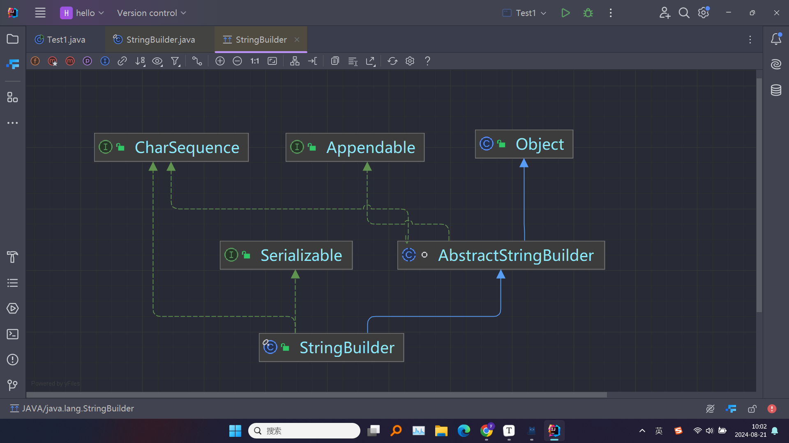


## 04.1 创建`StringBuilder`对象

> * 和`StringBuffer`的构造器是一样的，因此创建方式也都一样

方式一

> * 创建一个空的 `StringBuilder` 对象，默认初始容量为 16 个字符

```java
StringBuilder sb = new StringBuilder();
```

方式二

> * 创建一个具有指定初始容量的 `StringBuilder` 对象

```java
StringBuilder sb = new StringBuilder(50);
```

方式三

> * 创建一个以指定字符串内容初始化的 `StringBuilder` 对象

```java
StringBuilder sb = new StringBuilder("Hello");
```

方式四

> * 通过实现了 `CharSequence` 接口的对象（如 `String`）创建 `StringBuilder`

```java
StringBuilder sb = new StringBuilder("Hello World");
```

## 04.2 常用方法

> * 和`StringBuffer`的常用方法基本一样

## 04.3 总结

| 特性       |             `String`             |        `StringBuffer`        |      `StringBuilder`       |
| ---------- | :------------------------------: | :--------------------------: | :------------------------: |
| 可变性     |              不可变              |             可变             |            可变            |
| 线程安全性 |             线程安全             |           线程安全           |         非线程安全         |
| 性能       |    性能较低，频繁修改时效率低    | 性能较高，但由于同步机制稍慢 |    性能最高，无同步机制    |
| 存储方式   |      字符数组，字符串池共享      |  字符数组，堆内存，逐步扩容  | 字符数组，堆内存，逐步扩容 |
| 内存使用   | 由于不可变，每次修改会创建新对象 |   内存使用较低，可原地修改   | 内存使用较低，可原地修改>  |


