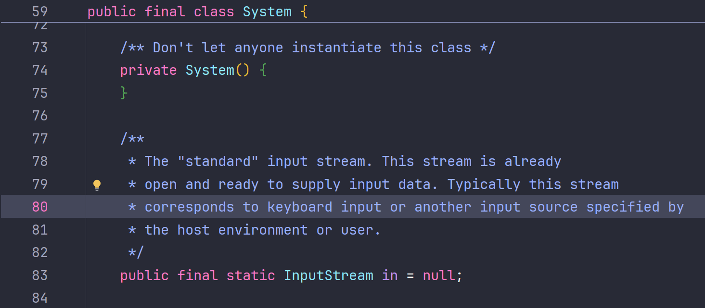
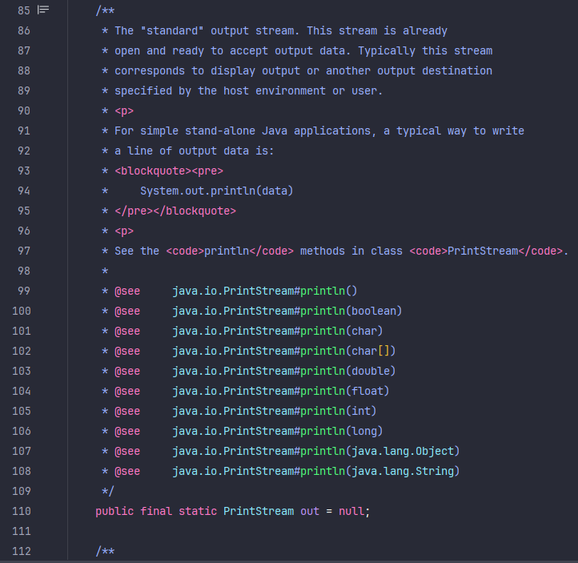
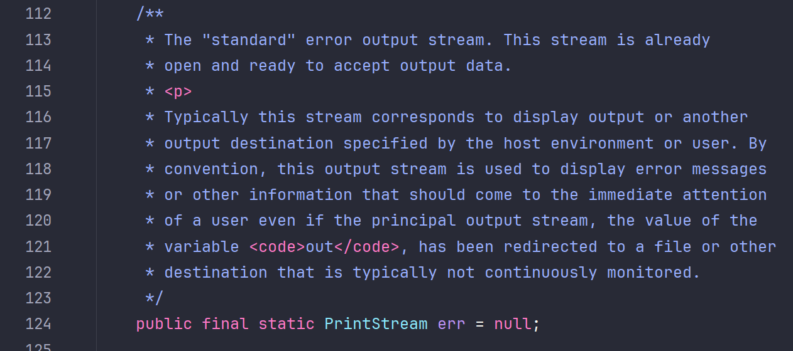
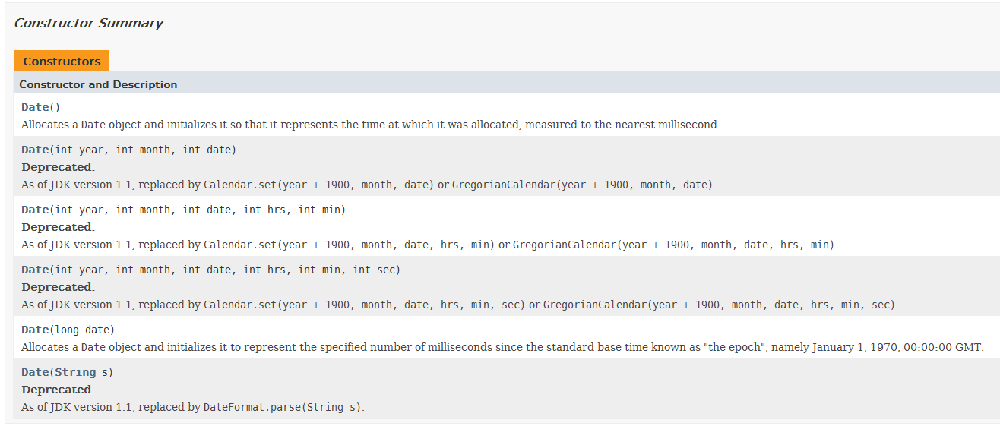

# 01 `Math`类

> * `Math` 类是 Java 标准库中提供的一个工具类，包含用于执行基本数学运算的方法
> * `Math` 类的所有方法都是静态方法，这意味着你不需要创建 `Math` 类的实例即可使用这些方法

## 01.1 基本特点

> * **静态方法**：`Math` 类中的所有方法都是 `static` 静态方法，因此可以直接通过类名调用
> * **不可实例化**: `Math` 类的构造方法是私有的，目的是防止实例化
> * **高效**: 许多 `Math` 方法是由底层平台的本地库实现的，因此通常比纯 Java 代码更高效
> * **精度**: 大部分方法的返回值都是 `double` 或 `int` 类型，以确保计算的精度

## 01.2 常用方法

> * **`Math.abs()`**: 返回绝对值
> * **`Math.max()` 和 `Math.min()`**: 返回两个值中的最大值或最小值
> * **`Math.pow(double a, double b)`**: 返回 `a` 的 `b` 次幂
> * **`Math.sqrt(double a)`**: 返回 `a` 的平方根
> * **`Math.cbrt(double a)`**: 返回 `a` 的立方根

```java
int a = Math.abs(-10);  // 输出: 10
double b = Math.abs(-10.5);  // 输出: 10.5

int max = Math.max(10, 20);  // 输出: 20
double min = Math.min(10.5, 20.0);  // 输出: 10.5

double result = Math.pow(2, 3);  // 输出: 8.0

double result = Math.sqrt(16);  // 输出: 4.0

double result = Math.cbrt(27);  // 输出: 3.0
```

> * **`Math.ceil(double a)`**: 返回大于或等于 `a` 的最小整数值（向上取整）
> * **`Math.floor(double a)`**: 返回小于或等于 `a` 的最大整数值（向下取整）
> * **`Math.round(double a)`**: 返回最接近的整数值，`a` 四舍五入

```java
double result = Math.ceil(2.3);  // 输出: 3.0

double result = Math.floor(2.7);  // 输出: 2.0

long result = Math.round(2.5);  // 输出: 3
```

> * **`Math.exp(double a)`**: 返回 `e` 的 `a` 次幂
> * **`Math.log(double a)`**: 返回 `a` 的自然对数（以 `e` 为底）
> * **`Math.log10(double a)`**: 返回 `a` 的以 10 为底的对数

```java
double result = Math.exp(1);  // 输出: 2.718281828459045 (即 e)

double result = Math.log(2.718281828459045);  // 输出: 1.0

double result = Math.log10(100);  // 输出: 2.0
```

> * **`Math.sin(double a)`**: 返回 `a` 弧度的正弦值
> * **`Math.cos(double a)`**: 返回 `a` 弧度的余弦值
> * **`Math.tan(double a)`**: 返回 `a` 弧度的正切值
> * **`Math.asin(double a)`**: 返回 `a` 的反正弦值，返回的角度范围是 `-π/2` 到 `π/2` 之间
> * **`Math.acos(double a)`**: 返回 `a` 的反余弦值，返回的角度范围是 `0` 到 `π` 之间
> * **`Math.atan(double a)`**: 返回 `a` 的反正切值，返回的角度范围是 `-π/2` 到 `π/2` 之间
> * **`Math.toRadians(double deg)`**: 将角度转换为弧度
> * **`Math.toDegrees(double rad)`**: 将弧度转换为角度

```java
double result = Math.sin(Math.PI / 2);  // 输出: 1.0
double result = Math.cos(0);  // 输出: 1.0
double result = Math.tan(Math.PI / 4);  // 输出: 1.0
double result = Math.asin(1);  // 输出: 1.5707963267948966 (即 π/2)
double result = Math.acos(1);  // 输出: 0.0
double result = Math.atan(1);  // 输出: 0.7853981633974483 (即 π/4)
double radians = Math.toRadians(180);  // 输出: 3.141592653589793 (即 π)
double degrees = Math.toDegrees(Math.PI);  // 输出: 180.0
```

## 01.3 随机数方法

### 01.3.1 基本用法

> * **`Math.random()`**: 返回一个 `[0.0, 1.0)` 之间的伪随机 `double` 值

```java
double randomValue = Math.random();
System.out.println(randomValue);  // 输出一个介于 0.0 到 1.0 之间的随机数
```

### 01.3.2 生成指定范围的随机浮点数

> * 生成一个在 `[min, max)` 范围内的随机浮点数

```java
double randomValue = min + (max - min) * Math.random();
```

> * 生成一个在 `[min, max)` 范围内的随机整数

```java
int randomInt = (int)(min + (max - min) * Math.random());
```

> * 生成 `[min, max]` 的整数，可以使用 `(max - min + 1)`

```java
int randomInt = min + (int)((max - min + 1) * Math.random());
```

# 02 `Arrays`类

> * 供了用于操作数组的静态方法，例如排序、搜索、填充、比较和转换等功能

## 02.1 基本特点

> * **静态方法**: `Arrays` 类中的所有方法都是 `static` 静态方法，可以直接通过类名调用，而不需要创建实例
> * **泛型支持**: `Arrays` 类的许多方法支持泛型，使得它们可以应用于任意类型的数组
> * **高效实现**: 许多 `Arrays` 类的方法内部实现采用了高效的算法，经过精心优化，提供最佳性能

## 02.2 常用方法

### 02.2.1 `sort()`排序

> *  对数组进行排序
> *  下面只以`int`类型为例，其他数据类型的`sort()`方法也都重载好了，均可使用

```java
//sort(int[] a)
int[] arr = {3, 1, 4, 1, 5, 9};
Arrays.sort(arr);
System.out.println(Arrays.toString(arr));  // 输出: [1, 1, 3, 4, 5, 9]

//sort(int[] a, int fromIndex, int toIndex)，对指定范围的排序
int[] arr = {3, 1, 4, 1, 5, 9};
Arrays.sort(arr, 2, 5);  // 只排序索引2到4的元素，左闭右开

//void sort(Object[] a): 对对象数组 a 进行升序排序，前提是数组中的对象必须实现 Comparable 接口
String[] arr = {"banana", "apple", "pear"};
Arrays.sort(arr);

```

### 02.2.2 `parallelSort()`并行排序

> * Java 8 引入了 `parallelSort()` 方法，这些方法利用多线程并行化技术来提高大数据量排序的性能。`parallelSort()` 方法的用法和 `sort()` 基本相同，但在排序大数组时性能更佳

```java
//void parallelSort(int[] a): 并行对 int 类型数组 a 进行排序
int[] arr = {3, 1, 4, 1, 5, 9};
Arrays.parallelSort(arr);

//void parallelSort(Object[] a): 并行对对象数组 a 进行排序，前提是对象实现了 Comparable 接口
String[] arr = {"banana", "apple", "pear"};
Arrays.parallelSort(arr);

//void parallelSort(int[] a, int fromIndex, int toIndex)
//并行对 int 类型数组的指定范围 [fromIndex, toIndex) 进行排序
int[] arr = {3, 1, 4, 1, 5, 9};
Arrays.parallelSort(arr, 2, 5);  // 并行排序索引2到4的元素
```

> * **简单排序**: 对于中小型数组，使用 `Arrays.sort()` 已经足够高效
> * **大数组排序**: 对于非常大的数组，特别是在多核环境中，考虑使用 `parallelSort()` 以获得更好的性能
> * **自定义排序**: 当需要根据自定义规则对对象数组进行排序时，使用带 `Comparator` 参数的 `sort()` 或 `parallelSort()`
> * **指定范围排序**: 当只需要对数组的某一部分进行排序时，使用指定范围的 `sort()` 或 `parallelSort()` 方法，以减少不必要的开销

```java
import java.util.Arrays;
import java.util.Comparator;

public class SortExample {
    public static void main(String[] args) {
        // 基本数据类型排序
        int[] numbers = {3, 1, 4, 1, 5, 9};
        Arrays.sort(numbers);
        System.out.println("Sorted numbers: " + Arrays.toString(numbers));

        // 对象数组排序
        String[] fruits = {"banana", "apple", "pear"};
        Arrays.sort(fruits);
        System.out.println("Sorted fruits: " + Arrays.toString(fruits));

        // 自定义比较器排序
        Arrays.sort(fruits, Comparator.reverseOrder());
        System.out.println("Reverse sorted fruits: " + Arrays.toString(fruits));

        // 指定范围排序
        int[] rangeNumbers = {3, 1, 4, 1, 5, 9};
        Arrays.sort(rangeNumbers, 2, 5);
        System.out.println("Range sorted numbers: " + Arrays.toString(rangeNumbers));

        // 并行排序
        int[] largeArray = {9, 7, 5, 3, 1, 2, 4, 6, 8, 0};
        Arrays.parallelSort(largeArray);
        System.out.println("并行排序后： " + Arrays.toString(largeArray));
    }
}
```

### 02.2.3 `binarySearch()`二分查找

> * 使用二分查找法在**已排序的数组**中搜索指定的值，返回值是元素的索引位置。如果未找到，返回负数表示该元素如果存在将插入的位置

```java
//binarySearch(int[] a, int key)
/**
 * @param a the array to be searched
 * @param key the value to be searched for
 */
int[] arr = {1, 2, 3, 4, 5, 6};
int index = Arrays.binarySearch(arr, 4);
System.out.println(index);  // 输出: 3

//对象数组查找
String[] arr = {"apple", "banana", "pear"};
Arrays.sort(arr);  // 确保数组已排序
int index = Arrays.binarySearch(arr, "banana");
System.out.println(index);  // 输出: 1

//指定范围查找
int[] arr = {1, 2, 3, 4, 5, 6};
int index = Arrays.binarySearch(arr, 2, 5, 4);  // 只在索引2到5范围内查找
System.out.println(index);  // 输出: 3
```

### 02.2.4  `equals()` 是否相同

> * 比较两个数组的内容是否相同。对于对象数组，`equals()` 方法会逐个元素调用其 `equals()` 方法

```java
//基本数据类型数组比较
int[] arr1 = {1, 2, 3};
int[] arr2 = {1, 2, 3};
boolean isEqual = Arrays.equals(arr1, arr2);
System.out.println(isEqual);  // 输出: true

//对象数组比较
String[] arr1 = {"apple", "banana"};
String[] arr2 = {"apple", "banana"};
boolean isEqual = Arrays.equals(arr1, arr2);
System.out.println(isEqual);  // 输出: true

//多维数组比较（deepEquals()）
int[][] arr1 = {{1, 2}, {3, 4}};
int[][] arr2 = {{1, 2}, {3, 4}};
boolean isEqual = Arrays.deepEquals(arr1, arr2);
System.out.println(isEqual);  // 输出: true
```

### 02.2.5 `fill()`填充

> * 将数组的所有元素或指定范围内的元素填充为某个值

```java
//填充整个数组
int[] arr = new int[5];
Arrays.fill(arr, 10);
System.out.println(Arrays.toString(arr));  // 输出: [10, 10, 10, 10, 10]

//填充部分数组
int[] arr = new int[5];
Arrays.fill(arr, 1, 4, 10);  // 只填充索引1到4之间的元素，不包括4
System.out.println(Arrays.toString(arr));  // 输出: [0, 10, 10, 10, 0]
```

### 02.2.6 `copyOf()` 和 `copyOfRange()`复制

> * 复制数组或数组的指定范围

```java
//复制整个数组
int[] arr = {1, 2, 3};
int[] newArr = Arrays.copyOf(arr, 5);
System.out.println(Arrays.toString(newArr));  // 输出: [1, 2, 3, 0, 0]

//复制部分数组
int[] arr = {1, 2, 3, 4, 5};
int[] newArr = Arrays.copyOfRange(arr, 1, 4);  // 复制索引1到4之间的元素，不包括4
System.out.println(Arrays.toString(newArr));  // 输出: [2, 3, 4]
```

###  02.2.7 `toString()`转字符串

> * 返回数组内容的字符串表示

```java
//基本数据类型数组
int[] arr = {1, 2, 3};
System.out.println(Arrays.toString(arr));  // 输出: [1, 2, 3]

//对象数组
String[] arr = {"apple", "banana"};
System.out.println(Arrays.toString(arr));  // 输出: [apple, banana]

//多维数组（deepToString()）
int[][] arr = {{1, 2}, {3, 4}};
System.out.println(Arrays.deepToString(arr));  // 输出: [[1, 2], [3, 4]]
```

### 02.2.8 `asList()`

> * 将数组转换为 `List`（`ArrayList`）

```java
String[] arr = {"apple", "banana", "pear"};
List<String> list = Arrays.asList(arr);
System.out.println(list);  // 输出: [apple, banana, pear]
```

# 03 `System `类

> * 是 Java 标准库中提供的一个重要的工具类，位于 `java.lang` 包中。`System` 类主要用于提供与系统相关的各种操作，包括标准输入输出、环境变量、系统属性、加载文件、运行时状态等。`System` 类中的所有方法和字段都是静态的

## 03.1 基本特点

> * **静态方法和字段**: `System` 类中的所有方法和字段都是静态的，直接通过类名调用
> * **不可实例化**: `System` 类的构造方法是私有的，防止类的实例化
> * **与系统交互**: `System` 类的核心功能是提供与底层操作系统的交互，涉及输入输出、环境属性等

## 03.2 常用字段

### 03.2.1  `System.in`\ `System.out`

> * `System.in` 是标准输入流，通常与键盘输入相关联，类型为 `InputStream`。它用于读取用户的输入
> * `System.out` 是标准输出流，通常与控制台输出相关联，类型为 `PrintStream`。它用于输出数据到控制台






```java
import java.io.IOException;

public class SystemInExample {
    public static void main(String[] args) throws IOException {
        System.out.println("Enter a character:");
        int ch = System.in.read();  // 读取一个字节
        System.out.println("You entered: " + (char)ch);
    }
}
```

### 03.2.2  `System.err`

> *  `System.err` 是标准错误输出流，通常用于输出错误信息，类型为 `PrintStream`



```java
public class SystemErrExample {
    public static void main(String[] args) {
        System.err.println("This is an error message!");  // 输出错误信息到控制台
    }
}
```

## 03.3 常用方法

### 03.3.1  `System.currentTimeMillis()`

> * 返回当前时间与1970年1月1日午夜（UTC）之间的毫秒数
> * 常用于计算时间差，性能分析等

```java
public class Test1 {
    public static void main(String[] args) {
        long startTime = System.currentTimeMillis();

        // 模拟一些处理
        for (int i = 0; i < 100000000; i++) {}

        long endTime = System.currentTimeMillis();
        System.out.println("Time taken: " + (endTime - startTime) + " milliseconds");
    }
}
```

### 03.3.2 `System.nanoTime()`

> * 返回当前时间的纳秒数，与特定的参考点相关。它的精度更高，常用于测量短时间间隔
> * 适用于需要更高精度的时间测量

```java
public class SystemNanoTimeExample {
    public static void main(String[] args) {
        long startTime = System.nanoTime();
        
        // 模拟一些处理
        for (int i = 0; i < 1000000; i++) {}
        
        long endTime = System.nanoTime();
        System.out.println("Time taken: " + (endTime - startTime) + " nanoseconds");
    }
}
```

### 03.3.3 `System.exit(int status)`

> * 终止当前运行的 Java 虚拟机。`status` 参数通常为 0 表示正常退出，非 0 表示异常退出
> * 用于强制退出程序

```java
public class SystemExitExample {
    public static void main(String[] args) {
        System.out.println("Before exit");
        System.exit(0);  // 正常退出
        System.out.println("This will not be printed");
    }
}
```

### 03.3.4 `System.gc()`

> * 提示 JVM 进行垃圾回收。这个调用并不保证垃圾回收器会立即执行
> * 用于手动提示垃圾回收，通常不推荐频繁使用

```java
public class SystemGCExample {
    public static void main(String[] args) {
        System.out.println("Requesting garbage collection...");
        System.gc();  // 提示 JVM 进行垃圾回收
    }
}
```

### 0303.5 `System.arraycopy()`

> * 以高效的方式将一个数组中的元素复制到另一个数组中
> * 进行数组复制操作，特别是在需要提高性能时
> * `System.arraycopy()` 方法有五个参数，每个参数的意义如下：
>   1. **`src` (Object)**: 源数组，表示要从中复制元素的数组
>   2. **`srcPos` (int)**: 源数组的起始位置，从这个索引开始复制元素
>   3. **`dest` (Object)**: 目标数组，表示要将元素复制到的数组
>   4. **`destPos` (int)**: 目标数组的起始位置，从这个索引开始放置复制的元素
>   5. **`length` (int)**: 复制的元素数量，即要复制多少个元素

```java
public class SystemArrayCopyExample {
    public static void main(String[] args) {
        int[] sourceArray = {1, 2, 3, 4, 5};
        int[] destinationArray = new int[5];
        System.arraycopy(sourceArray, 0, destinationArray, 0, 5);
        System.out.println("Copied array: " + Arrays.toString(destinationArray));
    }
}
```

# 04 `BigInteger` 类

> * 用于表示任意精度的整数。它可以存储比 `long` 类型更大的整数值，而不受数值范围的限制
> * 是不可变的，一旦创建，它的值不能改变。所有对 `BigInteger` 的操作都会返回一个新的 `BigInteger` 对象

## 04.1 构造方法

```java
//从整数值创建
BigInteger bi1 = BigInteger.valueOf(1234567890L);

//从字符串创建
BigInteger bi2 = new BigInteger("123456789012345678901234567890");
```

## 04.2 常用方法

```java
//add(BigInteger val): 返回一个 BigInteger，其值为 this + val
BigInteger bi1 = new BigInteger("1234567890");
BigInteger bi2 = new BigInteger("9876543210");
BigInteger result = bi1.add(bi2);  // 结果: 11111111100

//subtract(BigInteger val): 返回一个 BigInteger，其值为 this - val
BigInteger result = bi2.subtract(bi1);  // 结果: 8641975320

//multiply(BigInteger val): 返回一个 BigInteger，其值为 this * val
BigInteger result = bi1.multiply(bi2);  // 结果: 12193263111263526900

//divide(BigInteger val): 返回一个 BigInteger，其值为 this / val
BigInteger result = bi2.divide(bi1);  // 结果: 8

//mod(BigInteger val): 返回一个 BigInteger，其值为 this % val
BigInteger result = bi2.mod(bi1);  // 结果: 30

//pow(int exponent): 返回一个 BigInteger，其值为 this 的 exponent 次幂
BigInteger result = bi1.pow(2);  // 结果: 1524157875019052100

//gcd(BigInteger val): 返回 this 与 val 的最大公约数
BigInteger result = bi1.gcd(bi2);  // 结果: 10

//compareTo(BigInteger val): 比较 this 和 val 的大小
int comparison = bi1.compareTo(bi2);  // 结果: -1（表示 bi1 小于 bi2）
```

# 05 `BigDecimal` 类

> * 用于表示任意精度的浮点数（小数）。它用于高精度的浮点运算，特别是在财务计算中，能够避免 `float` 和 `double` 类型在处理小数时可能出现的精度损失问题
> * `BigDecimal` 也是不可变的，所有对 `BigDecimal` 的操作都会返回一个新的 `BigDecimal` 对象

## 05.1 构造方法

```java
//从浮点值创建
BigDecimal bd1 = new BigDecimal(12345.6789);

//从字符串创建
BigDecimal bd2 = new BigDecimal("12345.6789");
```

## 05.2 常用方法

```java
//add(BigDecimal val): 返回一个 BigDecimal，其值为 this + val
BigDecimal bd1 = new BigDecimal("123.45");
BigDecimal bd2 = new BigDecimal("678.90");
BigDecimal result = bd1.add(bd2);  // 结果: 802.35

//subtract(BigDecimal val): 返回一个 BigDecimal，其值为 this - val
BigDecimal result = bd2.subtract(bd1);  // 结果: 555.45

//multiply(BigDecimal val): 返回一个 BigDecimal，其值为 this * val
BigDecimal result = bd1.multiply(bd2);  // 结果: 83810.205

//divide(BigDecimal val): 返回一个 BigDecimal，其值为 this / val。需指定舍入模式避免无限小数
BigDecimal result = bd2.divide(bd1, RoundingMode.HALF_UP);  // 结果: 5.50

//setScale(int newScale, RoundingMode roundingMode)
//返回一个 BigDecimal，其值为 this 的四舍五入到 newScale 位小数后的值
BigDecimal rounded = bd1.setScale(1, RoundingMode.HALF_UP);  // 结果: 123.5

//compareTo(BigDecimal val): 比较 this 和 val 的大小
int comparison = bd1.compareTo(bd2);  // 结果: -1（表示 bd1 小于 bd2）
```

# 06 日期类

## 06.1 `java.util.Date`类

> * **概述**: `Date` 类表示特定的瞬间，精确到毫秒。最早是在 JDK 1.0 中引入的，早期设计时用于表示日期和时间
> * **问题**: `Date` 类存在设计缺陷，如大部分方法已过时、时区处理复杂、线程不安全等问题。因此，Java 8 之后推荐使用新的日期时间 API

### 06.1.1 构造方法



```java
//Date(): 创建一个表示当前日期和时间的 Date 对象
Date now = new Date();

//Date(long millis): 根据自1970年1月1日00:00:00 GMT以来的毫秒数创建一个 Date 对象
//参数其实就是从初始点开始的毫秒数
Date specificDate = new Date(1639940640000L);  // 例如：2021-12-19 10:04:00 GMT
```

### 06.1.2 时间格式化

> * 可以使用 `SimpleDateFormat` 类对日期和时间进行格式化，以符合特定的区域或习惯
>
> * `SimpleDateFormat` 类在多线程环境下并不是线程安全的。若在多线程环境中，使用 `SimpleDateFormat` 进行日期格式化，建议为每个线程创建一个新的 `SimpleDateFormat` 实例，或使用 `ThreadLocal` 来管理 `SimpleDateFormat` 实例
>
> * ### 常用的格式化模式
>
>   1.**年**: `yyyy`（四位数年份，如 `2024`）
>
>   2.**月**: `MM`（两位数月份，如 `07` 表示7月）
>
>   3.**日**: `dd`（两位数日期，如 `29` 表示29日）
>
>   4.**小时**: `HH`（24小时制，如 `15` 表示下午3点）
>
>   5.**分钟**: `mm`（两位数分钟，如 `45` 表示45分钟）
>
>   6.**秒**: `ss`（两位数秒，如 `30` 表示30秒）
>
>   7.**星期**: `E`（星期几，如 `星期一`）

```java
import java.text.SimpleDateFormat;
import java.util.Date;

public class Test1 {
    public static void main(String[] args) {
        // 获取当前日期和时间
        Date now = new Date();

        // 创建符合中国习惯的日期格式化对象
        SimpleDateFormat dateFormat = new SimpleDateFormat("yyyy年MM月dd日");

        // 创建符合中国习惯的时间格式化对象
        SimpleDateFormat timeFormat = new SimpleDateFormat("HH:mm:ss");

        // 格式化日期和时间
        String formattedDate = dateFormat.format(now);
        String formattedTime = timeFormat.format(now);

        // 输出格式化的日期和时间
        // 示例输出: 当前日期: 2024年08月24日
        System.out.println("当前日期: " + formattedDate);  
        // 示例输出: 当前时间: 20:10:17
        System.out.println("当前时间: " + formattedTime);  
    }
}
```

> * ### 常见格式化输出示例
>
>   1.**完整的日期和时间**: `yyyy年MM月dd日 HH:mm:ss E`
>
>   输出示例：`2024年07月29日 15:45:30 星期一`
>
>   2.**仅日期**: `yyyy年MM月dd日`
>
>   输出示例：`2024年07月29日`
>
>   3.**仅时间**: `HH:mm:ss`
>
>   输出示例：`15:45:30`
>
>   4.**日期和星期**: `yyyy年MM月dd日 E`
>
>   输出示例：`2024年07月29日 星期一`

> * 格式化好的时间字符串转Date
> * 可以使用 `SimpleDateFormat` 类中的 `parse()` 方法。`parse()` 方法根据指定的日期格式解析字符串，并返回对应的 `Date` 对象。若字符串格式与 `SimpleDateFormat` 对象的格式不匹配，报 `ParseException` 异常

```java
import java.text.ParseException;
import java.text.SimpleDateFormat;
import java.util.Date;

public class Test1 {
    public static void main(String[] args) throws ParseException {
        // 日期字符串，这个格式要和下面的simpleDateFormer的指定格式一致
        String dateString = "2024年07月29日 15:45:30";
        // 创建 SimpleDateFormat 对象，指定日期格式
        SimpleDateFormat dateFormat = new SimpleDateFormat("yyyy年MM月dd日 HH:mm:ss");
        Date date = dateFormat.parse(dateString);
        System.out.println(date);
    }
}
```

## 06.2 `java.util.Calendar`类

> * **概述**: `Calendar` 类是在 `Date` 之后引入的，用于改进 `Date` 的设计问题，支持更复杂的日期和时间操作。`Calendar` 提供了更灵活的日期处理能力，允许日期的分量操作（如年、月、日等）
> * **问题**: `Calendar` 也有一些设计缺陷，例如复杂的 API、线程不安全性等。Java 8 之后引入了新的日期时间 API 以替代它

### 06.2.1 创建 `Calendar` 对象

```java
//Calendar.getInstance(): 获取当前日期和时间的 Calendar 对象
Calendar calendar = Calendar.getInstance();

//Calendar.set(int year, int month, int day): 设置 Calendar 的日期
calendar.set(2021, Calendar.DECEMBER, 19);
```

```java
import java.util.Calendar;

public class Test1 {
    public static void main(String[] args)  {
        Calendar calendar = Calendar.getInstance();
        System.out.println(calendar.getTime());  //Sat Aug 24 22:16:51 CST 2024
        calendar.set(2021, Calendar.DECEMBER, 19);
        System.out.println(calendar.getTime());  //Sun Dec 19 22:16:51 CST 2021
    }
}
```

### 06.2.2 常用方法

```java
//创建对象
Calendar calendar = Calendar.getInstance();

//get(int field): 获取指定字段的值，如年、月、日、小时等
int year = calendar.get(Calendar.YEAR);
int month = calendar.get(Calendar.MONTH);  // 注意: 一月为0
int day = calendar.get(Calendar.DAY_OF_MONTH);

//set(int field, int value): 设置指定字段的值
calendar.set(Calendar.YEAR, 2022);

//add(int field, int amount): 在指定字段上增加或减少指定的时间量
calendar.add(Calendar.DAY_OF_MONTH, 5);  // 当前日期增加5天

//getTime(): 返回 Calendar 对象表示的时间的 Date 对象
Date date = calendar.getTime();
```

## 06.3 `java.time` 包

> * Java 8 引入了全新的日期时间 API，位于 `java.time` 包中，这个 API 设计现代化、使用简单、安全可靠，并且解决了 `Date` 和 `Calendar` 的各种问题
> * 该包中的类主要分为三类：用于表示日期、时间、日期时间的类；用于测量时间段和持续时间的类；以及用于格式化和解析日期时间的类

### 06.3.1 `LocalDate` 类

> * 表示无时间的日期（如生日、假期），只包含年、月、日信息

```java
//创建 LocalDate 对象
LocalDate today = LocalDate.now();  // 获取当前日期
LocalDate specificDate = LocalDate.of(2021, Month.DECEMBER, 19);  //设置特定时期对象
```

> * `getYear()`, `getMonth()`, `getDayOfMonth()`: 获取年、月、日部分
> * `plusDays(long daysToAdd)`, `minusMonths(long monthsToSubtract)`: 日期加减操作
> * `isBefore(LocalDate otherDate)`, `isAfter(LocalDate otherDate)`: 比较日期先后

```java
import java.time.LocalDate;

public class LocalDateExample {
    public static void main(String[] args) {
        // 获取当前日期
        LocalDate today = LocalDate.now();
        System.out.println("今天的日期: " + today);

        // 创建指定日期
        LocalDate specificDate = LocalDate.of(2024, 7, 29);
        System.out.println("指定的日期: " + specificDate);

        // 日期加减操作
        LocalDate nextWeek = today.plusDays(7);
        System.out.println("一周后的日期: " + nextWeek);

        // 比较日期
        boolean isBefore = today.isBefore(specificDate);
        System.out.println("今天是否在指定日期之前: " + isBefore);
    }
}
```

### 06.3.2 `LocalTime` 类

> * 表示不含日期的时间（如 `15:45:30`），只包含时、分、秒、纳秒信息
> * `now()`: 获取当前日期和时间
> * `of(int year, int month, int dayOfMonth, int hour, int minute)`: 根据指定的年、月、日、时、分创建日期时间
> * `toLocalDate()`, `toLocalTime()`: 提取日期或时间部分
> * `plusDays(long daysToAdd)`, `minusHours(long hoursToSubtract)`: 日期时间加减操作

```java
import java.time.LocalDateTime;

public class LocalDateTimeExample {
    public static void main(String[] args) {
        // 获取当前日期和时间
        LocalDateTime now = LocalDateTime.now();
        System.out.println("当前的日期和时间: " + now);

        // 创建指定的日期时间
        LocalDateTime specificDateTime = LocalDateTime.of(2024, 7, 29, 15, 45);
        System.out.println("指定的日期和时间: " + specificDateTime);

        // 日期时间加减操作
        LocalDateTime nextDaySameTime = now.plusDays(1);
        System.out.println("一天后的同一时间: " + nextDaySameTime);

        // 提取日期和时间部分
        System.out.println("日期部分: " + now.toLocalDate());
        System.out.println("时间部分: " + now.toLocalTime());
    }
} 
```

### 06.3.3 `ZonedDateTime` 类

> * 表示带时区的日期和时间（如 `2024-07-29T15:45:30+08:00[Asia/Shanghai]`）
> * `now()`: 获取当前日期和时间（包括时区）
> * `of(LocalDateTime localDateTime, ZoneId zone)`: 根据指定的日期时间和时区创建 `ZonedDateTime`
> * ``withZoneSameInstant(ZoneId zone)`: 转换到指定时区的同一时刻

```java
import java.time.LocalDateTime;
import java.time.ZoneId;
import java.time.ZonedDateTime;

public class Test1 {
    public static void main(String[] args) {
        // 获取当前日期和时间，包含时区信息
        ZonedDateTime now = ZonedDateTime.now();
        System.out.println("当前的日期和时间（带时区）: " + now);

        // 创建指定时区的日期时间
        ZonedDateTime SZDateTime = ZonedDateTime.of(
            LocalDateTime.of(2024, 7, 29, 15, 45), ZoneId.of("Asia/Shanghai"));
        System.out.println("指定的日期和时间（上海时区）: " + SZDateTime);

        // 转换到另一个时区
        ZonedDateTime nyTime = SZDateTime.withZoneSameInstant(
            ZoneId.of("America/New_York"));
        System.out.println("对应的纽约时间: " + nyTime);
    }
}
```

### 06.3.4 `Period` 类

> * 表示两个日期之间的时间段，以年、月、日为单位
> * `between(LocalDate startDateInclusive, LocalDate endDateExclusive)`: 计算两个日期间时间差
> * `getYears()`, `getMonths()`, `getDays()`: 获取年、月、日部分

```java
import java.time.LocalDate;
import java.time.Period;

public class PeriodExample {
    public static void main(String[] args) {
        // 计算两个日期之间的间隔
        LocalDate startDate = LocalDate.of(2022, 1, 1);
        LocalDate endDate = LocalDate.of(2024, 7, 29);
        Period period = Period.between(startDate, endDate);

        System.out.println("间隔的年数: " + period.getYears());
        System.out.println("间隔的月数: " + period.getMonths());
        System.out.println("间隔的天数: " + period.getDays());
    }
}
```

### 06.3.5 `Duration` 类

> * 表示两个时间点之间的时间段，以秒和纳秒为单位
> * `between(Temporal startInclusive, Temporal endExclusive)`: 计算两个时间点之间的持续时间
> * `toHours()`, `toMinutes()`, `toSeconds()`: 将持续时间转换为小时、分钟、秒

```java
import java.time.Duration;
import java.time.LocalTime;

public class DurationExample {
    public static void main(String[] args) {
        // 计算两个时间点之间的持续时间
        LocalTime startTime = LocalTime.of(10, 0, 0);
        LocalTime endTime = LocalTime.of(15, 30, 0);
        Duration duration = Duration.between(startTime, endTime);

        System.out.println("持续的小时数: " + duration.toHours());
        System.out.println("持续的分钟数: " + duration.toMinutes());
        System.out.println("持续的秒数: " + duration.getSeconds());
    }
}
```

### 06.3.6 `DateTimeFormatter` 类

> * 用于格式化和解析日期时间
> * `ofPattern(String pattern)`: 根据指定的模式创建格式化器
> * `format(TemporalAccessor temporal)`: 将日期时间格式化为字符串
> * `parse(CharSequence text, DateTimeFormatter formatter)`: 将字符串解析为日期时间对象

```java
import java.time.LocalDateTime;
import java.time.format.DateTimeFormatter;

public class DateTimeFormatterExample {
    public static void main(String[] args) {
        // 获取当前日期和时间
        LocalDateTime now = LocalDateTime.now();

        // 创建日期时间格式化器
        DateTimeFormatter formatter = DateTimeFormatter.ofPattern(
            "yyyy年MM月dd日 HH:mm:ss");

        // 格式化日期时间
        String formattedDateTime = now.format(formatter);
        System.out.println("格式化后的日期和时间: " + formattedDateTime);

        // 解析字符串为日期时间
        LocalDateTime parsedDateTime = LocalDateTime.parse(
            formattedDateTime, formatter);
        System.out.println("解析后的日期和时间: " + parsedDateTime);
    }
}
```


