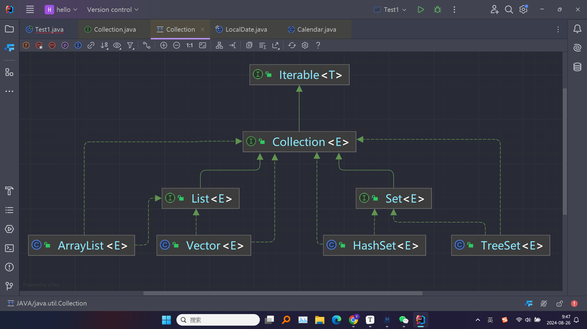
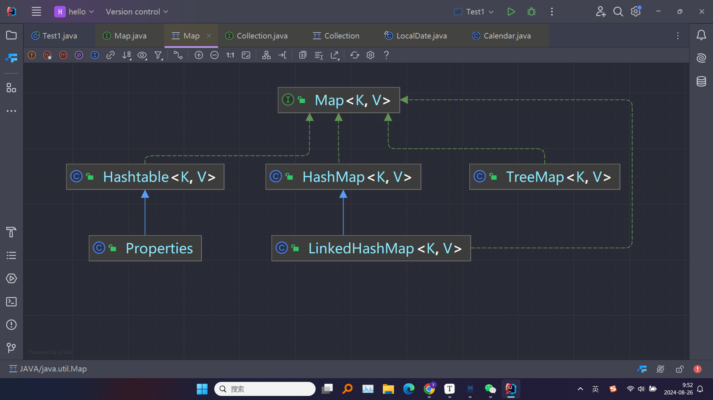
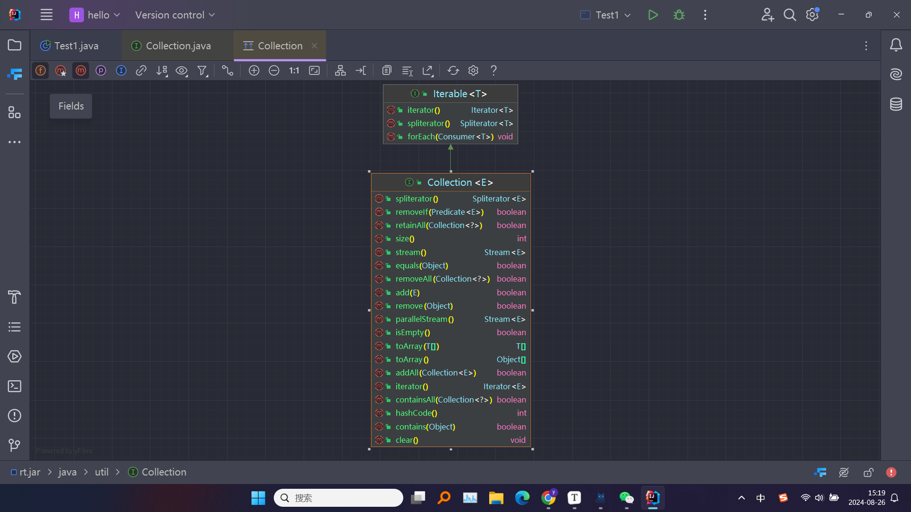
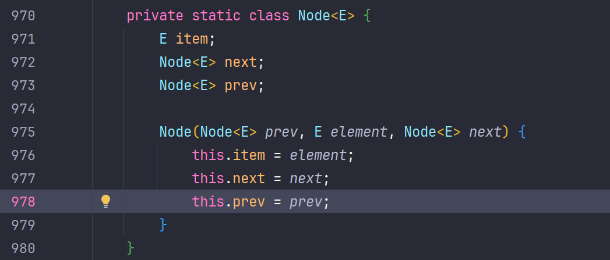
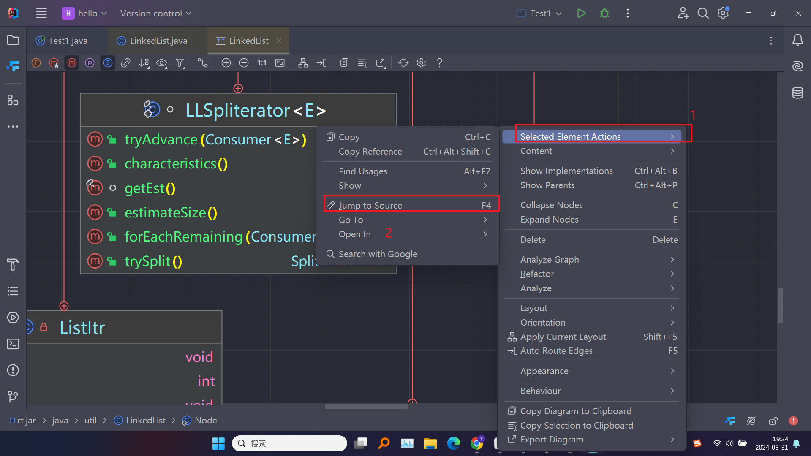

# 01 集合的框架体系

> *  Java 的集合框架 (`Collections Framework`) 是 Java 提供的一套标准数据结构实现，用于存储和操作对象集合。包括一组接口、实现这些接口的类以及一些工具类，用于处理常见的集合数据结构如列表、集合、队列和映射





> * ### 集合框架的层次结构
>
>   Java 的集合框架主要由三个部分组成：
>
>   1.**核心接口**: 定义了各种集合的基本操作
>
>   2.**实现类**: 提供了核心接口的具体实现，如 `ArrayList`, `HashSet`, `HashMap` 等
>
>   3.**工具类**: 提供对集合的常见操作，如排序、搜索、同步化等，如 `Collections`, `Arrays`

# 02 `Collection`接口

> * **`Collection<T>`**: 是 `Iterable` 的子接口，是其他所有集合接口的父接口。`Collection` 本身不能直接实例化，但它提供了集合类的通用操作
> * `Collection` 接口不直接提供任何实现，而是由更具体的子接口（如 `List`, `Set`, `Queue`）进行扩展



## 02.1 常用方法

> * `Collection` 接口定义了一组通用的操作方法，这些方法可以用来操作任意类型的集合。这些方法在各种实现中都有所体现，以下是 `Collection` 接口的常用方法：

添加元素的方法
> * **`boolean add(E e)`**: 向集合中添加一个元素。如果集合因为调用此方法而发生改变，则返回 `true`，否则返回 `false`。有些集合（如 `Set`）不允许重复元素，因此在这些集合中，`add` 方法可能会返回 `false`

```java
Collection<String> collection = new ArrayList<>();
collection.add("Apple");
collection.add("Banana");
System.out.println(collection);  // 输出: [Apple, Banana]
```

> * **`boolean addAll(Collection<? extends E> c)`**: 将指定集合中的所有元素添加到此集合中（可选操作）。如果此集合因为调用此方法而发生改变，则返回 `true`，否则返回 `false`

```java
Collection<String> collection1 = new ArrayList<>();
collection1.add("Apple");
Collection<String> collection2 = new ArrayList<>();
collection2.add("Banana");
collection2.add("Cherry");

collection1.addAll(collection2);
System.out.println(collection1);  // 输出: [Apple, Banana, Cherry]
```

删除元素的方法

>
> * **`boolean remove(Object o)`**: 从集合中移除单个实例的指定元素（可选操作）。如果集合中存在此元素并成功移除，则返回 `true`，否则返回 `false`

```java
Collection<String> collection = new ArrayList<>();
collection.add("Apple");
collection.add("Banana");
collection.remove("Apple");
System.out.println(collection);  // 输出: [Banana]
```

> * **`boolean removeAll(Collection<?> c)`**: 从集合中移除包含在指定集合中的所有元素（可选操作）。如果集合因调用此方法而改变，则返回 `true`

```java
Collection<String> collection1 = new ArrayList<>();
collection1.add("Apple");
collection1.add("Banana");
Collection<String> collection2 = new ArrayList<>();
collection2.add("Banana");
collection2.add("Cherry");

collection1.removeAll(collection2);
System.out.println(collection1);  // 输出: [Apple]
```

> * **`boolean retainAll(Collection<?> c)`**: 仅保留此集合中那些包含在指定集合中的元素（可选操作）。换句话说，从此集合中移除所有未包含在指定集合中的元素。如果集合因为调用此方法而发生改变，则返回 `true`

```java
Collection<String> collection1 = new ArrayList<>();
collection1.add("Apple");
collection1.add("Banana");
collection1.add("Cherry");

Collection<String> collection2 = new ArrayList<>();
collection2.add("Banana");
collection2.add("Cherry");

collection1.retainAll(collection2);
System.out.println(collection1);  // 输出: [Banana, Cherry]
```

> * **`void clear()`**: 移除此集合中的所有元素（可选操作）。调用此方法后，集合将为空

```java
Collection<String> collection = new ArrayList<>();
collection.add("Apple");
collection.add("Banana");
collection.clear();
System.out.println(collection);  // 输出: []
```

查询元素的方法

> * **`boolean contains(Object o)`**: 如果集合中包含指定的元素，则返回 `true`。如果集合允许 `null` 元素并且包含一个或多个 `null` 元素，则在调用 `contains(null)` 时会返回 `true`

```java
Collection<String> collection = new ArrayList<>();
collection.add("Apple");
collection.add("Banana");
boolean containsApple = collection.contains("Apple");
System.out.println(containsApple);  // 输出: true
```

> * **`boolean containsAll(Collection<?> c)`**: 如果此集合包含指定集合中的所有元素，则返回 `true`。如果指定的集合为空，则此方法始终返回 `true`

```java
Collection<String> collection1 = new ArrayList<>();
collection1.add("Apple");
collection1.add("Banana");

Collection<String> collection2 = new ArrayList<>();
collection2.add("Apple");

boolean containsAll = collection1.containsAll(collection2);
System.out.println(containsAll);  // 输出: true
```

集合大小

> * **`int size()`**: 返回集合中的元素数量。如果集合为空，则返回 `0`

```java
Collection<String> collection = new ArrayList<>();
collection.add("Apple");
collection.add("Banana");
int size = collection.size();
System.out.println(size);  // 输出: 2
```

> * **`boolean isEmpty()`**: 如果集合中没有元素，则返回 `true`

```java
Collection<String> collection = new ArrayList<>();
boolean isEmpty = collection.isEmpty();
System.out.println(isEmpty);  // 输出: true

collection.add("Apple");
isEmpty = collection.isEmpty();
System.out.println(isEmpty);  // 输出: false
```

转换为数组的方法

> * **`Object[] toArray()`**: 返回包含此集合中所有元素的数组。如果集合为 `String` 类型，那么返回的数组也是 `String[]` 类型

```java
Collection<String> collection = new ArrayList<>();
collection.add("Apple");
collection.add("Banana");

Object[] array = collection.toArray();
System.out.println(Arrays.toString(array));  // 输出: [Apple, Banana]
```

> * **`<T> T[] toArray(T[] a)`**: 返回包含此集合中所有元素的数组；返回数组的运行时类型是指定数组的类型。如果指定数组的大小不足以容纳集合中的所有元素，则分配一个新的数组；否则，在指定数组中存放集合元素

```java
Collection<String> collection = new ArrayList<>();
collection.add("Apple");
collection.add("Banana");

String[] array = collection.toArray(new String[0]);
System.out.println(Arrays.toString(array));  // 输出: [Apple, Banana]
```

集合的遍历

> * **`Iterator<E> iterator()`**: 返回用于遍历集合中元素的迭代器。`Iterator` 是一种访问集合中元素的标准方式。`Iterator` 允许以一种统一的方式遍历任何 `Collection`

```java
Collection<String> collection = new ArrayList<>();
collection.add("Apple");
collection.add("Banana");

Iterator<String> iterator = collection.iterator();
while (iterator.hasNext()) {
    System.out.println(iterator.next());
}
```

> * **增强 `for` 循环**: `Collection` 接口继承了 `Iterable` 接口，因此可以使用增强 `for` 循环遍历集合

```java
Collection<String> collection = new ArrayList<>();
collection.add("Apple");
collection.add("Banana");

for (String item : collection) {
    System.out.println(item);
}
```

## 02.2 接口的特性

> * **泛型支持**: `Collection` 接口使用泛型，允许集合类存储特定类型的元素。这提供了类型安全性，避免了类型转换异常
> * **可选操作**: 并不是所有集合都支持 `Collection` 接口的所有方法，例如，一些集合可能不支持 `add`, `remove` 等方法。这些集合在尝试调用不支持的方法时，会抛出 `UnsupportedOperationException`
> * **线程安全**: `Collection` 接口本身不保证线程安全。如果在多线程环境中使用集合，通常需要手动同步或使用 `Collections.synchronizedCollection` 等工具

# 03  `Iterator` 接口

> * `Iterator` 是 Java 中的一个接口，位于 `java.util` 包中。`Collection` 接口的所有子类（如 `List`, `Set`）都实现了 `Iterator` 接口，可以通过调用集合的 `iterator()` 方法来获取一个 `Iterator` 对象
> * `Iterator` 是一种设计模式，用于对集合的元素进行迭代（即逐个访问），使得不同的集合类型可以以统一的方式被遍历

## 03.1 常用方法

> * **`boolean hasNext()`**: 如果仍有元素可以迭代，则返回 `true`。这是用于判断迭代是否结束的条件
> * **`E next()`**: 返回迭代中的下一个元素。如果没有下一个元素，则抛出 `NoSuchElementException`
> * **`void remove()`**: 从集合中移除调用 `next()` 方法时返回的最后一个元素。此方法只能在调用 `next()` 之后使用，否则会抛出 `IllegalStateException`。并且在调用 `remove()` 后，如果继续调用 `next()` 前没有再次调用 `remove()`，否则会抛出异常

```java
//使用 Iterator 的遍历示例
//使用 Iterator 遍历 List 集合的示例代码
import java.util.ArrayList;
import java.util.Iterator;
import java.util.List;

public class IteratorExample {
    public static void main(String[] args) {
        // 创建一个 ArrayList 并添加一些元素
        List<String> list = new ArrayList<>();
        list.add("Apple");
        list.add("Banana");
        list.add("Cherry");

        // 获取该集合的迭代器
        Iterator<String> iterator = list.iterator();

        // 使用迭代器遍历集合
        while (iterator.hasNext()) {  //next() 方法返回当前元素，并将指针移至下一个元素
            String element = iterator.next();
            System.out.println("Element: " + element);
        }
    }
}
```

```java
//使用 Iterator 的删除示例
import java.util.ArrayList;
import java.util.Iterator;
import java.util.List;

public class IteratorRemoveExample {
    public static void main(String[] args) {
        // 创建一个 ArrayList 并添加一些元素
        List<String> list = new ArrayList<>();
        list.add("Apple");
        list.add("Banana");
        list.add("Cherry");
        list.add("Date");

        // 获取该集合的迭代器
        Iterator<String> iterator = list.iterator();

        // 使用迭代器遍历集合并移除元素
        while (iterator.hasNext()) {
            String element = iterator.next();
            if (element.startsWith("B")) {
                iterator.remove();  // 移除以 "B" 开头的元素
            }
        }

        // 输出剩余的集合元素
        System.out.println("Remaining elements: " + list);  
        // 输出: [Apple, Cherry, Date]
    }
}
```

## 03.2 为什么使用 `Iterator`

> * **统一遍历方式**: 无论集合的内部实现细节如何，`Iterator` 提供了一种统一的遍历方式。你可以用相同的方式遍历 `List`, `Set` 或其他实现 `Collection` 接口的集合
> * **安全的删除操作**: 使用 `Iterator` 可以在遍历集合的同时安全地删除元素，不会引起并发修改异常（`ConcurrentModificationException`）
> * **隐藏集合实现细节**: 使用 `Iterator` 可以避免直接访问集合的内部结构，这增强了代码的可维护性

## 03.3 `Iterator` 的局限性

> * **单向遍历**: `Iterator` 只能从前向后单向遍历集合，不能反向遍历
> * **一次性遍历**: `Iterator` 只能遍历集合一次，遍历结束后需要重新获取新的 `Iterator` 对象才能再次遍历

# 04 `Iterable`接口

> * `Iterable` 是一个表示可以进行迭代的对象的接口，而 `Iterator` 是用于迭代这些对象的接口
> * `Iterable` 接口表示一个可被迭代的集合（即返回一个 `Iterator` 集合）。定义了一个方法`iterator()`，用于返回一个 `Iterator` 对象
> * `Iterator` 接口用于遍历集合中的元素。它提供了 `hasNext()`、`next()` 和 `remove()` 等方法，用来顺序地访问集合中的每一个元素

> 关系总结：
>
> * **`Iterable` 提供 `Iterator`**: 实现了 `Iterable` 接口的类必须实现 `iterator()` 方法，该方法返回一个 `Iterator` 对象。通过这个 `Iterator` 对象，你可以逐个遍历集合中的元素
> * **`Iterator` 用于遍历 `Iterable`**: `Iterator` 是用来遍历 `Iterable` 对象的工具。`Iterable` 定义了集合可以被遍历，但真正执行遍历操作的是 `Iterator`

## 04.1 接口定义

> * `Iterable` 接口只有一个方法 `iterator()`，返回一个 `Iterator` 对象。通过调用该方法，可以获取一个用于遍历该集合的迭代器
> * `Iterable` 接口在 `java.lang` 包中，定义如下：

```java
public interface Iterable<T> {
    Iterator<T> iterator();
}
```

> * `Iterator` 接口在 `java.util` 包中，定义如下

```java
public interface Iterator<E> {
    boolean hasNext();
    E next();
    default void remove() {
        throw new UnsupportedOperationException("remove");
    }
}
```

## 04.2 具体实现的关系

> * 假设我们有一个 `ArrayList`，它实现了 `Iterable` 接口。我们可以使用 `iterator()` 方法获取一个 `Iterator` 对象，然后使用这个 `Iterator` 对象来遍历 `ArrayList` 中的元素

```java
import java.util.ArrayList;
import java.util.Iterator;
import java.util.List;

public class IterableIteratorExample {
    public static void main(String[] args) {
        // 创建一个 ArrayList 并添加一些元素
        List<String> list = new ArrayList<>();
        list.add("Apple");
        list.add("Banana");
        list.add("Cherry");

        // 获取迭代器
        Iterator<String> iterator = list.iterator();

        // 使用迭代器遍历集合
        while (iterator.hasNext()) {
            String element = iterator.next();
            System.out.println("Element: " + element);
        }
    }
}
```

> * **`ArrayList` 实现了 `Iterable`**: `ArrayList` 是 Java 集合类之一，它实现了 `Iterable` 接口，因此可以通过调用 `iterator()` 方法获取一个 `Iterator` 对象
> * **`iterator()` 返回 `Iterator` 对象**: 在 `list.iterator()` 这行代码中，我们调用了 `ArrayList` 的 `iterator()` 方法，这个方法返回了一个 `Iterator` 对象，该对象可以用于遍历 `ArrayList` 中的元素
> * **使用 `Iterator` 遍历**: 然后我们使用 `Iterator` 对象的 `hasNext()` 和 `next()` 方法来逐个访问 `ArrayList` 中的每一个元素

# 05 `List`接口

> * `List` 接口是 Java 集合框架中的一个重要接口，==表示一个有序的元素集合，可以包含重复的元素==。与 `Set` 接口不同，`List` 保证元素的插入顺序，并允许通过索引访问元素。`List` 接口的常用实现类包括 `ArrayList`、`LinkedList`、`Vector` 等
> * **有序性**: `List` 保证元素的插入顺序，意味着你可以根据元素在集合中的位置（索引）来访问它们
> * **可重复性**: `List` 允许包含重复的元素。多个元素可以具有相同的值，但它们在列表中的索引不同
> * **索引访问**: 你可以通过索引访问 `List` 中的元素（类似于数组），从而可以对列表中的任何元素进行高效的读取或修改

## 05.1 常用方法

> * `List` 接口继承了 `Collection` 接口，定义了许多通用的集合操作方法。此外，`List` 接口还增加了一些特有的方法，主要用于索引访问和列表的特定操作

基本操作方法

> * **`boolean add(E e)`**: 向列表末尾添加指定的元素，返回 `true` 表示添加成功

```java
List<String> list = new ArrayList<>();
list.add("Apple");
list.add("Banana");
System.out.println(list);  // 输出: [Apple, Banana]
```

> * **`void add(int index, E element)`**: 在列表的指定位置插入指定的元素，原位置及其后的元素依次右移

```java
list.add(1, "Cherry");
System.out.println(list);  // 输出: [Apple, Cherry, Banana]
```

> * **`E get(int index)`**: 返回列表中指定位置的元素

```java
String fruit = list.get(1);
System.out.println(fruit);  // 输出: Cherry
```

> * **`E set(int index, E element)`**: 将列表中指定位置的元素替换为指定的元素，并返回原位置的元素

```java
String oldFruit = list.set(1, "Date");
System.out.println(list);  // 输出: [Apple, Date, Banana]
```

> * **`E remove(int index)`**: 移除列表中指定位置的元素，返回被移除的元素

```java
String removedFruit = list.remove(1);
System.out.println(list);  // 输出: [Apple, Banana]
```

> * **`int indexOf(Object o)`**: 返回列表中首次出现指定元素的索引，如果列表不包含该元素，则返回 `-1`

```java
int index = list.indexOf("Banana");
System.out.println(index);  // 输出: 1
```

> * **`int lastIndexOf(Object o)`**: 返回列表中最后一次出现指定元素的索引，若列表不包含该元素，则返回 `-1`

```java
list.add("Apple");
int lastIndex = list.lastIndexOf("Apple");
System.out.println(lastIndex);  // 输出: 2
```

批量操作方法

> * **`boolean addAll(Collection<? extends E> c)`**: 将指定集合中的所有元素追加到列表的末尾，按集合的迭代顺序添加

```java
List<String> moreFruits = Arrays.asList("Mango", "Orange");
list.addAll(moreFruits);
System.out.println(list);  // 输出: [Apple, Banana, Apple, Mango, Orange]
```

> * **`boolean addAll(int index, Collection<? extends E> c)`**: 将指定集合中的所有元素插入到列表中，从指定位置开始插入

```java
list.addAll(1, moreFruits);
System.out.println(list);  // 输出: [Apple, Mango, Orange, Banana, Apple]
```

> * **`List<E> subList(int fromIndex, int toIndex)`**: 返回从 `fromIndex`（包含）到 `toIndex`（不包含）之间的子列表

```java
List<String> subList = list.subList(1, 3);
System.out.println(subList);  // 输出: [Mango, Orange]
```

遍历方法

> * **增强 `for` 循环**: 使用增强 `for` 循环遍历 `List`

```java
for (String fruit : list) {
    System.out.println(fruit);
}
```

> * **`Iterator<E> iterator()`**: 返回用于遍历列表元素的迭代器

```java
Iterator<String> iterator = list.iterator();
while (iterator.hasNext()) {
    System.out.println(iterator.next());
}
```

> * **`ListIterator<E> listIterator()`**: 返回用于遍历列表的双向迭代器

```java
ListIterator<String> listIterator = list.listIterator();
while (listIterator.hasNext()) {
    System.out.println(listIterator.next());
}
```

# 06 `List`接口实现类--`ArrayList`

> * `ArrayList` 是 Java 集合框架中的一个类，是 `List` 接口的实现类。`ArrayList` 是基于动态数组的数据结构，它提供了动态扩展的能力，可以存储任意数量的对象。`ArrayList` 是一个非常常用的集合类，因为它提供了对元素的快速访问和良好的性能
> * **可变大小的数组**: `ArrayList` 是一个可以动态调整大小的数组，随着元素的添加或删除，`ArrayList` 会自动扩展或缩减其容量
> * **有序性**: 元素在 `ArrayList` 中是按插入顺序存储的，并且可以通过索引来访问这些元素
> * **允许重复元素**: `ArrayList` 允许存储重复的元素，这与 `Set` 接口不同
> * **随机访问**: 由于底层是数组结构，`ArrayList` 允许通过索引快速地访问和修改元素，时间复杂度为 O(1)

## 06.1 `ArrayList` 的内部实现

> * 底层是一个动态扩展的数组，当数组的容量不足以容纳新元素时，`ArrayList` 会创建一个更大的数组，并将旧数组中的元素复制到新数组中
> * **默认初始容量**: `ArrayList` 在首次创建时，默认的初始容量为 10。如果在创建时指定了容量，则使用指定的容量
> * **扩容倍数**: 当 `ArrayList` 中的元素数量超过当前数组容量时，`ArrayList` 会进行扩容。默认情况下，新数组的容量为旧数组容量的 1.5 倍（即 `newCapacity = oldCapacity + (oldCapacity >> 1)`）

## 06.2 常用构造方法

> * **`ArrayList()`**: 创建一个初始容量为 10 的空列表

```java
ArrayList<String> list = new ArrayList<>();
```

> * **`ArrayList(int initialCapacity)`**: 创建一个具有指定初始容量的空列表。如果你知道要存储的元素数量，可以设置合适的初始容量，避免频繁扩容

```java
ArrayList<String> list = new ArrayList<>(50);
```

> * **`ArrayList(Collection<? extends E> c)`**: 创建一个包含指定集合元素的列表，按集合的迭代器返回的顺序

```java
List<String> otherList = Arrays.asList("Apple", "Banana");
ArrayList<String> list = new ArrayList<>(otherList);
```

## 06.3 常用方法

添加元素

> * **`boolean add(E e)`**: 向列表的末尾添加指定的元素

```java
ArrayList<String> list = new ArrayList<>();
list.add("Apple");
list.add("Banana");
```

> * **`void add(int index, E element)`**: 在列表的指定位置插入指定的元素，原位置及其后的元素依次右移

```java
list.add(1, "Cherry");  // 在索引1处插入"Cherry"
```

> * **`boolean addAll(Collection<? extends E> c)`**: 将指定集合中的所有元素追加到此列表的末尾

```java
List<String> otherList = Arrays.asList("Date", "Elderberry");
list.addAll(otherList);
```

访问元素

> * **`E get(int index)`**: 返回列表中指定位置的元素

```java
String fruit = list.get(1);  // 获取索引1处的元素
```

> * **`E set(int index, E element)`**: 用指定的元素替换列表中指定位置的元素，返回原位置的元素

```java
String oldFruit = list.set(1, "Date");  // 替换索引1处的元素
```

删除元素

> * **`E remove(int index)`**: 移除列表中指定位置的元素，返回被移除的元素

```java
```

> * **`boolean remove(Object o)`**: 移除列表中第一次出现的指定元素（如果存在），返回 `true` 表示成功移除

```java
boolean isRemoved = list.remove("Apple");  // 移除第一次出现的"Apple"
```

> * **`void clear()`**: 移除此列表中的所有元素

```java
list.clear();  // 清空列表
```

查询元素

> * **`int indexOf(Object o)`**: 返回列表中首次出现指定元素的索引，如果列表不包含该元素，则返回 `-1`

```java
int index = list.indexOf("Banana");  // 获取"Banana"的索引
```

> * **`int lastIndexOf(Object o)`**: 返回列表中最后一次出现指定元素的索引，若列表不包含该元素，则返回 `-1`

```java
list.add("Apple");
int lastIndex = list.lastIndexOf("Apple");  // 获取"Apple"最后一次出现的索引
```

> * **`boolean contains(Object o)`**: 如果列表包含指定的元素，则返回 `true`

```java
boolean containsApple = list.contains("Apple");  // 检查是否包含"Apple"
```

列表大小和判断是否为空

> * **`int size()`**: 返回列表中的元素个数

```java
int size = list.size();  // 获取列表大小
```

> * **`boolean isEmpty()`**: 如果列表不包含任何元素，则返回 `true`

```java
boolean isEmpty = list.isEmpty();  // 检查列表是否为空
```

列表遍历

> * **增强 `for` 循环**: 使用增强 `for` 循环遍历 `ArrayList`

```java
for (String fruit : list) {
    System.out.println(fruit);
}
```

> * **`Iterator<E> iterator()`**: 返回用于遍历列表元素的迭代器

```java
Iterator<String> iterator = list.iterator();
while (iterator.hasNext()) {
    System.out.println(iterator.next());
}
```

> * **`ListIterator<E> listIterator()`**: 返回用于遍历列表的双向迭代器

```java
ListIterator<String> listIterator = list.listIterator();
while (listIterator.hasNext()) {
    System.out.println(listIterator.next());
}
```

## 06.4 应用场景

> * **频繁读取**: 适用于需要频繁访问元素、随机访问需求较多的场景，例如保存用户输入、展示列表数据等
> * **数据量动态变化**: 当数据量在运行时需要动态调整时，`ArrayList` 是一个理想的选择，因为它能够自动扩容
> * **较少插入删除操作**: 虽然 `ArrayList` 支持插入和删除操作，但由于每次插入和删除操作可能会涉及大量的元素移动，因此当插入和删除操作较频繁时，性能会受到影响。在这种情况下，建议使用 `LinkedList`

## 06.5 常见问题

> * **线程安全性**: `ArrayList` ==不是线程安全的==，如果在多线程环境中使用 `ArrayList`，需要手动同步或使用线程安全的集合类（如 `Vector` 或 `Collections.synchronizedList`）
> * **内存管理**: 由于 `ArrayList` 的底层是数组，如果不再需要使用 `ArrayList`，建议调用 `clear()` 方法或将其引用置为 `null`，以帮助垃圾收集器回收内存

# 07`Arrays` 和 `ArrayList` 比较

> * `ArrayList` 内部基于动态数组实现，比 `Array`s（静态数组） 使用起来更加灵活：
>   - `ArrayList`会根据实际存储的元素动态地扩容或缩容，而 `Arrays` 被创建之后就不能改变它的长度了
>   - `ArrayList` 允许你使用泛型来确保类型安全，`Arrays` 则不可以
>   - `ArrayList` 只能存储对象。对于基本类型数据，需要使用其对应包装类。`Arrays` 可以直接存储基本类型数据，也可以存储对象
>   - `ArrayList` 支持插入、删除、遍历等常见操作，并提供丰富的 API 操作方法，比如 `add()`、`remove()`等。`Arrays` 只是一个固定长度的数组，只能按照下标访问其中的元素，不具备动态添加、删除元素的能力
>   - `ArrayList`创建时不需要指定大小，而`Arrays`创建时必须指定大小

```java
 // 初始化一个 String 类型的数组
 String[] stringArr = new String[]{"hello", "world", "!"};
 // 修改数组元素的值
 stringArr[0] = "goodbye";
 System.out.println(Arrays.toString(stringArr));// [goodbye, world, !]
 // 删除数组中的元素，需要手动移动后面的元素
 for (int i = 0; i < stringArr.length - 1; i++) {
     stringArr[i] = stringArr[i + 1];  //向前移动
 }
 stringArr[stringArr.length - 1] = null;
 System.out.println(Arrays.toString(stringArr));// [world, !, null]
```

```java
// 初始化一个 String 类型的 ArrayList
 ArrayList<String> stringList = new ArrayList<>(Arrays.asList("hello", "world", "!"));
// 添加元素到 ArrayList 中
 stringList.add("goodbye");
 System.out.println(stringList);// [hello, world, !, goodbye]
 // 修改 ArrayList 中的元素
 stringList.set(0, "hi");
 System.out.println(stringList);// [hi, world, !, goodbye]
 // 删除 ArrayList 中的元素
 stringList.remove(0);
 System.out.println(stringList); // [world, !, goodbye]
```

# 08 `List`接口实现类--`Vector`

> * `Vector` 类是 Java 集合框架中较早的一个集合类，底层实现是一个动态数组，并且它==是线程安全的==。这意味着 `Vector` 类的所有方法都被同步了，以确保在多线程环境中操作时数据的一致性。但由于线程同步带来的开销，`Vector` 的性能在某些情况下可能不如 `ArrayList` 高效
> * **实现接口**: `Vector` 实现了 `List`、`RandomAccess`、`Cloneable` 和 `Serializable` 接口
> * **线程安全**: `Vector` 的所有操作都是线程安全的，这意味着在多线程环境中可以安全使用。`Vector` 通过在所有可变方法上添加 `synchronized` 关键字来实现线程安全
> * **动态数组**: 与 `ArrayList` 类似，`Vector` 底层也是基于数组实现的，支持动态扩展。数组的大小会随着元素的增加而自动增长
> * **插入顺序**: `Vector` 保留元素的插入顺序，允许通过索引访问元素
> * **可重复性**: `Vector` 允许添加重复的元素

## 08.1 内部实现机制

> 动态扩容：
>
> - **初始容量**: 默认情况下，`Vector` 的初始容量为 10。可以通过构造方法指定初始容量
> - **扩容机制**: 当 `Vector` 中的元素数量超过当前容量时，它会自动扩容。默认情况下，每次扩容会将容量增加一倍。也可以在创建 `Vector` 时指定扩容的增量
>
> 同步机制：
>
> - **线程安全性**: `Vector` 的所有方法都是同步的，通过在方法上添加 `synchronized` 关键字来实现。这确保了在多线程环境中，不同线程可以安全地对 `Vector` 进行操作
> - **性能影响**: 因同步的开销，`Vector` 的性能通常比 `ArrayList` 要差，特别是单线程环境。这也是 `ArrayList` 更加广泛使用的原因之一

## 08.2 构造方法

> * **`Vector()`**: 创建一个默认初始容量为 10 的空向量

```java
Vector<String> vector = new Vector<>();  
// 这里的String指只能放该类型的vector，也可以是其他数据类型，前面同理
```

> * **`Vector(int initialCapacity)`**: 创建一个具有指定初始容量的空向量

```java
Vector<String> vector = new Vector<>(20);
```

> * **`Vector(int initialCapacity, int capacityIncrement)`**: 创建一个具有指定初始容量和容量增量的空向量。`capacityIncrement` 是需要扩展时，数组容量的增加量。若没有指定增量，则默认翻倍容量

```java
Vector<String> vector = new Vector<>(20, 5);
```

> * **`Vector(Collection<? extends E> c)`**: 创建一个包含指定集合元素的向量，按集合的迭代器返回的顺序添加这些元素

```java
Vector<String> vector = new Vector<>(Arrays.asList("Apple", "Banana", "Cherry"));
```

## 08.3 常用方法

> * `Vector` 类继承了 `AbstractList` 类，并实现了 `List` 接口，因此它支持所有 `List` 接口的方法，如添加、删除、修改、遍历等

添加元素

> * **`boolean add(E e)`**: 向向量的末尾添加指定的元素

```java
Vector<String> vector = new Vector<>();
vector.add("Apple");
vector.add("Banana");
```

> * **`void add(int index, E element)`**: 在向量的指定位置插入指定的元素，原位置及其后的元素依次右移

```java
vector.add(1, "Cherry");  // 在索引1处插入"Cherry"
```

> * **`boolean addAll(Collection<? extends E> c)`**: 将指定集合中的所有元素追加到此向量的末尾

```java
Vector<String> otherVector = new Vector<>(Arrays.asList("Date", "Elderberry"));
vector.addAll(otherVector);
```

访问元素

> * **`E get(int index)`**: 返回向量中指定位置的元素

```java
String fruit = vector.get(1);  // 获取索引1处的元素
```

> * **`E set(int index, E element)`**: 用指定的元素替换向量中指定位置的元素，返回原位置的元素

```java
String oldFruit = vector.set(1, "Date");  // 替换索引1处的元素
```

删除元素

> * **`E remove(int index)`**: 移除向量中指定位置的元素，返回被移除的元素

```java
String removedFruit = vector.remove(1);  // 移除索引1处的元素
```

> * **`boolean remove(Object o)`**: 移除向量中第一次出现的指定元素（如果存在），返回 `true` 表示成功移除

```java
boolean isRemoved = vector.remove("Apple");  // 移除第一次出现的"Apple"
```

> * **`void clear()`**: 移除此向量中的所有元素

```java
vector.clear();  // 清空向量
```

查询元素

> * **`int indexOf(Object o)`**: 返回向量中首次出现指定元素的索引，如果向量不包含该元素，则返回 `-1`

```java
int index = vector.indexOf("Banana");  // 获取"Banana"的索引
```

> * **`int lastIndexOf(Object o)`**: 返回向量中最后一次出现指定元素的索引，若向量不包含该元素，则返回 `-1`

```java
vector.add("Apple");
int lastIndex = vector.lastIndexOf("Apple");  // 获取"Apple"最后一次出现的索引
```

> * **`boolean contains(Object o)`**: 如果向量包含指定的元素，则返回 `true`

```java
boolean containsApple = vector.contains("Apple");  // 检查是否包含"Apple"
```

向量大小和判断是否为空

> * **`int size()`**: 返回向量中的元素个数

```java
int size = vector.size();  // 获取向量大小
```

> * **`boolean isEmpty()`**: 如果向量不包含任何元素，则返回 `true`

```java
boolean isEmpty = vector.isEmpty();  // 检查向量是否为空
```

向量遍历

> * **增强 `for` 循环**: 使用增强 `for` 循环遍历 `Vector`

```java
for (String fruit : vector) {
    System.out.println(fruit);
}
```

> * **`Iterator<E> iterator()`**: 返回用于遍历向量元素的迭代器

```java
Iterator<String> iterator = vector.iterator();
while (iterator.hasNext()) {
    System.out.println(iterator.next());
}
```

> * **`ListIterator<E> listIterator()`**: 返回用于遍历向量的双向迭代器

```java
ListIterator<String> listIterator = vector.listIterator();
while (listIterator.hasNext()) {
    System.out.println(listIterator.next());
}
```

## 08.4 应用场景

> * **多线程环境**: 虽可使用 `Collections.synchronizedList(new ArrayList<>())` 来创建线程安全的 `ArrayList`，但 `Vector` 提供了内置的同步机制，使用更方便
> * **存储大量数据**: 由于 `Vector` 的自动扩容机制，它适合存储大量数据，并在运行时动态调整容量
> * **需要快速访问**: `Vector` 的底层是数组结构，因此可以通过索引快速访问元素，适合需要频繁读取数据的场景

# 09 `Vector` 和 `ArrayList` 比较

> **线程安全**:
>
> * `Vector`: 线程安全，通过同步方法实现
>
> * `ArrayList`: 不是线程安全的，但可以通过 `Collections.synchronizedList` 方法将其转为线程安全

> **性能**:
>
> - `Vector`: 由于同步机制的存在，性能比 `ArrayList` 略差，特别是在不需要线程安全的场景下
> - `ArrayList`: 性能更高，特别适合单线程环境

> **扩容机制**:
>
> - `Vector`: 每次扩容时，容量翻倍或按指定增量增加
> - `ArrayList`: 每次扩容时，容量增加 50%

> **推荐使用**:
>
> - 在单线程或不需要线程安全的场景下，推荐使用 `ArrayList`，因为它的性能更好
> - 在多线程或必须保证线程安全的场景下，可以使用 `Vector`。但在现代开发中，更多情况下推荐使用 `CopyOnWriteArrayList` 或使用同步包装的 `ArrayList` 代替 `Vector`

# 10 `List`接口实现类--`LinkedList`

> * 其 实现了 `List` 和 `Deque` 接口，是基于链表数据结构提供的一个双向链表的实现。与 `ArrayList` 不同，`LinkedList` 适合于频繁的插入和删除操作，因为在链表中插入或删除元素的时间复杂度为 O(1)，而 `ArrayList` 需要 O(n) 的时间复杂度
> * **实现接口**: `LinkedList` 实现了 `List`、`Deque`、`Queue`、`Cloneable` 和 `Serializable` 接口。因为它实现了 `Deque` 接口，所以 `LinkedList` 可以作为队列（FIFO）或栈（LIFO）使用
> * **底层数据结构**: `LinkedList` 是一个双向链表，这意味着每个节点都包含对前一个和后一个节点的引用
> * **有序性**: `LinkedList` 保证元素的插入顺序，这意味着元素的顺序与插入时的顺序一致
> * **可重复性**: `LinkedList` 允许添加重复的元素

## 10.1 内部实现机制

> `LinkedList` 底层是基于双向链表的数据结构实现的。每个节点（Node）包含三个部分：
>
> - **`E item`**: 当前节点存储的元素
> - **`Node<E> next`**: 指向下一个节点的引用
> - **`Node<E> prev`**: 指向上一个节点的引用



> 定位方法：
>
> * 先在`LinkedList`类的Diagram里查找内部类，找到这个`Node`内部类，然后再如图所示



## 10.2 构造方法

> * **`LinkedList()`**: 创建一个空的链表

```java
LinkedList<String> list = new LinkedList<>();
```

> * **`LinkedList(Collection<? extends E> c)`**: 创建一个包含指定集合元素的链表，按集合的迭代器返回的顺序添加这些元素

```java
LinkedList<String> list = new LinkedList<>(Arrays.asList("Apple", "Banana"));  
// Arrays.asList()方法将数组转换成一个 List，常用类里有介绍
```

## 10.3 常用方法

添加元素

> * **`boolean add(E e)`**: 将元素添加到链表的末尾（尾部）

```java
list.add("Apple");
```

> * **`void add(int index, E element)`**: 在链表的指定位置插入元素，原位置及其后的元素依次右移

```java
list.add(1, "Banana");
```

> * **`void addFirst(E e)`**: 将元素插入到链表的头部

```java
list.addFirst("Cherry");
```

> * **`void addLast(E e)`**: 将元素添加到链表的尾部（等同于 `add(E e)` 方法）

```java
list.addLast("Date");
```

> * **`boolean offer(E e)`**: 将元素添加到链表的尾部（队列模式），返回 `true` 表示成功

```java
list.offer("Elderberry");
```

> * **`boolean offerFirst(E e)`**: 将元素插入到链表的头部，返回 `true` 表示成功

```java
list.offerFirst("Fig");
```

> * **`boolean offerLast(E e)`**: 将元素添加到链表的尾部（等同于 `offer(E e)` 方法），返回 `true` 表示成功

```java
list.offerLast("Grape");
```

访问元素

> * **`E get(int index)`**: 返回链表中指定位置的元素

```java
String fruit = list.get(1);
```

> * **`E getFirst()`**: 返回链表中的第一个元素

```java
String firstFruit = list.getFirst();
```

> * **`E getLast()`**: 返回链表中的最后一个元素

```java
String lastFruit = list.getLast();
```

> * **`E peek()`**: 检索但不移除链表的头元素，如果链表为空，则返回 `null`

```java
String headFruit = list.peek();
```

> * **`E peekFirst()`**: 检索但不移除链表的第一个元素，如果链表为空，则返回 `null`

```java
String headFruit = list.peekFirst();
```

> * **`E peekLast()`**: 检索但不移除链表的最后一个元素，如果链表为空，则返回 `null`

```java
String tailFruit = list.peekLast();
```

删除元素

> * **`E remove(int index)`**: 移除链表中指定位置的元素，返回被移除的元素

```java
String removedFruit = list.remove(1);
```

> * **`boolean remove(Object o)`**: 移除链表中第一次出现的指定元素（如果存在），返回 `true` 表示成功移除

```java
boolean isRemoved = list.remove("Apple");
```

> * **`E removeFirst()`**: 移除并返回链表中的第一个元素

```java
String removedFirst = list.removeFirst();
```

> * **`E removeLast()`**: 移除并返回链表中的最后一个元素

```java
String removedLast = list.removeLast();
```

> * **`E poll()`**: 检索并移除链表的头元素，如果链表为空，则返回 `null`

```java
String polledFruit = list.poll();
```

> * **`E pollFirst()`**: 检索并移除链表的第一个元素，如果链表为空，则返回 `null`

```java
String polledFirst = list.pollFirst();
```

> * **`E pollLast()`**: 检索并移除链表的最后一个元素，如果链表为空，则返回 `null`

```java
String polledLast = list.pollLast();
```

查询元素

> * **`int indexOf(Object o)`**: 返回链表中首次出现指定元素的索引，如果链表不包含该元素，则返回 `-1`

```java
int index = list.indexOf("Banana");
```

> * **`int lastIndexOf(Object o)`**: 返回链表中最后一次出现指定元素的索引，若链表不包含该元素，则返回 `-1`

```java
list.add("Apple");
int lastIndex = list.lastIndexOf("Apple");
```

> * **`boolean contains(Object o)`**: 如果链表包含指定的元素，则返回 `true`

```java
boolean containsApple = list.contains("Apple");
```

链表大小和判断是否为空

> * **`int size()`**: 返回链表中的元素个数

```java
int size = list.size();
```

> * **`boolean isEmpty()`**: 如果链表不包含任何元素，则返回 `true`

```java
boolean isEmpty = list.isEmpty();
```

链表遍历

> * **增强 `for` 循环**: 使用增强 `for` 循环遍历 `LinkedList`

```java
for (String fruit : list) {
    System.out.println(fruit);
}
```

> * **`Iterator<E> iterator()`**: 返回用于遍历链表元素的迭代器

```java
Iterator<String> iterator = list.iterator();
while (iterator.hasNext()) {
    System.out.println(iterator.next());
}
```

> * **`ListIterator<E> listIterator()`**: 返回用于遍历链表的双向迭代器

```java
ListIterator<String> listIterator = list.listIterator();
while (listIterator.hasNext()) {
    System.out.println(listIterator.next());
}
```

# 11 `LinkedList` 和`ArrayList` 比较

> **数据结构**:
>
> - `LinkedList`: 基于双向链表实现
> - `ArrayList`: 基于动态数组实现
>
> **插入和删除操作**:
>
> - `LinkedList`: 在列表的中间或两端插入和删除操作非常高效，时间复杂度为 O(1)
> - `ArrayList`: 插入和删除操作涉及元素的移动，时间复杂度为 O(n)
>
> **随机访问操作**:
>
> - `LinkedList`: 不能通过索引直接访问元素，随机访问的时间复杂度为 O(n)
> - `ArrayList`: 可以通过索引直接访问元素，随机访问的时间复杂度为 O(1)
>
> **内存消耗**:
>
> - `LinkedList`: 由于每个节点都存储了前一个和后一个节点的引用，`LinkedList` 内存消耗比 `ArrayList` 大
> - `ArrayList`: 内存消耗相对较小，但在扩容时可能会浪费一些空间

##


