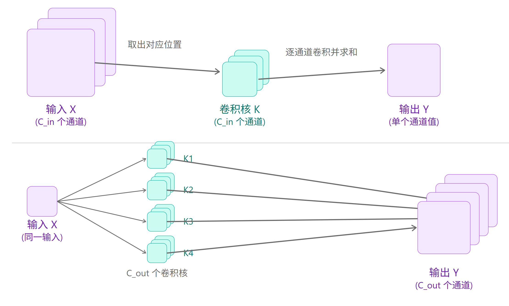

# 01 卷积层

> * 卷积层是整个 CNN 的特征提取核心。它通过一组可学习的滤波器（也叫卷积核/kernel）在输入特征图上进行滑动窗口运算，实现局部特征检测
> * 具体过程：每个卷积核是一个小矩阵（例如 3×3），它与输入图像对应区域做**点乘求和**，再加上偏置，得到输出特征图上一个点的值。滑动完整张图后，就生成了多张“特征响应图”（feature maps）
> * 数学上，输出特征图的每个位置值 = ∑(输入局部区域 × 卷积核权重) + bias

想象你拿着一叠“专用放大镜”（每个放大镜就是一种卷积核），在照片上从左上角开始一格一格滑动。每个放大镜只负责找一种线索（比如竖线、圆弧、颜色过渡）。匹配越强，新的“线索地图”上对应位置就越亮。最后你得到几十张线索地图，后面网络一看就知道“这张图有猫耳朵和车轮”

## 01.1 卷积核

> * 核是一个小矩阵（如 3×3），里面是可学习的权重
> * 核越大，一次“看”的范围越大（感受野越大），能捕捉更复杂特征；但参数会平方级增加，容易过拟合
> * 实战中 99% 情况用 3×3（黄金平衡：参数少 + 堆 3 层就能达到 7×7 的感受野）。早期层偶尔用 5×5 或 7×7 快速捕捉大结构，后期全用 3×3
> * 写数字/指纹/细胞（细小局部）→ 必须 3×3；整张风景/卫星图（大结构）→ 可以先用 7×7 再接 3×3

## 01.2 步长

> * 指卷积核每次移动几个像素
> * stride=1 精细扫描，保留所有细节；stride=2 直接把输出尺寸砍半，相当于内置下采样，节省显存和计算量
> * 前 1-2 层永远 stride=1（保细节），之后每隔 1-2 个卷积块用 stride=2 降维
> * 高分辨率小物体（遥感车牌）→ 多用 stride=1；实时手机检测（人脸）→ 早用 stride=2 提速

## 01.3 填充

> * 在输入四周补 0（或其它值）
> * 不加 padding，卷积后边缘信息被裁掉，尺寸变小；==加 padding=1（3×3 核）能让输出尺寸和输入完全一样，保护边缘特征==，让网络敢堆 50+ 层
> * 3×3 核永远 padding=1（same padding）；1×1 核 padding=0；大核按公式 padding = (kernel_size-1)//2

## 01.4 多通道计算

> * ==输入图片通常有多个通道（灰度图=1通道，RGB彩色图=3通道）。每个输出通道都会“独立地”对**所有输入通道**分别做卷积，然后把结果**相加**，再加一个偏置==
> * 单通道只能学“黑白特征”，多通道能同时学“颜色 + 纹理 + 形状”。比如第一层输出32通道，就相当于同时学32种不同特征（竖线、圆弧、红色区域……）

想象输入是一张RGB彩色照片（3张透明胶片叠在一起：红胶片、绿胶片、蓝胶片）。侦探手里有32个“多层放大镜”（每个放大镜有3层，分别对应红绿蓝）：

- 对红胶片用放大镜第1层滑动 → 得到一张“红特征地图”

- 对绿胶片用放大镜第2层滑动 → 得到一张“绿特征地图”

- 对蓝胶片用放大镜第3层滑动 → 得到一张“蓝特征地图”

==然后把这3张地图**像素对像素相加**（红+绿+蓝），再加一个“整体亮度调节值”（bias），就得到**第1个输出通道**的特征图。==对另外31个放大镜重复以上过程 → 最终得到32张输出特征图。这个“32”是**人为拍板**的数字——想多学点特征就调大（64、128），想省显存就调小（16、32）

> * **输出通道数（out_channels = n）是人为指定的**：你想提取多少种特征，就设多少个 n
>
>    **每个输出通道对应 1 张特征图**：所以输出总共是 n 张特征图
>
>    **对于 RGB 输入（in_channels = 3）**：
>
>    - 总共有 **n 个滤波器（filters）**（也叫 n 个 3D 卷积核）
>    - **每个滤波器内部包含 3 个 2D 卷积核**（分别对应红、绿、蓝三个输入通道）
>    - 因此，**总共会有 3n 个 2D 卷积核**（3×3 的小矩阵）

对于**图像数据（2D 卷积）**，`nn.Conv2d` 的权重形状永远是：

```python
torch.Size([out_channels, in_channels, kernel_height, kernel_width])
```

PyTorch 图像数据的标准格式：**NCHW**

对于一张**彩色图像**，在 PyTorch 里它是一个 **4 维张量**（tensor），形状永远是：

```python
torch.Size([N, C, H, W])
# N 批次 C 通道 H 高 W 宽” —— 从外到内，先看一次处理多少张，再看每张有几层透明胶片，最后才是胶片本身的行列。
```



---

## 01.5 特征图计算

> * **特征图（Feature Map）** 就是**卷积层或池化层输出**的张量（tensor）
>     它的形状通常是 `(batch_size, channels, height, width)`
>
>    - `batch_size`：一次处理的图片数量（训练时一般 32/64/128）
>    - `channels`：当前层提取了多少种特征（比如第1层 32、第2层 64）
>    - `height` 和 `width`：**空间尺寸**（这就是我们常说的“特征图大小”）
>
>    输入一张 28×28 的 MNIST 灰度图（shape = [1, 1, 28, 28]），经过一层卷积后，可能变成 [1, 32, 28, 28] —— 这 32 张 28×28 的图，就是第1层的**特征图**

```cpp
输出高度 = floor( (输入高度 + 2 × padding - kernel_size) / stride ) + 1
输出宽度 = floor( (输入宽度 + 2 × padding - kernel_size) / stride ) + 1
```

（floor 是向下取整）


## 01.6 nn.Conv2d

`nn.Conv2d` 是 PyTorch 中 **2D 卷积层** 的实现类（2D = 处理图像/特征图的高度和宽度）。它会创建一个**可学习的卷积核（kernel）**，在输入特征图上滑动，进行**局部特征提取**


**数学上**：
 对于输入张量 `(batch, in_channels, height, width)`，每个输出位置的值 =`sum(输入局部区域 × 卷积核权重) + bias`（bias 可选关闭）


完整构造函数写法:

```python
self.conv = nn.Conv2d(
    in_channels= ?,      # 必须填，输入特征图有多少通道（RGB=3，灰度=1，前一层输出的 out_channels）
    out_channels= ?,     # 必须填，输出通道数 = 生成多少张特征图
    kernel_size= ?,      # 必须填（可以是 int 表示正方形或 tuple (h, w)）
    stride=1,            # 可选，默认1
    padding=0,           # 可选，默认0（推荐根据 kernel_size 设置），输入四周补多少圈 0
    dilation=1,          # 可选，默认1，膨胀卷积，核中间插入空格（dilation=2 就是每隔1像素采样）
    groups=1,            # 可选，默认1（轻量模型常用），把输入通道分成几组，分别卷积
    bias=True,           # 可选，默认True（BN 后常设 False），每个输出通道加一个可学习的常数
    padding_mode='zeros' # 可选，默认'zeros'
)
```


==in/out 通道要对齐，kernel 3×3最给力，stride 1保细节、2降维，padding=(k-1)//2 尺寸稳，BN后bias=False最省力。==


```python
import torch
import torch.nn as nn

class Conv2dFullDemo(nn.Module):
    def __init__(self):
        super().__init__()
        # ============== 最常用写法 ==============
        # 1. 标准 3x3 卷积（灰度图输入，推荐写法）
        self.conv1 = nn.Conv2d(
            in_channels=1,          # MNIST灰度图
            out_channels=32,        # 生成32张特征图
            kernel_size=3,          # 3x3核
            stride=1,               # 步长1
            padding=1,              # padding=1保持尺寸28→28
            bias=True
        )
        
        # 2. RGB输入 + 下采样（CIFAR/ImageNet常用）
        self.conv2 = nn.Conv2d(3, 64, kernel_size=3, stride=2, padding=1, bias=False)
        
        # 3. 1x1通道压缩（NiN/ResNet必备）
        self.conv1x1 = nn.Conv2d(64, 16, kernel_size=1, stride=1, padding=0)
        
        # 4. 膨胀卷积（扩大感受野）
        self.dilated = nn.Conv2d(16, 32, kernel_size=3, stride=1, padding=2, dilation=2)

    def forward(self, x):
        print(f"输入尺寸: {x.shape}   # batch, channels, H, W")
        
        x = self.conv1(x)
        print(f"conv1 (3x3 stride=1 pad=1) → {x.shape}   # 尺寸不变，通道→32")
        
        # 模拟RGB 32x32输入
        x_rgb = torch.randn(1, 3, 32, 32)
        x = self.conv2(x_rgb)
        print(f"conv2 (RGB + stride=2) → {x.shape}   # 尺寸减半")
        
        x = self.conv1x1(x)
        print(f"1x1压缩 → {x.shape}   # 通道从64→16，提速神器")
        
        x = self.dilated(x)
        print(f"膨胀卷积 → {x.shape}   # 感受野扩大")
        return x

# ============== 直接运行 ==============
if __name__ == "__main__":
    demo = Conv2dFullDemo()
    x_mnist = torch.randn(1, 1, 28, 28)   # 模拟MNIST
    demo(x_mnist)
```

输入尺寸: torch.Size([1, 1, 28, 28])   # batch, channels, H, W
conv1 (3x3 stride=1 pad=1) → torch.Size([1, 32, 28, 28])   # 尺寸不变，通道→32
conv2 (RGB + stride=2) → torch.Size([1, 64, 16, 16])   # 尺寸减半
1x1压缩 → torch.Size([1, 16, 16, 16])   # 通道从64→16，提速神器
膨胀卷积 → torch.Size([1, 32, 16, 16])   # 感受野扩大


> * 示例代码

```python
import torch
import torch.nn as nn
import matplotlib.pyplot as plt

# 1. 定义函数，加载图像，卷积，特征图可视化
def dm01():
    # 加载图片
    img = plt.imread('pic1.jpg')
    print(f'type:{type(img)},shape:{img.shape}')   #shape:(1706, 1280, 3),这个是HWC

    # 把图像形状改成符合NCHW
    img = torch.tensor(img, dtype = torch.float32)
    img = img.permute(2,0,1)
    print(f'转换后的形状：{img.shape}')   #torch.Size([3, 1706, 1280])   CHW
    img = img.unsqueeze(dim = 0)
    print(f'最终的形状：{img.shape}')     #torch.Size([1, 3, 1706, 1280]) NCHW

    # 创建卷积层
    conv = nn.Conv2d(in_channels=3, out_channels=5, kernel_size=3, stride=1, padding=1)
    conv_img = conv(img)
    print(f'卷积后输出的形状：{conv_img.shape}')  # torch.Size([1, 5, 1706, 1280])
    
    # 打印卷积后的各通道特征图
    channels_img = conv_img[0]    
    print(f'得到该批次的特征图形状：{channels_img.shape}') # torch.Size([5, 1706, 1280])
    channels_img = channels_img.permute(1,2,0)   # 转回CHW，进行可视化


    fig, axes = plt.subplots(nrows=1, ncols=5, figsize=(20, 4))
    fig.suptitle("5 feature maps after conv (random weights)", fontsize=14)

    for i in range(5):
        # [H,W] → numpy
        fmap = channels_img[:, :, i].detach().numpy()   # 明确拿第 i 个通道 [H, W]

        
        # 简单归一化到 [0,1] 方便显示
        fmap = (fmap - fmap.min()) / (fmap.max() - fmap.min() + 1e-8)
        
        axes[i].imshow(fmap, cmap='viridis')   
        axes[i].set_title(f'Channel {i+1}')
        axes[i].axis('off')

    plt.tight_layout()
    plt.show()


if __name__ == '__main__':
    dm01()   
```

## 01.7 1x1卷积核

```python
nn.Conv2d(in_channels, out_channels, kernel_size=1)
```

- **空间上**：不滑动！对每个像素位置**独立处理**，完全不看周围像素（不像 3×3 会看 9 个像素）
- ==**通道上**：它会把输入的多个通道（比如 64 个）“混合”成输出的通道数（比如 16 个）==
    数学上：输出 = 输入的每个位置 × 一个 1×1 的权重矩阵 + bias（本质是**每个像素位置做一次线性变换**）

> * 一句话总结**：1×1 卷积 = **只在通道维度上做“调色/融合/压缩”**，空间尺寸（H×W）**完全不变**

==1x1卷积和池化的区别：前者就是通道层面的压缩，后者是特征图尺寸的压缩==，注意，这里卷积核是1x1，只有1个权重值，但是有多个通道的滤波器，所以本质上是同一个位置在不同通道上的加权求和。

# 02 池化层

> * ==池化层对卷积输出的特征图做下采样。==它把特征图划分成若干小区域，在每个区域内取最大值（MaxPool）或平均值（AvgPool），==输出尺寸变小，但保留最重要信息==
> * 卷积后的特征图又大又吵（很多弱激活）。池化能：① 减少空间维度（计算量指数级下降）；② 突出显著特征（MaxPool 挑最亮）；③ 增加平移不变性（猫挪 2 像素仍能认出）；④ 防止过拟合

**现代 CNN 铁律顺序**：
 `Conv2d → BatchNorm2d → ReLU → Pooling`（或者用 stride=2 的 Conv 代替 Pooling，像 ResNet）

## 02.1 nn.MaxPool2d

在每个 kernel_size 大小的窗口内，取**最大值**作为输出。它是最“激进”的池化，只保留最强的激活信号

```python
nn.MaxPool2d(
    kernel_size=2,      # 窗口大小，最常用 2（尺寸砍半）或 3
    stride=2,           # 步长，默认等于 kernel_size（不重叠）。设成 1 就是重叠池化
    padding=0,          # 边缘补 0，默认 0（不想补就别加）
    dilation=1,         # 膨胀率，默认 1（很少改）
    return_indices=False,  # 是否返回最大值的位置（后续上采样 Unpool 用）
    ceil_mode=False     # True 时向上取整（尺寸计算更保守）
)
```

## 02.2 nn.AvgPool2d

在窗口内取**平均值**作为输出。比 MaxPool “温柔”

```python
nn.AvgPool2d(kernel_size=2, stride=2, padding=0, ceil_mode=False)
```

## 02.3 nn.AdaptiveAvgPool2d

**自适应**全局平均池化。不管输入特征图多大（14×14、7×7、甚至 100×100），直接输出你指定的固定尺寸（最常用 (1,1)）

> * 它自动计算 kernel_size 和 stride，让输出正好是你想要的大小
> * 输入尺寸可以任意（不用担心不同分辨率图片）
> * 彻底取代传统的 Flatten + 大全连接层 → 参数量大幅减少，防过拟合
> * NiN、ResNet、EfficientNet、MobileNet……所有现代网络最后一步都用它

```python
nn.AdaptiveAvgPool2d(output_size)   # output_size 可以是 int（正方形）或 tuple (H, W)
```


```python
import torch
import torch.nn as nn

# 输入尺寸可以完全不同！
x1 = torch.randn(1, 512, 7, 7)     # ResNet 最后一层常见尺寸
x2 = torch.randn(1, 512, 14, 14)   # VGG 最后一层

pool = nn.AdaptiveAvgPool2d((1, 1))

print("x1 输入:", x1.shape, "→ 输出:", pool(x1).shape)   # [1, 512, 1, 1]
print("x2 输入:", x2.shape, "→ 输出:", pool(x2).shape)   # 同样 [1, 512, 1, 1]
```

## 02.4 多通道计算

> * 在处理多通道输入数据时，池化层对每个输入通道分别池化，而不是像卷积层那样将各个通道的输入相加。这意味着==池化层的输入和输出的通道数是相等的，不改变通道数量==

```python
import torch
import torch.nn as nn

# 1. 单通道池化
def dm01():
    inputs = torch.tensor([
        [
            [0,1,2],
            [3,5,6],
            [6,7,9]
        ]
    ])
    print(f'输入图片的形状：{inputs.shape}') # torch.Size([1, 1, 3, 3])

    # 创建最大池化层
    pool1 = nn.MaxPool2d(kernel_size=2, stride=1, padding=0)
    outputs = pool1(inputs)
    print(f'池化后的图片：{outputs}，形状：{outputs.shape}')  # torch.Size([1, 1, 2, 2])

    # 创建平均池化层
    pool2 = nn.AvgPool2d(kernel_size=2, stride=1, padding=0)
    outputs = pool2(inputs)
    print(f'池化后的图片：{outputs}，形状：{outputs.shape}') # torch.Size([1, 2, 2, 2])

# 2. 多通道池化
def dm02():
    inputs = torch.tensor([
        [
            [
                [0,1,2],
                [3,5,6],
                [6,7,9]
            ],
            [
                [0,1,2],
                [3,5,6],
                [6,7,9]
            ]
        ]
    ])
    print(f'输入图片的形状：{inputs.shape}')  # torch.Size([1, 2, 3, 3])

    # 创建最大池化层
    pool1 = nn.MaxPool2d(kernel_size=2, stride=1, padding=0)
    outputs = pool1(inputs)
    print(f'池化后的图片：{outputs}，形状：{outputs.shape}')  # torch.Size([1, 2, 2, 2])

    # 创建平均池化层
    pool2 = nn.AvgPool2d(kernel_size=2, stride=1, padding=0) 
    outputs = pool2(inputs)
    print(f'池化后的图片：{outputs}，形状：{outputs.shape}') #torch.Size([1, 2, 2, 2])
    

if __name__ == '__main__':
    # dm01()
    dm02()
```

## 02.5 特征图计算

- **输入特征图形状**：假设输入是 `(batch_size, channels, H_in, W_in)`，其中：
   - `batch_size`：批量大小（不变）。
   - `channels`：通道数（池化不改变通道数）。
   - `H_in`：输入高度（Height）。
   - `W_in`：输入宽度（Width）。
- **输出特征图形状**：`(batch_size, channels, H_out, W_out)`。
- 池化通常对高度和宽度独立计算（假设方形输入，如果不对称，用同样公式分别算 H 和 W）。

池化不改变 batch_size 和 channels，只影响空间维度（H 和 W）


# 03 SimpleCNN示例

## 03.1 MNIST图像分类

```python
import torch
import torch.nn as nn
import torch.optim as optim
from torch.utils.data import DataLoader
from torchvision import datasets, transforms
import torch.nn.functional as F
import os

# --------------------- 1. 设备设置 ---------------------
# torch.device: 告诉程序接下来我们的数据和模型要放在哪里运算。
# "cuda" 代表 Nvidia GPU，"cpu" 代表普通处理器。
device = torch.device("cuda" if torch.cuda.is_available() else "cpu")
print(f"使用设备: {device}")

# --------------------- 2. 数据预处理与加载 ---------------------
transform = transforms.Compose([
    # transforms.ToTensor(): 非常关键的一步！
    # 1. 把 PIL 图片(0-255像素值)转成 PyTorch 能看懂的 Tensor 格式。
    # 2. 自动把 0~255 的整数像素值，压缩（归一化）变成 0.0~1.0 的小数。
    transforms.ToTensor(),                    
    
    # transforms.Normalize(mean, std): 标准化。
    # 公式：(像素值 - 均值) / 标准差。
    # 为什么要这样？把数据强行拉到一个“均值为0，方差为1”的分布中，数学上证明这样能让神经网络学得最快。
    # 这里的 (0.1307,) 和 (0.3081,) 是 MNIST 数据集官方算好的所有图片的均值和标准差。
    # 为什么带个逗号？因为这是单通道（灰度图），如果是RGB彩图就是三个值比如 (0.5, 0.5, 0.5)。
    transforms.Normalize((0.1307,), (0.3081,))  
])

# 加载数据集
train_dataset = datasets.MNIST(root='./data', train=True, download=True, transform=transform)
test_dataset  = datasets.MNIST(root='./data', train=False, download=True, transform=transform)

# DataLoader: 神经网络的“喂饭器”
train_loader = DataLoader(
    train_dataset, 
    batch_size=128,   # 每次抓取 128 张图片作为一个批次喂给模型
    shuffle=True,     # 打乱顺序。如果不打乱，模型可能会按顺序死记硬背（比如先学全是0的图，再学全是1的图）
    num_workers=2,    # 开启 2 个子进程来帮你搬运数据（相当于雇了两个工人），加快读取速度
    pin_memory=True   # 锁页内存。开启后，数据从 CPU 内存转移到 GPU 显存的速度会更快
)
test_loader = DataLoader(test_dataset, batch_size=128, shuffle=False, num_workers=2, pin_memory=True)

# --------------------- 3. 模型定义：SimpleCNN ---------------------
class SimpleCNN(nn.Module): 
    def __init__(self):
        super(SimpleCNN, self).__init__() # 祖传代码，调用父类的初始化
        
        # --- 第一层卷积 ---
        # in_channels=1: 输入通道数。MNIST 是黑白图所以是 1；如果是真实彩图这里就是 3 (RGB)。
        # out_channels=32: 输出通道数。相当于我们雇了 32 个不同的“特征寻找员”，每个人找不同的特征（比如边缘、角落）。
        # kernel_size=3: 卷积核大小，也就是 3x3 的小方块在图片上滑动扫描。
        # padding=1: 边缘填充。为了不让图片越扫越小，我们在图片外围补一圈 0，这样 28x28 扫完还是 28x28。
        self.conv1 = nn.Conv2d(in_channels=1, out_channels=32, kernel_size=3, padding=1)
        self.bn1   = nn.BatchNorm2d(32) # 里面的 32 必须和上一层的 out_channels 保持一致
        
        # MaxPool2d: 最大池化层。
        # kernel_size=2, stride=2: 用 2x2 的框去套，每次移动 2 步，选出框里最大的那个数字。
        # 作用：把 28x28 的图片强行缩小一半，变成 14x14。保留最强特征，同时大大减少计算量。
        self.pool1 = nn.MaxPool2d(kernel_size=2, stride=2)  
        
        # --- 第二层卷积 ---
        self.conv2 = nn.Conv2d(32, 64, kernel_size=3, padding=1)
        self.bn2   = nn.BatchNorm2d(64)
        self.pool2 = nn.MaxPool2d(2, 2) # 图片从 14x14 变成 7x7
        
        # --- 第三层卷积 ---
        self.conv3 = nn.Conv2d(64, 128, kernel_size=3, padding=1)
        self.bn3   = nn.BatchNorm2d(128)
        self.pool3 = nn.MaxPool2d(2, 2) # 图片从 7x7 变成 3x3 (因为 7/2=3.5，PyTorch 默认向下取整为 3)
        
        # --- Dropout层 ---
        # p=0.5: 每次训练时，随机把 50% 的神经元“脑子敲晕”不让它们工作。
        # 为什么？强迫剩下的神经元变得更强，不能相互依赖，这是防止模型“死记硬背”（过拟合）的神器。
        self.dropout = nn.Dropout(p=0.5)
        
        # --- 全连接层 (Linear) ---
        # 此时图片经历了三次缩小，变成了 128个通道，每个通道是 3x3 的大小。
        # 128 * 3 * 3 = 1152，相当于把这些立体的特征全部“拍扁”排成一长串数字。
        self.fc1 = nn.Linear(in_features=128 * 3 * 3, out_features=512) 
        # out_features=10: 最终必须是 10！因为我们要在 0~9 这 10 个数字中做选择题。
        self.fc2 = nn.Linear(in_features=512, out_features=10)          

    def forward(self, x):
        # 规定数据流动的顺序：卷积 -> 批归一化 -> 激活函数(ReLU) -> 池化
        # F.relu: 激活函数
        x = self.pool1(F.relu(self.bn1(self.conv1(x))))   
        x = self.pool2(F.relu(self.bn2(self.conv2(x))))   
        x = self.pool3(F.relu(self.bn3(self.conv3(x))))   
        
        # x.view(): “拍扁”函数。
        # x.size(0) 提取的是 batch_size (这里是128)。
        # -1 意思是：“我数学不好，请 PyTorch 帮我自动计算剩下的维度应该填几”。
        # 结果就是把维度从 [128, 128, 3, 3] 变成了 [128, 1152]。
        x = x.view(x.size(0), -1)                         
        
        x = F.relu(self.fc1(self.dropout(x))) # 进入全连接层前，先过一下 Dropout
        x = self.fc2(x) # 最后一层不需要 ReLU 了，直接输出 10 个类的打分 
        return x

model = SimpleCNN().to(device)

# --------------------- 4. 损失函数与优化器 ---------------------
# CrossEntropyLoss: 交叉熵损失。专门用来做“多项选择题”的评分标准
criterion = nn.CrossEntropyLoss()                    
# Adam: 优化器。
optimizer = optim.Adam(model.parameters(), lr=0.001) 
# StepLR: 学习率调度器。每训练 5 轮 (step_size=5)，就把步子缩小 10 倍 (gamma=0.1)。因为后期模型快收敛了，步子太大容易跨过最优解。
scheduler = optim.lr_scheduler.StepLR(optimizer, step_size=5, gamma=0.1)  

# --------------------- 5. 训练函数 ---------------------
def train(epoch):
    model.train() # 极其重要！告诉模型：“现在是训练时间”。此时 Dropout 会生效随机敲晕神经元，BatchNorm 会正常计算。
    running_loss = 0.0
    correct = 0
    total = 0
    
    for batch_idx, (data, target) in enumerate(train_loader):
        # 把图片数据和正确答案也搬运到 GPU 上
        data, target = data.to(device), target.to(device)
        
        optimizer.zero_grad() # 重点！每次循环前，必须把上一次算出来的梯度（误差指引）清零！不然误差会一直累加，模型就疯了。
        
        output = model(data)             # 让模型做题，得到预测结果
        loss = criterion(output, target) # 老师批卷，用预测结果和正确答案计算差距 (Loss)
        
        loss.backward()  # 反向传播！核心魔法：PyTorch 会自动根据 Loss 从后往前算出每个参数该负多少责任（求导计算梯度）。
        optimizer.step() # 优化器执行！根据算出的梯度，正式修改模型的参数，让模型变聪明一点点。
        
        running_loss += loss.item() # loss.item() 把一个张量提取成普通的 Python 浮点数，方便累加记录
        
        # output.max(1): 在第 1 维度（10个类别的打分）中找最大值。
        # 返回两个东西：最大值本身，和最大值所在的索引（比如第3个位置分数最高，预测就是数字 3）。
        # _ 表示我们只关心索引（预测结果 predicted），不关心具体得分是多少。
        _, predicted = output.max(1)                 
        total += target.size(0)
        correct += predicted.eq(target).sum().item() # predicted.eq(target) 会比较预测和答案是否一样，对的就是 True(1)，错的就是 False(0)，求和算对了几个。
        
        if batch_idx % 100 == 0:
            print(f'Epoch: {epoch} | Batch: {batch_idx}/{len(train_loader)} | '
                  f'Loss: {loss.item():.4f} | 当前 Acc: {100.*correct/total:.2f}%')
    
    scheduler.step()  # 一轮结束，告诉调度器推进一天，看看是不是该降学习率了
    print(f'=== Epoch {epoch} 训练完成 === 平均 Loss: {running_loss/len(train_loader):.4f}')

# --------------------- 6. 测试函数（无梯度，纯评估） ---------------------
def test():
    model.eval()                                     # 测试模式（关闭 Dropout）
    correct = 0
    total = 0
    with torch.no_grad():                            # 测试时不需要计算梯度，节省内存
        for data, target in test_loader:
            data, target = data.to(device), target.to(device)
            output = model(data)
            _, predicted = output.max(1)
            total += target.size(0)
            correct += predicted.eq(target).sum().item()
    
    acc = 100. * correct / total
    print(f'=== 测试集准确率: {acc:.2f}% ===')
    return acc

# --------------------- 7. 完整训练流程 + 保存最佳模型 ---------------------
if __name__ == '__main__':
    os.makedirs('models', exist_ok=True)             # 创建保存文件夹
    
    best_acc = 0.0
    for epoch in range(1, 11):                       # 训练 10 个 epoch（初学者足够，可改大）
        train(epoch)
        acc = test()
        
        # 只保存目前最好的模型（科学做法）
        if acc > best_acc:
            best_acc = acc
            torch.save(model.state_dict(), 'models/best_simple_cnn_mnist.pth')
            print(f'>>> 新最佳模型已保存！当前准确率: {best_acc:.2f}% <<<')
    
    print(f'\n训练全部结束！最终最佳测试准确率: {best_acc:.2f}%')
    print('模型文件保存在 models/best_simple_cnn_mnist.pth')
    print('加载方式示例：model.load_state_dict(torch.load("models/best_simple_cnn_mnist.pth"))')
```

## 03.2 问题说明

> * **“拍扁”（Flatten）操作确实打破了二维的网格结构，丢失了原本的绝对空间位置信息。**
>
>    但为什么 CNN 还要这么做，且效果依然很好呢？我们可以从以下三个核心层面来解开这个疑惑：
>
>    ### 1. 卷积层已经把“局部位置”变成了“高级概念”
>
>    在图片刚输入时（28x28），每一个像素点只是一个毫无意义的亮度值，此时**空间位置极其重要**（比如横线必须连在一起才是横线）。
>
>    但随着图片经过一层层的卷积和池化，发生了神奇的变化：
>
>    - **第一层卷积：** 提取了边缘、角落（比如“左上角有一道圆弧”）。
>    - **第二层卷积：** 把边缘组合成了局部形状（比如“上面有一个圆圈”）。
>    - **第三层卷积：** 组合成了高级语义特征（比如“这是一个数字 8 的上半部分”）。
>
>    在你的代码中，经过 3 次池化，原本 28x28 的图片变成了 3x3 的尺寸，通道数变成了 128。
>     这时候的 3x3 已经不是像素了，而是**高度浓缩的特征块**。每一个特征块涵盖了原图中一大片区域的信息（这叫“感受野”）。此时，**“它是什么特征”远比“它精确在哪个坐标”重要得多**。
>
>    ### 2. 打个比方：警察搜查与法官判案
>
>    我们可以把 CNN 的前半部分（卷积）和后半部分（全连接）想象成一个破案过程：
>
>    - **卷积层（现场搜查警）：** 警察带着放大镜在案发现场（图片）一寸寸扫描。他们非常在意空间位置：“报告！在**左上角**发现了一个猫耳朵特征，在**正中间**发现了一个猫鼻子特征！”
>    - **拍扁 Flatten（整理证物清单）：** 把所有搜查到的特征汇总成一个清单，不看位置了，只看有没有这些特征。清单变成了一维表格：“猫耳朵：有；猫鼻子：有；狗尾巴：无；车轮子：无”。
>    - **全连接层 FC（法官判案）：** 法官（全连接层）不需要亲自去案发现场看猫耳朵具体在哪个坐标，他只需要看着这张一维的清单，进行逻辑推理：“既然有猫耳朵和猫鼻子，那这 99% 是一只猫！”
>
>    **总结来说：** 全连接层（FC1 和 FC2）的作用是**做最终的逻辑综合与决策**。决策阶段不需要二维的拓扑结构，只需要知道“提取出了哪些特征组合”，一维向量（拍扁后）是最高效的数学运算格式。
>
>    ### 3. 我们真的完全丢失位置信息了吗？
>
>    其实并没有**彻底**丢失。
>
>    当你把一个 3x3x128 的立体方块拍扁成 1152 的一维长条时，它的排列是有固定顺序的（比如先排第一行，再排第二行）。
>     全连接层的权重矩阵，实际上是一一对应连接到这 1152 个数字上的。模型在训练过程中，会隐式地记住：
>
>    - “如果第 1 到 128 个数字（对应原图左上角区域的特征）被激活了，说明左上角有某个东西。”
>
>    虽然没有二维网格了，但全连接层通过**固定的索引位置**，依然保留了对大致方位的感知能力。
>
>    ------
>
>    ### 💡 延伸知识：如果不拍扁可以吗？
>
>    你可能会问：既然拍扁有点暴力，有没有不拍扁的方法？
>
>    有的！在更现代、更高级的网络（比如全卷积网络 FCN，常用于图像分割、抠图）中，为了追求极致的像素级定位，会**彻底抛弃全连接层**，全程只用卷积层。
>     但在像 MNIST 这种仅仅为了回答“这张图整体是个啥（分类任务）”的问题中，“拍扁 + 全连接”依然是最经典、性价比最高的设计组合。

## 03.3 CIFAR10图像分类

```python
import torch
import torch.nn as nn
import torch.optim as optim
from torch.utils.data import DataLoader
from torchvision import datasets, transforms
import torch.nn.functional as F
import os

# --------------------- 1. 设备设置 ---------------------
device = torch.device("cuda" if torch.cuda.is_available() else "cpu")
print(f"使用设备: {device}")

# --------------------- 2. 数据预处理与增强（⚠️ CIFAR-10 核心差异） ---------------------
# CIFAR-10 比较难，容易过拟合。所以我们在训练集上做“数据增强”，让每次输入的图片都有一点点不一样
train_transform = transforms.Compose([
    transforms.RandomCrop(32, padding=4),      # 随机裁剪：四周补4个像素的0，然后随机在这个大图里切32x32的图
    transforms.RandomHorizontalFlip(),         # 随机水平翻转：50%的概率把猫的头从朝左变成朝右
    transforms.ToTensor(),
    # 注意这里有 3 个数字！分别对应 R, G, B 三个通道的均值和标准差
    transforms.Normalize((0.4914, 0.4822, 0.4465), (0.2023, 0.1994, 0.2010)) 
])

# 测试集【绝对不能】做随机裁剪和翻转，因为考试题目必须是确定的，只能做转 Tensor 和归一化
test_transform = transforms.Compose([
    transforms.ToTensor(),
    transforms.Normalize((0.4914, 0.4822, 0.4465), (0.2023, 0.1994, 0.2010))
])

# 加载数据集（首次运行会自动下载约 160MB 的数据）
train_dataset = datasets.CIFAR10(root='./data', train=True, download=True, transform=train_transform)
test_dataset  = datasets.CIFAR10(root='./data', train=False, download=True, transform=test_transform)

train_loader = DataLoader(train_dataset, batch_size=128, shuffle=True, num_workers=2, pin_memory=True)
test_loader  = DataLoader(test_dataset, batch_size=128, shuffle=False, num_workers=2, pin_memory=True)

# --------------------- 3. 模型定义：CifarCNN（⚠️ 尺寸和通道差异） ---------------------
class CifarCNN(nn.Module):
    def __init__(self):
        super(CifarCNN, self).__init__()
        
        # --- 第一层卷积 ---
        # ⚠️ in_channels=3 因为是 RGB 彩色图！CIFAR-10 原图大小是 32x32
        self.conv1 = nn.Conv2d(in_channels=3, out_channels=32, kernel_size=3, padding=1)
        self.bn1   = nn.BatchNorm2d(32)
        self.pool1 = nn.MaxPool2d(kernel_size=2, stride=2) # 池化后尺寸：32/2 = 16x16
        
        # --- 第二层卷积 ---
        self.conv2 = nn.Conv2d(32, 64, kernel_size=3, padding=1)
        self.bn2   = nn.BatchNorm2d(64)
        self.pool2 = nn.MaxPool2d(2, 2) # 池化后尺寸：16/2 = 8x8
        
        # --- 第三层卷积 ---
        self.conv3 = nn.Conv2d(64, 128, kernel_size=3, padding=1)
        self.bn3   = nn.BatchNorm2d(128)
        self.pool3 = nn.MaxPool2d(2, 2) # 池化后尺寸：8/2 = 4x4
        
        self.dropout = nn.Dropout(p=0.5)
        
        # --- 全连接层 ---
        # 这里通道数是 128，图片经过 3 次尺寸减半，最终长宽是 4x4。
        # 所以拍扁后的一维长条有 128 * 4 * 4 = 2048 个数字！
        self.fc1 = nn.Linear(128 * 4 * 4, 512)
        self.fc2 = nn.Linear(512, 10) # 依然是 10 个类别（飞机、狗、猫等）

    def forward(self, x):
        x = self.pool1(F.relu(self.bn1(self.conv1(x))))
        x = self.pool2(F.relu(self.bn2(self.conv2(x))))
        x = self.pool3(F.relu(self.bn3(self.conv3(x))))
        
        x = x.view(x.size(0), -1) # 在这里“拍扁”！维度变成 [batch_size, 2048]
        
        x = F.relu(self.fc1(self.dropout(x)))
        x = self.fc2(x)
        return x

model = CifarCNN().to(device)

# --------------------- 4. 损失函数与优化器 ---------------------
criterion = nn.CrossEntropyLoss()
optimizer = optim.Adam(model.parameters(), lr=0.001)
scheduler = optim.lr_scheduler.StepLR(optimizer, step_size=10, gamma=0.5) # CIFAR10 需要多训练几轮，所以每10轮衰减一半

# --------------------- 5. 训练与测试函数---------------------
def train(epoch):
    model.train()
    running_loss = 0.0
    correct = 0
    total = 0
    for batch_idx, (data, target) in enumerate(train_loader):
        data, target = data.to(device), target.to(device)
        
        optimizer.zero_grad()
        output = model(data)
        loss = criterion(output, target)
        loss.backward()
        optimizer.step()
        
        running_loss += loss.item()
        _, predicted = output.max(1)
        total += target.size(0)
        correct += predicted.eq(target).sum().item()
        
        if batch_idx % 100 == 0:
            print(f'Epoch {epoch} | Batch: {batch_idx}/{len(train_loader)} | '
                  f'Loss: {loss.item():.4f} | Acc: {100.*correct/total:.2f}%')
    scheduler.step()

def test():
    model.eval()
    correct = 0
    total = 0
    with torch.no_grad():
        for data, target in test_loader:
            data, target = data.to(device), target.to(device)
            output = model(data)
            _, predicted = output.max(1)
            total += target.size(0)
            correct += predicted.eq(target).sum().item()
    
    acc = 100. * correct / total
    print(f'=== 测试集准确率: {acc:.2f}% ===\n')
    return acc

# --------------------- 6. 主循环（保存最佳模型） ---------------------
if __name__ == '__main__':
    os.makedirs('models', exist_ok=True)
    best_acc = 0.0
    
    # CIFAR-10 通常需要 20-50 个 Epoch 才能看到比较好的结果（70%~80% 准确率）
    for epoch in range(1, 21): 
        train(epoch)
        acc = test()
        
        if acc > best_acc:
            best_acc = acc
            torch.save(model.state_dict(), 'models/best_cifar_cnn.pth')
            print(f'>>> 💾 新最佳模型已保存！当前最高准确率: {best_acc:.2f}% <<<\n')
    
    print(f'训练结束！最终最佳准确率: {best_acc:.2f}%')
```

## 03.4 问题说明

> * **`torchvision.datasets`**：**现成的数据集仓库。** 里面打包好了 MNIST、CIFAR-10、ImageNet 等经典数据集，一行代码就能下载加载，省去了你到处找图片、写读取脚本的麻烦
> * **`torchvision.transforms`**：**图像变形/增强车间。** 里面全是用来对图片进行裁剪、翻转、变色、转张量的工具
> * **`torchvision.models`**：**经典模型武器库。** 里面放着 ResNet、VGG、MobileNet 等业界大神已经设计好甚至训练好的经典网络架构，可以直接拿来用
> * **`torchvision.utils`**：**小工具箱。** 比如把好多张小图拼成一张大格子图（网格图）保存下来
> * `transforms.Compose([...])` 就像是工厂里的一条**自动流水线**。
>     中括号 `[]` 里的每一个函数，就是流水线上的一个**加工机器**。当一张原图（图片格式）进入流水线后，会**按顺序**依次经过这些机器的加工，最后输出神经网络想要的张量（Tensor）格式


