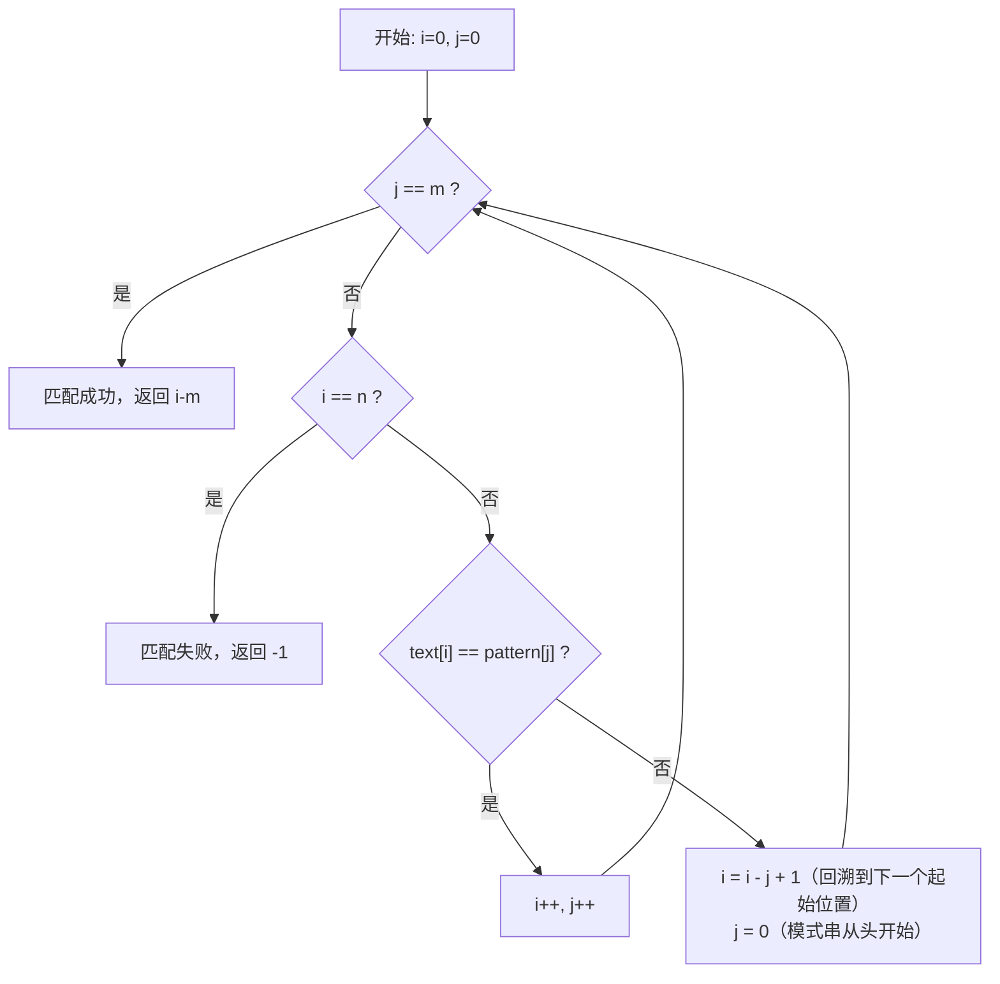

# 数据结构——串（String）深度学习笔记

> **核心一句话**：串是由零个或多个字符组成的有限序列，看似简单，却因其**模式匹配**问题催生了计算机科学中最精巧的算法之一——KMP

---

## 目录

- [1. 串的基本概念](#1-串的基本概念)
- [2. 串的存储结构](#2-串的存储结构)
- [3. 串的模式匹配算法（核心重点）](#3-串的模式匹配算法核心重点)
- [4. 拓展与应用](#4-拓展与应用)
- [5. 典型考题与易错点总结](#5-典型考题与易错点总结)

---

## 1. 串的基本概念

### 1.1 串的定义

**串（String）** 是由**零个或多个字符**组成的**有限序列**，记作：

$$S = \text{'} a_1 a_2 a_3 \dots a_n \text{'}$$

其中 $S$ 是串名，引号中的内容是**串值**，$a_i$（$1 \le i \le n$）是串中的字符，$n$ 是串的**长度**

### 1.2 核心术语辨析

| 术语 | 定义 | 示例 |
|------|------|------|
| **串（String）** | 零个或多个字符组成的有限序列 | `S = "abcde"` |
| **空串（Empty String）** | 长度为 0 的串，不含任何字符，记作 `""` 或 `∅` | `S = ""` |
| **空格串（Blank String）** | 由一个或多个空格字符组成的串，**不是空串**！ | `S = "   "` （长度为3） |
| **串的长度** | 串中字符的个数 | `"abc"` 的长度是 3 |
| **子串（Substring）** | 串中任意个**连续的字符**组成的子序列 | `"abc"` 的子串有：`""`, `"a"`, `"b"`, `"c"`, `"ab"`, `"bc"`, `"abc"` |
| **主串** | 包含子串的串 | `"abcde"` 是 `"bcd"` 的主串 |
| **字符位置** | 字符在串中的序号（通常从 0 或 1 开始） | `"abcde"` 中 `'c'` 的位置是 2（从0起） |
| **子串位置** | 子串的第一个字符在主串中的位置 | `"bcd"` 在 `"abcde"` 中的位置是 1（从0起） |
| **前缀（Prefix）** | 从串的**第一个字符**开始的连续子串（不含自身） | `"abc"` 的前缀：`"a"`, `"ab"` |
| **后缀（Suffix）** | 到串的**最后一个字符**结束的连续子串（不含自身） | `"abc"` 的后缀：`"c"`, `"bc"` |

> ⚠️ **空串 vs 空格串**：这是考试高频陷阱。空串长度为 0，空格串长度 ≥ 1。空格是一个合法字符

#### 前缀和后缀的理解（对后面学 KMP 至关重要）

```css
串 "ABCAB" 的所有前缀和后缀：

前缀（从头开始，不含自身）：
  "A", "AB", "ABC", "ABCA"

后缀（到尾结束，不含自身）：
  "B", "AB", "CAB", "BCAB"

最长相等前后缀："AB"（长度 2）
  前缀 "AB" == 后缀 "AB" ✓
```

### 1.3 串与一般线性表的区别与联系

串本质上是一种**特殊的线性表**——每个数据元素是一个**字符**。但它值得单独研究，原因如下：

| 维度 | 一般线性表 | 串 |
|------|-----------|-----|
| **数据元素** | 可以是任意类型 | 限定为字符 |
| **操作对象** | 通常以**单个元素**为操作单位 | 通常以**子串**为操作单位 |
| **典型操作** | 查找、插入、删除某个元素 | 模式匹配、拼接、求子串、替换 |
| **研究重点** | 元素的增删改查效率 | **模式匹配算法**（KMP 等）|

> 一句话总结：线性表关注"某个元素在哪"，串关注"某个子串在哪"

### 1.4 串的抽象数据类型定义（ADT）

```
ADT String:
    数据：
        零个或多个字符组成的有限序列

    操作：
        str_assign(chars)        — 赋值：将字符序列赋值给串
        str_length()             — 求长：返回串的长度
        str_compare(other)       — 比较：与另一个串按字典序比较
        str_concat(other)        — 拼接：将另一个串接在本串之后
        substr(pos, length)      — 求子串：从 pos 开始取 length 个字符
        index(pattern)           — 定位：返回模式串首次出现的位置
        str_replace(old, new)    — 替换：将串中的 old 替换为 new
        str_insert(pos, s)       — 插入：在 pos 位置插入串 s
        str_delete(pos, length)  — 删除：从 pos 开始删除 length 个字符
        is_empty()               — 判空：判断是否为空串
```

> **补充知识**：ADT（Abstract Data Type）= 只定义"做什么"，不管"怎么做"。上面列出了串"应该支持什么操作"，接下来讨论"怎么实现"

---

> 📌 **关键要点回顾 —— 第1章**
>
> 1. 串 = 字符组成的有限序列，空串长度为 0，空格串长度 ≥ 1
> 2. 子串 = 串中连续的字符序列；前缀 = 从头开始的子串；后缀 = 到尾结束的子串
> 3. 串 vs 线性表：串以"子串"为操作单位，核心问题是模式匹配
> 4. 前缀和后缀的概念是理解 KMP 算法的基础，必须吃透

---

## 2. 串的存储结构

### 2.1 顺序存储（基于数组）

#### 2.1.1 定长顺序存储

**思想**：用一个**固定大小的字符数组**存储串，并记录当前串的实际长度。

```
┌───┬───┬───┬───┬───┬───┬───┬───┐
│ H │ e │ l │ l │ o │   │   │   │  capacity = 8
└───┴───┴───┴───┴───┴───┴───┴───┘
  0   1   2   3   4   5   6   7
                        ↑
                   length = 5（实际使用了5个位置）
```

**局限性**：

- 最大长度固定，无法存储超出容量的串
- 拼接操作可能导致**截断**（目标串放不下）
- 空间可能浪费（预分配太大）或不够用（预分配太小）

#### 2.1.2 堆分配存储（动态数组）

**改进**：不预设固定大小，而是根据实际需要**动态分配内存**。在 C 语言中用 `malloc`/`realloc`，在 Python 中 `list` 天然支持动态扩展。

- 串的存储空间在运行时根据需要动态分配
- 保留了顺序存储"随机访问快"的优点
- 消除了定长存储"长度受限"的缺陷

> Python 的 `str` 类型本质上就是基于堆分配的不可变顺序存储。

#### 2.1.3 Python 实现：顺序串

```python
class SeqString:
    """
    基于数组（Python list）实现的顺序串

    内部用一个 list[str] 存储每个字符，模拟"字符数组"。
    注意：Python 内置的 str 是不可变的，我们这里用 list 模拟可变串，
    目的是学习底层原理。

    内部结构示例：
        SeqString("Hello")
        _data = ['H', 'e', 'l', 'l', 'o']
        _length = 5

    用法示例：
        s = SeqString("Hello")
        print(len(s))        # 5
        print(s[1])          # 'e'
        s2 = s.concat(SeqString(" World"))
        print(s2)            # SeqString('Hello World')
    """

    def __init__(self, chars: str = "") -> None:
        """
        用字符串初始化顺序串

        Args:
            chars: 初始字符串，默认为空串

        Time Complexity:
            O(n)，n 为 chars 的长度
        """
        self._data: list[str] = list(chars)  # 将字符串拆成字符列表
        self._length: int = len(chars)
        # 补充知识：
        # list("abc") → ['a', 'b', 'c']
        # 这会把字符串中的每个字符拆成列表的一个元素

    def __len__(self) -> int:
        """
        返回串的长度

        Returns:
            串中字符的个数

        Time Complexity:
            O(1)
        """
        return self._length

    def __getitem__(self, index: int) -> str:
        """
        按下标获取字符（支持 s[i] 语法）

        Args:
            index: 字符位置（0-based）

        Returns:
            对应位置的字符

        Raises:
            IndexError: 下标越界时抛出

        Time Complexity:
            O(1)——顺序存储支持随机访问

        补充知识：
            __getitem__ 是 Python 的特殊方法（魔术方法），
            定义之后就可以用 obj[index] 的语法来访问元素。
        """
        if index < 0 or index >= self._length:
            raise IndexError(f"index {index} out of range [0, {self._length - 1}]")
        return self._data[index]

    def __repr__(self) -> str:
        """
        返回串的字符串表示（用于调试和打印）

        补充知识：
            __repr__ 和 __str__ 的区别：
            - __repr__ 面向开发者，目标是"无歧义"，通常能反推出对象
            - __str__ 面向用户，目标是"可读性"
            - 如果只定义 __repr__，print() 也会使用它
        """
        return f"SeqString('{self.to_str()}')"

    def to_str(self) -> str:
        """
        将顺序串转为 Python 原生字符串

        Returns:
            Python str 对象

        Time Complexity:
            O(n)

        补充知识：
            ''.join(['a', 'b', 'c']) → "abc"
            join 方法将列表中的元素用指定分隔符拼接成一个字符串
            这里分隔符是空串 ''，所以直接拼在一起
        """
        return ''.join(self._data)

    def is_empty(self) -> bool:
        """
        判断是否为空串

        Returns:
            True 表示空串

        Time Complexity:
            O(1)
        """
        return self._length == 0

    def compare(self, other: 'SeqString') -> int:
        """
        与另一个串按字典序比较

        Args:
            other: 待比较的串

        Returns:
            正数表示 self > other，
            0 表示相等，
            负数表示 self < other

        Time Complexity:
            O(min(m, n))，m 和 n 分别为两串长度

        算法思路：
            逐字符比较，遇到不同的字符就返回差值；
            如果所有可比较的字符都相同，则较长的串更大。

        补充知识：
            ord('a') → 97，返回字符的 ASCII 码（Unicode 码点）
            字典序比较就是按字符编码值逐位比较
        """
        min_len: int = min(self._length, len(other))

        for i in range(min_len):
            diff: int = ord(self._data[i]) - ord(other[i])
            if diff != 0:
                return diff  # 找到第一个不同的字符，返回差值

        # 所有可比较的字符都相同，比较长度
        return self._length - len(other)

    def concat(self, other: 'SeqString') -> 'SeqString':
        """
        将另一个串拼接到本串末尾，返回新串（不修改原串）

        Args:
            other: 要拼接的串

        Returns:
            拼接后的新 SeqString 对象

        Time Complexity:
            O(m + n)，m 和 n 分别为两串长度

        图解：
            self  = "Hello"
            other = " World"
            结果  = "Hello World"

            self._data:  ['H','e','l','l','o']
            other._data: [' ','W','o','r','l','d']
            新 _data:    ['H','e','l','l','o',' ','W','o','r','l','d']
        """
        new_data: str = self.to_str() + other.to_str()
        return SeqString(new_data)

    def substr(self, pos: int, length: int) -> 'SeqString':
        """
        从 pos 位置开始取 length 个字符作为子串

        Args:
            pos:    起始位置（0-based）
            length: 子串长度

        Returns:
            新的 SeqString 对象（子串）

        Raises:
            ValueError: 参数非法时抛出

        Time Complexity:
            O(length)

        图解：
            s = "Hello World"
            s.substr(6, 5)  → "World"

            索引：  0 1 2 3 4 5 6 7 8 9 10
            字符：  H e l l o   W o r l  d
                                ↑ pos=6
                                |←length=5→|
        """
        if pos < 0 or pos >= self._length:
            raise ValueError(f"pos {pos} out of range [0, {self._length - 1}]")
        if length < 0 or pos + length > self._length:
            raise ValueError(f"substr({pos}, {length}) exceeds string boundary")

        sub_chars: str = ''.join(self._data[pos:pos + length])
        # 补充知识：
        # self._data[pos:pos+length] 是列表切片
        # [2:5] 取索引 2, 3, 4 的元素（左闭右开）
        return SeqString(sub_chars)

    def index(self, pattern: 'SeqString') -> int:
        """
        定位：返回模式串在本串中首次出现的位置

        Args:
            pattern: 模式串

        Returns:
            首次出现的起始下标（0-based），未找到返回 -1

        Time Complexity:
            最坏 O(m * n)（朴素匹配），后面会学到 O(m+n) 的 KMP

        这里使用朴素匹配算法，KMP 版本见第 3 章。
        """
        n: int = self._length
        m: int = len(pattern)

        if m == 0:
            return 0  # 空模式串匹配任何位置
        if m > n:
            return -1  # 模式串比主串长，不可能匹配

        for i in range(n - m + 1):
            match: bool = True
            for j in range(m):
                if self._data[i + j] != pattern[j]:
                    match = False
                    break
            if match:
                return i

        return -1


# ===== 使用示例 =====
if __name__ == "__main__":
    print("=== 顺序串 SeqString 演示 ===\n")

    s1: SeqString = SeqString("Hello")
    s2: SeqString = SeqString(" World")

    print(f"  s1 = {s1}")
    print(f"  s2 = {s2}")
    print(f"  len(s1) = {len(s1)}")
    print(f"  s1[1] = '{s1[1]}'")

    # 拼接
    s3: SeqString = s1.concat(s2)
    print(f"\n  s1.concat(s2) = {s3}")

    # 求子串
    sub: SeqString = s3.substr(6, 5)
    print(f"  s3.substr(6, 5) = {sub}")

    # 比较
    sa: SeqString = SeqString("abc")
    sb: SeqString = SeqString("abd")
    print(f"\n  'abc'.compare('abd') = {sa.compare(sb)}")  # 负数（c < d）
    print(f"  'abd'.compare('abc') = {sb.compare(sa)}")  # 正数

    # 定位
    text: SeqString = SeqString("AABAACAADAABAABA")
    pat: SeqString = SeqString("AABAA")
    print(f"\n  text = {text}")
    print(f"  pattern = {pat}")
    print(f"  index() = {text.index(pat)}")  # 0
```

### 2.2 链式存储（块链结构）

#### 2.2.1 为什么单纯的单链表效率低？

如果每个链表节点只存**一个字符**，存储密度极低：

```css
单链表存储 "Hello"（每个节点 1 个字符）：

  [H|→] → [e|→] → [l|→] → [l|→] → [o|→] → None

  每个节点需要：1字节（字符）+ 8字节（指针）= 9字节
  存储密度 = 有效数据 / 总空间 = 1/9 ≈ 11%    ← 极其浪费！
```

> **存储密度** = 串值所占的存储空间 / 实际分配的总存储空间。存储密度越高越好

#### 2.2.2 块链结构的设计思想

**改进**：每个节点存储**多个字符**（称为一个"块"），显著提高存储密度。

```css
块链存储 "Hello World"（每个节点 4 个字符，block_size=4）：

  [Hell|→] → [o Wo|→] → [rld#|→] → None
                              ↑
                        # 表示填充字符（最后一个块可能不满）

  每个节点：4字节（字符）+ 8字节（指针）= 12字节
  存储密度 = 4/12 ≈ 33%    ← 比单字符好多了

  如果 block_size = 8：
  [Hello Wo|→] → [rld#####|→] → None
  存储密度 = 8/16 = 50%
```

块越大，存储密度越高，但最后一个块的浪费也可能越多。实际中需要根据应用场景权衡

#### 2.2.3 Python 实现：块链串

```python
class BlockNode:
    """
    块链串的节点

    每个节点存储 block_size 个字符（最后一个节点可能不满）

    图示（block_size = 4）：
        ┌──────────────┬──────┐
        │ data (≤4字符) │ next │ ──→ 下一个节点
        └──────────────┴──────┘
    """

    def __init__(self, block_size: int) -> None:
        self.data: list[str] = []            # 存储字符的列表（最多 block_size 个）
        self.next: BlockNode | None = None   # 指向下一个块节点
        self.block_size: int = block_size    # 块的容量


class LinkedString:
    """
    基于块链结构实现的链式串

    核心思想：
    - 每个节点是一个"块"，可以存储 block_size 个字符
    - 多个块用单链表串联起来
    - 最后一个块可能不满

    图示（block_size=4, 内容="Hello World"）：

    head → [H,e,l,l] → [o, ,W,o] → [r,l,d] → None
            block 0      block 1     block 2
                                     (只有3个字符)

    用法示例：
        s = LinkedString("Hello World", block_size=4)
        print(len(s))        # 11
        print(s[6])          # 'W'
    """

    def __init__(self, chars: str = "", block_size: int = 4) -> None:
        """
        初始化块链串

        Args:
            chars:      初始字符串
            block_size: 每个块的大小（默认 4）

        Time Complexity:
            O(n)，n 为 chars 的长度
        """
        self._head: BlockNode | None = None   # 头节点指针
        self._length: int = 0                  # 串的总长度
        self._block_size: int = block_size     # 块大小

        if chars:
            self._build_from_str(chars)

    def _build_from_str(self, chars: str) -> None:
        """
        从字符串构建块链

        过程：将字符串按 block_size 分组，每组创建一个块节点

        Args:
            chars: 源字符串

        Time Complexity:
            O(n)
        """
        self._length = len(chars)
        prev: BlockNode | None = None

        for i in range(0, len(chars), self._block_size):
            # 补充知识：
            # range(0, 11, 4) → 0, 4, 8
            # 每隔 block_size 个字符切一刀

            node: BlockNode = BlockNode(self._block_size)
            chunk: str = chars[i:i + self._block_size]  # 取一块字符
            node.data = list(chunk)

            if prev is None:
                self._head = node     # 第一个块成为头节点
            else:
                prev.next = node      # 串联到前一个块的后面

            prev = node

    def __len__(self) -> int:
        """
        返回串的长度

        Time Complexity:
            O(1)
        """
        return self._length

    def __getitem__(self, index: int) -> str:
        """
        按下标获取字符

        Args:
            index: 字符位置（0-based）

        Returns:
            对应位置的字符

        Time Complexity:
            O(n/block_size)——需要逐块跳转到目标块

        注意：与顺序串的 O(1) 随机访问不同，链式串需要遍历到对应块。
        """
        if index < 0 or index >= self._length:
            raise IndexError(f"index {index} out of range [0, {self._length - 1}]")

        # 计算目标字符在哪个块的哪个位置
        block_index: int = index // self._block_size    # 第几个块
        char_offset: int = index % self._block_size     # 块内偏移
        # 补充知识：
        # 11 // 4 = 2（第2个块，从0起算）
        # 11 % 4  = 3（块内的第3个位置）

        # 遍历到目标块
        current: BlockNode | None = self._head
        for _ in range(block_index):
            current = current.next

        return current.data[char_offset]

    def to_str(self) -> str:
        """
        将块链串转为 Python 原生字符串

        Time Complexity:
            O(n)
        """
        result: list[str] = []
        current: BlockNode | None = self._head
        while current is not None:
            result.extend(current.data)
            # 补充知识：
            # list.extend(iterable) 将可迭代对象中的元素逐个添加到列表
            # [1,2].extend([3,4]) → [1,2,3,4]
            # 与 append 不同：[1,2].append([3,4]) → [1,2,[3,4]]
            current = current.next
        return ''.join(result)

    def concat(self, other: 'LinkedString') -> 'LinkedString':
        """
        拼接两个块链串，返回新串

        Args:
            other: 要拼接的串

        Returns:
            新的 LinkedString 对象

        Time Complexity:
            O(m + n)
        """
        new_str: str = self.to_str() + other.to_str()
        return LinkedString(new_str, self._block_size)

    def substr(self, pos: int, length: int) -> 'LinkedString':
        """
        从 pos 开始取 length 个字符作为子串

        Args:
            pos:    起始位置（0-based）
            length: 子串长度

        Returns:
            新的 LinkedString 对象（子串）

        Time Complexity:
            O(pos + length)
        """
        if pos < 0 or pos >= self._length:
            raise ValueError(f"pos {pos} out of range")
        if length < 0 or pos + length > self._length:
            raise ValueError(f"substr({pos}, {length}) exceeds boundary")

        chars: list[str] = []
        for i in range(pos, pos + length):
            chars.append(self[i])
        return LinkedString(''.join(chars), self._block_size)

    def __repr__(self) -> str:
        """打印块链串内容和结构"""
        blocks: list[str] = []
        current: BlockNode | None = self._head
        while current is not None:
            blocks.append(f"[{''.join(current.data)}]")
            current = current.next
        structure: str = " → ".join(blocks) if blocks else "∅"
        return f"LinkedString('{self.to_str()}', blocks: {structure})"


# ===== 使用示例 =====
if __name__ == "__main__":
    print("=== 块链串 LinkedString 演示 ===\n")

    s: LinkedString = LinkedString("Hello World", block_size=4)
    print(f"  s = {s}")
    print(f"  len(s) = {len(s)}")
    print(f"  s[6] = '{s[6]}'")      # 'W'

    sub: LinkedString = s.substr(6, 5)
    print(f"  s.substr(6, 5) = {sub}")

    s2: LinkedString = LinkedString("!!!", block_size=4)
    s3: LinkedString = s.concat(s2)
    print(f"  s.concat('!!!') = {s3}")
```

#### 2.2.4 顺序存储 vs 链式存储 对比

| 对比维度 | 顺序存储（数组） | 链式存储（块链） |
|---------|-----------------|-----------------|
| **随机访问** | $O(1)$ ⭐ | $O(n/block_size)$ |
| **存储密度** | 高（无指针开销） | 中等（取决于块大小） |
| **插入/删除** | $O(n)$（需要移动元素） | $O(n/block_size)$（定位后修改指针） |
| **空间利用** | 可能浪费（预分配）或频繁扩容 | 按需分配 |
| **模式匹配** | 快（连续内存，缓存友好） | 慢（跨块访问，缓存不友好） |
| **适用场景** | 频繁查询和模式匹配 | 频繁插入删除的文本编辑 |

> **实际建议**：在绝大多数场景下，顺序存储更优。Python 的 `str` 就是顺序存储的。链式存储主要用于教学目的，以及**文本编辑器**中的 rope 数据结构（一种高级链式串）

---

> 📌 **关键要点回顾 —— 第2章**
>
> 1. 顺序串 = 字符数组 + 长度，支持 O(1) 随机访问，适合查找和匹配。
> 2. 块链串 = 每个节点存多个字符的链表，提高了单字符链表的存储密度。
> 3. 存储密度 = 有效数据 / 总空间，块越大密度越高，但末块浪费也越多。
> 4. 实际开发中用顺序存储（Python `str`），链式存储了解原理即可。

---

## 3. 串的模式匹配算法（核心重点）

**模式匹配（Pattern Matching）** 是串的核心问题：给定主串 `text` 和模式串 `pattern`，找出 `pattern` 在 `text` 中首次出现的位置

### 3.1 朴素模式匹配（Brute-Force）

#### 3.1.1 算法思想

**最直接的想法**：把模式串在主串上"滑动"，每滑动一个位置就逐字符比较，匹配成功就返回，失败就右移一格重新比较

```
主串 text:    A A B A A C A A D A A B A A B A
模式串 pattern: A A B A A

第1趟（i=0）：A A B A A C ...
              A A B A A       ← 全部匹配！返回 0
```

#### 3.1.2 匹配过程流程图



**关键理解**：失配时 `i = i - j + 1` 这一步的含义。

```
当前状态：已经从位置 start 开始匹配了 j 个字符，此时 i = start + j。
失配时要让 i 回到 start + 1 的位置：
  i = i - j + 1 = (start + j) - j + 1 = start + 1  ✓

同时 j 归零，模式串从头重新匹配。
```

#### 3.1.3 匹配过程可视化示例

```
text    = "AABAACAADAABAABA"
pattern = "AABAA"

第1趟（起始位置 0）：
  text:     A A B A A C A A D A A B A A B A
  pattern:  A A B A A
            ✓ ✓ ✓ ✓ ✓    ← 5个字符全部匹配！匹配成功！返回 0

（如果要找第二次出现的位置，继续：）

第2趟（起始位置 1）：
  text:     A A B A A C A A D A A B A A B A
  pattern:    A A B A A
              ✓ ✓ ✗      ← text[3]='A' vs pattern[2]='B'，失配

第3趟（起始位置 2）：
  text:     A A B A A C A A D A A B A A B A
  pattern:      A A B A A
                ✗          ← text[2]='B' vs pattern[0]='A'，失配

...（省略中间过程）

第10趟（起始位置 9）：
  text:     A A B A A C A A D A A B A A B A
  pattern:                    A A B A A
                              ✓ ✓ ✓ ✓ ✗  ← text[13]='A' vs... 
  （实际看一下：text[9..13] = "AABAA" → 匹配！）
```

#### 3.1.4 Python 实现

```python
def brute_force_match(text: str, pattern: str) -> int:
    """
    朴素（暴力）模式匹配算法

    在主串 text 中查找模式串 pattern 首次出现的位置。

    Args:
        text:    主串
        pattern: 模式串

    Returns:
        模式串首次出现的起始下标（0-based），未找到返回 -1

    Time Complexity:
        最好情况：O(m)        — 第一趟就匹配成功
        最坏情况：O(m * n)    — 每趟比较到最后一个字符才失配
        平均情况：O(m * n)    — 在最坏情况的模式下
        其中 m = len(text), n = len(pattern)

    Space Complexity:
        O(1) — 只用了常数级额外空间

    算法步骤：
        1. 用 i 指向主串当前位置，j 指向模式串当前位置
        2. 如果 text[i] == pattern[j]，则 i++, j++，继续比较下一个字符
        3. 如果失配，i 回溯到本趟开始位置的下一个位置，j 归零
        4. 如果 j == len(pattern)，说明模式串全部匹配，返回起始位置
    """
    n: int = len(text)       # 主串长度
    m: int = len(pattern)    # 模式串长度

    if m == 0:
        return 0             # 空模式串匹配任何位置
    if m > n:
        return -1            # 模式串比主串长，不可能匹配

    i: int = 0               # 主串指针
    j: int = 0               # 模式串指针

    while i < n and j < m:
        if text[i] == pattern[j]:
            # 当前字符匹配，两个指针同时右移
            i += 1
            j += 1
        else:
            # 失配：
            # i 回溯到"本趟起始位置 + 1"
            # 本趟起始位置 = i - j（因为已经匹配了 j 个字符）
            # 所以 i 回到 i - j + 1
            i = i - j + 1
            j = 0            # 模式串从头开始

    if j == m:     # 这里的意思是m个字符全都匹配成功
        return i - m         # 匹配成功，起始位置 = i - m
    else:
        return -1            # 匹配失败


# ===== 测试 =====
if __name__ == "__main__":
    print("=== 朴素模式匹配 ===\n")

    test_cases: list[tuple[str, str, int]] = [
        ("AABAACAADAABAABA", "AABAA", 0),
        ("AABAACAADAABAABA", "AADAA", 6),
        ("AABAACAADAABAABA", "XYZ", -1),
        ("AAAAAB", "AAAB", 2),
        ("", "ABC", -1),
        ("ABC", "", 0),
    ]

    for text, pattern, expected in test_cases:
        result: int = brute_force_match(text, pattern)
        status: str = "✓" if result == expected else "✗"
        print(f"  {status} brute_force_match(\"{text}\", \"{pattern}\") = {result}")
```

#### 3.1.5 朴素算法的时间复杂度分析

**最坏情况举例**：

```css
text    = "AAAAAAAAAB"    (n = 10)
pattern = "AAAB"          (m = 4)

每一趟都比较到模式串最后一个字符才失配：

第1趟：text[0..3] = "AAAA" vs "AAAB"  → 比较4次，最后失配
第2趟：text[1..4] = "AAAA" vs "AAAB"  → 比较4次，最后失配
...
第7趟：text[6..9] = "AAAB" vs "AAAB"  → 比较4次，匹配！

总比较次数 ≈ 7 × 4 = 28 ≈ (n - m + 1) × m

当 m ≈ n/2 时，时间复杂度为 O(n²)
```

> **朴素算法的根本问题**：失配时主串指针 `i` 要**回溯**。已经匹配过的字符中蕴含的信息被浪费了。KMP 算法正是为了解决这个问题而生

---

> 📌 **关键要点回顾 —— 3.1 朴素匹配**
>
> 1. 核心操作：逐位滑动模式串，逐字符比较
> 2. 失配时 `i = i - j + 1`（主串回溯），`j = 0`（模式串归零）
> 3. 最坏时间复杂度 O(m × n)，主要发生在主串和模式串有大量重复字符时
> 4. 核心缺陷：主串指针回溯，浪费了已匹配部分的信息

---

### 3.2 KMP 算法（Knuth-Morris-Pratt）

#### 3.2.1 KMP 的核心洞察

KMP 算法的核心思想可以概括为一句话：

> **主串指针 `i` 永远不回溯，失配时只移动模式串**

当在 `pattern[j]` 处失配时，我们已经知道 `text[i-j..i-1] == pattern[0..j-1]`（已匹配的部分）。利用这个已知信息，我们可以将模式串直接右移到一个"合理的位置"，而不需要让 `i` 回溯

**那么模式串应该右移多少呢？** 答案取决于已匹配部分 `pattern[0..j-1]` 的**最长相等前后缀**

#### 3.2.2 最长相等前后缀（部分匹配值）

**定义**：对于串 $P[0..j-1]$，如果存在 $P[0..k-1] = P[j-k..j-1]$（前 $k$ 个字符 = 后 $k$ 个字符），且 $k < j$，那么最大的 $k$ 就是**最长相等前后缀长度**。用人话说：**串的前缀和后缀有多长的重合？**

```
例子1：P = "AABAA"

  前缀集合（不含自身）：{A, AA, AAB, AABA}
  后缀集合（不含自身）：{A, AA, BAA, ABAA}

  相等的前后缀："A"（长度1）、"AA"（长度2）
  最长相等前后缀 = "AA"，长度 = 2

例子2：P = "ABCAB"

  前缀：{A, AB, ABC, ABCA}
  后缀：{B, AB, CAB, BCAB}

  相等的前后缀："AB"（长度2）
  最长相等前后缀 = "AB"，长度 = 2

例子3：P = "ABCDE"

  前缀：{A, AB, ABC, ABCD}
  后缀：{E, DE, CDE, BCDE}

  没有相等的前后缀
  最长相等前后缀长度 = 0
```

#### 为什么最长相等前后缀决定了模式串的右移量？

```
假设在 pattern[j] 处失配：

text:    ... X X [A B C A B] ? ...
                  ↑ 已匹配部分 ↑
pattern:         [A B C A B] Y
                  0 1 2 3 4  5=j（失配位置）

已匹配部分 "ABCAB" 的最长相等前后缀是 "AB"（长度 k=2）。

这意味着：已匹配部分的后缀 "AB" == 已匹配部分的前缀 "AB"

所以我们可以直接将模式串右移，让前缀对齐到后缀曾经的位置：

text:    ... X X  A B C [A B] ? ...
                         ↑ 这部分已经匹配了！
pattern:                [A B] C A B Y
                         0 1  2=新的j

模式串从 j=2 继续匹配，主串 i 不回溯！
```

**结论**：失配时，`j` 应该跳到 `k`（最长相等前后缀长度），而不是 0。这就是 next 数组的含义

#### 3.2.3 next 数组的定义与含义

**next[j]** 的定义：
$$
\text{next}[j] = 
\begin{cases}
-1 & \text{当 } j = 0  \\
\max\{k \ | \ 0 < k < j, \ P[0..k-1] = P[j-k..j-1]\} & \text{当此集合非空时} \\
0 & \text{其他情况（没有相等前后缀）}
\end{cases}
$$

- `next[0] = -1`：固定值，表示"模式串的第一个字符就不匹配，主串 i 右移，模式串从头开始"
- `next[j]`（j > 0）= `pattern[0..j-1]` 这个前缀的**最长相等前后缀长度**

> ⚠️ **下标约定**：本笔记 next 数组从 **下标 0** 开始，`next[0] = -1`。有些教材从下标 1 开始，`next[1] = 0`。实质一样，只是偏移了一位。这是 KMP 学习中最常见的混淆源，详见第 5 章易错点。

#### 3.2.4 手工推导示例：模式串 "ABAABCAC"

逐步求解 next 数组，每一步都写清推导理由。

```
模式串 P = "ABAABCAC"
下标 j：    0 1 2 3 4 5 6 7

=== 逐字符推导 ===

j = 0: next[0] = -1（定义固定值）

j = 1: 考察 P[0..0] = "A"
       前缀集合 = {}（长度为1的串没有真前缀）
       后缀集合 = {}
       最长相等前后缀长度 = 0
       next[1] = 0

j = 2: 考察 P[0..1] = "AB"
       前缀：{"A"}
       后缀：{"B"}
       无相等前后缀
       next[2] = 0

j = 3: 考察 P[0..2] = "ABA"
       前缀：{"A", "AB"}
       后缀：{"A", "BA"}
       相等的：{"A"}，最长长度 = 1
       next[3] = 1

j = 4: 考察 P[0..3] = "ABAA"
       前缀：{"A", "AB", "ABA"}
       后缀：{"A", "AA", "BAA"}
       相等的：{"A"}，最长长度 = 1
       next[4] = 1

j = 5: 考察 P[0..4] = "ABAAB"
       前缀：{"A", "AB", "ABA", "ABAA"}
       后缀：{"B", "AB", "AAB", "BAAB"}
       相等的：{"AB"}，最长长度 = 2
       next[5] = 2

j = 6: 考察 P[0..5] = "ABAABC"
       前缀：{"A", "AB", "ABA", "ABAA", "ABAAB"}
       后缀：{"C", "BC", "ABC", "AABC", "BAABC"}
       无相等前后缀
       next[6] = 0

j = 7: 考察 P[0..6] = "ABAABCA"
       前缀：{"A", "AB", "ABA", "ABAA", "ABAAB", "ABAABC"}
       后缀：{"A", "CA", "BCA", "ABCA", "AABCA", "BAABCA"}
       相等的：{"A"}，最长长度 = 1
       next[7] = 1

=== 最终结果 ===

下标 j:    0    1    2    3    4    5    6    7
P[j]:      A    B    A    A    B    C    A    C
next[j]:  -1    0    0    1    1    2    0    1
```

#### 3.2.5 next 数组的程序化求解

手工枚举前后缀适合理解概念，但编程时需要更高效的方法。next 数组的求解本身就是一个"模式串对自身的匹配"过程

```css
核心递推逻辑：

已知 next[j] = k，即 P[0..k-1] == P[j-k..j-1]，也就是说在前缀串P[0..j-1]中，存在一个长度为k的最长相等前后缀

现在要求 next[j+1]，也就是求串P[0..j]的最长相等前后缀长度：

情况1：P[k] == P[j]
  → P[0..k] == P[j-k..j]
  → next[j+1] = k + 1  这里的意思是本来就有P[0..k-1] == P[j-k..j-1]，现在k和j位置的也相等，那这个最长相等前后缀的程度就直接+1


情况2：P[k] != P[j]
  → 这说明当前长度为 k 的相等前后缀不能再扩展，因此 next[j+1] 不可能是 k+1
  → 退而求其次，让 k = next[k]，找更短的前后缀
  → 重复判断，直到 P[k] == P[j] 或 k == -1

  这一步为什么是 k = next[k]？
  因为 next[k] 告诉我们 P[0..k-1] 的最长相等前后缀长度，
  退到这个更短的匹配位置继续尝试。
```

#### 3.2.6 Python 实现

```python
def get_next(pattern: str) -> list[int]:
    """
    求模式串的 next 数组

    next[j] 的含义：当 pattern[j] 失配时，j 应该回退到的位置。
    等价于 pattern[0..j-1] 的最长相等前后缀长度。
    特别地，next[0] = -1。

    Args:
        pattern: 模式串

    Returns:
        next 数组（长度与 pattern 相同）

    Time Complexity:
        O(m)，m = len(pattern)
        虽然有 while 循环嵌套在 for 循环中，但 k 的值总增减量均摊为 O(m)

    算法核心：
        利用已经求出的 next[0..j-1] 来递推 next[j]，
        本质上是"模式串与自身的匹配"。
    """
    m: int = len(pattern)
    if m == 0:
        return []

    nxt: list[int] = [0] * m   # next 数组（用 nxt 避免和 Python 内置 next 冲突）
    nxt[0] = -1                 # 定义：第一个字符失配时 next = -1

    j: int = 1                  # 当前要求 next 值的位置（从 1 开始）
    k: int = -1                 # k = next[j-1] 的初始值
    # k 表示"当前已匹配的最长相等前后缀长度"
    # 初始 k = -1 对应 j=1 时 next[0] = -1 的情况

    while j < m:
        if k == -1 or pattern[j - 1] == pattern[k]:
            # 情况1：k == -1 → 没有可匹配的前缀，next[j] = 0
            # 情况2：P[j-1] == P[k] → 相等前后缀可以扩展一位
            k += 1
            nxt[j] = k
            j += 1
        else:
            # 情况3：P[j-1] != P[k] → 回退到更短的匹配
            k = nxt[k]

    return nxt


def kmp_match(text: str, pattern: str) -> int:
    """
    使用 KMP 算法在主串中查找模式串首次出现的位置。

    Args:
        text:    主串
        pattern: 模式串

    Returns:
        模式串在主串中首次出现的起始下标（0-based），未找到返回 -1

    Time Complexity:
        O(m + n)，其中 m = len(text)，n = len(pattern)
        - 求 next 数组：O(n)
        - 匹配过程：O(m)
        - 总计：O(m + n)

    Space Complexity:
        O(n) — next 数组的空间

    与朴素算法的关键区别：
        朴素：失配时 i 回溯，j 归零
        KMP ：失配时 i 不动，j 跳到 next[j]
    """
    n: int = len(text)       # 主串长度
    m: int = len(pattern)    # 模式串长度

    if m == 0:
        return 0
    if m > n:
        return -1

    nxt: list[int] = get_next(pattern)  # 预处理 next 数组

    i: int = 0               # 主串指针（永远不回溯！）
    j: int = 0               # 模式串指针

    while i < n and j < m:
        if j == -1 or text[i] == pattern[j]:
            # j == -1：模式串第一个字符就不匹配，主串右移一位
            # text[i] == pattern[j]：当前字符匹配，继续
            i += 1
            j += 1
        else:
            # 失配：j 跳到 next[j]，i 不动！
            j = nxt[j]

    if j == m:
        return i - m         # 匹配成功
    else:
        return -1            # 匹配失败


# ===== 测试 =====
if __name__ == "__main__":
    print("=== KMP 算法 ===\n")

    # 演示 next 数组求解
    patterns: list[str] = ["ABAABCAC", "AAAAB", "ABCABD", "AABAA"]
    for p in patterns:
        nxt: list[int] = get_next(p)
        print(f"  pattern = \"{p}\"")
        print(f"  index:  {list(range(len(p)))}")
        print(f"  char:   {list(p)}")
        print(f"  next:   {nxt}\n")

    # 演示 KMP 匹配
    print("--- KMP 匹配测试 ---")
    test_cases: list[tuple[str, str, int]] = [
        ("AABAACAADAABAABA", "AABAA", 0),
        ("AABAACAADAABAABA", "AADAA", 6),
        ("AABAACAADAABAABA", "XYZ", -1),
        ("AAAAAB", "AAAB", 2),
        ("ABCABCABD", "ABCABD", 3),
        ("", "ABC", -1),
        ("ABC", "", 0),
    ]

    for text, pattern, expected in test_cases:
        result: int = kmp_match(text, pattern)
        status: str = "✓" if result == expected else "✗"
        print(f"  {status} kmp_match(\"{text}\", \"{pattern}\") = {result}")
```

#### 3.2.7 KMP 匹配过程可视化

```
text    = "ABCABCABD"
pattern = "ABCABD"
next    = [-1, 0, 0, 0, 1, 2]

=== 匹配过程 ===

第1趟（i=0, j=0 开始）：
  text:     A B C A B C A B D
  pattern:  A B C A B D
            ✓ ✓ ✓ ✓ ✓ ✗
                        ↑ i=5, j=5, text[5]='C' ≠ pattern[5]='D'

  失配！j = next[5] = 2（不回溯 i！）

  解释：已匹配部分 "ABCAB" 的最长相等前后缀 = "AB"（长度2），
        所以模式串直接跳到 j=2 继续匹配。

第2趟（i=5, j=2 继续）：
  text:     A B C A B C A B D
                      ↑ i=5
  pattern:        A B C A B D
                      ↑ j=2

  比较 text[5]='C' vs pattern[2]='C' → ✓
  比较 text[6]='A' vs pattern[3]='A' → ✓
  比较 text[7]='B' vs pattern[4]='B' → ✓
  比较 text[8]='D' vs pattern[5]='D' → ✓

  j == 6 == m → 匹配成功！返回 i - m = 9 - 6 = 3

=== 对比朴素算法 ===

朴素算法在第1趟失配后：
  i 回溯到 1，j 归零，从 text[1] 重新开始 → 浪费！

KMP 算法：
  i 不回溯（停在5），j 跳到 2 → 利用了已匹配部分的信息
```

#### 3.2.8 为什么 KMP 是 O(m + n)？

```
时间复杂度证明思路：

匹配过程中，考察 i 和 j 的变化：

每一步要么：
  (a) i++, j++ — i 增加 1（匹配成功）
  (b) j = next[j] — j 减小，i 不变（失配回退）

关键观察：
  - i 最多增加 n 次（从 0 到 n-1）→ (a) 最多执行 n 次
  - 每次 (a) 让 j 增加 1，每次 (b) 让 j 减小
  - j 减小的总量 ≤ j 增加的总量 ≤ n
  - 所以 (b) 最多执行 n 次

总步数 ≤ 2n = O(n)

加上求 next 数组的 O(m)，总复杂度 = O(m + n)。

这里用到的分析技巧叫做"摊还分析（Amortized Analysis）"：
虽然单步可能在 while 循环中多次执行，
但从全局看总操作次数是有界的。
```

---

> 📌 **关键要点回顾 —— 3.2 KMP 算法**
>
> 1. **核心思想**：主串指针 i 不回溯，失配时只移动模式串（j = next[j]）
> 2. **next[j]** = pattern[0..j-1] 的最长相等前后缀长度
> 3. **next 数组求解**：本质是"模式串对自身的匹配"，递推求解
> 4. **时间复杂度 O(m+n)**：通过摊还分析证明，i 和 j 各自最多变化 n 次和 m 次
> 5. **next[0] = -1** 是哨兵值，表示模式串第一个字符就失配

---

### 3.3 KMP 的优化——nextval 数组

#### 3.3.1 next 数组的缺陷

考虑模式串 `"AAAAB"`：

```
P     = A  A  A  A  B
j     = 0  1  2  3  4
next  = -1 0  1  2  3

用 next 匹配的场景：

text:    A A A B A A A A B
pattern: A A A A B
         ✓ ✓ ✓ ✗     ← j=3 处失配（text[3]='B' ≠ pattern[3]='A'）

按 next[3]=2，j 跳到 2：
text:    A A A B ...
pattern:   A A A A B
               ↑ j=2, 但 pattern[2]='A'，text[3] 仍然是 'B'，必然失配！

按 next[2]=1，j 跳到 1：
text:    A A A B ...
pattern:     A A A A B
               ↑ j=1, pattern[1]='A'，又失配！

按 next[1]=0，j 跳到 0：
text:    A A A B ...
pattern:       A A A A B
               ↑ j=0, pattern[0]='A'，还是失配！

问题：连续 4 次"明知会失配还要比较"——因为 pattern[3]=pattern[2]=pattern[1]=pattern[0]='A'，
只要 text[3] ≠ 'A'，它们就都不可能匹配。
```

**缺陷本质**：`next[j] = k` 时，如果 `pattern[j] == pattern[k]`，那么在 `text[i] ≠ pattern[j]` 的情况下，`text[i] ≠ pattern[k]` 也必然成立。跳到 `k` 是白跳

#### 3.3.2 nextval 数组的优化逻辑

**优化思路**：在求 next 数组时，如果 `pattern[j] == pattern[next[j]]`，就继续回退，直到找到一个不同的字符或到达 -1。

用数学公式表示：

$$
\text{nextval}[j] = 
\begin{cases}
-1 & \text{当 } j = 0 \\
\text{nextval}[\text{next}[j]] & \text{当 } P[j] = P[\text{next}[j]] \text{ 时（跳过重复字符）} \\
\text{next}[j] & \text{当 } P[j] \neq P[\text{next}[j]] \text{ 时（保持不变）}
\end{cases}
$$

#### 3.3.3 手工推导示例

##### 示例1：模式串 "AAAAB"

```
P      = A    A    A    A    B
j      = 0    1    2    3    4
next   = -1   0    1    2    3

求 nextval：

j=0: nextval[0] = -1（固定值）

j=1: next[1] = 0, P[1]='A', P[0]='A'
     P[1] == P[next[1]] → 回退！
     nextval[1] = nextval[0] = -1

j=2: next[2] = 1, P[2]='A', P[1]='A'
     P[2] == P[next[2]] → 回退！
     nextval[2] = nextval[1] = -1

j=3: next[3] = 2, P[3]='A', P[2]='A'
     P[3] == P[next[3]] → 回退！
     nextval[3] = nextval[2] = -1

j=4: next[4] = 3, P[4]='B', P[3]='A'
     P[4] ≠ P[next[4]] → 保持
     nextval[4] = next[4] = 3

结果对比：
j        = 0    1    2    3    4
P[j]     = A    A    A    A    B
next     = -1   0    1    2    3
nextval  = -1  -1   -1   -1    3

优化效果：j=3 失配时，直接跳到 -1（整体右移），
          跳过了 3 次无效比较！
```

##### 示例2：模式串 "ABAABCAC"

```
P       = A    B    A    A    B    C    A    C
j       = 0    1    2    3    4    5    6    7
next    = -1   0    0    1    1    2    0    1

求 nextval：

j=0: nextval[0] = -1

j=1: next[1]=0, P[1]='B', P[0]='A'
     'B' ≠ 'A' → 保持
     nextval[1] = 0

j=2: next[2]=0, P[2]='A', P[0]='A'
     'A' == 'A' → 回退！
     nextval[2] = nextval[0] = -1

j=3: next[3]=1, P[3]='A', P[1]='B'
     'A' ≠ 'B' → 保持
     nextval[3] = 1

j=4: next[4]=1, P[4]='B', P[1]='B'
     'B' == 'B' → 回退！
     nextval[4] = nextval[1] = 0

j=5: next[5]=2, P[5]='C', P[2]='A'
     'C' ≠ 'A' → 保持
     nextval[5] = 2

j=6: next[6]=0, P[6]='A', P[0]='A'
     'A' == 'A' → 回退！
     nextval[6] = nextval[0] = -1

j=7: next[7]=1, P[7]='C', P[1]='B'
     'C' ≠ 'B' → 保持
     nextval[7] = 1

结果对比：
j         = 0    1    2    3    4    5    6    7
P[j]      = A    B    A    A    B    C    A    C
next      = -1   0    0    1    1    2    0    1
nextval   = -1   0   -1    1    0    2   -1    1
```

#### 3.3.4 Python 实现

```python
def get_nextval(pattern: str) -> list[int]:
    """
    求模式串的 nextval 数组（next 数组的优化版）

    优化逻辑：
    如果 pattern[j] == pattern[next[j]]，则 nextval[j] = nextval[next[j]]
    否则 nextval[j] = next[j]

    Args:
        pattern: 模式串

    Returns:
        nextval 数组（长度与 pattern 相同）

    Time Complexity:
        O(m)，m = len(pattern)
    """
    m: int = len(pattern)
    if m == 0:
        return []

    nextval: list[int] = [0] * m
    nextval[0] = -1

    j: int = 1
    k: int = -1

    while j < m:
        if k == -1 or pattern[j - 1] == pattern[k]:
            k += 1
            # 优化判断：如果 pattern[j] == pattern[k]，则继续回退
            if j < m and pattern[j] == pattern[k]:
                nextval[j] = nextval[k]   # 跳过重复字符
            else:
                nextval[j] = k             # 保持
            j += 1
        else:
            k = nextval[k]  # 利用已有的 nextval 加速回退

    return nextval


# 另一种更清晰的实现方式：先求 next，再修正为 nextval
def get_nextval_v2(pattern: str) -> list[int]:
    """
    先求 next 数组，再修正为 nextval 数组

    这种写法逻辑更清晰，便于理解。

    Args:
        pattern: 模式串

    Returns:
        nextval 数组

    Time Complexity:
        O(m)
    """
    m: int = len(pattern)
    if m == 0:
        return []

    # 第一步：先求 next 数组
    nxt: list[int] = get_next(pattern)

    # 第二步：修正为 nextval
    nextval: list[int] = [0] * m
    nextval[0] = -1

    for j in range(1, m):
        if pattern[j] == pattern[nxt[j]]:
            nextval[j] = nextval[nxt[j]]   # P[j]==P[next[j]]，继续回退
        else:
            nextval[j] = nxt[j]             # 不同字符，保持 next 值

    return nextval


# ===== 测试 =====
if __name__ == "__main__":
    print("=== nextval 数组 ===\n")

    patterns: list[str] = ["AAAAB", "ABAABCAC", "ABCABD"]
    for p in patterns:
        nxt: list[int] = get_next(p)
        nxtval: list[int] = get_nextval(p)
        nxtval2: list[int] = get_nextval_v2(p)
        print(f"  pattern  = \"{p}\"")
        print(f"  index:     {list(range(len(p)))}")
        print(f"  char:      {list(p)}")
        print(f"  next:      {nxt}")
        print(f"  nextval:   {nxtval}")
        print(f"  nextval_v2:{nxtval2}")

        # 验证两种实现结果一致
        assert nxtval == nxtval2, f"结果不一致: {nxtval} vs {nxtval2}"
        print(f"  ✓ 两种实现结果一致\n")
```

---

> 📌 **关键要点回顾 —— 3.3 nextval**
>
> 1. **next 的缺陷**：`pattern[j] == pattern[next[j]]` 时，跳到 next[j] 必然还是失配
> 2. **nextval 的优化**：遇到上述情况就继续回退，`nextval[j] = nextval[next[j]]`
> 3. **效果**：消除连续相同字符导致的无效比较，在 "AAAAB" 类模式串上提升显著
> 4. **实际影响**：KMP 的时间复杂度本身就是 O(m+n)，nextval 只是减小了常数因子

---

## 4. 拓展与应用

### 4.1 串在实际工程中的应用

**文本编辑器**：查找/替换功能的核心就是串的模式匹配。现代编辑器（VS Code、Vim）支持正则表达式匹配，底层会用到更高级的串匹配算法

**搜索引擎**：网页内容索引、关键词匹配、全文检索都依赖高效的串处理算法。倒排索引将文档中的每个词映射到文档列表，查询时通过字符串匹配定位相关文档

**生物信息学**：DNA 由 A、T、C、G 四种碱基组成的长序列，基因序列比对（如 BLAST 算法）本质上是大规模串匹配问题。人类基因组约有 30 亿个碱基对，高效的模式匹配至关重要

**网络安全**：入侵检测系统（IDS）需要在网络流量中匹配已知攻击模式的特征串。防病毒软件需要在文件中搜索病毒签名（特征字节序列）

**编译器**：词法分析阶段需要识别关键字、标识符、运算符等，本质上是多模式串匹配问题

### 4.2 其他经典串匹配算法简介

#### 4.2.1 Boyer-Moore 算法

**核心思想**：从模式串的**末尾开始**向前比较（从右往左），利用"坏字符规则"和"好后缀规则"实现大步跳跃。

- **坏字符规则**：失配时，看主串中导致失配的那个字符在模式串中最右出现的位置，据此决定跳跃距离。
- **好后缀规则**：失配时，看已经匹配的后缀在模式串中是否有其他出现，据此决定跳跃距离。
- 两个规则取较大的跳跃值。

**特点**：在实际文本搜索中通常比 KMP 更快，因为它经常能跳过大段主串。最好情况 O(n/m)，最坏情况 O(m×n)。

#### 4.2.2 Rabin-Karp 算法

**核心思想**：用**哈希函数**将模式串和主串的子串映射为数值，先比较哈希值（O(1)），哈希值相同再逐字符验证。使用**滚动哈希**技术，使得每次窗口滑动只需 O(1) 更新哈希值。

**特点**：平均 O(m+n)，最坏 O(m×n)（哈希冲突多时退化）。特别适合**多模式匹配**（同时搜索多个模式串）。

#### 4.2.3 Sunday 算法

**核心思想**：与 Boyer-Moore 类似，但更简单。失配时关注的是主串中**窗口后面的第一个字符**（而不是当前失配字符），根据该字符在模式串中的位置决定跳跃距离。

**特点**：实现简单，平均性能优秀。在模式串较短、字符集较大时效率很高。

#### 4.2.4 算法对比

| 算法 | 时间复杂度（最坏） | 时间复杂度（平均/最好） | 核心思想 | 预处理 | 适用场景 |
|------|-------------------|----------------------|---------|--------|---------|
| **朴素** | O(m×n) | O(m×n) / O(n) | 逐位滑动 | 无 | 教学、简单场景 |
| **KMP** | O(m+n) | O(m+n) | 利用已匹配信息，不回溯 i | next 数组 O(m) | 需要**最坏情况保证**的场景 |
| **Boyer-Moore** | O(m×n) | O(n/m)（亚线性！） | 从右往左比较，大步跳跃 | 坏字符+好后缀表 | 大文本搜索（实际最常用） |
| **Rabin-Karp** | O(m×n) | O(m+n) | 滚动哈希 | 哈希计算 O(m) | **多模式匹配** |
| **Sunday** | O(m×n) | O(n/m) | 关注窗口后第一个字符 | 偏移表 O(m) | 短模式串，大字符集 |

> **总结**：
> - 需要最坏情况 O(m+n) 保证 → **KMP**
> - 实际大文本搜索、追求平均速度 → **Boyer-Moore** 或 **Sunday**
> - 同时搜索多个模式串 → **Rabin-Karp**
> - 教学和理解基础 → **朴素算法**

---

> 📌 **关键要点回顾 —— 第4章**
>
> 1. 串匹配无处不在：编辑器、搜索引擎、DNA比对、网络安全、编译器。
> 2. KMP 的独特优势是**最坏情况 O(m+n)**，其他算法最坏情况可能退化。
> 3. Boyer-Moore 在实际文本中通常最快（亚线性），但最坏情况不如 KMP。
> 4. 不同场景选择不同算法，没有"绝对最优"。

---

## 5. 典型考题与易错点总结

### 5.1 经典考题

#### 题目 1：手算 next 数组（高频必考）

**题目**：求模式串 `"ABABAAABABAA"` 的 next 数组。

**解答**：

```
P     = A  B  A  B  A  A  A  B  A  B  A  A
j     = 0  1  2  3  4  5  6  7  8  9  10 11

逐步求解：

j=0:  next[0] = -1（定义）

j=1:  P[0..0]="A" → 无真前/后缀 → next[1] = 0

j=2:  P[0..1]="AB" → 前缀{A}, 后缀{B} → 无相等 → next[2] = 0

j=3:  P[0..2]="ABA" → 前缀{A,AB}, 后缀{A,BA} → 相等{"A"} → next[3] = 1

j=4:  P[0..3]="ABAB" → 前缀{A,AB,ABA}, 后缀{B,AB,BAB}
      → 相等{"AB"} → next[4] = 2

j=5:  P[0..4]="ABABA" → 前缀{A,AB,ABA,ABAB}
      后缀{A,BA,ABA,BABA} → 相等{"A","ABA"} → max=3 → next[5] = 3

j=6:  P[0..5]="ABABAA" → 前缀{A,AB,ABA,ABAB,ABABA}
      后缀{A,AA,BAA,ABAA,BABAA} → 相等{"A"} → next[6] = 1

j=7:  P[0..6]="ABABAAA" → 前缀{...,A,AB,...}
      后缀{...,A,AA,...} → 相等{"A"} → next[7] = 1

j=8:  P[0..7]="ABABAAAB" → 前缀{...,AB,...}
      后缀{...,AB,...} → 相等{"AB"} → next[8] = 2

j=9:  P[0..8]="ABABAAABA" → 前缀{...,ABA,...}
      后缀{...,ABA,...} → 相等{"A","ABA"} → max=3 → next[9] = 3

j=10: P[0..9]="ABABAAABAB" → 前缀{...,ABAB,...}
      后缀{...,ABAB,...} → 相等{"AB","ABAB"} → max=4 → next[10] = 4

j=11: P[0..10]="ABABAAABABA" → 前缀{...,ABABA,...}
      后缀{...,ABABA,...} → 相等{"A","ABA","ABABA"} → max=5 → next[11] = 5

最终结果：
j     = 0   1   2   3   4   5   6   7   8   9  10  11
P[j]  = A   B   A   B   A   A   A   B   A   B   A   A
next  = -1  0   0   1   2   3   1   1   2   3   4   5
```

#### 题目 2：KMP 匹配过程追踪

**题目**：主串 `T = "abaabaabcabaabc"`，模式串 `P = "abaabc"`，用 KMP 算法求匹配位置，画出匹配过程中 i 和 j 的变化。

**解答**：

```
先求 next 数组：
P     = a  b  a  a  b  c
j     = 0  1  2  3  4  5
next  = -1 0  0  1  1  2

匹配过程：

步骤  i  j  比较              结果
 1    0  0  T[0]='a' vs P[0]='a'  匹配，i=1, j=1
 2    1  1  T[1]='b' vs P[1]='b'  匹配，i=2, j=2
 3    2  2  T[2]='a' vs P[2]='a'  匹配，i=3, j=3
 4    3  3  T[3]='a' vs P[3]='a'  匹配，i=4, j=4
 5    4  4  T[4]='b' vs P[4]='b'  匹配，i=5, j=5
 6    5  5  T[5]='a' vs P[5]='c'  失配！j=next[5]=2
 7    5  2  T[5]='a' vs P[2]='a'  匹配，i=6, j=3
 8    6  3  T[6]='b' vs P[3]='a'  失配！j=next[3]=1
 9    6  1  T[6]='b' vs P[1]='b'  匹配，i=7, j=2
10    7  2  T[7]='c' vs P[2]='a'  失配！j=next[2]=0
11    7  0  T[7]='c' vs P[0]='a'  失配！j=next[0]=-1
12    8 -1  j==-1，i=9, j=0
13    9  0  T[9]='b' vs P[0]='a'  失配！j=next[0]=-1
14   10 -1  j==-1，i=11, j=0
      （后面省略，继续从 i=10 匹配...）

实际上从 i=9 开始完整过程：
  T[9..14] = "abaabc" vs P = "abaabc" → 全部匹配！
  返回 i - m = 15 - 6 = 9
```

#### 题目 3：next 与 nextval 的区别（选择题）

**题目**：模式串 `P = "aabaaac"`，其 next 数组和 nextval 数组分别是什么？

**解答**：

```
P      = a   a   b   a   a   a   c
j      = 0   1   2   3   4   5   6

next 数组：
j=0: -1
j=1: P[0]="a"  → 0
j=2: P[0..1]="aa" → 前缀{a}, 后缀{a} → 相等{"a"} → 1
j=3: P[0..2]="aab" → 前缀{a,aa}, 后缀{b,ab} → 无相等 → 0
j=4: P[0..3]="aaba" → 前缀{a,aa,aab}, 后缀{a,ba,aba} → 相等{"a"} → 1
j=5: P[0..4]="aabaa" → 前缀{a,aa,aab,aaba}, 后缀{a,aa,baa,abaa}
     → 相等{"a","aa"} → max=2
j=6: P[0..5]="aabaaa" → 前缀{a,aa,aab,aaba,aabaa}
     后缀{a,aa,aaa,baaa,abaaa} → 相等{"a","aa"} → max=2

next   = -1  0   1   0   1   2   2

nextval 数组：
j=0: -1
j=1: next[1]=0, P[1]='a'==P[0]='a' → nextval[1]=nextval[0]=-1
j=2: next[2]=1, P[2]='b'≠P[1]='a' → nextval[2]=1
j=3: next[3]=0, P[3]='a'==P[0]='a' → nextval[3]=nextval[0]=-1
j=4: next[4]=1, P[4]='a'==P[1]='a' → nextval[4]=nextval[1]=-1
j=5: next[5]=2, P[5]='a'≠P[2]='b' → nextval[5]=2
j=6: next[6]=2, P[6]='c'≠P[2]='b' → nextval[6]=2

nextval = -1 -1   1  -1  -1   2   2
```

#### 题目 4：朴素 vs KMP 比较次数

**题目**：主串 `T = "AAAAAAB"`，模式串 `P = "AAAB"`，分别用朴素算法和 KMP 算法匹配，各需要多少次字符比较？

**解答**：

```
朴素算法：

第1趟(i=0): A A A A → A A A B  比较4次，最后失配
第2趟(i=1): A A A A → A A A B  比较4次，最后失配
第3趟(i=2): A A A A → A A A B  比较4次，最后失配
第4趟(i=3): A A A B → A A A B  比较4次，匹配成功！

总比较次数 = 4 × 4 = 16 次

KMP 算法：

next  = [-1, 0, 1, 2]
nextval = [-1, -1, -1, 2]（使用 nextval 更优）

用 next：
i=0,j=0: 'A'='A' ✓ → i=1,j=1
i=1,j=1: 'A'='A' ✓ → i=2,j=2
i=2,j=2: 'A'='A' ✓ → i=3,j=3
i=3,j=3: 'A'≠'B' ✗ → j=next[3]=2
i=3,j=2: 'A'='A' ✓ → i=4,j=3
i=4,j=3: 'A'≠'B' ✗ → j=next[3]=2
i=4,j=2: 'A'='A' ✓ → i=5,j=3
i=5,j=3: 'A'≠'B' ✗ → j=next[3]=2
i=5,j=2: 'A'='A' ✓ → i=6,j=3
i=6,j=3: 'B'='B' ✓ → 匹配成功

总比较次数 = 10 次（比朴素少6次）

用 nextval 会更少：失配时直接跳到 j=-1，避免多次无效比较。
```

#### 题目 5：串的基本操作

**题目**：设 `S = "abcdefg"`，求 `substr(S, 3, 2)` 和 `concat(substr(S, 1, 3), substr(S, 5, 2))` 的结果。

**解答**（下标从 0 开始）：

```
S = "abcdefg"

(1) substr(S, 3, 2)：从位置 3 开始取 2 个字符
    S[3] = 'd', S[4] = 'e'
    结果 = "de"

(2) concat(substr(S, 1, 3), substr(S, 5, 2))：
    substr(S, 1, 3) = S[1..3] = "bcd"
    substr(S, 5, 2) = S[5..6] = "fg"
    concat("bcd", "fg") = "bcdfg"

注意：如果题目下标从 1 开始，则：
    substr(S, 3, 2) = S[3..4] = "cd"
    一定要看清题目的下标约定！
```

### 5.2 常见易错点清单

#### 易错点 1：next 数组下标从 0 还是从 1 开始

```
下标从 0 开始的约定（本笔记使用）：
  j     = 0   1   2   3   4
  P     = A   B   C   A   B
  next  = -1  0   0   0   1

下标从 1 开始的约定（部分教材使用）：
  j     = 1   2   3   4   5
  P     = A   B   C   A   B
  next  = 0   1   1   1   2

两者的关系：从1开始的 next[j] = 从0开始的 next[j-1] + 1

⚠️ 做题时第一件事就是确认下标约定！
   从0开始：next[0] = -1
   从1开始：next[1] = 0
```

#### 易错点 2：混淆"前缀"和"子串"

```
串 "ABCAB" 的前缀 ≠ 包含 A 的子串！

前缀：必须从第一个字符开始
  ✓ "A", "AB", "ABC", "ABCA"

不是前缀：
  ✗ "BCA"（不是从头开始的）
  ✗ "ABCAB"（等于串本身，前后缀定义排除自身）

后缀：必须到最后一个字符结束
  ✓ "B", "AB", "CAB", "BCAB"

不是后缀：
  ✗ "BCA"（不是到尾结束的）
```

#### 易错点 3：nextval 递推时忘记递归回退

```
❌ 错误做法：只看一层
P = "AAAB"
j=2: next[2]=1, P[2]='A'==P[1]='A'
     nextval[2] = next[1] = 0     ← 错！应该是 nextval[1]

✅ 正确做法：用 nextval[next[j]] 而不是 next[next[j]]
j=2: next[2]=1, P[2]='A'==P[1]='A'
     nextval[2] = nextval[1] = -1  ← 对！递归用 nextval
```

#### 易错点 4：忘记 KMP 中 j == -1 的处理

```python
# ❌ 错误：没有处理 j == -1
while i < n and j < m:
    if text[i] == pattern[j]:    # j == -1 时 pattern[-1] 是最后一个字符！
        i += 1
        j += 1
    else:
        j = nxt[j]

# ✅ 正确：先判断 j == -1
while i < n and j < m:
    if j == -1 or text[i] == pattern[j]:  # j == -1 时直接 i++, j++
        i += 1
        j += 1
    else:
        j = nxt[j]
```

#### 易错点 5：子串个数的计算

```
长度为 n 的串有多少个非空子串？

位置 i 可以从 0 到 n-1，长度 len 可以从 1 到 n-i
总数 = Σ(i=0 到 n-1) (n-i) = n + (n-1) + ... + 1 = n(n+1)/2

如果包含空串，则总数 = n(n+1)/2 + 1

⚠️ 但去重后的子串数量可能远少于此！
例如 "AAA" 有 n(n+1)/2 = 6 个子串（含重复），
去重后只有 3 个："A", "AA", "AAA"
```

#### 易错点 6：空串和空格串混为一谈

```python
empty: str = ""       # 空串，长度 = 0
blank: str = "   "    # 空格串，长度 = 3

len(empty)  # 0
len(blank)  # 3

empty == blank  # False！

# 空串是任何串的子串
# 空格串是由空格字符组成的普通串
```

---

> 📌 **关键要点回顾 —— 第5章**
>
> 1. 手算 next 数组是考试必考技能，关键是"列出前缀集合和后缀集合，找最长相等的"。
> 2. 下标约定（0-based vs 1-based）是最常见的错误来源。
> 3. nextval 递推必须用 `nextval[next[j]]` 而不是 `next[next[j]]`。
> 4. KMP 代码中 `j == -1` 的判断不能遗漏。
> 5. 区分空串和空格串、前缀和子串。

---

## 附录：完整代码汇总

以下将本笔记中所有核心算法整合在一起，方便直接运行测试：

```python
"""
串（String）核心算法汇总
包含：朴素匹配、KMP 匹配、next 数组、nextval 数组
"""


def brute_force_match(text: str, pattern: str) -> int:
    """
    朴素模式匹配算法

    Args:
        text:    主串
        pattern: 模式串

    Returns:
        首次匹配位置（0-based），未找到返回 -1

    Time Complexity:
        O(m * n)
    """
    n: int = len(text)
    m: int = len(pattern)

    if m == 0:
        return 0
    if m > n:
        return -1

    i: int = 0
    j: int = 0

    while i < n and j < m:
        if text[i] == pattern[j]:
            i += 1
            j += 1
        else:
            i = i - j + 1
            j = 0

    return i - m if j == m else -1


def get_next(pattern: str) -> list[int]:
    """
    求 next 数组

    Args:
        pattern: 模式串

    Returns:
        next 数组

    Time Complexity:
        O(m)
    """
    m: int = len(pattern)
    if m == 0:
        return []

    nxt: list[int] = [0] * m
    nxt[0] = -1

    j: int = 1
    k: int = -1

    while j < m:
        if k == -1 or pattern[j - 1] == pattern[k]:
            k += 1
            nxt[j] = k
            j += 1
        else:
            k = nxt[k]

    return nxt


def get_nextval(pattern: str) -> list[int]:
    """
    求 nextval 数组（next 数组的优化版）

    Args:
        pattern: 模式串

    Returns:
        nextval 数组

    Time Complexity:
        O(m)
    """
    m: int = len(pattern)
    if m == 0:
        return []

    # 先求 next
    nxt: list[int] = get_next(pattern)

    # 修正为 nextval
    nextval: list[int] = [0] * m
    nextval[0] = -1

    for j in range(1, m):
        if pattern[j] == pattern[nxt[j]]:
            nextval[j] = nextval[nxt[j]]
        else:
            nextval[j] = nxt[j]

    return nextval


def kmp_match(text: str, pattern: str) -> int:
    """
    KMP 模式匹配算法

    Args:
        text:    主串
        pattern: 模式串

    Returns:
        首次匹配位置（0-based），未找到返回 -1

    Time Complexity:
        O(m + n)
    """
    n: int = len(text)
    m: int = len(pattern)

    if m == 0:
        return 0
    if m > n:
        return -1

    nxt: list[int] = get_next(pattern)

    i: int = 0
    j: int = 0

    while i < n and j < m:
        if j == -1 or text[i] == pattern[j]:
            i += 1
            j += 1
        else:
            j = nxt[j]

    return i - m if j == m else -1


def kmp_match_optimized(text: str, pattern: str) -> int:
    """
    使用 nextval 优化的 KMP 匹配算法

    Args:
        text:    主串
        pattern: 模式串

    Returns:
        首次匹配位置（0-based），未找到返回 -1

    Time Complexity:
        O(m + n)
    """
    n: int = len(text)
    m: int = len(pattern)

    if m == 0:
        return 0
    if m > n:
        return -1

    nxtval: list[int] = get_nextval(pattern)

    i: int = 0
    j: int = 0

    while i < n and j < m:
        if j == -1 or text[i] == pattern[j]:
            i += 1
            j += 1
        else:
            j = nxtval[j]

    return i - m if j == m else -1


# ===== 综合测试 =====
if __name__ == "__main__":
    print("=" * 60)
    print("串的模式匹配算法 —— 综合测试")
    print("=" * 60)

    # 测试 next 和 nextval
    print("\n【1】next 与 nextval 数组\n")
    test_patterns: list[str] = [
        "ABAABCAC",
        "AAAAB",
        "ABCABD",
        "AABAA",
        "aabaaac",
    ]
    for p in test_patterns:
        nxt: list[int] = get_next(p)
        nxtval: list[int] = get_nextval(p)
        print(f"  P = \"{p}\"")
        print(f"    j:       {list(range(len(p)))}")
        print(f"    char:    {list(p)}")
        print(f"    next:    {nxt}")
        print(f"    nextval: {nxtval}")
        print()

    # 测试匹配算法
    print("【2】模式匹配测试\n")
    match_cases: list[tuple[str, str]] = [
        ("AABAACAADAABAABA", "AABAA"),
        ("ABCABCABD", "ABCABD"),
        ("AAAAAB", "AAAB"),
        ("abaabaabcabaabc", "abaabc"),
        ("HELLO WORLD", "WORLD"),
        ("ABCDEF", "XYZ"),
    ]
    for text, pattern in match_cases:
        bf: int = brute_force_match(text, pattern)
        kmp: int = kmp_match(text, pattern)
        kmp_opt: int = kmp_match_optimized(text, pattern)
        status: str = "✓" if bf == kmp == kmp_opt else "✗"
        print(f"  {status} T=\"{text}\", P=\"{pattern}\"")
        print(f"    BF={bf}, KMP={kmp}, KMP_opt={kmp_opt}")
```

---

> 📝 **笔记版本**：v1.0
> 📅 **最后更新**：2026年4月
> 🏷️ **标签**：数据结构、串、String、模式匹配、KMP、next数组、nextval、Python
