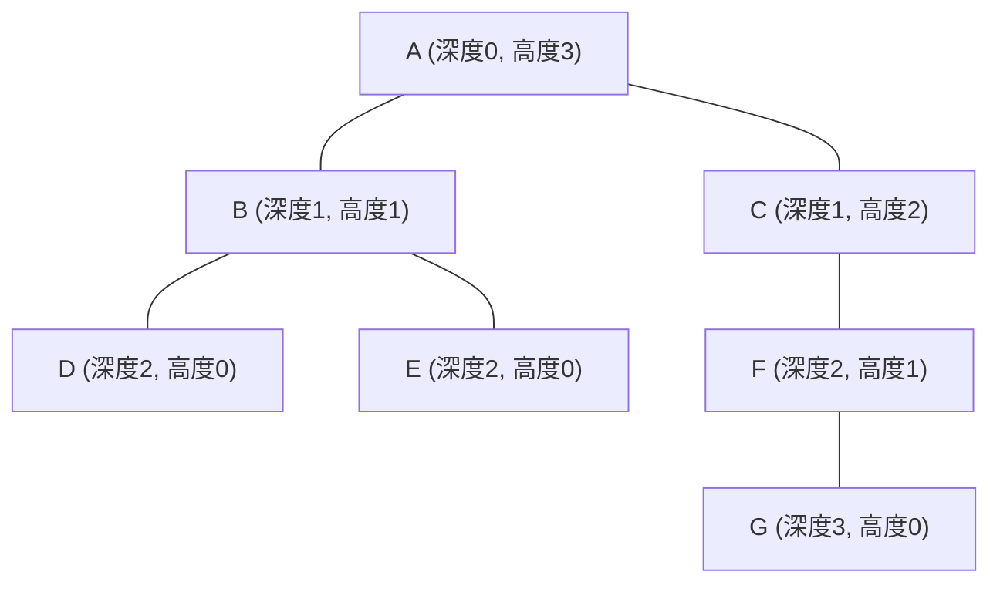
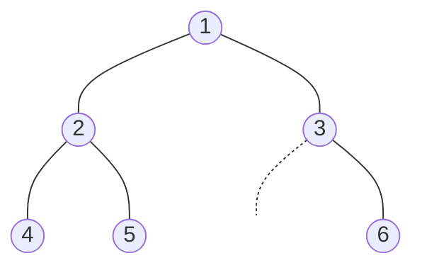
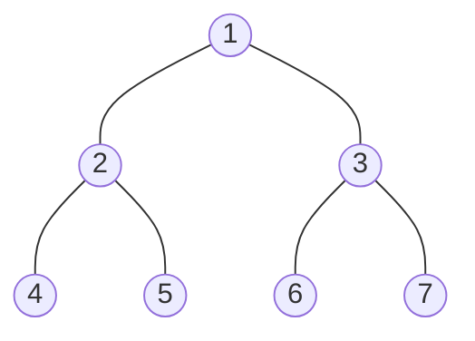
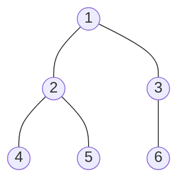
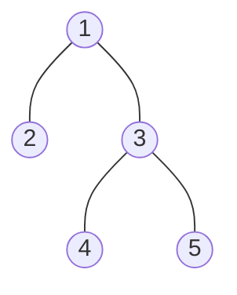
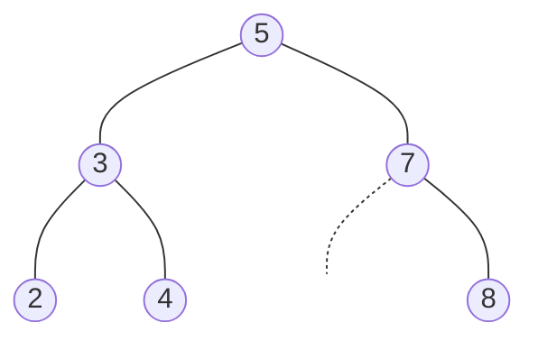
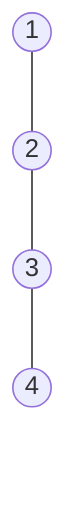

# 数据结构——二叉树（Binary Tree）深度学习笔记

---

## 1 树与二叉树基础与核心概念

### 1.1 树与二叉树的常见术语

#### 基本术语一览

| 术语 | 英文 | 含义 |
|------|------|------|
| 节点 (Node) | Node | 树的基本单元，存储数据与指向子节点的引用 |
| 根节点 | Root | 树最顶端、没有父节点的唯一节点 |
| 叶子节点 | Leaf | 没有任何子节点的节点（度为 0） |
| 父节点 | Parent | 直接连接在某节点上方的节点 |
| 子节点 | Child | 直接连接在某节点下方的节点 |
| 兄弟节点 | Sibling | 拥有同一个父节点的节点 |
| 边 (Edge) | Edge | 连接父子节点的链接，一棵有 \(n\) 个节点的树恰好有 \(n-1\) 条边 |
| 度 (Degree) | Degree | 一个节点拥有的子节点数量；二叉树中每个节点的度 ≤ 2 |
| 子树 | Subtree | 以某节点为根的、包含其所有后代的子结构 |

#### 深度（Depth）、高度（Height）与层（Level）

这三个概念极易混淆，下面用一棵树来精确区分：



| 概念 | 定义 | 方向 | 起始值 |
|------|------|------|--------|
| **深度 (Depth)** | 从**根节点**到该节点的路径上的**边数** | 自顶向下 ↓ | 根节点深度 = 0 |
| **高度 (Height)** | 从该节点到其**最远叶子节点**的路径上的**边数** | 自底向上 ↑ | 叶子节点高度 = 0 |
| **层 (Level)** | 通常定义为 `深度 + 1`（也有教材直接等同于深度，需注意上下文） | 自顶向下 ↓ | 根节点位于第 1 层 |

> **记忆口诀**：深度像**潜水**——从水面（根）往下数；高度像**量身高**——从脚底（叶）往上量

**树的高度** = 根节点的高度 = 树中所有节点深度的最大值。上图中树的高度为 3

---

### 1.2 二叉树的节点定义与基本操作

#### TreeNode 定义

```python
from __future__ import annotations  # 允许类型注解中直接使用 'TreeNode'
from typing import Optional


class TreeNode:
    """二叉树节点定义。

    Attributes:
        val:   节点存储的值。
        left:  左子节点引用，无子节点时为 None。
        right: 右子节点引用，无子节点时为 None。
    """

    def __init__(
        self,
        val: int = 0,
        left: Optional[TreeNode] = None,
        right: Optional[TreeNode] = None,
    ) -> None:
        self.val: int = val
        self.left: Optional[TreeNode] = left
        self.right: Optional[TreeNode] = right

    def __repr__(self) -> str:
        return f"TreeNode({self.val})"
```

#### 手动构建示例二叉树

后续所有遍历代码均以此树为例：



```python
# ---------- 构建示例树 ----------
#        1
#       / \
#      2   3
#     / \   \
#    4   5   6

n4 = TreeNode(4)
n5 = TreeNode(5)
n6 = TreeNode(6)
n2 = TreeNode(2, left=n4, right=n5)
n3 = TreeNode(3, left=None, right=n6)
root = TreeNode(1, left=n2, right=n3)
```

#### 插入与删除简述

在**普通二叉树**中，插入和删除操作没有统一的规则，可以把新节点插到任何空位，也可以删除任何节点后把子树重新挂接，这种模糊性使得普通二叉树很少单独使用

真正有实用价值的插入/删除规则出现在**二叉搜索树（BST）**中：

- **插入**：从根开始比较，小于当前节点走左子树，大于走右子树，直到找到空位插入。保证树仍满足 BST 性质
- **删除**：需要分三种情况讨论——删除叶子节点、删除只有一个子节点的节点、删除有两个子节点的节点（用中序后继或前驱替代）

> BST 的详细实现将在后续章节中展开，此处仅做概念引入

---

### 1.3 常见二叉树类型

#### 完美二叉树（Perfect Binary Tree）

所有叶子节点都在同一层，且每个非叶节点都恰好有两个子节点。一棵高度为 \($h$\) 的完美二叉树恰好有 \($2^{h+1} - 1$\) 个节点



#### 完全二叉树（Complete Binary Tree）

除了最后一层外，每一层都被完全填满；==最后一层的节点**从左到右连续排列**，中间不能有空缺==



**为什么完全二叉树适合用数组存储？**

由于节点从上到下、从左到右连续编号，我们可以把节点按层序存入数组 `arr`，对于下标为 `i` 的节点：

- 左子节点下标：\(2i + 1\)
- 右子节点下标：\(2i + 2\)
- 父节点下标：\($\lfloor (i - 1) / 2 \rfloor$\)

数组中不会出现空洞，空间利用率达到 100%。**堆（Heap）**就是基于完全二叉树的数组实现

#### 完满/严格二叉树（Full / Strict Binary Tree）

每个节点要么有 **0 个**子节点（叶子），要么有**恰好 2 个**子节点。允许各叶子不在同一层



#### 平衡二叉树（Balanced Binary Tree）

任意节点的左右子树高度差不超过 1。典型代表：AVL 树、红黑树。平衡性保证了查找、插入、删除操作的时间复杂度稳定在 \($O(\log N)$\)



> 📌 **关键区分**：完美 ⊂ 完全，完美 ⊂ 完满。完全二叉树不一定是完满的（最后一层的节点可以只有一个子节点）；完满二叉树不一定是完全的（叶子可以不在同一层或不连续靠左）

---

### 1.4 二叉树的退化

当二叉树中每个节点都只有一个子节点时，树的形状退化为**链表**：



**退化的危害**：树的核心优势在于其分支结构能将搜索空间对半缩减，使操作达到 \($O(\log N)$\)。一旦退化为链表，高度从 \($\log N$\) 变为 \($N$\)，所有依赖高度的操作（查找、插入、删除）的时间复杂度全部恶化为 \($O(N)$\)，树彻底丧失了其相对于链表的性能优势

这正是 AVL 树和红黑树等自平衡 BST 被发明的根本原因——它们通过旋转操作阻止退化的发生

> 📌 **关键要点回顾——第1 节**
> 1. 深度从根向下数，高度从叶向上量，两者方向相反
> 2. `TreeNode` 是二叉树的基本构件，持有值与左右子指针
> 3. 完美 vs 完全 vs 完满 vs 平衡——四种类型各有严格定义，切忌混淆
> 4. 完全二叉树可用数组无空洞存储，堆就是这样实现的
> 5. 退化使 \($O(\log N)$\) 恶化为 \($O(N)$\)，自平衡树是解药

---

## 2 二叉树的遍历算法

遍历是二叉树一切操作的基础。遍历方式按搜索方向分为两大类：

| 类别 | 方式 | 借助的数据结构 |
|------|------|----------------|
| 广度优先搜索 (BFS) | 层序遍历 | **队列** (Queue) |
| 深度优先搜索 (DFS) | 前序 / 中序 / 后序遍历 | **栈** (Stack)（递归隐式使用调用栈，迭代显式使用栈） |

---

### 2.1 广度优先：层序遍历（Level-order Traversal）

#### 核心思想

层序遍历像从树顶往下**逐层扫描**，同一层的节点按从左到右的顺序访问。这天然需要一个**先进先出（FIFO）**的队列来维护"待访问节点"的顺序：

1. 将根节点入队
2. 循环：取出队首节点 → 访问 → 将其非空左右子节点依次入队
3. 队列为空时遍历结束

#### 基础版代码（返回一维列表）

```python
from collections import deque
from typing import Optional, List


def level_order_flat(root: Optional[TreeNode]) -> List[int]:
    """层序遍历（基础版），返回一维列表。

    Args:
        root: 二叉树根节点，可能为 None（空树）。

    Returns:
        按层序排列的节点值列表。空树返回 []。

    Time:  O(N)  —— 每个节点恰好入队/出队一次。
    Space: O(N)  —— 队列最大长度为树最宽的一层的节点数，最坏 ≈ N/2。
    
    popleft() 负责 从队列前面拿出当前要处理的节点

	两个 if 负责 把这个节点的下一层孩子追加到队列后面

	因为是 先加左孩子，再加右孩子，再加上队列是 先进先出，所以同一层访问顺序就是 从左到右
    """
    if not root:                     # 空树拦截
        return []

    result: List[int] = []
    queue: deque[TreeNode] = deque([root])  # 为什么不能直接写 deque(root),因为 root 是一个 TreeNode 对象，不是可迭代对象,放进list里，就成了可迭代对象

    while queue:
        node = queue.popleft()       # 取出队首
        result.append(node.val)      # 访问
        if node.left:
            queue.append(node.left)  # 左子节点入队
        if node.right:
            queue.append(node.right) # 右子节点入队

    return result
```

对示例树调用：`level_order_flat(root)` → `[1, 2, 3, 4, 5, 6]`

#### 进阶版代码（分层输出 `List[List[int]]`）

面试中更常见的变体是要求**分层返回**，关键技巧是在每轮循环开始时记录当前队列长度 `size`，`size` 就是当前层的节点数，内层循环恰好处理 `size` 个节点。

```python
def level_order(root: Optional[TreeNode]) -> List[List[int]]:
    """层序遍历（分层版），返回二维列表，每个子列表是一层的节点值。

    Args:
        root: 二叉树根节点。

    Returns:
        分层的节点值列表。例如 [[1], [2, 3], [4, 5, 6]]。

    Time:  O(N)
    Space: O(N)
    """
    if not root:
        return []

    result: List[List[int]] = []
    queue: deque[TreeNode] = deque([root])

    while queue:
        level_size = len(queue)          # 当前层的节点数
        current_level: List[int] = []

        for _ in range(level_size):      # 只处理当前层
            node = queue.popleft()
            current_level.append(node.val)
            if node.left:
                queue.append(node.left)
            if node.right:
                queue.append(node.right)

        result.append(current_level)

    return result
```

对示例树调用：`level_order(root)` → `[[1], [2, 3], [4, 5, 6]]`

#### 时空复杂度

- **时间 \(O(N)\)**：每个节点被访问恰好一次
- **空间 \(O(N)\)**：队列存储量取决于最宽层的节点数。对完美二叉树，最底层有 \($\lceil N/2 \rceil$\) 个节点

> 📌 **关键要点回顾——2.1**
>
> 1. 层序遍历 = BFS，核心数据结构是**队列**
> 2. 分层输出的技巧：每轮循环开始时用 `len(queue)` 锁定当前层大小
> 3. 时空复杂度均为 \($O(N)$\)

---

### 2.2 深度优先：前序、中序、后序遍历

深度优先搜索（DFS）沿着一条路径尽可能深入，到达叶子后再回溯。根据**根节点的访问时机**，分为三种：

| 遍历方式 | 访问顺序 | 示例树结果 |
|----------|----------|------------|
| 前序 (Preorder) | **根** → 左 → 右 | `[1, 2, 4, 5, 3, 6]` |
| 中序 (Inorder)  | 左 → **根** → 右 | `[4, 2, 5, 1, 3, 6]` |
| 后序 (Postorder) | 左 → 右 → **根** | `[4, 5, 2, 6, 3, 1]` |

> **助记**：前/中/后指的是**根节点**在遍历序列中的位置——最前、中间、最后

---

#### 1. 前序遍历（Preorder：根 → 左 → 右）

##### 递归法

递归的思路最直接：先访问根，再递归遍历左子树，最后递归遍历右子树

```python
def preorder_recursive(root: Optional[TreeNode]) -> List[int]:
    """前序遍历——递归实现。

    Args:
        root: 二叉树根节点。

    Returns:
        前序遍历结果列表。

    Time:  O(N)  —— 每个节点访问一次。
    Space: O(H)  —— H 为树高，递归调用栈深度；最坏 O(N)（退化链表），最优 O(log N)（平衡树）。
    """
    result: List[int] = []

    def dfs(node: Optional[TreeNode]) -> None:
        if not node:            # 递归终止条件
            return
        result.append(node.val) # 1. 访问根
        dfs(node.left)          # 2. 遍历左子树
        dfs(node.right)         # 3. 遍历右子树

    dfs(root)
    return result
```

##### 迭代法（显式栈）

递归本质上依赖系统调用栈来保存"待回溯"的状态。迭代法就是我们自己维护一个显式栈来模拟这个过程

**关键理解**：栈是**后进先出（LIFO）**的。我们希望先处理左子树、后处理右子树，那么入栈时必须**先压右、再压左**，这样左子节点会位于栈顶，被优先弹出处理

```python
def preorder_iterative(root: Optional[TreeNode]) -> List[int]:
    """前序遍历——迭代实现（显式栈）。

    算法流程：
        1. 根节点入栈。
        2. 弹出栈顶 → 访问 → 先压右子、再压左子。
        3. 重复直到栈空。

    Args:
        root: 二叉树根节点。

    Returns:
        前序遍历结果列表。

    Time:  O(N)
    Space: O(H)  —— 栈的最大深度等于树高。
    """
    if not root:
        return []

    result: List[int] = []
    stack: List[TreeNode] = [root]

    while stack:
        node = stack.pop()          # 弹出栈顶
        result.append(node.val)     # 访问（根）

        # 先压右，再压左 → 保证左子节点先被弹出
        if node.right:
            stack.append(node.right)
        if node.left:
            stack.append(node.left)

    return result
```

**在示例树上的执行过程**：

| 步骤 | 弹出 | 访问 | 栈状态（顶→底） | result |
|------|------|------|-----------------|--------|
| 初始 | — | — | `[1]` | `[]` |
| 1 | 1 | 1 | `[2, 3]` | `[1]` |
| 2 | 2 | 2 | `[4, 5, 3]` | `[1,2]` |
| 3 | 4 | 4 | `[5, 3]` | `[1,2,4]` |
| 4 | 5 | 5 | `[3]` | `[1,2,4,5]` |
| 5 | 3 | 3 | `[6]` | `[1,2,4,5,3]` |
| 6 | 6 | 6 | `[]` | `[1,2,4,5,3,6]` |

---

#### 2. 中序遍历（Inorder：左 → 根 → 右）

##### 递归法

```python
def inorder_recursive(root: Optional[TreeNode]) -> List[int]:
    """中序遍历——递归实现。

    Args:
        root: 二叉树根节点。

    Returns:
        中序遍历结果列表。

    Time:  O(N)
    Space: O(H)
    """
    result: List[int] = []

    def dfs(node: Optional[TreeNode]) -> None:
        if not node:
            return
        dfs(node.left)          # 1. 遍历左子树
        result.append(node.val) # 2. 访问根
        dfs(node.right)         # 3. 遍历右子树

    dfs(root)
    return result
```

##### 迭代法（显式栈 + 指针）

中序遍历的迭代法是**高频面试题**，它的逻辑不像前序那样简单地"弹出就访问"，因为必须先走到最左端才能开始访问

**核心逻辑——"左臂下探"模式**：

1. 维护一个指针 `curr`，从根出发，不断沿左子节点深入，沿途将经过的节点全部压栈（它们还不能被访问，因为它们的左子树还没处理）
2. 当 `curr` 为 `None` 时，说明左子树已经到底了。此时弹出栈顶——这就是当前应该访问的"根"
3. 访问后，将 `curr` 转向弹出节点的右子树，重复整个过程

```python
def inorder_iterative(root: Optional[TreeNode]) -> List[int]:
    """中序遍历——迭代实现（栈 + 指针）。

    算法：
        - curr 指针不断向左深入，沿途节点入栈；
        - curr 为 None 时弹栈访问，并转向右子树。

    Args:
        root: 二叉树根节点。

    Returns:
        中序遍历结果列表。

    Time:  O(N)
    Space: O(H)
    """
    result: List[int] = []
    stack: List[TreeNode] = []
    curr: Optional[TreeNode] = root

    while curr or stack:
        # —— 阶段 1：沿左臂不断下探，沿途压栈 ——
        while curr:
            stack.append(curr)
            curr = curr.left

        # —— 阶段 2：弹栈访问，转向右子树 ——
        curr = stack.pop()
        result.append(curr.val)  # 访问当前节点（其左子树已全部处理完毕）
        curr = curr.right        # 转向右子树（下一轮循环会继续左臂下探）

    return result
```

**在示例树上的执行过程**：

| 步骤 | 操作 | curr | 栈（顶→底） | result |
|------|------|------|-------------|--------|
| 初始 | — | 1 | `[]` | `[]` |
| 左探 | push 1, 2, 4 | None | `[4, 2, 1]` | `[]` |
| 弹栈 | pop 4, 访问, curr→None | None | `[2, 1]` | `[4]` |
| 弹栈 | pop 2, 访问, curr→5 | 5 | `[1]` | `[4,2]` |
| 左探 | push 5 | None | `[5, 1]` | `[4,2]` |
| 弹栈 | pop 5, 访问, curr→None | None | `[1]` | `[4,2,5]` |
| 弹栈 | pop 1, 访问, curr→3 | 3 | `[]` | `[4,2,5,1]` |
| 左探 | push 3, curr→None | None | `[3]` | `[4,2,5,1]` |
| 弹栈 | pop 3, 访问, curr→6 | 6 | `[]` | `[4,2,5,1,3]` |
| 左探 | push 6 | None | `[6]` | `[4,2,5,1,3]` |
| 弹栈 | pop 6, 访问, curr→None | None | `[]` | `[4,2,5,1,3,6]` |

---

#### 3. 后序遍历（Postorder：左 → 右 → 根）

##### 递归法

```python
def postorder_recursive(root: Optional[TreeNode]) -> List[int]:
    """后序遍历——递归实现。

    Args:
        root: 二叉树根节点。

    Returns:
        后序遍历结果列表。

    Time:  O(N)
    Space: O(H)
    """
    result: List[int] = []

    def dfs(node: Optional[TreeNode]) -> None:
        if not node:
            return
        dfs(node.left)          # 1. 遍历左子树
        dfs(node.right)         # 2. 遍历右子树
        result.append(node.val) # 3. 访问根

    dfs(root)
    return result
```

##### 迭代法（巧妙解法：变种前序 + 逆序）

后序遍历的迭代法是三种遍历中**最难**的。这里介绍一种非常巧妙的解法：

**思路推导**：
$$
\text{后序} = \text{左} \to \text{右} \to \text{根}
$$
如果我们把前序遍历（根→左→右）中左右子树的入栈顺序对调，就得到一个"根→右→左"的序列。然后将这个序列**整体反转**，就得到了"左→右→根"——正是后序！
$$
\text{前序变种：根} \to \text{右} \to \text{左} \xrightarrow{\text{反转}} \text{左} \to \text{右} \to \text{根} = \text{后序}
$$

```python
def postorder_iterative(root: Optional[TreeNode]) -> List[int]:
    """后序遍历——迭代实现（变种前序 + 反转）。

    算法：
        1. 模仿前序遍历，但改为"先压左、再压右"（使右子先弹出），
           得到 根→右→左 的序列。
        2. 将结果反转，得到 左→右→根（后序）。

    Args:
        root: 二叉树根节点。

    Returns:
        后序遍历结果列表。

    Time:  O(N)
    Space: O(H)  —— 栈深度 + 结果列表（结果列表不算额外空间，则为 O(H)）。
    """
    if not root:
        return []

    result: List[int] = []
    stack: List[TreeNode] = [root]

    while stack:
        node = stack.pop()
        result.append(node.val)     # 访问（根）

        # 注意：与前序相反！先压左、再压右 → 右子先弹出
        # 这样得到的顺序是 根→右→左
        if node.left:
            stack.append(node.left)
        if node.right:
            stack.append(node.right)

    result.reverse()                # 反转：根→右→左  变为  左→右→根
    return result
```

##### 迭代法（通用标准解法：prev 指针）

上面的"反转法"虽然巧妙，但修改了结果数组。下面给出更通用的 `prev` 指针方法，它**真正模拟了后序遍历的回溯过程**：

核心难点在于：弹出栈顶节点后，如果它有右子树且右子树尚未被访问，我们不能立即访问它——必须先处理右子树。用 `prev` 记录上一个访问过的节点，就能判断右子树是否已经处理完毕。

```python
def postorder_iterative_v2(root: Optional[TreeNode]) -> List[int]:
    """后序遍历——迭代实现（prev 指针标准解法）。

    算法：
        - 与中序类似，先沿左臂压栈。
        - 查看栈顶：若其右子树为空或已被访问（== prev），则弹出并访问；
          否则转向右子树继续压栈。

    Args:
        root: 二叉树根节点。

    Returns:
        后序遍历结果列表。

    Time:  O(N)
    Space: O(H)
    """
    if not root:
        return []

    result: List[int] = []
    stack: List[TreeNode] = []
    curr: Optional[TreeNode] = root
    prev: Optional[TreeNode] = None   # 记录上一个被访问的节点

    while curr or stack:
        # 阶段 1：沿左臂下探
        while curr:
            stack.append(curr)
            curr = curr.left

        # 阶段 2：查看栈顶
        curr = stack[-1]              # peek，不急着弹出

        # 如果右子树为空，或右子树已经访问过 → 可以安全访问当前节点
        if not curr.right or curr.right is prev:
            stack.pop()
            result.append(curr.val)
            prev = curr               # 标记当前节点为"已访问"
            curr = None               # 重要！设为 None，避免重复左探
        else:
            # 右子树存在且未访问 → 转向右子树
            curr = curr.right

    return result
```

---

#### 4. 复杂度与对比

##### 时间复杂度

无论递归还是迭代，三种遍历的时间复杂度都是 **\(O(N)\)**——每个节点被访问恰好一次

##### 空间复杂度

| 方法 | 空间复杂度 | 具体来源 |
|------|-----------|---------|
| 递归 | $O(H)$ | **系统调用栈**。每次递归调用会在调用栈上压入一个栈帧（包含局部变量、返回地址等），最大深度 = 树高 \(H\) |
| 迭代 | $O(H)$ | **显式栈**。栈中最多同时存放 \(H\) 个节点 |

两者的渐进复杂度相同，但**实际开销有差异**：

- **递归的隐性成本**：系统调用栈的每个栈帧包含函数参数、局部变量、返回地址等元数据，远比只存一个节点引用的显式栈帧更"重"。此外，大量递归调用还涉及函数调用的固定开销（压参、跳转、弹栈等 CPU 指令）
- **栈溢出风险**：Python 默认递归深度限制为 1000（`sys.getrecursionlimit()`）。当树高度超过此限制（如退化链表有上万节点），递归法会直接抛出 `RecursionError`，而迭代法只受堆内存限制，安全得多
- **结论**：对于浅树（平衡树），两者性能差异可忽略；对于深树或节点极多的场景，**迭代法更加稳健和高效**

##### 完整对比表

| 遍历方式 | 访问顺序 | 递归难度 | 迭代难度 | 典型应用 |
|----------|----------|---------|---------|---------|
| 前序 | 根→左→右 | ★☆☆ | ★☆☆ | 序列化/复制树结构 |
| 中序 | 左→根→右 | ★☆☆ | ★★☆ | BST 中获取有序序列 |
| 后序 | 左→右→根 | ★☆☆ | ★★★ | 释放/删除树、计算子树属性 |
| 层序 | 逐层从左到右 | — | ★☆☆ | 求树的宽度、最短路径 |

> 📌 **关键要点回顾——2.2**
> 1. 前/中/后序的"前中后"指的是**根的访问时机**
> 2. 递归法结构统一，仅 `result.append` 所在位置不同
> 3. 前序迭代：直接弹出访问，**先压右再压左**
> 4. 中序迭代：**"左臂下探 + 弹栈访问 + 转右"**经典三步模式
> 5. 后序迭代：推荐"变种前序(根右左) → 反转"的巧妙解法；通用解法使用 `prev` 指针判断右子树是否已处理
> 6. 递归与迭代渐进复杂度相同，但迭代法在深树场景下更安全、更高效
