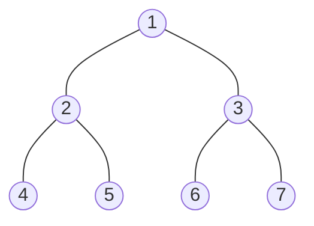
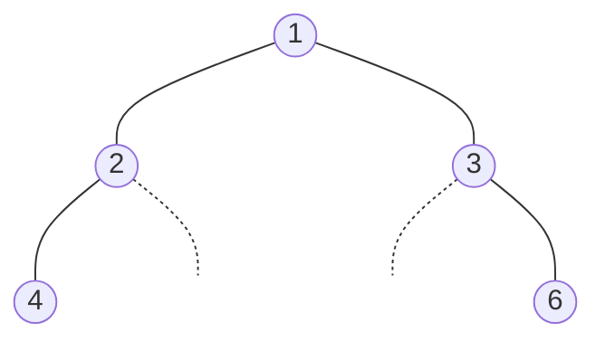
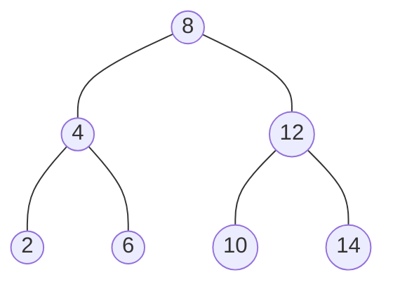
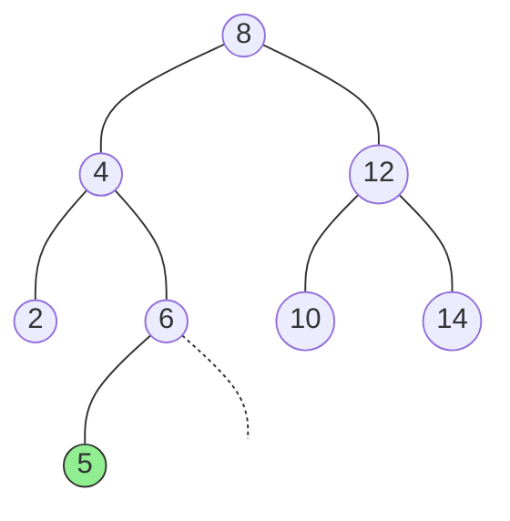
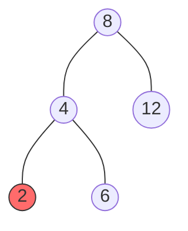
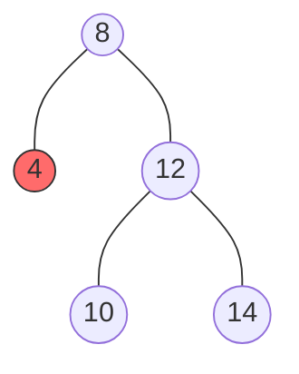
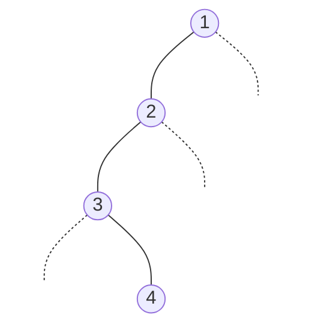

# 数据结构——二叉树的数组表示与二叉搜索树（BST）深度学习笔记

---

## 7.3 二叉树的数组表示

树形结构最常见的存储方式是链式存储（每个节点持有左右子指针），但在特定场景下，**用数组（顺序存储）来表示二叉树**具有独特优势。本节将系统讲解其原理、公式推导与适用边界

### 7.3.1 表示完美二叉树

#### 核心思想

将二叉树的节点按**层序遍历**的顺序，逐一映射到数组的连续下标中。对于一棵完美二叉树，这种映射是**无空洞的**——数组中的每一个位置都被有效节点占据

以如下完美二叉树为例：



映射到数组后：

```css
索引:  0   1   2   3   4   5   6
值:  [ 1 | 2 | 3 | 4 | 5 | 6 | 7 ]
```

#### 索引映射公式

设某节点在数组中的下标为 $i$（从 0 开始计数）：

| 关系 | 公式 | 约束 |
|------|------|------|
| **左子节点** | $2i + 1$ | 结果 < 数组长度时有效 |
| **右子节点** | $2i + 2$ | 结果 < 数组长度时有效 |
| **父节点** | $\lfloor (i - 1) / 2 \rfloor$ | $i > 0$ 时有效 |

**直觉理解**：每一层的节点数恰好是上一层的两倍。下标为 $i$ 的节点之前共有 $i$ 个节点，其左子节点前面还要加上这 $i$ 个节点的另一个子节点，因此偏移量恰好为 $i + 1$，即 $2i + 1$

**验证**：节点 `2`（下标 1）的左子节点下标 = $2 \times 1 + 1 = 3$（即节点 `4`），右子节点下标 = $2 \times 1 + 2 = 4$（即节点 `5`）。节点 `5`（下标 4）的父节点下标 = $\lfloor(4-1)/2\rfloor = 1$（即节点 `2`）。全部正确

---

### 7.3.2 表示任意二叉树

当二叉树不完美时，层序序列中会出现"空缺"。为了维持索引公式的正确性，必须用 `None` 来**占位**

以如下二叉树为例：



映射到数组：

```
索引:  0     1     2     3      4      5     6
值:  [ 1  |  2  |  3  |  4  | None | None |  6 ]
```

节点 `2` 没有右子节点，下标 4 处填 `None`；节点 `3` 没有左子节点，下标 5 处填 `None`。**只有这样，索引公式才能继续适用**——例如节点 `3`（下标 2）的右子节点下标 = $2 \times 2 + 2 = 6$，正确指向节点 `6`

#### Python 实现

```python
from __future__ import annotations
from typing import Optional, List


class TreeNode:
    """二叉树节点（沿用前章定义）。"""

    def __init__(
        self,
        val: int = 0,
        left: Optional[TreeNode] = None,
        right: Optional[TreeNode] = None,
    ) -> None:
        self.val: int = val
        self.left: Optional[TreeNode] = left
        self.right: Optional[TreeNode] = right


class ArrayBinaryTree:
    """基于数组表示的二叉树。

    内部使用一个列表 `_tree` 按层序存储节点值，
    空位以 None 填充。提供通过索引访问父/子节点的方法。

    Attributes:
        _tree: 层序存储的节点值列表，None 表示空节点。
    """

    def __init__(self, root: Optional[TreeNode]) -> None:
        """从链式二叉树构建数组表示。

        通过层序遍历将链式结构转为数组。

        Args:
            root: 链式二叉树的根节点，可为 None。

        Time:  O(N)  —— N 为数组最终长度（含 None 占位）。
        Space: O(N)
        """
        self._tree: List[Optional[int]] = []
        if not root:
            return

        from collections import deque
        # 层序遍历，空子节点也入队（占位）
        queue: deque[Optional[TreeNode]] = deque([root])

        while queue:
            node = queue.popleft()
            if node:
                self._tree.append(node.val)
                queue.append(node.left)   # 可能为 None
                queue.append(node.right)
            else:
                self._tree.append(None)

        # 去除末尾多余的 None（不影响正确性，仅节省空间）
        while self._tree and self._tree[-1] is None:
            self._tree.pop()

    def size(self) -> int:
        """返回数组长度。"""
        return len(self._tree)

    def val(self, i: int) -> Optional[int]:
        """获取下标 i 处的节点值。越界或空位返回 None。

        Args:
            i: 数组下标。

        Returns:
            节点值或 None。
        """
        if i < 0 or i >= self.size():
            return None
        return self._tree[i]

    def left(self, i: int) -> Optional[int]:
        """获取下标 i 节点的左子节点值。

        公式: left_index = 2 * i + 1
        """
        return self.val(2 * i + 1)

    def right(self, i: int) -> Optional[int]:
        """获取下标 i 节点的右子节点值。

        公式: right_index = 2 * i + 2
        """
        return self.val(2 * i + 2)

    def parent(self, i: int) -> Optional[int]:
        """获取下标 i 节点的父节点值。

        公式: parent_index = (i - 1) // 2
        """
        if i <= 0:
            return None
        return self.val((i - 1) // 2)

    def level_order(self) -> List[int]:
        """层序遍历，返回所有非 None 节点值。

        Time:  O(N)
        Space: O(1)（不计返回值）
        """
        return [v for v in self._tree if v is not None]

    def __repr__(self) -> str:
        return f"ArrayBinaryTree({self._tree})"
```

---

### 7.3.3 优点与局限性

#### 优点

1. **极致的缓存局部性（Cache Locality）**：数组在内存中是连续存储的。当 CPU 访问某个节点时，其相邻节点大概率已在同一条缓存行（Cache Line，通常 64 字节）中被预取。对于层序遍历、堆操作等按索引顺序访问的场景，这带来的加速效果非常显著——相比链式存储中频繁的指针跳转（pointer chasing）导致的缓存未命中（cache miss），数组表示可快数倍。

2. **零指针开销**：链式存储中每个节点需额外存储两个指针（64 位系统上各 8 字节），而数组表示通过索引公式隐式编码父子关系，**无需任何额外空间存储拓扑信息**。

3. **随机访问**：通过公式 $O(1)$ 定位任意节点的父/子节点，无需从根遍历。

#### 局限性

1. **稀疏树的空间浪费**：一棵高度为 $h$ 的二叉树，数组最坏需要 $2^{h+1} - 1$ 个位置。若树严重不平衡（如退化为链表），$h = N - 1$，数组大小达 $O(2^N)$——指数级浪费。例如一棵仅有 10 个节点的右斜链表，需要长度为 1023 的数组。

2. **插入/删除代价高**：数组中间插入或删除元素需要大量移位操作来维持索引关系，时间复杂度 $O(N)$，远不如链式存储的 $O(1)$ 指针修改。

3. **动态扩容**：数组容量固定，树的增长可能触发扩容与数据拷贝。

#### 结论

| 场景 | 推荐表示 |
|------|---------|
| 完全/完美二叉树（如**堆**） | **数组** —— 无空洞、缓存友好、实现简单 |
| 形状不确定的一般二叉树 | **链式** —— 灵活、无空间浪费 |
| 频繁插入删除 | **链式** |
| 静态结构 + 高频随机访问 | **数组** |

> 📌 **关键要点回顾——7.3 节**
> 1. 数组表示的核心公式：左子 $2i+1$，右子 $2i+2$，父 $\lfloor(i-1)/2\rfloor$。
> 2. 非完全二叉树需用 `None` 占位以维持公式正确性。
> 3. 数组表示的王牌优势是缓存局部性；致命弱点是稀疏树的指数级空间浪费。
> 4. **堆（Heap）是数组表示二叉树最经典的工程应用。**

---

## 7.4 二叉搜索树（Binary Search Tree, BST）

### 7.4.0 定义与核心性质

**二叉搜索树**是一棵满足以下性质的二叉树——对于**任意**节点 `node`：

1. `node` 的**左子树**中所有节点的值 $<$ `node.val`
2. `node` 的**右子树**中所有节点的值 $>$ `node.val`
3. 左右子树**各自**也是二叉搜索树



> 上图是一棵合法的 BST：以节点 8 为例，其左子树中所有值 {2, 4, 6} 均 < 8，右子树中所有值 {10, 12, 14} 均 > 8。

**注意**：本笔记假设 BST 中**不包含重复值**。处理重复值的策略（放入左子树、放入右子树、或在节点内维护计数器）因实现而异。

---

### 7.4.1 二叉搜索树的操作

以下给出完整的 `BinarySearchTree` 类实现。

```python
from __future__ import annotations
from typing import Optional, List


class TreeNode:
    """BST 节点定义。"""

    def __init__(
        self,
        val: int = 0,
        left: Optional[TreeNode] = None,
        right: Optional[TreeNode] = None,
    ) -> None:
        self.val: int = val
        self.left: Optional[TreeNode] = left
        self.right: Optional[TreeNode] = right

    def __repr__(self) -> str:
        return f"TreeNode({self.val})"
```

#### 1. 查找节点

BST 的查找过程本质上是一次**二分搜索**：每次比较后，搜索范围缩小一半（理想情况下）。

**递归思路**：
- 当前节点为空 → 未找到。
- 目标值 == 当前值 → 找到。
- 目标值 < 当前值 → 去左子树找。
- 目标值 > 当前值 → 去右子树找。

**迭代思路**完全等价，只是用 `while` 循环替代递归调用，避免调用栈开销。

```python
def search_recursive(self, root: Optional[TreeNode], target: int) -> Optional[TreeNode]:
    """在 BST 中查找值为 target 的节点——递归实现。

    Args:
        root: 当前子树的根节点。
        target: 待查找的值。

    Returns:
        找到则返回对应节点，否则返回 None。

    Time:  O(H)，H 为树高。平衡时 O(log N)，退化时 O(N)。
    Space: O(H)，递归调用栈。
    """
    if not root:
        return None
    if target == root.val:
        return root
    elif target < root.val:
        return self.search_recursive(root.left, target)
    else:
        return self.search_recursive(root.right, target)


def search_iterative(self, root: Optional[TreeNode], target: int) -> Optional[TreeNode]:
    """在 BST 中查找值为 target 的节点——迭代实现。

    Time:  O(H)
    Space: O(1)  —— 无额外空间开销，优于递归。
    """
    curr: Optional[TreeNode] = root
    while curr:
        if target == curr.val:
            return curr
        elif target < curr.val:
            curr = curr.left        # 目标更小，向左走
        else:
            curr = curr.right       # 目标更大，向右走
    return None                     # 遍历完毕，未找到
```

> 迭代法空间 $O(1)$，递归法空间 $O(H)$。在生产环境中**优先选择迭代法**。

---

#### 2. 插入节点

插入操作的目标：将新值放到正确位置，使 BST 性质不被破坏。

**核心逻辑**：从根出发，按查找逻辑走到一个空位（`None`），在此处创建新节点。需要记录"父节点"以便挂接。

```python
def insert(self, root: Optional[TreeNode], val: int) -> TreeNode:
    """向 BST 中插入值为 val 的新节点。

    若 val 已存在，不做任何操作（本实现不允许重复值）。

    Args:
        root: BST 根节点。
        val:  待插入的值。

    Returns:
        插入后的 BST 根节点（若原树为空，返回新创建的根）。

    Time:  O(H)
    Space: O(1)
    """
    new_node = TreeNode(val)

    # 空树：新节点即为根
    if not root:
        return new_node

    curr: Optional[TreeNode] = root
    parent: Optional[TreeNode] = None

    while curr:
        if val == curr.val:
            return root             # 值已存在，直接返回
        parent = curr
        if val < curr.val:
            curr = curr.left
        else:
            curr = curr.right

    # curr 为 None，parent 指向待挂接的父节点
    if val < parent.val:            # type: ignore[union-attr]
        parent.left = new_node
    else:
        parent.right = new_node     # type: ignore[union-attr]

    return root
```

**插入示例**：在上面的 BST 中插入 `5`：



路径：$8 \to 4 \to 6 \to$ 左子为空 → 挂入。新节点总是成为叶子。

---

#### 3. 删除节点（核心重点）

删除是 BST 中最复杂的操作。根据待删除节点的子节点数量，必须分**三种情况**处理。

##### 情况一：删除叶子节点（度为 0）

叶子节点没有子节点，直接删除即可，不影响 BST 其余结构。



删除节点 `2`：直接令 `4.left = None`。

##### 情况二：删除只有一个子节点的节点（度为 1）

用其**唯一的子节点**替代被删除节点的位置。



若删除 `4`（假设它无子节点则为情况一，此处假设其有一个子节点 `2`），则令 `8.left = 4 的唯一子节点`。

##### 情况三：删除有两个子节点的节点（度为 2）——最复杂

不能简单地移除，否则两棵子树无处挂接。解法是找一个**替身**：

- 找到待删除节点的**右子树中的最小节点**（即右子树中最左的节点，也叫**中序后继**，in-order successor）。
- 将替身的值复制到待删除节点。
- 删除替身节点（替身最多只有一个右子节点，因此回归情况一或二）。

**为什么选右子树最小节点？** 因为它是所有大于待删除节点的值中**最小的那个**，用它替代后，BST 的左小右大性质仍然成立。等价地，也可以用左子树中的最大节点（中序前驱）替代。

**图解**：删除节点 `8`：

```
删除前:               找到右子树最小节点(10):        用10替换8，删除原10:
       8                     8                           10
      / \                   / \                          / \
     4   12                4   12                       4   12
    / \  / \              / \  / \                     / \    \
   2  6 10 14            2  6 10 14                   2  6    14
```

##### 完整代码实现

```python
def delete(self, root: Optional[TreeNode], val: int) -> Optional[TreeNode]:
    """从 BST 中删除值为 val 的节点。

    Args:
        root: BST 根节点。
        val:  待删除的值。

    Returns:
        删除后的 BST 根节点。若 val 不存在则树不变。

    Time:  O(H)
    Space: O(H)（递归调用栈；迭代版本可优化为 O(1)）
    """
    if not root:
        return None

    # ---- 递归定位待删除节点 ----
    if val < root.val:
        root.left = self.delete(root.left, val)
    elif val > root.val:
        root.right = self.delete(root.right, val)
    else:
        # ---- 找到目标节点，开始分情况删除 ----

        # 情况一 & 二：至多一个子节点
        # 如果左子为空，直接用右子（可能也为 None）替代
        if not root.left:
            return root.right
        # 如果右子为空，直接用左子替代
        if not root.right:
            return root.left

        # 情况三：有两个子节点
        # 步骤 1：找到右子树中的最小节点（中序后继）
        successor: TreeNode = root.right
        while successor.left:
            successor = successor.left

        # 步骤 2：用后继的值覆盖当前节点
        root.val = successor.val

        # 步骤 3：在右子树中递归删除后继节点
        #         后继节点最多只有右子节点，因此必然回归情况一/二
        root.right = self.delete(root.right, successor.val)

    return root
```

**关键细节**：递归删除后继时，后继一定是右子树最左节点（无左子节点），所以递归只会触发"情况一"或"情况二"，不会无限递归。

---

#### 4. 中序遍历有序

BST 最优美的性质之一：**中序遍历（左 → 根 → 右）的输出恰好是单调递增序列。**

**直觉证明**：中序遍历先访问左子树（所有值 < 根），再访问根，最后访问右子树（所有值 > 根）。递归地，左子树内部也是先小后大。因此整体输出严格递增。

```python
def inorder(self, root: Optional[TreeNode]) -> List[int]:
    """BST 的中序遍历——返回有序序列。

    Time:  O(N)
    Space: O(H)
    """
    result: List[int] = []

    def dfs(node: Optional[TreeNode]) -> None:
        if not node:
            return
        dfs(node.left)
        result.append(node.val)
        dfs(node.right)

    dfs(root)
    return result
```

对前述 BST 调用：`inorder(root)` → `[2, 4, 6, 8, 10, 12, 14]`

> 这一性质的工程应用：需要从 BST 中获取排序数据时，只需中序遍历即可，时间 $O(N)$，无需额外排序。

> 📌 **关键要点回顾——7.4.1**
> 1. 查找：本质是二分搜索，迭代法空间 $O(1)$，优于递归。
> 2. 插入：新节点**总是**成为叶子节点。
> 3. 删除三种情况：叶子直接删；单子直接替；双子用**中序后继**替换后递归删除后继。
> 4. 中序遍历天然有序，这是 BST 的核心特征。

---

### 7.4.2 二叉搜索树的效率

BST 上查找、插入、删除的时间复杂度都取决于**树的高度 $H$**。

| 树的形态 | 高度 $H$ | 操作复杂度 |
|----------|---------|-----------|
| **平衡**（如完美/近完美二叉树） | $O(\log N)$ | $O(\log N)$ |
| **退化**（链表） | $O(N)$ | $O(N)$ |

**最佳情况**：$N$ 个节点的平衡 BST 高度为 $\lfloor \log_2 N \rfloor$。每次比较排除约一半候选节点，与有序数组上的二分搜索等效。

**最坏情况**：若按单调递增（或递减）顺序依次插入 $1, 2, 3, \ldots, N$，BST 退化为一条向右延伸的链表，高度为 $N - 1$：



此时所有操作退化为链表的线性扫描，BST 的对数级优势荡然无存。

**平均情况**：随机插入 $N$ 个不同值时，BST 的期望高度为 $O(\log N)$（由随机二叉搜索树理论保证），但这依赖于输入的随机性，实际工程中无法保证。

---

### 7.4.3 二叉搜索树常见应用

#### 工程应用场景

1. **有序集合 / 有序映射**：许多语言标准库中的有序容器（如 C++ 的 `std::map`/`std::set`、Java 的 `TreeMap`/`TreeSet`）底层就是平衡 BST（通常为红黑树）。
2. **数据库索引**：数据库中的 B 树和 B+ 树是 BST 思想向多路搜索树的泛化，用于高效地在磁盘上组织和检索数据。
3. **优先级队列**：虽然堆更常见，但平衡 BST 也可实现优先级队列，且支持更丰富的操作（如删除任意元素、按范围查询）。
4. **区间查询与排名查询**：结合附加信息（如子树大小），BST 可高效回答"第 $k$ 小元素"、"小于 $x$ 的元素个数"等问题。

#### 从 BST 到自平衡树

朴素 BST 的致命缺陷在于其结构完全取决于插入顺序——坏运气就会导致退化。工程界的解法是引入**自平衡机制**：

| 自平衡 BST | 核心思想 | 平衡约束 |
|------------|---------|---------|
| **AVL 树** | 每次插入/删除后检查平衡因子，通过**旋转**恢复平衡 | 任意节点左右子树高度差 ≤ 1 |
| **红黑树** | 为节点着红/黑色，通过颜色规则与旋转维持**近似平衡** | 最长路径 ≤ 最短路径的 2 倍 |

两者都将最坏情况下的树高严格控制在 $O(\log N)$，从根本上消除了退化的可能性。AVL 树更严格地平衡（查找更快），红黑树的插入/删除操作旋转次数更少（修改更快）。现代工程中，**红黑树因其综合性能更优而被广泛采用**（Linux 内核、Java HashMap 链表退化后的替代结构、C++ STL 等）。

> 📌 **关键要点回顾——7.4.2 & 7.4.3**
> 1. BST 操作的时间复杂度 = $O(H)$；平衡时 $H = O(\log N)$，退化时 $H = O(N)$。
> 2. 顺序插入是 BST 退化的经典陷阱。
> 3. BST 在有序容器、数据库索引、排名查询中有广泛应用。
> 4. AVL 树和红黑树通过旋转机制，将最坏高度锁定在 $O(\log N)$，是 BST 的工程级进化。
