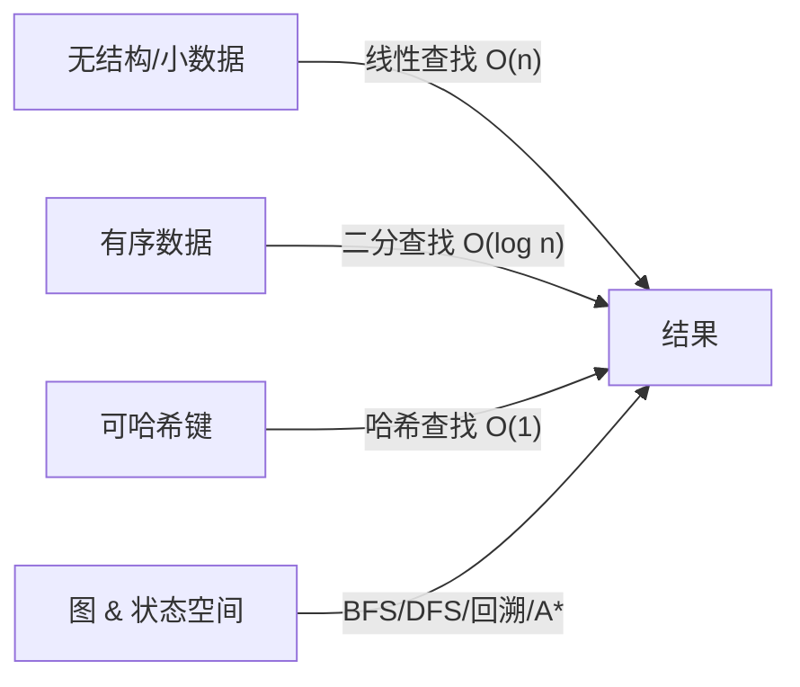
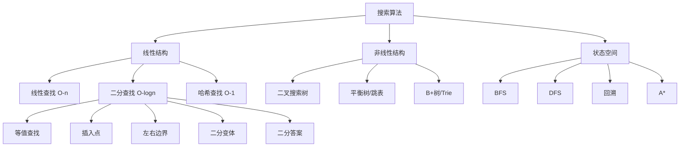

# 搜索算法完全指南（Search Algorithms）

> 专业复习笔记 · Python 3 实现 · 覆盖二分查找全族谱 + 哈希优化 + 搜索范式全景

---

## 0. 大纲优化说明

你给出的原始大纲聚焦在"二分查找 + 哈希优化"，这是**数组/顺序结构**上的搜索核心。为了让笔记在实际编程开发中更实用，我在**不改动你原大纲精神**的前提下做了如下扩展：

| 原章节 | 本笔记对应章节 | 说明 |
| :--: | :--: | :--: |
| — | 第 2 章：线性查找 | 任何搜索学习的起点，也是二分查找的对照基准 |
| 10.1 二分查找 | 第 3 章 | 讲清楚两种主流写法的区别与选择 |
| 10.2 二分查找插入点 | 第 4 章 | 配合 `bisect` 模块讲透"最左可插入位置"的含义 |
| 10.3 二分查找边界 | 第 5 章 | 左边界 / 右边界 / 统一框架三连 |
| — | 第 6 章：二分查找变体 | 旋转数组、山峰、二分答案等实战高频题 |
| 10.4 哈希优化策略 | 第 7 章 | 从"两数之和"讲到通用的"空间换时间"模式 |
| — | 第 8 章：其他搜索范式 | BFS / DFS / 回溯 / 启发式 的简要全景 |
| 10.5 重识搜索算法 | 第 9 章 | 按策略与数据结构给所有搜索做分类总结 |
| — | 第 10 章：Python 语法回顾 | 专门回顾本章用到的语法点 |
| — | 第 11 章：实战示例 | 真实可运行的综合例子 |
| 10.6 小结 | 第 12 章 | 必背清单 + 易错速查 + 复习建议 |

---

## 1. 引言：为什么要专门研究搜索算法？

**搜索**是计算机最基础的动作之一，找一个元素、找一个位置、找一个答案。所有算法面试、工程代码、数据库索引，背后几乎都藏着搜索的身影

一个坏消息是：

> 朴素的线性查找在 $n = 10^7$时已经需要几百毫秒，而现代系统一次请求往往要查几十次、几百次

而一个好消息是：

> 只要数据具备"**有序性**"或"**可哈希**"这两种结构特征，搜索复杂度就能从 $O(n)$降到 $O(\log n)$甚至 \(O(1)\)。

本章的主线就是：



> 🎯 **一句话总结**：搜索算法的本质是"**用结构换时间**"

---

## 2. 线性查找（Linear Search）

### 2.1 原理

从容器一端开始，**逐个比对**，直到找到目标或遍历结束

```css
索引:  0   1   2   3   4   5   6
数组: [3, 8, 1, 9, 7, 4, 6]
目标:  7
过程:  ↑                             比 3 != 7
          ↑                         比 8 != 7
              ↑                     比 1 != 7
                  ↑                 比 9 != 7
                      ↑             比 7 == 7 ✓ 返回 4
```

### 2.2 代码实现

```python
from typing import List, Optional, Iterable, TypeVar

T = TypeVar("T")                                          # 泛型类型，让函数支持任意可比较类型


def linear_search(nums: List[T], target: T) -> int:
    """在列表中线性查找 target，返回第一个出现的下标；找不到返回 -1

    Args:
        nums:   待查找的列表（不要求有序）
        target: 要查找的目标值

    Returns:
        目标元素的下标；若不存在返回 -1

    Complexity:
        Time:  O(n)   —— 最坏情况扫描整个列表
        Space: O(1)
    """
    # 用 enumerate 同时拿到下标与元素，比 range(len(...)) 更 Pythonic
    for i, x in enumerate(nums):
        # 逐个比较：只要相等立即返回，保证返回"第一次出现"的位置
        if x == target:
            return i
    # 循环走完都没找到 -> 约定返回 -1 表示"不存在"
    return -1
```

### 2.3 复杂度与优缺点

| 维度 | 分析 |
| :--: | :--: |
| 时间 | 最好 $O(1)$（第一个就命中）；平均/最坏 $O(n)$ |
| 空间 | $O(1)$ |
| 前提 | **无任何要求** —— 这是它最大的优势 |
| 场景 | 数据小（$n < 100$）、无序、只查一次 |
| 缺点 | 数据大时慢到难以接受 |

### 2.4 Pitfalls

1. **误用 `if x is target:`**：`is` 比较对象身份，数值相等但对象不同会判错。数值比较一律用 `==`
2. **在热点路径上线性查找**：常常是性能 bug 的元凶，考虑换哈希或先排序 + 二分

---

## 3. 二分查找（Binary Search）

### 3.1 前提条件：**数据必须有序**

二分查找能成立的核心理由：**根据中点元素和目标的大小关系，可以直接排除一半的搜索空间**。这一步成立必须有"**单调性**"

> 💡 更宽泛地说：只要搜索空间存在**某种单调性质**（不一定是数值排序），二分就可以用——这正是第 6 章"二分答案"的基础

### 3.2 核心思想

```
搜索区间 [L, R]   —— 目标若存在必在此区间
     mid = (L + R) // 2
     如果 arr[mid] == target: 命中
     如果 arr[mid] <  target: 答案必在右半 -> L = mid + 1
     如果 arr[mid] >  target: 答案必在左半 -> R = mid - 1
     否则: 区间空 -> 不存在
```

图示（在已排序数组 `[1, 3, 5, 7, 9, 11, 13]` 中查 `11`）：

```
轮次  L  R  mid  arr[mid]  操作
 1    0  6   3     7       7 < 11 -> L = 4
 2    4  6   5    11      11 == 11 ✓ 返回 5
```

### 3.3 两种主流写法的区别

| 写法 | 区间定义 | 循环条件 | 收缩方式 |
| :--- | :--- | :--- | :--- |
| **双闭** | `[L, R]` | `while L <= R:` | `L = mid + 1` 或 `R = mid - 1` |
| **左闭右开** | `[L, R)` | `while L < R:` | `L = mid + 1` 或 `R = mid`（不减 1） |

> ⚠️ **选哪个？** 从工程经验看：
> - 找**固定目标**（等值查找）→ 双闭写法更直观；
> - 找**边界 / 插入点**（第 4、5 章）→ 左闭右开写法几乎不出错
>
> 本笔记**两种都会给**，但边界题一律用左闭右开

### 3.4 代码实现

#### 双闭写法

```python
def binary_search_closed(nums: List[int], target: int) -> int:
    """经典双闭区间二分查找：arr 已排序，返回 target 的下标；不存在返回 -1。

    Args:
        nums:   升序排列的整数列表。
        target: 目标值。

    Returns:
        若存在则返回任一命中下标（不保证最左/最右）；否则 -1。

    Complexity:
        Time:  O(log n)
        Space: O(1)
    """
    left: int = 0                                         # 搜索区间左端点（闭）
    right: int = len(nums) - 1                            # 搜索区间右端点（闭）；注意 -1

    # 关键：闭区间，所以 left == right 时区间内仍有 1 个元素，需要继续循环
    while left <= right:
        # 用 (left + right) // 2 即可。Python 整数无溢出风险，
        # 但写成 left + (right - left) // 2 在其他语言可防溢出，也推荐养成习惯。
        mid: int = (left + right) // 2
        if nums[mid] == target:                           # 命中：直接返回
            return mid
        elif nums[mid] < target:                          # 中点偏小 -> 答案在右半
            left = mid + 1                                # 关键：+1 排除 mid，防止死循环
        else:                                             # 中点偏大 -> 答案在左半
            right = mid - 1                               # 同理 -1
    # 循环退出说明区间空，未找到
    return -1
```

#### 左闭右开写法

```python
def binary_search_half_open(nums: List[int], target: int) -> int:
    """左闭右开区间 [left, right) 的二分查找

    与双闭写法等价，但在"查找边界/插入点"时更容易写对

    Args:
        nums:   升序排列的整数列表
        target: 目标值

    Returns:
        命中则下标，否则 -1
    """
    left: int = 0                                         # 闭端
    right: int = len(nums)                                # 开端，取到 len（注意不减 1）

    # 左闭右开：区间 [L, R) 为空当且仅当 L == R，所以用 <（非 <=）
    while left < right:
        mid: int = (left + right) // 2                    # mid 始终落在 [L, R) 内
        if nums[mid] == target:
            return mid
        elif nums[mid] < target:
            left = mid + 1                                # 同样 +1 排除 mid
        else:
            right = mid                                   # ！不减 1，因为区间本身右端就是开的
    return -1
```

### 3.5 复杂度与正确性直觉

- **时间 $O(\log n)$**：每轮搜索空间减半，$n \to n/2 \to n/4 \to \cdots \to 1$，共 $\lceil \log_2 n\rceil $轮
- **空间 $O(1)$**：只用常数个变量
- **终止性**：闭区间写法每轮至少减 1 个元素；左闭右开写法每轮左右至少收缩 1

### 3.6 五个经典 Pitfalls

| # | 陷阱 | 典型症状 | 防御 |
| :-- | :--: | :--: | :--: |
| 1 | 双闭写成 `while L < R` | 少查一个元素（漏判 L==R 的格子） | 闭区间严格用 `<=` |
| 2 | 左闭右开写成 `R = mid - 1` | 遗漏正确答案 | 开区间右端收缩**不减 1** |
| 3 | `mid = (L + R) // 2` ，C/Java溢出 | 大数组返回错误 | 写 `L + (R - L) // 2` 更稳 |
| 4 | 无序数组上用二分 | 时错时对 | 一定先确认/保证有序 |
| 5 | 忘记处理空数组 | `nums[mid]` 越界 | 入口校验 `if not nums: return -1` |

---

## 4. 二分查找插入点

### 4.1 问题定义

> 给定有序数组 `nums` 和目标 `target`，求**可以把 target 插入其中，使数组仍保持有序**的最左下标

等价于：**第一个 ≥ target 的位置**

```css
arr = [1, 3, 3, 5, 8]
target = 3  -> 插入点 = 1   （第一个 ≥ 3 的位置）
target = 4  -> 插入点 = 3
target = 0  -> 插入点 = 0
target = 9  -> 插入点 = 5
```

### 4.2 为何等价于"第一个 ≥ target 的位置"？

- 若 target **已存在**，最左可插入点就在第一个 target 之前（或等同位置）；
- 若 target **不存在**，可插入点就是第一个比 target 大的元素位置；
- 二者统一表述：**第一个 ≥ target 的下标**

### 4.3 代码实现（推荐左闭右开）

```python
def search_insert_left(nums: List[int], target: int) -> int:
    """返回 target 在升序数组中的最左可插入位置（= 第一个 ≥ target 的下标）

    即 Python bisect.bisect_left 的等价实现

    Args:
        nums:   升序整数数组。
        target: 目标值。

    Returns:
        插入点下标，取值范围 [0, len(nums)]

    Complexity:
        Time: O(log n), Space: O(1)
    """
    left: int = 0                              # 答案候选区间 [0, len(nums)]（用左闭右开表达为 [0, n)）
    right: int = len(nums)                     # 注意可以插到末尾，所以是 n 而不是 n-1

    while left < right:
        mid: int = (left + right) // 2
        if nums[mid] < target:
            # mid 严格小于目标，所以 mid 以及它左边都不是答案 —— 答案在 mid 右边
            left = mid + 1
        else:
            # nums[mid] >= target：mid 本身有可能就是答案，不能越过它
            # 因此让 right 收缩到 mid（开区间，不包含 mid）
            right = mid
    # 循环结束时 left == right，此下标即为"第一个 ≥ target 的位置"
    return left
```

> 🔍 **原理洞察**：为什么 `right = mid` 而不是 `mid - 1`？
>
> 因为目的**不是剔除 mid**，而是"把 mid 保留为候选答案"。左闭右开区间 `[L, R)` 不包含 `R`，所以 `right = mid` 等价于"**让 mid 还在候选范围内**"

### 4.4 含重复元素时的两种变体

当数组含多个 target 时：

- **最左插入点**（`bisect_left`）：插在所有 target **之前**
- **最右插入点**（`bisect_right`）：插在所有 target **之后**

```python
def search_insert_right(nums: List[int], target: int) -> int:
    """返回 target 在升序数组中的最右可插入位置（= 第一个 > target 的下标）

    即 Python bisect.bisect_right 的等价实现
    """
    left: int = 0
    right: int = len(nums)
    while left < right:
        mid: int = (left + right) // 2
        # ！注意条件换成了 <= target：
        # 只要 nums[mid] <= target，mid 都不可能是"第一个 > target 的位置"
        if nums[mid] <= target:
            left = mid + 1
        else:
            right = mid
    return left
```

> ✨ **记忆口诀**：
> - `bisect_left` 判 `nums[mid] <  target`（严格小）
> - `bisect_right` 判 `nums[mid] <= target`（小于等于）
>
> **一个字符之差，语义天差地别**

---

## 5. 二分查找边界

### 5.1 左边界（target 第一次出现的位置）

```
arr = [1, 2, 2, 2, 4, 5]
target = 2  -> 左边界 = 1     右边界 = 3
target = 3  -> 不存在 -> 返回 -1
```

核心思路：**复用 `bisect_left` 找插入点，再检查该位置是否真的是 target**。

```python
def find_left_bound(nums: List[int], target: int) -> int:
    """查找 target 在升序数组中第一次出现的下标；不存在返回 -1。

    Args:
        nums:   升序整数数组（允许重复）。
        target: 目标值。

    Returns:
        第一次出现的下标；不存在则 -1。

    Complexity:
        Time: O(log n), Space: O(1)
    """
    # 复用第 4 章实现：拿到"第一个 ≥ target 的位置"
    i: int = search_insert_left(nums, target)
    # 边界检查：i 可能等于 len(nums)（target 比所有元素都大），要先挡住越界
    if i == len(nums) or nums[i] != target:
        return -1                                         # 目标不存在
    return i                                              # 这个位置的值正好是 target，就是左边界
```

### 5.2 右边界（target 最后一次出现的位置）

```python
def find_right_bound(nums: List[int], target: int) -> int:
    """查找 target 在升序数组中最后一次出现的下标；不存在返回 -1。"""
    # bisect_right 返回"第一个 > target 的位置" => 它前一个若为 target 即右边界
    i: int = search_insert_right(nums, target) - 1
    # i 可能为 -1（target 比所有元素都小），nums[-1] 会误取末尾元素，要先挡住
    if i < 0 or nums[i] != target:
        return -1
    return i
```

### 5.3 统一框架：一张图看懂四种问题

```
数组 (升序):  arr[0] ... arr[i-1] | target target target | arr[j+1] ... arr[n-1]
                                  ↑                   ↑
                       左边界 i = bisect_left          右边界 j = bisect_right - 1
                                  ↑                       ↑
                     最左插入点 bisect_left            最右插入点 bisect_right
```

| 问题 | 底层调用 | 特殊处理 |
| :--- | :--- | :--- |
| 找 target 下标（任意） | 标准二分 | 命中即返 |
| 左边界 | `bisect_left` | 检查命中 |
| 右边界 | `bisect_right - 1` | 检查命中 |
| 最左可插入点 | `bisect_left` | 无 |
| 最右可插入点 | `bisect_right` | 无 |
| target 的个数 | `bisect_right - bisect_left` | 无 |

### 5.4 使用标准库 `bisect` 模块

Python 标准库已经实现得又快又稳，**工程代码强烈推荐直接用**：

```python
import bisect
from typing import List

nums: List[int] = [1, 2, 2, 2, 4, 5]
print(bisect.bisect_left(nums, 2))   # 1  —— 最左插入点/左边界
print(bisect.bisect_right(nums, 2))  # 4  —— 最右插入点 = 右边界 + 1
print(bisect.bisect_right(nums, 2) - bisect.bisect_left(nums, 2))  # 3  —— target 的个数
bisect.insort(nums, 3)               # 原地插入并保持有序 -> [1,2,2,2,3,4,5]
```

> 📝 **面试 vs 工程**：面试手写二分考察功底；工程用 `bisect` 避免 bug

---

## 6. 二分查找的变体与高级应用

二分查找的精髓不是"在有序数组里找数"，而是"**每轮能排除一半候选**"。只要问题具备单调性，就能二分

### 6.1 旋转排序数组查找

数组是先升序、再在某处截断旋转（如 `[4,5,6,7,0,1,2]`）。依然能$ O(\log n)$ 查找

```python
def search_in_rotated(nums: List[int], target: int) -> int:
    """在旋转排序数组（无重复）中查找 target，返回下标；不存在返回 -1。

    核心思想：mid 把数组一分为二，总有一半是有序的，依靠这一半做判断。
    """
    left: int = 0
    right: int = len(nums) - 1
    while left <= right:
        mid: int = (left + right) // 2
        if nums[mid] == target:
            return mid
        # 判断左半 [left, mid] 是否有序（旋转点一定在另一半）
        if nums[left] <= nums[mid]:
            # 左半有序：看 target 是否落在这个有序段内
            if nums[left] <= target < nums[mid]:
                right = mid - 1                           # 在左半继续找
            else:
                left = mid + 1                            # 去右半（那里有旋转点，但也可能藏着 target）
        else:
            # 否则右半 [mid, right] 有序
            if nums[mid] < target <= nums[right]:
                left = mid + 1
            else:
                right = mid - 1
    return -1
```

> ⚡ 精髓：**哪半有序，就在哪半判断 target 是否落入，再决定去哪一半搜索**

### 6.2 山峰数组查找峰值

数组**先升后降**，找峰值下标

```python
def find_peak(nums: List[int]) -> int:
    """山峰数组找峰值下标（假设只有一个峰）。

    单调性来自：左半段一直升、右半段一直降；在 mid 和 mid+1 比较即可判断方向。
    """
    left: int = 0
    right: int = len(nums) - 1
    while left < right:                                   # 用 < 而不是 <=，因为最终收敛到 1 个元素时它就是答案
        mid: int = (left + right) // 2
        if nums[mid] < nums[mid + 1]:                     # 当前在上坡，峰值在右边
            left = mid + 1
        else:                                             # 上坡结束或下坡，峰值在 mid 或左边
            right = mid
    return left                                           # left == right，就是峰
```

### 6.3 二分答案（浮点数开平方）

二分不仅能在数组上做，还能在**答案空间**上做

```python
def sqrt_float(x: float, eps: float = 1e-9) -> float:
    """用二分法求 x 的平方根（x >= 0），精度 eps。

    关键观察：f(m) = m*m 随 m 单调递增，所以可以在答案区间 [0, max(1, x)] 上二分。
    """
    assert x >= 0, "负数无实平方根"
    # 大于 1 时平方根必 < x；小于 1 时平方根 > x，所以上界取 max(1, x)
    left: float = 0.0
    right: float = max(1.0, x)
    # 浮点二分用"区间足够窄"做终止条件，不再用 left < right
    while right - left > eps:
        mid: float = (left + right) / 2                   # 浮点不能用 // 整除
        if mid * mid < x:
            left = mid                                    # 注意浮点二分没有 +1 的概念
        else:
            right = mid
    return (left + right) / 2                             # 区间中点近似返回
```

> 💡 **浮点二分要点**：
> - 终止条件用 **`right - left > eps`**，不是等值比较；
> - **不用 `mid + 1 / mid - 1`**，因为"下一个浮点数"不是 +1；
> - 循环次数约 \(\log_2 \frac{\text{区间长}}{eps}\)，例如精度 \(10^{-9}\) 大约 30~50 轮。

### 6.4 二分答案（整数版：最小值最大化）

**典型问题**：给定绳子长度数组，切出至少 k 段相等长度，问最长能切多长？

**模式识别**：
- 问题问"**最大/最小的某个值**"；
- 存在 check 函数：给定候选答案 v，能 \(O(n)\) 判断"是否可行"；
- check 对 v 单调。

```python
def max_cut_length(ropes: List[int], k: int) -> int:
    """在绳子数组中切出 k 段等长整数段，求每段最长长度。

    Args:
        ropes: 各绳子长度（正整数）。
        k:     需要切出的段数。

    Returns:
        每段最大可能的整数长度；若无法满足返回 0。
    """
    def can_cut(length: int) -> bool:
        """判断每段长 length 时能否切出 >= k 段。"""
        if length == 0:                                   # 避免除零
            return True
        return sum(r // length for r in ropes) >= k

    # 答案范围：最小 1，最大 max(ropes)
    left: int = 1
    right: int = max(ropes)
    ans: int = 0
    while left <= right:
        mid: int = (left + right) // 2
        if can_cut(mid):
            ans = mid                                     # mid 可行，记录并尝试更大
            left = mid + 1
        else:
            right = mid - 1                               # mid 不可行，只能更小
    return ans
```

> 🏁 **套路总结**：二分答案的骨架 = 确定答案范围 + 写 check 函数 + 按可行性收缩。

---

## 7. 哈希查找与哈希优化策略

### 7.1 哈希查找原理

哈希表通过 **哈希函数 `h(key)` → 数组下标** 的映射，实现**平均 $O(1)$** 的查找

```css
key = "apple"
h("apple") = 37   ->   bucket[37] = ("apple", value)
```

| 操作 | 平均复杂度 | 最坏复杂度（哈希碰撞满链）|
| :--: | :--: | :--: |
| 查找 | $O(1)$ | $O(n)$ |
| 插入 | $O(1)$ | $O(n)$ |
| 删除 | $O(1)$ | $O(n)$ |

Python 的 `dict` 和 `set` 都是强力的哈希表实现

### 7.2 哲学：**空间换时间**

哈希优化的核心思路是：

> **把"要查找的信息"提前放进哈希表里，把一个 $O(n)$ 的扫描换成一次 $O(1) $的查询**

### 7.3 经典案例：两数之和

> 给数组 `nums` 和目标 `target`，返回两个元素下标使它们之和为 `target`

#### 朴素解：$O(n^2)$

```python
def two_sum_bruteforce(nums: List[int], target: int) -> List[int]:
    """O(n^2) 双重循环找两数之和。仅作对比基线。"""
    n: int = len(nums)
    for i in range(n):                                    # 固定第一个数
        for j in range(i + 1, n):                         # 在 i 之后找第二个数，避免重复配对
            if nums[i] + nums[j] == target:
                return [i, j]
    return []
```

#### 哈希优化解：$O(n)$

```python
from typing import Dict, List


def two_sum_hash(nums: List[int], target: int) -> List[int]:
    """用哈希表把两数之和优化到 O(n)。

    核心洞察：对当前元素 x，问题转化为"之前出现过的元素里是否有 target - x"。
    哈希表让这一步查询是 O(1)。

    Args:
        nums:   整数数组。
        target: 目标和。

    Returns:
        满足和 == target 的两个下标；不存在返回空列表。
    """
    # key = 值, value = 该值最后一次出现的下标
    seen: Dict[int, int] = {}
    for i, x in enumerate(nums):
        complement: int = target - x                      # 我此刻需要的"另一半"
        # 先查：防止 x 和自己配对；同时避开下标重复
        if complement in seen:
            return [seen[complement], i]                  # 先出现的下标在前
        # 再存：只在没命中时把当前元素加入哈希，保证 i != j
        seen[x] = i
    return []
```

> 🔑 **顺序很关键**：**先查后存**，能天然避免"同一个元素和自己配对"的错误

### 7.4 通用哈希优化模式

以下问题都能用同一个"**遇到元素 → 查互补信息 → 存当前信息**"的模式解决：

| 问题 | 哈希表的 key | 哈希表的 value |
| :--: | :--- | :--- |
| 两数之和 | 元素值 | 元素下标 |
| 无重复字符最长子串 | 字符 | 上次出现位置 |
| 和为 K 的子数组个数 | 前缀和 | 出现次数 |
| LRU 缓存 | key | 双向链表节点指针 |
| 字母异位词分组 | 排序后的字符串 | 原字符串列表 |

这是实战中最高频的一种"**数据结构级优化**"

### 7.5 Pitfalls

1. **key 必须可哈希**：`list` / `dict` / `set` 不可作 key，但 `tuple` / `frozenset` / `str` 可以
2. **浮点作 key 要小心**：`0.1 + 0.2 != 0.3`，精度问题会导致查不到
3. **最坏 $O(n)$ 的退化**：对抗性输入（全都碰撞）可能让哈希退化。Python 字典有随机化哈希种子减轻此问题
4. **遍历中修改 dict**：Python 会抛 `RuntimeError: dictionary changed size during iteration`，要么先复制 `list(d.keys())` 再遍历，要么收集变更到缓冲区后批量应用

---

## 8. 其他搜索范式全景

前面讲的都是**线性结构 + 有序/哈希**上的搜索。对于**图/树/状态空间**，有完全不同的搜索范式

### 8.1 广度优先搜索（BFS）

- **结构**：队列（FIFO）
- **特点**：层层扩展，能求**无权图最短路径**
- **复杂度**：$O(V + E)$

```python
from collections import deque
from typing import Dict, List, Set


def bfs_shortest_path(graph: Dict[int, List[int]], start: int, target: int) -> int:
    """BFS 求无权图 start -> target 的最短路径长度（步数）；不可达返回 -1。"""
    if start == target:
        return 0
    visited: Set[int] = {start}                            # 防止重复访问
    queue: deque = deque([(start, 0)])                     # (顶点, 到 start 的距离)
    while queue:
        node, dist = queue.popleft()                       # 队首出队：保证先访问的先处理
        for nb in graph.get(node, []):
            if nb == target:
                return dist + 1
            if nb not in visited:
                visited.add(nb)                            # 入队前就标记，防止同一层重复入队
                queue.append((nb, dist + 1))
    return -1
```

### 8.2 深度优先搜索（DFS）

- **结构**：栈（显式或递归栈）
- **特点**：一条路走到底，回溯
- **用途**：连通性、拓扑排序、找所有路径

```python
def dfs_all_paths(graph: Dict[int, List[int]], start: int, target: int) -> List[List[int]]:
    """DFS 找 start -> target 的所有简单路径。"""
    results: List[List[int]] = []
    path: List[int] = [start]

    def _dfs(node: int, visited: Set[int]) -> None:
        if node == target:
            results.append(path.copy())                    # 要深拷贝，否则后续修改会影响已保存的路径
            return
        for nb in graph.get(node, []):
            if nb in visited:                              # 避免回路
                continue
            visited.add(nb)
            path.append(nb)
            _dfs(nb, visited)
            path.pop()                                     # 回溯：恢复现场
            visited.remove(nb)

    _dfs(start, {start})
    return results
```

### 8.3 回溯（Backtracking）

- **本质**：在**隐式状态空间**上的 DFS + 剪枝
- **用途**：全排列、组合、N 皇后、数独

```python
def permutations(nums: List[int]) -> List[List[int]]:
    """生成 nums 的所有全排列。经典回溯模板。"""
    results: List[List[int]] = []
    used: List[bool] = [False] * len(nums)                 # 记录每个元素是否已选
    path: List[int] = []

    def _bt() -> None:
        if len(path) == len(nums):                         # 终止条件：路径满员
            results.append(path.copy())
            return
        for i, x in enumerate(nums):
            if used[i]:                                    # 剪枝：已用则跳过
                continue
            used[i] = True                                 # 做选择
            path.append(x)
            _bt()                                          # 递归
            path.pop()                                     # 撤销选择
            used[i] = False                                # 撤销标记（回溯三步：选择 → 递归 → 撤销）

    _bt()
    return results
```

### 8.4 启发式搜索（A\*）

- **特点**：在搜索中引入"启发函数" $h(x)$，**优先扩展更靠近目标的节点**
- **用途**：游戏寻路、拼图、路径规划
- **核心公式**：$f(x) = g(x) + h(x)$，其中 $g $是已付出代价，$h$ 是对剩余代价的估计
- **前提**：$h$必须"可接受"（不高估真实代价），才能保证最优

实现通常用优先队列 `heapq`，属于图搜索的进阶内容，这里不展开

### 8.5 何时用哪种搜索？

```css
                                     ┌─ 有序 ────────► 二分查找 O(log n)
                                     │
            ┌─ 线性结构/数组 ────────┤
            │                        └─ 无序/频繁查找 ► 哈希查找 O(1)
 问题 ─────┤
            │                        ┌─ 无权最短路径 ► BFS
            │                        │
            └─ 图/树/状态空间 ──────┤─ 连通性/所有解 ► DFS
                                     │
                                     ├─ 枚举所有可能 ► 回溯
                                     │
                                     └─ 启发信息可用 ► A*
```

---

## 9. 重识搜索算法：分类体系

### 9.1 按算法策略

| 策略 | 特点 | 代表算法 |
| :--: | :--: | :--: |
| **暴力搜索** | 不依赖数据结构特性，逐个尝试 | 线性查找、BFS、DFS、回溯 |
| **自适应搜索** | 利用数据的"结构特征"快速缩小搜索空间 | 二分查找、哈希查找、B 树查找 |
| **启发式搜索** | 利用问题的"额外知识"指导方向 | A*、IDA*、模拟退火 |

> 💡 **本质**：从暴力到自适应，是"**让数据告诉算法该看哪里**"；到启发式，是"**让问题自身告诉算法该怎么判断优先级**"

### 9.2 按依赖的数据结构

| 数据结构 | 支持的搜索 | 典型复杂度 |
| :--: | :--: | :--: |
| 无序数组/链表 | 线性查找 | $O(n)$ |
| 有序数组 | 二分查找 / 插值查找 | $O(\log n)$ / $O(\log\log n)$（均匀分布） |
| 哈希表 | 哈希查找 | \(O(1)\) 平均 |
| 二叉搜索树（BST） | 二叉树查找 | \(O(\log n)\) 平均，\(O(n)\) 最坏 |
| 平衡树（AVL/红黑树/跳表） | 有序查找 | \(O(\log n)\) 最坏 |
| B 树 / B+ 树 | 外存有序查找 | \(O(\log_B n)\)（数据库索引核心） |
| 字典树（Trie） | 前缀查找 | \(O(L)\)，\(L\) 是字符串长 |

### 9.3 选择决策流程

回答三个问题，基本就能选对：

1. **是否有序？** 有序 → 二分 / 树。无序 → 哈希 / 线性
2. **查询多还是插入多？** 读多写少 → 数组 + 二分；读写都多 → 哈希或平衡树
3. **key 是否可哈希且稳定？** 是 → 哈希；否（如浮点、自定义对象） → 树

---

## 10. Python 语法回顾专区

### 10.1 类型注解（`typing`）

```python
from typing import List, Dict, Set, Tuple, Optional, Union, Any, Iterable, Iterator, Callable, TypeVar
```

| 注解 | 作用 |
| :--- | :--- |
| `List[int]` | 整型列表 |
| `Dict[str, int]` | 键是 str、值是 int 的字典 |
| `Optional[T]` | `T` 或 `None` |
| `Union[int, str]` | 可能是 int 或 str |
| `Callable[[int, int], int]` | 接收 `(int, int)`、返回 `int` 的函数 |
| `TypeVar("T")` | 泛型，保证参数与返回值类型保持一致 |

> Python 3.9+ 可直接写 `list[int]` / `dict[str, int]` / `int | None`（替代 `Optional`），更现代。本笔记为了兼容性全部沿用 `typing`。

### 10.2 `bisect` 模块

| 函数 | 行为 |
| :--- | :--- |
| `bisect.bisect_left(a, x)` | x 最左可插入位置（= 第一个 ≥ x 的下标） |
| `bisect.bisect_right(a, x)` / `bisect.bisect` | x 最右可插入位置（= 第一个 > x 的下标） |
| `bisect.insort_left(a, x)` | 原地插入并保序（最左） |
| `bisect.insort_right(a, x)` / `bisect.insort` | 原地插入并保序（最右） |

> 📌 `bisect` 内部是 C 实现，比手写二分快很多；但它**只支持升序数组**，降序需自己反转或改写。

### 10.3 整除与位运算

```python
10 // 3     # 3    整除（向下取整）
-10 // 3    # -4   Python 向下取整(和 C 语言的截断方向不同！)
10 % 3      # 1
(l + r) >> 1   # 等价于 (l + r) // 2，位运算更快（不过 Python 差距很小）
```

> ⚠️ 负数下 `//` 不是"朝 0 取整"而是"向下取整"，写二分时如果区间含负数要留意。

### 10.4 哈希容器：`dict` 与 `set`

```python
d: Dict[str, int] = {}
d["apple"] = 1                                # 插入 O(1)
"apple" in d                                  # 查询 O(1)
d.get("banana", 0)                            # 不存在返回默认值，避免 KeyError
del d["apple"]                                # 删除

s: Set[int] = set()
s.add(3)                                      # 插入
3 in s                                        # 查询
s.discard(3)                                  # 删除（不存在也不报错；remove 会报）
```

**最佳实践**：
- 计数用 `collections.Counter`；
- 需要默认值字典用 `collections.defaultdict(int)`；
- 有序字典用 `dict` 本身就行（Python 3.7+ 保序）。

### 10.5 迭代与递归

**迭代**适合线性过程（二分查找、哈希查找）；**递归**适合树形/回溯过程（DFS、回溯）。

```python
import sys
sys.setrecursionlimit(10000)                  # Python 默认递归限制 ~1000，深度搜索常需上调
```

> 🛑 递归写法要特别注意**终止条件**与**回溯恢复**（`append` 后一定配对 `pop`）。

### 10.6 `enumerate`、切片、解包

```python
for i, x in enumerate(nums):                   # 同时拿索引和值
    ...
a, *rest, b = [1, 2, 3, 4, 5]                 # a=1, rest=[2,3,4], b=5
new = nums[left : right]                       # 切片是 O(right-left)，不要在热点路径滥用
```

---

## 11. 实战示例与应用

### 11.1 综合示例：在员工工资表中查询

```python
from dataclasses import dataclass
from typing import List, Dict, Optional
import bisect


@dataclass
class Employee:
    """员工记录。"""
    id: int
    name: str
    salary: int


def demo() -> None:
    """演示三种搜索方式的应用场景。"""
    # 员工列表：按 salary 升序排列，支持二分
    employees: List[Employee] = [
        Employee(1, "Alice",  5000),
        Employee(2, "Bob",    7500),
        Employee(3, "Carol",  9000),
        Employee(4, "Dave",  12000),
        Employee(5, "Eve",   15000),
    ]

    # --- (1) 线性查找：按姓名找人（无序信息）---
    def find_by_name(name: str) -> Optional[Employee]:
        """按姓名查找员工。无序，只能线性。"""
        for e in employees:
            if e.name == name:
                return e
        return None

    # --- (2) 二分查找：第一个工资 >= 10000 的员工 ---
    # 抽出 salary 数组做二分的 key
    salaries: List[int] = [e.salary for e in employees]
    idx: int = bisect.bisect_left(salaries, 10000)        # bisect 对 key 做二分
    first_high_paid: Optional[Employee] = employees[idx] if idx < len(employees) else None

    # --- (3) 哈希查找：按 id 瞬间定位 ---
    id_index: Dict[int, Employee] = {e.id: e for e in employees}
    target: Optional[Employee] = id_index.get(3)

    print(find_by_name("Bob"))
    print(first_high_paid)
    print(target)


if __name__ == "__main__":
    demo()
```

### 11.2 应用场景速查

| 场景 | 推荐算法 | 原因 |
| :--- | :--- | :--- |
| 数据库索引（B+ 树） | 平衡树二分 | 支持范围查询 + 外存友好 |
| Redis `ZSET` 排行榜 | 跳表 + 二分 | 有序 + 高效插入 |
| Python `dict` / Java `HashMap` | 哈希 | \(O(1)\) 增删查 |
| Leetcode 排序数组找数 | 二分 | \(O(\log n)\) |
| 统计单词频率 | 哈希 | 一次扫描 |
| 迷宫最短路 | BFS | 无权最短路径 |
| 全排列 / 组合 / 子集 | 回溯 | 枚举所有解 |
| 大整数开方 | 二分答案 | 答案空间单调 |
| 游戏寻路 | A\* | 启发信息加速 |

---

## 12. 总结与复习要点

### 12.1 核心知识图谱



### 12.2 必背要点 ✅

**二分查找**

- [ ] 前提：数据有序（或搜索空间单调）。
- [ ] 双闭 `[L, R]`：`while L <= R`, 收缩 `mid ± 1`。
- [ ] 左闭右开 `[L, R)`：`while L < R`, 收缩 `L = mid + 1` 或 `R = mid`（**不减 1**）。
- [ ] 复杂度：\(O(\log n)\) 时间，\(O(1)\) 空间。
- [ ] 溢出保险：`mid = L + (R - L) // 2`（Python 可忽略，但习惯要养成）。

**插入点与边界**

- [ ] `bisect_left`：第一个 **≥** target 的位置（条件 `nums[mid] < target`）。
- [ ] `bisect_right`：第一个 **>** target 的位置（条件 `nums[mid] <= target`）。
- [ ] 左边界 = `bisect_left`；右边界 = `bisect_right - 1`；个数 = 二者之差。
- [ ] 用前做 `idx < len(nums) and nums[idx] == target` 防越界。

**哈希优化**

- [ ] 思路：**遇到 → 查互补 → 存当前**。
- [ ] 顺序：**先查后存**（避免自配对）。
- [ ] 空间换时间：\(O(n)\) 额外空间换 \(O(n)\) 时间。
- [ ] key 必须可哈希，浮点作 key 慎重。

**二分变体**

- [ ] 旋转数组：**判断哪半有序**再定位。
- [ ] 山峰数组：**比较 `nums[mid]` 与 `nums[mid+1]`** 决定方向。
- [ ] 浮点二分：**区间宽度** 作终止条件。
- [ ] 二分答案：**确定范围 + 写 check + 按可行性收缩**。

**其他搜索**

- [ ] BFS 用队列，DFS 用栈/递归，回溯 = DFS + 剪枝。
- [ ] A\* 用优先队列，`f = g + h`，`h` 不能高估。

### 12.3 易错速查

| 类别 | 陷阱 | 防御 |
| :--- | :--- | :--- |
| 二分区间 | `<` 与 `<=` 混用 | 闭区间用 `<=`，开区间用 `<` |
| 二分收缩 | `R = mid - 1` 用在开区间 | 开区间写 `R = mid`（**不减 1**） |
| 死循环 | 忘记 `L = mid + 1` | 等值处理后务必 `+1` |
| 边界判定 | 没做 `idx < n` 保护 | 先挡越界，再判值等 |
| 旋转数组 | 边界 `<=` 写成 `<` | 用 `nums[left] <= nums[mid]` 保证左端点本身也在考察范围 |
| 哈希 | 先存后查导致自配对 | 永远**先查后存** |
| 浮点 | 用 `==` 判断收敛 | 用 `right - left > eps` |
| 回溯 | 忘记撤销选择 | `append` ↔ `pop` 成对 |
| BFS | 出队时才标记 visited | **入队前**就标记 |

### 12.4 复习建议动作

1. **默写二分模板**：闭区间和左闭右开两个版本，不看答案独立写出并跑通。
2. **手绘执行过程**：给一个小数组跟踪 L/R/mid 的变化，包括越界情况。
3. **连做 4 道边界题**：左边界、右边界、最左插入点、最右插入点，直到顺手。
4. **变体专题**：旋转数组、山峰数组、平方根、二分答案各刷 1~2 题。
5. **哈希模式迁移**：把"两数之和"思路套到"和为 K 的子数组"、"最长无重复子串"。
6. **对比阅读源码**：读一遍 Python `bisect` 模块源码，看看工业级实现。

### 12.5 一句话收尾

> **线性查找**是起点，**二分查找**是核心，**哈希查找**是杀手锏，**BFS/DFS/回溯/A\*** 是拓展边疆。
> 所有搜索算法的共同母题是：**用结构换时间**。
> 理解"**单调性**"与"**可哈希性**"这两个魔法词，你就掌握了搜索世界一半的钥匙。

---

*— End of Notes —*
