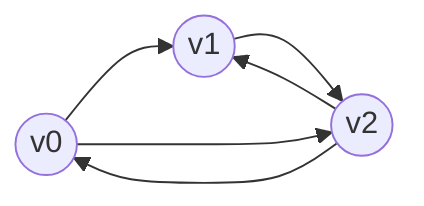
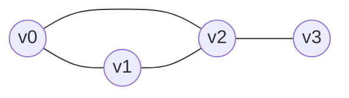
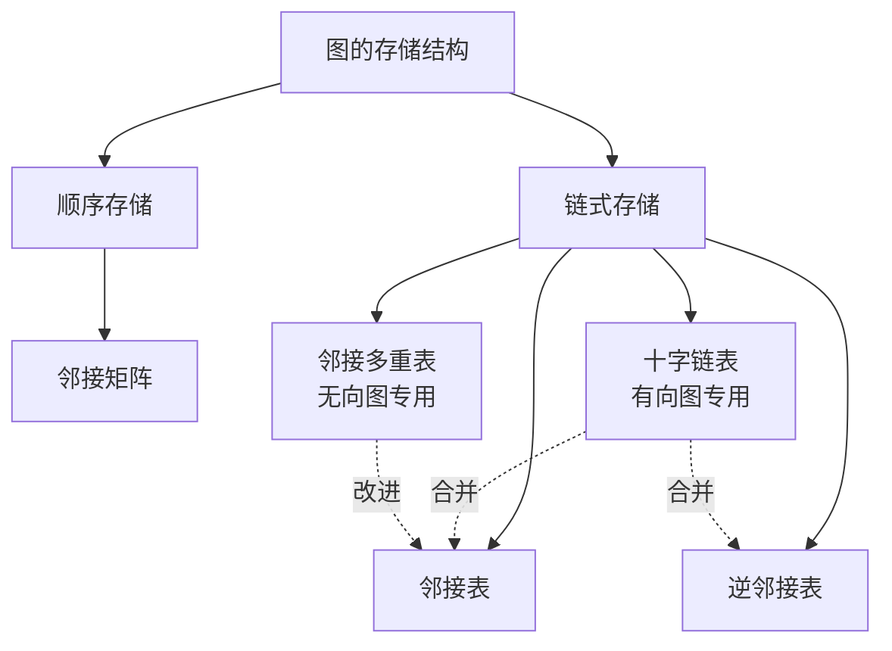

# 图的高级存储结构：十字链表 与 邻接多重表

> 专业复习笔记 · Python 3 实现 · 面向已掌握图论基础的读者

---

## 1. 引言：为什么还需要更高级的存储结构？

在图论基础中，我们已经接触过三种经典存储结构：**邻接矩阵**、**邻接表**、**逆邻接表**。但它们都存在一些难以回避的缺陷：

| 场景 | 邻接矩阵 | 邻接表 | 逆邻接表 |
| :--: | :--: | :--: | :--: |
| 稀疏图空间利用 | ❌ $O(n^2)$ 浪费严重 | ✅ 高效 | ✅ 高效 |
| 有向图求**出度** | ✅ $O(n)$ | ✅ $O(出度)$ | ❌ $O(n+e)$ |
| 有向图求**入度** | ✅ $O(n)$ | ❌ $O(n+e)$ | ✅ $O(入度)$ |
| 无向图**每条边只存一份** | ❌ 矩阵对称冗余 | ❌ 每条边存 2 份 | — |
| 在边上做**标记/修改** | 简单但冗余 | ❌ 标记不同步 | — |

**两个核心痛点**：

1. **有向图**：邻接表擅长出度，逆邻接表擅长入度，**二者只能二选一**。若同时建立两份，空间翻倍且更新困难（同一条弧在两张表中要维护两次）
2. **无向图**：邻接表把一条边$ (v_i, v_j) $拆成了两个节点分别挂在$ v_i$和$ v_j$的链表上，**一条边存两份**。当我们对边做"访问标记"（如 DFS、最小生成树、回路判定）时，必须同时修改两份，否则会出现**状态不一致**的 bug

于是就有了两种**"为解决这两个痛点而生"的结构**：

- **十字链表（Orthogonal List）** → 专为**有向图**设计，让出度与入度遍历**同样高效**
- **邻接多重表（Adjacency Multilist）** → 专为**无向图**设计，让每条边**只存一份节点**，同时被两个端点共享

它们的共同思想是：**一个节点同时挂在多条链表上**——这也是本章所有精巧之处的源头

---

## 2. 十字链表（Orthogonal List / Cross-Linked List）

### 2.1 核心思想

> 把 **邻接表** 与 **逆邻接表** "叠加"在同一组弧节点上
> 每个弧节点既属于"同弧尾链"，又属于"同弧头链"，两条链正交（orthogonal）交叉，因此得名

### 2.2 节点结构

十字链表有两类节点：**顶点节点** 和 **弧节点**

#### 2.2.1 顶点节点（VexNode）

```css
┌─────────┬──────────┬──────────┐
│  data   │ firstin  │ firstout │
└─────────┴──────────┴──────────┘
```

| 字段 | 含义 |
| :--: | :--: |
| `data` | 顶点存储的数据（顶点名/编号/权值等） |
| `firstin` | 指向**以该顶点为弧头**的第一条弧节点（入弧链头） |
| `firstout` | 指向**以该顶点为弧尾**的第一条弧节点（出弧链头） |

> 💡 记忆口诀：**in 管进来的箭头，out 管出去的箭头**

#### 2.2.2 弧节点（ArcNode）

```css
┌─────────┬─────────┬──────┬───────┬───────┐
│ tailvex │ headvex │ info │ hlink │ tlink │
└─────────┴─────────┴──────┴───────┴───────┘
```

| 字段 | 含义 | 指向/记录的内容 |
| :--: | :--: | :--: |
| `tailvex` | 弧尾顶点下标 | 弧的起点 \(u\) |
| `headvex` | 弧头顶点下标 | 弧的终点 \(v\) |
| `info` | 弧的附加信息 | 通常是权值 |
| `hlink` | **H**ead link | 下一条**弧头相同**的弧（与我同终点的下一条弧） |
| `tlink` | **T**ail link | 下一条**弧尾相同**的弧（与我同起点的下一条弧） |

> ⚠️ **极易混淆的点**：`hlink` 不是"head 指针"而是"**head 相同的下一个**"；`tlink` 同理

### 2.3 结构图示

设有向图：



弧集合：$\{(v_0,v_1),\ (v_0,v_2),\ (v_1,v_2),\ (v_2,v_0),\ (v_2,v_1)\}$

十字链表结构图（箭头: `→` = `tlink`，`↓` = `hlink`；顶点上 `O:` = `firstout`，`I:` = `firstin`）：

```
顶点数组
┌─────────────────────┐
│ v0  I:●  O:●        │──O──→ [0→2] ──tlink──→ [0→1] ──tlink──→ NULL
│     ↓               │               
│     ●───────────┐   │               
└─────────────────┼───┘               
                  │                   
┌─────────────────┼───┐               
│ v1  I:●  O:●    │   │──O──→ [1→2] ──tlink──→ NULL
│     ↓           │   │        
│     ●───────┐   │   │        
└─────────────┼───┼───┘        
              │   │            
┌─────────────┼───┼───┐        
│ v2  I:●  O:●│   │   │──O──→ [2→0] ──tlink──→ [2→1] ──tlink──→ NULL
│     ↓       │   │   │               
│     ●───┐   │   │   │               
└─────────┼───┼───┼───┘               
          │   │   │                   
    firstin 链收尾于各弧节点的 hlink
```

**要读懂上图需要牢记**：
- **每个弧节点**同时属于**两条链**。
- **水平**方向（`tlink`）是"同 **tail** 起点"的链，由某顶点的 `firstout` 牵引。
- **垂直**方向（`hlink`）是"同 **head** 终点"的链，由某顶点的 `firstin` 牵引。

### 2.4 构建：插入一条弧$ (u \to v)$

采用**头插法**（最省事，$O(1)$）：

```css
new_arc.tailvex = u
new_arc.headvex = v

# 1. 插入到 u 的 "出弧链"（tlink 串联）
new_arc.tlink       = vex[u].firstout
vex[u].firstout     = new_arc

# 2. 插入到 v 的 "入弧链"（hlink 串联）
new_arc.hlink       = vex[v].firstin
vex[v].firstin      = new_arc
```

**关键原理**：同一个 `new_arc` 对象被两条链表同时引用——这正是"十字"的来源。在 Python 中这就是**对象引用的复用**（指针多重指向）

### 2.5 常见操作与复杂度

设顶点数 $n$，弧数 $e$

| 操作 | 实现方式 | 复杂度 |
| :--: | :--: | :--: |
| 求顶点 \(u\) 的**出度** | 沿 `vex[u].firstout` 走 `tlink` 链计数 | $O(\text{out}(u))$ |
| 求顶点 \(u\) 的**入度** | 沿 `vex[u].firstin` 走 `hlink` 链计数 | $O(\text{in}(u))$ |
| 判断弧 \((u,v)\) 是否存在 | 遍历 \(u\) 的出链（或 \(v\) 的入链） | $O(\min(\text{out}(u), \text{in}(v)))$ |
| 删除弧 \((u,v)\) | 同时从**两条链**中摘除该节点 | $O(\text{out}(u)+\text{in}(v))$ |
| 空间复杂度 | 每个顶点一个节点，每条弧一个节点 | $O(n+e)$ |

> 🎯 **杀手锏**：对比邻接表，入度查询从 $O(n+e)$降为$ O(\text{in}(u))$；对比"邻接表+逆邻接表"的方案，**空间节省一半**，且不会出现维护不同步

### 2.6 易错点（Pitfalls）

1. **混淆 hlink 与 tlink**：记住 `h` 对 `head`、`t` 对 `tail`，而且是"**相同**的下一条"
2. **只更新一条链**：插入/删除时漏掉另一条链，会造成链表断裂而程序不报错——**隐蔽但致命**
3. **`firstin` 上用的是 `hlink`、`firstout` 上用的是 `tlink`**：初学者经常混着用
4. **自环（self-loop）$u\to u$：该弧既在 \(u\) 的出链又在 \(u\) 的入链，**同一条链里它只能出现一次吗？——不！它会同时出现在两条不同字段的链（`firstin`/`firstout`）上，但这两条链在内存中是独立的链表，不会冲突。遍历时要警惕自环被"重复计数"

---

## 3. 邻接多重表（Adjacency Multilist）

### 3.1 核心思想

> 专为**无向图**设计。一条边 \((v_i, v_j)\) **只用一个边节点**表示，这个节点**同时**出现在 \(v_i\) 和 \(v_j\) 两个顶点的邻接链中。

一条边节点承担"双重身份"——这就是"**多重**(multi-list)"的含义。

### 3.2 节点结构

#### 3.2.1 顶点节点（VexNode）

```
┌─────────┬───────────┐
│  data   │ firstedge │
└─────────┴───────────┘
```

| 字段 | 含义 |
| :--- | :--- |
| `data` | 顶点数据 |
| `firstedge` | 指向**依附于该顶点**的第一条边节点 |

#### 3.2.2 边节点（EdgeNode）

```
┌──────┬──────┬──────┬───────┬───────┬──────┐
│ mark │ ivex │ jvex │ ilink │ jlink │ info │
└──────┴──────┴──────┴───────┴───────┴──────┘
```

| 字段 | 含义 |
| :--- | :--- |
| `mark` | 标志域（是否被访问过，如 DFS、MST 中使用） |
| `ivex`, `jvex` | 该边两端顶点的下标（顺序无硬性规定） |
| `ilink` | 指向依附于 `ivex` 的**下一条边** |
| `jlink` | 指向依附于 `jvex` 的**下一条边** |
| `info` | 边的权值等信息 |

> 💡 **核心理解**：一条边有两个端点，所以需要两个"下一条"指针——每个端点一个。

### 3.3 结构图示

无向图：



边集合：$\{(v_0,v_1),\ (v_0,v_2),\ (v_1,v_2),\ (v_2,v_3)\}$

邻接多重表结构（每条边只出现一次，但被两条链共享）：

```
vex[0] ──firstedge──► E01 ──ilink(依附于0)──► E02 ──ilink(依附于0)──► NULL
                      │                        │
                      │ jlink(依附于1)         │ jlink(依附于2)
                      ▼                        ▼
vex[1] ──firstedge──► E01                     E02
                       │(上面那个E01本身,但    │  此时 E02 位于"依附于2"的链上
                        从 v1 方向进入)        │  所以需要看 jvex==2，下一步走 jlink
                      ilink(依附于1)           │
                      ▼                        ▼
                      E12 ──jlink(2)────────► E12 ──jlink(依附于2)──► E23
                                                                        │
                                                                        jlink(依附于3)
                                                                        ▼
vex[2] ──firstedge──► E12（从v2方向进入, 看 jvex==2, 走 jlink）─► E02 ─► E23
vex[3] ──firstedge──► E23 ─► NULL
```

（ASCII 对这种多重共享链表天然不友好，下文我们通过代码+逐步插入演示来彻底讲清。）

### 3.4 遍历边的核心算法

从顶点 \(u\) 出发遍历所有关联边：

```
p = vex[u].firstedge
while p is not None:
    if p.ivex == u:           # 当前边从 ivex 方向挂入 u 的链
        # 另一端点是 p.jvex
        next_p = p.ilink      # 关键: 走 ilink!
    else:                     # 即 p.jvex == u
        # 另一端点是 p.ivex
        next_p = p.jlink      # 关键: 走 jlink!
    ...处理...
    p = next_p
```

> ⚡ **灵魂问题**：为什么要区分 `ivex == u` 还是 `jvex == u`？
>
> 因为同一个边节点被**两条链表复用**，它的"下一个节点"方向取决于**我们正从哪个端点视角访问它**。`ilink` 只对 `ivex` 端点有意义，`jlink` 只对 `jvex` 端点有意义。这正是"多重"的魅力与陷阱并存之处。

### 3.5 构建：插入一条边 \((u, v)\)

```
new_edge.ivex = u
new_edge.jvex = v

# 1. 插入到 u 的邻接链（用 ilink）
new_edge.ilink     = vex[u].firstedge
vex[u].firstedge   = new_edge

# 2. 插入到 v 的邻接链（用 jlink）
new_edge.jlink     = vex[v].firstedge
vex[v].firstedge   = new_edge
```

> 🔑 注意第 1 步和第 2 步**分别**更新 `firstedge`，但它们**都指向同一个** `new_edge`。同一节点被两个顶点共享——节省了一半空间。

### 3.6 操作复杂度

设顶点数 \(n\)，边数 \(e\)。

| 操作 | 复杂度 | 说明 |
| :--- | :--- | :--- |
| 求顶点 \(u\) 的**度** | \(O(\text{deg}(u))\) | 沿邻接链逐个跳 |
| 插入一条边 | \(O(1)\) | 头插法 |
| 查找边 \((u,v)\) | \(O(\min(\text{deg}(u),\text{deg}(v)))\) | 遍历某个顶点的边链 |
| 删除边 \((u,v)\) | \(O(\text{deg}(u)+\text{deg}(v))\) | 从两条链中摘除**同一节点** |
| **标记一条边**已访问 | \(O(1)\) | 只改 `mark` 字段**一次** |
| 空间复杂度 | \(O(n+e)\) | 相较邻接表的 \(O(n+2e)\) 节约近一半 |

### 3.7 邻接多重表最闪光的应用场景

1. **DFS/BFS 遍历无向图**：对边打标记，防止重复访问。若用邻接表，需要同步两份；邻接多重表**一次搞定**。
2. **最小生成树（Kruskal/Prim 的变体实现）**：对已加入树的边打 `mark = True`。
3. **判断连通分量**、**欧拉路径**：都需要"边已使用"的标记。
4. **无向图的删边操作密集**的场景。

### 3.8 易错点

1. **混淆 `ilink` 与 `jlink` 的归属**：`ilink` 永远对 "**依附于 ivex**" 这条链有效，遍历时请对照 `ivex/jvex` 来判断走哪个指针。
2. **删除时漏删一条链**：同十字链表类似，必须从 `ivex` 和 `jvex` 两条链中都摘除该边节点。
3. **mark 字段初始化**：每次新一轮遍历前都要重置（或采用"版本号"机制）。
4. **插入自环 \((u,u)\)**：此时 `ivex == jvex == u`，节点会被挂入 \(u\) 的链两次（一次用 `ilink`，一次用 `jlink`），形成链中的"假环"——遍历时要格外小心。

---

## 4. 十字链表 vs 邻接多重表：全面对比

| 维度 | 十字链表 | 邻接多重表 |
| :--- | :--- | :--- |
| **目标图类型** | 有向图 | 无向图 |
| **核心痛点** | 同时支持高效求入度 + 出度 | 一条边只存一份，避免双份同步 |
| **顶点节点关键指针** | `firstin` + `firstout` | `firstedge` |
| **弧/边节点关键指针** | `hlink` + `tlink` | `ilink` + `jlink` |
| **指针含义** | "同 head 的下一条"<br>"同 tail 的下一条" | "依附于 ivex 的下一条边"<br>"依附于 jvex 的下一条边" |
| **一条弧/边节点出现在几条链表中** | 2 条（入链 + 出链） | 2 条（两个端点的邻接链） |
| **空间复杂度** | \(O(n+e)\) | \(O(n+e)\) |
| **求度数** | 出度 \(O(\text{out})\)，入度 \(O(\text{in})\) | 度 \(O(\text{deg})\) |
| **边标记操作** | 标记弧：改 1 次 | 标记边：改 1 次（最大优势） |
| **删除边** | \(O(\text{out}(u)+\text{in}(v))\) | \(O(\text{deg}(u)+\text{deg}(v))\) |
| **实现复杂度** | 中等（2 指针交织） | 中等偏高（需判断端点方向） |
| **典型应用** | 有向图入度/出度均频繁查询 | 无向图频繁对边打标 / 改信息 |

> 📝 **一句话总结**：
> - 十字链表 = 邻接表 **"+"** 逆邻接表（共享节点，适合有向图）
> - 邻接多重表 = 邻接表中**共享边节点**版本（适合无向图）

---

## 5. Python 代码实现与语法回顾专区

### 5.1 先回顾几个 Python 语法点

#### 5.1.1 `typing` 类型注解

```python
from typing import Optional, List, Dict, Any, Iterator
```

| 注解 | 含义 |
| :--- | :--- |
| `Optional[T]` | 等价于 `Union[T, None]`，表示"可能是 T 或 None"。用于链表指针字段再合适不过 |
| `List[T]` | 元素类型为 T 的列表 |
| `Dict[K, V]` | 键 K 值 V 的字典 |
| `Any` | 任意类型（弱化类型检查） |
| `Iterator[T]` | 迭代器类型，用于 `__iter__` 等返回值 |

> 💡 **链表指针最佳写法**：`next_node: Optional["Node"] = None`。引号 `"Node"` 是**前向引用**，在类还没定义完时用字符串代替类名，避免 NameError。

#### 5.1.2 `@dataclass` 装饰器

```python
from dataclasses import dataclass, field
```

`@dataclass` 自动为类生成 `__init__`、`__repr__`、`__eq__`，让我们免去写一堆样板。

```python
@dataclass
class Point:
    x: int
    y: int = 0                     # 有默认值的字段必须放在后面
    tags: List[str] = field(default_factory=list)  # 可变默认值用 field 包裹！
```

> ⚠️ **可变默认值陷阱**：`tags: List[str] = []` 会让所有实例**共享同一个列表**。必须用 `field(default_factory=list)`。

#### 5.1.3 Python 的"指针" = 对象引用

Python 没有指针，但变量就是对象引用。
```python
a = ArcNode(...)
b = a             # b 和 a 指向同一个对象
b.tlink = None    # 等价于 a.tlink = None
```

这正是十字链表/邻接多重表"一个节点挂多条链"的底层机制：多个字段引用同一对象。

#### 5.1.4 `Optional` 字段链表遍历范式

```python
p: Optional[ArcNode] = head
while p is not None:
    ... # 处理 p
    p = p.tlink       # 走指针
```

- 用 `is not None` 而非 `if p:`（后者遇到定义了 `__bool__` 的对象可能误判）。
- 注意赋值要在循环体最后，否则死循环。

---

### 5.2 十字链表完整实现

```python
from __future__ import annotations  # 允许类内字段使用尚未定义的类名
from dataclasses import dataclass, field
from typing import Optional, List, Dict, Any, Iterator


# ---------------------------------------------------------------
# 弧节点：十字链表里交叉链接的"核心零件"
# ---------------------------------------------------------------
@dataclass
class ArcNode:
    """有向图弧节点。

    一个 ArcNode 同时属于两条链表：
      1. "同 tail 起点"链 —— 由 vex[tailvex].firstout 牵引，用 tlink 串联；
      2. "同 head 终点"链 —— 由 vex[headvex].firstin  牵引，用 hlink 串联；
    所以同一个对象被 4 个地方引用（tlink 前驱、hlink 前驱、两个 first* 之一、外部变量）。

    Attributes:
        tailvex: 弧尾顶点下标（起点 u）
        headvex: 弧头顶点下标（终点 v）
        info:    弧的附加信息，通常是权值。
        tlink:   下一条"弧尾相同"的弧（同起点链上的 next）。
        hlink:   下一条"弧头相同"的弧（同终点链上的 next）。
    """
    tailvex: int                                         # 弧尾(起点)下标
    headvex: int                                         # 弧头(终点)下标
    info: Any = None                                     # 权值等
    tlink: Optional["ArcNode"] = None                    # "t 对 tail": 同起点下一条
    hlink: Optional["ArcNode"] = None                    # "h 对 head": 同终点下一条


# ---------------------------------------------------------------
# 顶点节点
# ---------------------------------------------------------------
@dataclass
class OLVexNode:
    """十字链表顶点节点。

    Attributes:
        data:     顶点数据（名字/编号/payload）。
        firstin:  以该顶点为弧头（即终点）的第一条弧；后续用 hlink 串。
        firstout: 以该顶点为弧尾（即起点）的第一条弧；后续用 tlink 串。
    """
    data: Any                                            # 顶点值
    firstin: Optional[ArcNode] = None                    # 入弧链表头
    firstout: Optional[ArcNode] = None                   # 出弧链表头


# ---------------------------------------------------------------
# 十字链表图类
# ---------------------------------------------------------------
class OrthogonalListGraph:
    """基于十字链表存储的有向图。

    Attributes:
        vex_list:   顶点数组(顶点节点的顺序存储)。
        vex_index:  data -> 下标 的快速查询字典。
    """

    def __init__(self, vertices: List[Any]) -> None:
        """用给定的顶点数据列表初始化图。

        Args:
            vertices: 顶点 data 列表，按此顺序排入 vex_list。
        """
        # 为每个顶点数据建立顶点节点；列表下标即为顶点编号
        self.vex_list: List[OLVexNode] = [OLVexNode(data=v) for v in vertices]
        # data -> index 的反向查询字典，O(1) 找到顶点下标
        self.vex_index: Dict[Any, int] = {v: i for i, v in enumerate(vertices)}

    # -------------------- 插入弧 --------------------
    def add_arc(self, u: Any, v: Any, info: Any = None) -> None:
        """插入一条有向弧 u -> v。采用头插法，O(1)。

        Args:
            u:   弧尾顶点的 data。
            v:   弧头顶点的 data。
            info: 弧的附加信息（权值等）。
        """
        ui: int = self.vex_index[u]                      # 起点下标
        vi: int = self.vex_index[v]                      # 终点下标
        # 构造新弧节点。注意：此时 tlink / hlink 还是 None
        arc: ArcNode = ArcNode(tailvex=ui, headvex=vi, info=info)

        # ----- 1. 挂到 u 的 "出弧链" 头部 -----
        # 新节点的 tlink 指向原来的链头 -> 新节点变成新链头
        arc.tlink = self.vex_list[ui].firstout           # 先保留旧链头
        self.vex_list[ui].firstout = arc                 # 再把头指向新节点

        # ----- 2. 同时挂到 v 的 "入弧链" 头部 -----
        # 这正是"十字"的精髓：同一个 arc 对象被两条链同时引用
        arc.hlink = self.vex_list[vi].firstin            # 先保留旧链头
        self.vex_list[vi].firstin = arc                  # 再让 v 的 firstin 指向新节点

    # -------------------- 出度 & 入度 --------------------
    def out_degree(self, u: Any) -> int:
        """返回顶点 u 的出度。时间复杂度 O(out(u))。"""
        ui: int = self.vex_index[u]
        count: int = 0
        p: Optional[ArcNode] = self.vex_list[ui].firstout  # 从出链链头开始
        while p is not None:                             # 走 tlink 遍历"同起点"链
            count += 1
            p = p.tlink                                  # ！关键：出链走 tlink
        return count

    def in_degree(self, v: Any) -> int:
        """返回顶点 v 的入度。时间复杂度 O(in(v))。"""
        vi: int = self.vex_index[v]
        count: int = 0
        p: Optional[ArcNode] = self.vex_list[vi].firstin  # 从入链链头开始
        while p is not None:                             # 走 hlink 遍历"同终点"链
            count += 1
            p = p.hlink                                  # ！关键：入链走 hlink
        return count

    # -------------------- 查找/删除一条弧 --------------------
    def find_arc(self, u: Any, v: Any) -> Optional[ArcNode]:
        """查找弧 u->v，若不存在返回 None。"""
        ui: int = self.vex_index[u]
        vi: int = self.vex_index[v]
        p: Optional[ArcNode] = self.vex_list[ui].firstout
        while p is not None:                             # 在 u 的出链中找
            if p.headvex == vi:                          # 找到目标
                return p
            p = p.tlink
        return None

    def remove_arc(self, u: Any, v: Any) -> bool:
        """删除弧 u->v。需要同时从两条链中摘除节点。"""
        ui: int = self.vex_index[u]
        vi: int = self.vex_index[v]

        # ---- 1. 从 u 的出链中摘除：遍历 tlink 链 ----
        prev_t: Optional[ArcNode] = None                 # 记前驱以便重接
        cur: Optional[ArcNode] = self.vex_list[ui].firstout
        while cur is not None and cur.headvex != vi:
            prev_t = cur
            cur = cur.tlink
        if cur is None:                                  # 没找到
            return False
        target: ArcNode = cur                            # 这就是要删的节点
        if prev_t is None:                               # 被删节点是出链头
            self.vex_list[ui].firstout = target.tlink
        else:
            prev_t.tlink = target.tlink

        # ---- 2. 从 v 的入链中摘除：遍历 hlink 链 ----
        prev_h: Optional[ArcNode] = None
        cur = self.vex_list[vi].firstin
        while cur is not None and cur is not target:     # 用对象身份判断，最可靠
            prev_h = cur
            cur = cur.hlink
        # 由于我们上面刚从出链中找到它，入链中必然也有它
        assert cur is target, "数据结构损坏：一条链上找到了弧，另一条链上却没有"
        if prev_h is None:
            self.vex_list[vi].firstin = target.hlink
        else:
            prev_h.hlink = target.hlink

        return True

    # -------------------- 遍历所有弧 --------------------
    def iter_arcs(self) -> Iterator[ArcNode]:
        """以 出链 为主轴遍历所有弧（每条弧恰好出现一次）。"""
        for vex in self.vex_list:
            p: Optional[ArcNode] = vex.firstout
            while p is not None:
                yield p
                p = p.tlink

    # -------------------- 调试打印 --------------------
    def debug_print(self) -> None:
        """逐顶点打印其出弧与入弧，用于核对结构。"""
        for i, vex in enumerate(self.vex_list):
            out_chain: List[str] = []                    # 收集 u->x 的字符串
            p: Optional[ArcNode] = vex.firstout
            while p is not None:
                out_chain.append(f"->{self.vex_list[p.headvex].data}")
                p = p.tlink
            in_chain: List[str] = []
            p = vex.firstin
            while p is not None:
                in_chain.append(f"{self.vex_list[p.tailvex].data}->")
                p = p.hlink
            print(f"[{i}] {vex.data}  OUT: {out_chain}  IN: {in_chain}")
```

---

### 5.3 邻接多重表完整实现

```python
# ---------------------------------------------------------------
# 边节点
# ---------------------------------------------------------------
@dataclass
class EdgeNode:
    """无向图边节点。一个节点代表一条边，被两个端点的邻接链共享。

    Attributes:
        ivex:  端点 i 的下标。
        jvex:  端点 j 的下标。
        ilink: 依附于 ivex 的下一条边（从 ivex 视角访问时的 next）。
        jlink: 依附于 jvex 的下一条边（从 jvex 视角访问时的 next）。
        mark:  访问标志。标记一次就同时对两个端点的链都可见，是本结构的最大卖点。
        info:  边权值等。
    """
    ivex: int                                            # 一端顶点下标
    jvex: int                                            # 另一端顶点下标
    ilink: Optional["EdgeNode"] = None                   # "i 方向" 下一条
    jlink: Optional["EdgeNode"] = None                   # "j 方向" 下一条
    mark: bool = False                                   # 标志域
    info: Any = None                                     # 附加信息


# ---------------------------------------------------------------
# 顶点节点
# ---------------------------------------------------------------
@dataclass
class AMLVexNode:
    """邻接多重表顶点节点。

    Attributes:
        data:      顶点数据。
        firstedge: 依附于该顶点的第一条边节点。
    """
    data: Any
    firstedge: Optional[EdgeNode] = None


# ---------------------------------------------------------------
# 邻接多重表图类
# ---------------------------------------------------------------
class AdjacencyMultilistGraph:
    """基于邻接多重表存储的无向图。

    Attributes:
        vex_list:  顶点数组。
        vex_index: data -> index 字典。
    """

    def __init__(self, vertices: List[Any]) -> None:
        """构造函数：仅初始化顶点，不含边。"""
        self.vex_list: List[AMLVexNode] = [AMLVexNode(data=v) for v in vertices]
        self.vex_index: Dict[Any, int] = {v: i for i, v in enumerate(vertices)}

    # -------------------- 插入边 --------------------
    def add_edge(self, u: Any, v: Any, info: Any = None) -> EdgeNode:
        """无向图插入一条边 (u, v)。头插法，O(1)。

        Args:
            u, v: 两个端点的 data。
            info: 边权值等。

        Returns:
            新创建的 EdgeNode（便于外部持有引用进行 mark 操作）。
        """
        ui: int = self.vex_index[u]
        vi: int = self.vex_index[v]
        # 约定：ivex 存 u, jvex 存 v（顺序并不影响正确性，影响的是 ilink/jlink 用法）
        edge: EdgeNode = EdgeNode(ivex=ui, jvex=vi, info=info)

        # ----- 1. 挂到 u 的邻接链（u 即 ivex, 用 ilink）-----
        edge.ilink = self.vex_list[ui].firstedge
        self.vex_list[ui].firstedge = edge

        # ----- 2. 挂到 v 的邻接链（v 即 jvex, 用 jlink）-----
        # 若是自环 u==v：上一步已把 edge 挂到 u 的链头，本步又会再挂一次 —— 而且是通过 jlink。
        # 这种情况需要调用者了解并小心处理（见易错点）。
        edge.jlink = self.vex_list[vi].firstedge
        self.vex_list[vi].firstedge = edge

        return edge                                      # 返回引用便于外部 mark

    # -------------------- 获取顶点的所有邻居 --------------------
    def neighbors(self, u: Any) -> List[Any]:
        """返回顶点 u 的所有邻接顶点 data 列表。

        核心 trick：走链时必须根据 p.ivex == ui 还是 p.jvex == ui 来决定
        - 对端是哪个
        - 下一步该走 ilink 还是 jlink
        """
        ui: int = self.vex_index[u]
        result: List[Any] = []
        p: Optional[EdgeNode] = self.vex_list[ui].firstedge
        while p is not None:
            if p.ivex == ui:                             # 当前节点挂在"ivex 链"上
                other: int = p.jvex                      # 对端是 jvex
                next_p: Optional[EdgeNode] = p.ilink     # 继续走 ivex 方向的 next
            else:                                        # p.jvex == ui
                other = p.ivex
                next_p = p.jlink                         # 继续走 jvex 方向的 next
            result.append(self.vex_list[other].data)
            p = next_p
        return result

    # -------------------- 度数 --------------------
    def degree(self, u: Any) -> int:
        """返回顶点 u 的度数。O(deg(u))。"""
        return len(self.neighbors(u))

    # -------------------- DFS（体现 mark 字段的威力）--------------------
    def dfs(self, start: Any) -> List[Any]:
        """以 start 为起点做 DFS，返回访问顺序的 data 列表。

        核心：利用边节点的 mark 字段避免回溯到已走过的边。
        注意：此处我们同时用 visited 集合避免重复访问顶点——mark 管边、visited 管点。
        """
        # 先复位所有 mark（工程中也可用"版本号"避免反复遍历）
        for e in self._iter_edges():
            e.mark = False

        order: List[Any] = []
        visited: set = set()

        def _dfs(idx: int) -> None:
            visited.add(idx)
            order.append(self.vex_list[idx].data)
            p: Optional[EdgeNode] = self.vex_list[idx].firstedge
            while p is not None:
                # 先决定"下一个边节点"，因为之后可能递归改变指针上下文
                if p.ivex == idx:
                    other = p.jvex
                    next_p = p.ilink
                else:
                    other = p.ivex
                    next_p = p.jlink
                # 若该边未访问：标记（一次同时对两个端点链生效！），并递归
                if not p.mark:
                    p.mark = True                        # 邻接多重表的最大福利
                    if other not in visited:
                        _dfs(other)
                p = next_p

        _dfs(self.vex_index[start])
        return order

    # -------------------- 删除一条边 --------------------
    def remove_edge(self, u: Any, v: Any) -> bool:
        """删除边 (u, v)。必须在两条邻接链中都摘除同一 EdgeNode。"""
        ui: int = self.vex_index[u]
        vi: int = self.vex_index[v]

        # 先在 u 的链中定位目标边
        prev: Optional[EdgeNode] = None
        cur: Optional[EdgeNode] = self.vex_list[ui].firstedge
        while cur is not None:
            # 根据当前节点"属于 u 的哪一端"决定 next 指针
            if cur.ivex == ui:
                other = cur.jvex
                next_on_u: Optional[EdgeNode] = cur.ilink
            else:
                other = cur.ivex
                next_on_u = cur.jlink
            if other == vi:                              # 找到这条边
                break
            prev = cur
            cur = next_on_u
        else:                                            # while...else: 未 break
            return False
        target: EdgeNode = cur                           # 要删的边
        # 从 u 链摘除
        if prev is None:
            self.vex_list[ui].firstedge = next_on_u
        else:
            # prev 指向 target，但 prev 在 u 链上的"下一个"字段是 ilink 还是 jlink?
            # 要看 prev.ivex==ui 还是 prev.jvex==ui
            if prev.ivex == ui:
                prev.ilink = next_on_u
            else:
                prev.jlink = next_on_u

        # 再在 v 的链中摘除同一节点（靠对象身份 is 判断）
        prev = None
        cur = self.vex_list[vi].firstedge
        while cur is not None and cur is not target:
            if cur.ivex == vi:
                prev = cur
                cur = cur.ilink
            else:
                prev = cur
                cur = cur.jlink
        # 一定找得到；否则数据结构被破坏
        assert cur is target
        # 计算 target 在 v 链中的下一节点
        next_on_v: Optional[EdgeNode] = target.ilink if target.ivex == vi else target.jlink
        if prev is None:
            self.vex_list[vi].firstedge = next_on_v
        else:
            if prev.ivex == vi:
                prev.ilink = next_on_v
            else:
                prev.jlink = next_on_v
        return True

    # -------------------- 遍历所有边（每条边仅一次）--------------------
    def _iter_edges(self) -> Iterator[EdgeNode]:
        """遍历每条边恰好一次：只在 ivex < jvex 的端点一侧产出。"""
        seen: set = set()                                # 对象 id 集合做去重
        for i, vex in enumerate(self.vex_list):
            p: Optional[EdgeNode] = vex.firstedge
            while p is not None:
                if id(p) not in seen:                    # 用对象 id 去重
                    seen.add(id(p))
                    yield p
                # 确定下一条
                if p.ivex == i:
                    p = p.ilink
                else:
                    p = p.jlink

    # -------------------- 调试打印 --------------------
    def debug_print(self) -> None:
        for i, vex in enumerate(self.vex_list):
            chain: List[str] = []
            p: Optional[EdgeNode] = vex.firstedge
            while p is not None:
                if p.ivex == i:
                    other = p.jvex
                    nxt = p.ilink
                else:
                    other = p.ivex
                    nxt = p.jlink
                chain.append(f"-{self.vex_list[other].data}")
                p = nxt
            print(f"[{i}] {vex.data}  ADJ: {chain}")
```

---

## 6. 实际操作示例与应用

### 6.1 示例一：用十字链表建有向图并查询度数

```python
# 构造一张和 2.3 节图示相同的有向图
g = OrthogonalListGraph(vertices=["v0", "v1", "v2"])
g.add_arc("v0", "v1")
g.add_arc("v0", "v2")
g.add_arc("v1", "v2")
g.add_arc("v2", "v0")
g.add_arc("v2", "v1")

g.debug_print()
# 预期输出（链内顺序由头插法决定, 和插入顺序相反）:
# [0] v0  OUT: ['->v2', '->v1']  IN: ['v2->']
# [1] v1  OUT: ['->v2']          IN: ['v2->', 'v0->']
# [2] v2  OUT: ['->v1', '->v0']  IN: ['v1->', 'v0->']

print(g.out_degree("v0"), g.in_degree("v0"))   # 2 1
print(g.out_degree("v2"), g.in_degree("v2"))   # 2 2

# 删除弧再看一次
g.remove_arc("v0", "v2")
print(g.out_degree("v0"), g.in_degree("v2"))   # 1 1
```

**插入顺序对链表顺序的影响**：因为头插法会反转顺序，所以 `v0 -> v1`、`v0 -> v2` 依次插入后，`v0` 的出链顺序是 **v2 -> v1**。这一点在考试手工画图时要特别注意。

### 6.2 示例二：用邻接多重表建无向图并做 DFS

```python
g2 = AdjacencyMultilistGraph(vertices=["A", "B", "C", "D"])
g2.add_edge("A", "B")
g2.add_edge("A", "C")
g2.add_edge("B", "C")
g2.add_edge("C", "D")

g2.debug_print()
# 预期形如:
# [0] A  ADJ: ['-C', '-B']
# [1] B  ADJ: ['-C', '-A']
# [2] C  ADJ: ['-D', '-B', '-A']
# [3] D  ADJ: ['-C']

print(g2.degree("C"))        # 3
print(g2.neighbors("C"))     # ['D', 'B', 'A']  (顺序受插入顺序影响)
print(g2.dfs("A"))           # 例如 ['A', 'C', 'D', 'B']
```

### 6.3 为什么 mark 是"邻接多重表的王牌"

假设我们用**邻接表**实现上面的 DFS，必须用一个 `visited_edge: Dict[Tuple[int,int], bool]`，
而且每次标记都要执行**两次**（对 `(u,v)` 和 `(v,u)` 都要置 True），否则从另一个端点过来时会以为这条边没走过。

在**邻接多重表**中，`p.mark = True` 只需写一次——`p` 这个节点本来就被两个端点共享，自然就同步了。这在工程中直接消除一类"忘了对称更新"的 bug。

### 6.4 应用场景对照表

| 需求 | 推荐结构 | 原因 |
| :--- | :--- | :--- |
| 有向图求强连通分量（Kosaraju 需要反图） | 十字链表 | 反图无需另建，直接走 `firstin`/`hlink` |
| 有向图拓扑排序（需反复更新入度） | 十字链表 | 入度链直接可数 |
| 稀疏有向图频繁增删弧 | 十字链表 | \(O(1)\) 插入、链表删除优于矩阵 |
| 无向图 DFS/BFS 并标记边 | 邻接多重表 | `mark` 一改两见 |
| Kruskal 算法的边标记 | 邻接多重表 | 同上 |
| 稠密图 | 邻接矩阵 | 指针开销不划算 |

---

## 7. 总结与复习要点

### 7.1 核心知识图谱



### 7.2 必背要点清单 ✅

**十字链表**

- [ ] 顶点节点三字段：`data / firstin / firstout`。
- [ ] 弧节点五字段：`tailvex / headvex / info / tlink / hlink`。
- [ ] `firstout` 牵引的链用 `tlink` 串；`firstin` 牵引的链用 `hlink` 串——**绝不能混用**。
- [ ] `tlink` 是"**t**ail 相同的下一条"；`hlink` 是"**h**ead 相同的下一条"。
- [ ] 一个弧节点同时挂在 2 条链上；空间 \(O(n+e)\)。
- [ ] 插入：同时头插到出链与入链；删除：同时从两条链摘除。
- [ ] 出度 \(O(\text{out}(u))\)，入度 \(O(\text{in}(u))\)——**都高效**。

**邻接多重表**

- [ ] 顶点节点两字段：`data / firstedge`。
- [ ] 边节点六字段：`mark / ivex / ilink / jvex / jlink / info`。
- [ ] 一条边用一个节点，被两个端点的邻接链共享。
- [ ] 遍历 \(u\) 的邻居：比较 `p.ivex == u` 决定走 `ilink` 还是 `jlink`。
- [ ] `mark` 一次修改对两个端点链同时生效——**最闪亮的设计**。
- [ ] 空间 \(O(n+e)\)，比无向图邻接表 \(O(n+2e)\) 节省一半边节点。

### 7.3 易错速查

| 陷阱类别 | 症状 | 防御措施 |
| :--- | :--- | :--- |
| 指针只维护一条链 | 链表结构静悄悄断裂 | 插入/删除必须"**双链同步**" |
| hlink/tlink 混用 | 遍历少/多节点 | 记口诀：**入链 h、出链 t** |
| 邻接多重表走错指针 | 死循环或漏点 | 每步看 `ivex==u?` 决定 `ilink` 或 `jlink` |
| mark 未清零 | DFS 结果永远是空 | 新一次遍历前务必复位或使用版本号 |
| 自环处理 | 统计度数偏差 / DFS 死循环 | 特判 `u == v`；考试题往往隐含此陷阱 |
| 头插法顺序反转 | 手工画图答案对不上 | 提醒自己"链的顺序与插入顺序相反" |

### 7.4 复习建议动作

1. **手画一张 4-5 顶点的有向图**，按插入顺序手工构造十字链表，然后对每一条链逐一核对。
2. **手画一张无向图**，按插入顺序手工构造邻接多重表，重点关注每条边在两条链里的位置。
3. 抽一条边，在纸上模拟 **删除** 操作，记得更新 4 个指针（无向图场景：前驱 `ilink` 或 `jlink`，及 target 在两条链中的后继）。
4. 反复演练"给定图 → 画结构 → 读结构 → 回推原图"这三步闭环。
5. 用本笔记的 Python 代码跑一遍 `debug_print`，亲眼看到头插法带来的顺序反转。

### 7.5 一句话收尾

> **十字链表**用"一个节点两条链"把邻接表与逆邻接表**合二为一**，解决了有向图入/出度的效率矛盾；
> **邻接多重表**用"一条边一个节点"让每条边被两个端点**共同共享**，消除了无向图边状态同步的烦恼。
> 两者虽然指针交织略显烧脑，却都是**空间与操作效率双赢**的经典设计，值得每一位算法学习者彻底吃透。

---

*— End of Notes —*
